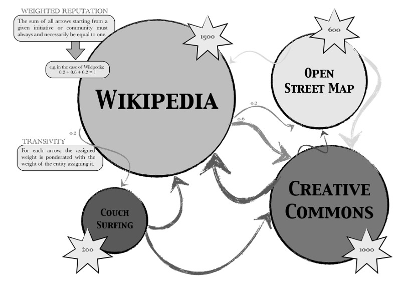
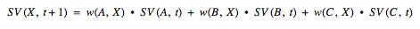
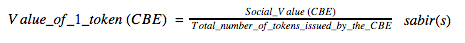
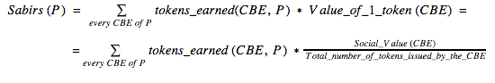
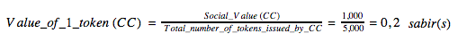
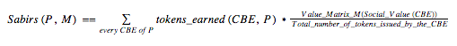

---
Pr-id: MoneyLab
P-id: INC Reader
A-id: 10
Type: article
Book-type: anthology
Anthology item: article
Item-id: unique no.
Article-title: Measuring Value in the Commons-Based Ecosystem: Bridging the Gap Between the Commons and the Market
Article-status: accepted
Author: Primavera De Filippi and Samer Hassan
Author-email:   corresponding address
Author-bio:  about the author
Abstract:   short description of the article (100 words)
Keywords:   50 keywords for search and indexing
Rights: CC BY-NC 4.0
...

# Measuring Value in the Commons-Based Ecosystem: Bridging the Gap Between the Commons and the Market 

### Primavera De Filippi and Samer Hassan  {.author}

## Prelude

>Maya is a bubbly girl who is well known for community activities in her small town. She has two clear passions: writing Wikipedia articles and making Creative Commons documentaries… yet she struggles to make ends meet, and resorts to stressful and unfulfilling advertising work in order to make some money.

Maya is one among many who contribute daily to projects like Wikipedia,
Creative Commons and Open Source software. But how much
value does each of these projects have? How do people value these
contributions? How could contributors be rewarded for their hard work
while still retaining the voluntary and cooperative dynamics inherent to
these projects? Ideally, we would like to figure out:

-   A way for these kinds of projects to assess their own social value.
-   A way for people to understand the value they are contributing to
    these projects.
-   A way for people to benefit from the goods and services provided by
    the market, without necessarily having to play by the rules of the market.

>Maya would love to have a way for her and others to see how much she is contributing to the social good. Maya’s family doesn’t understand why she spends so much time working on things that offer no money in return, while Maya is frustrated that her contributions to the commons are not recognized as actual work by society. Moreover, Maya would love her contributions to society to be recognized, and potentially rewarded, by the market, so that she would not have to spend so much time on her advertising job.

How could we help Maya?

We present here a system – which for the sake of this example, we will name Sabir – that can resolve some of the most recurrent problems encountered in Commons-based Peer Production (CBPP) communities. The Sabir system[^1] is composed of three layers that will help us:

1.  Understanding the social value – as opposed to the  market value – of
    different CBPP communities, in order to make an informed comparison.
2.  Identifying the value generated by individuals contributing to the
    commons and evaluating it through a common denominator.
3.  Creating an interface between the market and the CBPP ecosystem so
    that the two can interact, and benefit from each other.

## Introduction

Today, the production and dissemination of information is increasingly
done outside of the market economy. An alternative model of production
is emerging – both on the internet and elsewhere – that does not rely on
market transactions but rather on sharing and cooperation among peers.
Production is based on voluntary collaboration and resources are
released under specific licenses, such as Open Source and Creative
Commons licenses, so that they may be freely used and reused by
everyone. This new model of production – sometimes referred to as
CBPP[^2] – constitutes the sharing economy, which consists, for the most
part, of social interactions outside of the market economy.
In the realm of information, Wikipedia is perhaps the most popular
example, along with Free/Libre Open Source Software (FLOSS) and Creative
Commons, but the same is also true in the physical realm, with a growing
number of initiatives such as the Open Source Ecology and FabLabs.

Commons-based Peer Production (CBPP) is an emerging and innovative model
of production, both online and offline, characterized by peer-to-peer
collaboration and contribution oriented towards the production of a
collectively-owned resource. CBPP lends itself to a different economic
system based on the notions of *abundance* and *sharing*, which do not fit within the framework of most conventional economic theories
based on notions of *scarcity* and *exchange*.[^3]

To the extent that CBPP operates outside of the market economy,
conventional market mechanisms, such as pricing, are unable to give an indication of the overall social value of CBPP – which is based largely on
non-market transactions.[^4] In the market economy, the key concern is
to assess the economic value (or market value) of things through the
mechanism of supply and demand. All others values, such as friendship,
solidarity, or even deeper ethical values such as freedom or justice, are regarded as mere externalities which will only be accounted for to
the extent that they can be translated into monetary
value.[^5]

Without the traditional system of ‘pricing’, we can no longer rely on a
universal unit of analysis (i.e. a value proxy) to assess and
compare the value of different CBPP platforms, or to indicate the value individual users contribute to these platforms.[^6] Even when commons-based entities do have monetary value, we cannot rely on the traditional market mechanisms (such as pricing) to assess the value they produce. Hence, we need to identify another indicator of
‘social value’ (other than price) capable of capturing the value generated by CBPP and this will allow us to assess, compare
and communicate the value of different entities or projects that
operate exclusively in the sharing economy.

>Maya would like to show her friends and family, who are not part of the commons ecosystem, the value she is contributing to the world. Everyone knows about Wikipedia, but many people are not aware of Creative Commons, or even smaller initiatives like Couchsurfing. Moreover it is difficult for people to understand the value that these commons-based initiatives yield, even when they are (directly or indirectly) benefiting from them. 

## Value Metric for Commons-Based Entities

For instance, what is the value of Wikipedia? Does it have a monetary
value? – and if so, would it make sense to measure it in monetary terms?
We know it has a high social value because of the perceived value others attribute to it – but how can this value be measured? Ideally, we should have
a quantified indicator of the approximate social value of Wikipedia or
any commons-based entities (from now on referred to as CBEs[^7]).

>Maya could then describe the value of her work to her family and friends, by simply pointing out the value of the different CBEs she’s contributing to.

Of course, in order to have an indicator, we need an alternative *value
metric*, separate from the market one, which will allow us to understand
the value of CBEs. We believe that a metric of the social value of a CBE
should be constructed on two basic assumptions:

1.   As an indicator of social value, its value should emerge from the
    network of involved actors, that is, the CBEs;
2.   As a subjective value, it should be based on the perception of
    peers, that is, the other CBEs.

Thus, based on these premises, we propose a value metric algorithm
inspired by:

-   Flattr[^8], understood as a meter of individual appreciation that
    translates into donations. Peers may express their
    appreciation for other peers by clicking on their badge (*flattring*
    them), and anyone can see the amount of flattrs a user receives.
    (or something e.g.: a blog post, a project, etc).

-   Google’s *PageRank*[^9], as a means of evaluating the importance of a
    webpage based on its incoming links. That is, the algorithm
    calculates a quantification of the social relevance of each node
    based on the network of links.

In our model, we combine the two in order to achieve a more
sophisticated system for estimating the social value of CBEs:

1.  Inspired by Flattr, any CBE can *vouch* for another CBE that it
    considers valuable.

2.  Inspired by PageRank algorithm, we can then calculate how many
    incoming vouches, as opposed to incoming links, a CBE has according
    to a specific algorithm.

3.  Inspired by the fractionality of Flattr, a CBE may assign a
    particular weight to each one of its vouches (where the sum of these
    weights given must be equal to 1).

4.  Inspired by the transitivity of PageRank, a CBE channels a fraction
    (a percentage indicated by the vouch weight) of its own social value
    to the CBEs it is vouching for.

5.  The more value a CBE accumulates, the more socially valuable it will
    be considered. That is, quantity matters: how many vouches I have;
    and quality matters: who is vouching for me.

We can see an example of this indicator (which we will refer to as ‘the
social value indicator’) in Fig. 1, where Wikipedia has a high value (1,500, and a larger circle) due to its weighted reputation. Couchsurfing is smaller, but it still has a value of 200 because even if
it’s only receiving a weight of 0.1, it is ponderated with the weight assigned to it from the larger Wikipedia.

`Fig. 1: Example of several CBEs vouching each other with different weights, resulting in a social value number for each.`{.caption}

As an algorithm, in its simplest form,[^10] we can implement it as
follows:

For any given entity X, its social value (SV) at time (t) is expressed by
the function SV(X, t). SV(W,t) indicates the total amount of *weight*
(w) received by X from other entities in the system (A, B, C),
ponderated by the SV of these entities:

`Eq. 1`{.caption}

Taking into account that every CBE can assign weight to others, with a sum which must neccesarily be equal to one, the complete formula can be expressed as follows:

`Eq. 2`{.caption}

> *where *
>
> *Ux = the universe of all the entities assigning a weight to X*
>
> *Vx = the universe of all the entities that were assigned weight by X*

This specification complies with the definition of *ordered weighted
averaging* (OWA)[^11] aggregation operator in fuzzy logic, and therefore
it possesses interesting mathematical properties.

Finally, it is also important to note that the community of communities
forming within the system is structurally, and necessarily, biased: it
should only be composed of commons-based entities (CBEs) forming a
web-of-trust. This requires some kind of pre- and post-filtering or
discrimination. For example, how do we prevent Skype from joining, if it
claims to be part of the commons ecosystem?

-   Firstly, in order to join, a new CBE may need to be endorsed
    by a certain number of CBEs (algorithm pre-filtering): e.g., one needs to be invited by at least five entities before it may join the system.

-   Subsequently, the CBEs participating in the system would
    self-regulate who belongs to the system (community filtering): e.g.,
    if a large amount of CBEs believe Skype is not a CBE, it may be banned.

-   In addition, the system may contain rules that would facilitate the
    rejection process (algorithm post-filtering): e.g. if no user vouches
    for an entity for a long period of time, it is a sign that it may be banned.

Essentially, this would be creating a network-of-trust model, and therefore
the initial selection of entities might have a significant impact on the
subsequent population of the ecosystem.

## Rewards for Contributors to the Commons

Thanks to the social value indicator, we now have a clear indication of the social value each CBE has within the commons-based ecosystem.
However, a CBE can do nothing with such an indicator except brag about it. We propose here a possible use for such an indicator, which would
allow for the value contributed to the CBE to flow back to where it
originated from: i.e. to the CBE contributors.

The (macro) value of CBEs is generated exclusively by the
community of individuals participating in (micro) creating content
(articles, source code, videos, etc.), discussing, sharing, rating, and
essentially contributing to the community. Therefore, the long-term
sustainability of CBEs depends on a constant flow of quality
contributions, which can only be achieved if the contributors are investing a sufficient amount of time, effort, and resources in the CBE. Therefore, it would be ideal if contributors to the commons could somehow be rewarded for their time and effort.

Today, CBEs, and online platforms in general, can employ different
mechanisms to gratify their contributors, by means of both immaterial
rewards (e.g. reputation, admin rights and privileges) and material rewards
(e.g. virtual currencies and donations) as seen in Table 1.

[Table 1: A series of examples of existing value metrics and value
rewards.]

Yet, most of these reward mechanisms are limited by the following issues.
On the one hand, rewarding contributors with material rewards – such as
money, or a monetary equivalent – may lead to
undesirable results:

-   If some contributors are paid, others may no longer want to contribute
    *for free*.

-   As more users start contributing *for money,* efforts may
    shift towards the things that will be the most highly rewarded, as
    opposed to what people feel the most passionate about.

-   Since money is scarce, contributors may start competing against each
    other, instead of collaborating towards a common goal.

On the other hand, if gratification is limited to immaterial rewards,
the situation of contributors is barely improved. In other words, contributors
will need to keep doing *those boring tasks that provide them with a source
of income* rather than contribute to their favorite CBE: the one which
does not know how to reward them appropriately. Besides, given that most
of these rewards are CBE-dependant, contributions do not scale well in
multiple CBEs. Each reward mechanism is disconnected from each other and
contributors cannot aggregate, exchange or compare the value they helped
generate in different communities.

We propose here a mechanism for rewarding contributors, which adheres to
the following principles:

-   It should not involve money, nor any scarce and transferable
    resource that may be exchanged for money – therefore avoiding the emergence of competitive or individualistic dynamics among contributors.

-   It should support people *in the physical world,* who are currently dominated by the logic of the market. 

-   It should account for the contributions from all CBEs the user may be participating in.

In summary, what we aim for is an interface between the market and the
commons-based ecosystem which will provide rewards that are
non-transferable (i.e. not currency-based) but that the market may
somehow recognize.

Let’s imagine that we have such system – the so-called *Sabir* system –
for a moment, and continue our story...

## The Journey Towards Rewarding Maya

Imagine a world with a flourishing commons-based ecosystem that operates
alongside the market economy. In that world, some CBEs would be invited
to join a network-based value system, where their value could be
established by other CBEs according to their weight in the ecosystem
(see the social value indicator in the previous section).

>Now, let’s assume for a moment that, in such an imaginary world, Wikipedia (WP) has a social value of 1500 and Creative Commons (CC) has a social value of 1000. Maya is a CC video artist and WP contributor; she only has a part time job, because she wants to spend more time on doing what she loves, that is, making CC documentaries and WP articles.

Whoever contributes to the commons is rewarded with a particular set of
non-transferrable tokens issued by a specific CBE. Each CBE is free to
decide the number of tokens it issues, and the manner in which
these tokens will be redistributed to its contributors, according to an
internal reward mechanism based on gratitude and appreciation. Each CBE
has its own token type, that is, its tokens differ from those
other CBEs issue.

> WP has many contributors, so it has issued 12,500 tokens. CC has only issued 5,000 tokens so far. As Maya participates actively in both communities, she has received 125 WP-tokens and 200 CC-Tokens, which she collects in her portfolio.

In order for people to compare the value of their contributions between
different CBEs, the value of each token must be translated into a common
denominator of value, Sabir, calculated with the following formula:

`Eq. 3`{.caption}

and therefore, the number of sabirs per person *P* would be expressed by
the following formula:

`Eq. 4`{.caption}

Therefore, in the case of CC:

`Eq. 5`{.caption}

>Hence, Maya’s 200 CC-Tokens are equal to 40 sabirs, and Maya’s overall contribution to the commons is equal to: Total number of sabirs (Maya) = 125 \* $\frac{SV(WP)}{12,500}$ + 200 \*    $\frac{SV(CC)}{5,000}$ = 15 + 40 = 55 sabirs  
    Maya is really proud of herself, not only can she understand the value that she has contributed to the commons over the past year, but she can also easily express it to her friends.

### Gratification

`Fig. 2: One CBE (Wikipedia), with its own social value, generates and
distributes its own tokens (WP-tokens) to different contributors based
on their task.`{.caption}

The system of gratification can be explained by the example shown
in Fig. 2. Wikipedia, with a Social Value of 1500 as we saw in Fig. 1,
issues 12,500 Wikipedia-tokens (WP-tokens). At this specific moment,
Wikipedia is adopting a strategy of prioritizing the quality rather than
the quantity of its articles, so it decides to reward article reviews
the most, followed by donations and finally the creation of new articles.
In the particular example we considered, Wikipedia rewards 20
WP-tokens to all those providing a comprehensive review of existing articles,
15 WP-tokens for each donation over \$200, and 10 WP-tokens for each
article created longer than a stub that is accepted by the community.
This way, it is providing a reward to its contributors. Even
though this has the potential to distort the nature of contributions, if properly used, it can be employed as a tool for the CBE to provide incentives for the most essential tasks.
For instance, if a contributor hesitates on whether to create a new
article, or review an existing one, she might favor the review based on
the higher value it has for the community, as expressed by the internal
mechanism of rewards.

The system should ensure that users know what kind of rewards can be
earned by which tasks. Thus, each CBE should provide a standard table
where these task and gratification is indicated. The more transparent
it is, the more the CBE can encourage its contributors to focus on the
most urgent tasks. The system should also ensure that each CBE keeps
track of how many tokens are earned by each contributor. Therefore, CBEs should
provide a standard way for accessing such information, either by querying
the contributor’s profile, or via an API for people to use
their own personal *wallet* – i.e. a software that records all the tokens earned and the sabir value of each token.

Even though the tokens are a quantified expression of gratitude, we are
not aiming to *quantify everything*. These rewards can be earned
according to *internal rules* chosen by each CBE, and such rules may be quantitative or qualitative, and may refer to:

-   Projects for which people can earn a particular number of
    tokens. Rewards may be based on both quantity (e.g. number of words)
    and quality (e.g. three or more approvals from librarians).
-   A role which provides a salary-like remuneration.
    This may be common for maintenance and caring-related roles, e.g.
    Wikipedia administrators might earn 5 WP-token per month.
-   Other surprise rewards. Tokens can be distributed as prizes to
    really productive or skilled users that did remarkable
    contributions. Some users may also be given administrative rights to distribute a certain quota of tokens as they see fit.  

WP-tokens are generated on demand: Wikipedia can issue as many as they
want, is other words, no *a priori* artificial limitation is imposed. Unlike real money and most virtual currencies (e.g. Bitcoin) it is not essential for these tokens to be scarce, Besides, these WP-tokens are non-transferable: a contributor cannot *sell* her tokens
to someone else, nor exchange them. Finally, the value
of each WP-token is different than the value of each CC-token: the value
depends on the actual social value of the CBE issuing them, and on the
amount issued.

We propose here a simple way to normalize the value of all those CBE
tokens, through our common denominator of value, *Sabir*: a quantified
indicator that approximates the value of all contributions that a user has made to the commons. Such an indicator is easy to understand not
just by the contributor herself but also by others, who may not be
acquainted with the particular CBEs to which the contribution was made.

## Interaction With Market Players

Sabir can essentially be regarded as a proxy for value in the
commons-based ecosystem. Like the role of pricing in the market economy,
Sabir allows individual contributions to be assessed and compared
according to a common denominator of value (which remains distinct from
market-value). While price is linked to a particular service or product
of exchange, Sabir is an expression of the value that a particular
individual contributed to the commons over a lifetime, and should
therefore remain linked to that individual over their whole lifetime (i.e.
it is not transferrable).

As a common denominator of value, Sabir establishes a common language
(a lingua franca), and acts as a bridge between the commons and
the market economy, so that the two can benefit from each other, without
one actually taking over the other. Indeed, by introducing a
quantitative denominator of value for commons-based contributions
(similar to pricing in the market economy), Sabir makes it easier for
market entities to understand the value generated by CBE contributors to
the common good, and reward them accordingly. Hence people who make a large contribution to the commons but remain outside of the market economy, may eventually be able to gain recognition from commercial players. Perhaps some of these market players would provide free or discounted goods or services to significant contributors. [^12]

Maya’s part-time job doesn’t provide her with a sufficient income.
Fortunately, there are several market entities, popular among CBE
contributors, who recognize the value of her work. Once a week, Maya
can have free lunch in a local restaurant whose owner is also a CC
artist, and she gets a free license for Adobe Photoshop.

From a commercial perspective, Sabir enables market players to
price-discriminate between standard customers and CBE contributors,
potentially restricting their offers only to those people who
contributed at least 'x amount' of Sabir to the commons.

Maya loves to record her songs with commercial recording software but
the license is expensive. Fortunately for Maya, the software company provides free licenses to anyone who has contributed over 10 sabirs to the Free/Libre Open Source Software community.

Since Sabir is an open value system anyone could potentially assign value to
CBEs according to their own value metrics. For example schools or universities
could apply an ‘education’ matrix, giving greater importance to Wikipedia
and Creative Commons. Whereas a local restaurant might apply the ‘slow
food’ matrix, giving more weight to local farmers and producers. Therefore,
the previous Equation \#4 could be customized by a third-party (M) as
follows:

`Eq. 6`{.caption}

In other words, the third party may apply its customized *value matrix* to the
already given social value of the CBEs. However, not every third-party
needs to build their own matrix: they may use the standard social value (Eq. 4),
use their own customized matrix, or use a matrix deployed by others.
For example, Github may use the standard social value, a customized
Value\_Matrix\_Github, or the Value\_Matrix\_FOSS, a common matrix used
by many within the Open Source Software realm.

Maya is a good student; she’s smart and very passionate about the topics
she loves. She spends a lot of time on Wikipedia, researching and
reporting her findings together with a community of other enthusiastic users. Her school recognizes the value she’s contributing to the
‘Commons’ and gives her better grades for that. On the other hand, the university looks at the commons through an ‘education lens’ which assigns greater
value to academic institutions such as Wikipedia or the P2PUniversity, but does not recognize other CBEs such as Couchsurfing or
other non-academic CBE platforms.

Individuals can choose whether to work for the market (earning money) or
for the commons (earning sabirs), without necessarily having to give up
one for the other. By providing an interface between the commons and the
market economy, Sabir might ultimately encourage people to contribute to
the commons in order to benefit from the special deals provided by
certain market entities to CBE contributors.

Eventually, as more market entities recognize the value of
Sabir, and CBE contributors accordingly, Maya will be able to spend more
time doing what she loves, contributing to the commons, while benefiting
from the products and services offered by the market without having
to interact directly with the market economy.

Over time, a positive feedback loop is established, as commercial
entities that support the commons will gain reputation
in the commons-based ecosystem. Ultimately, this would lead a larger number of people to purchase their products or services.

Each time Maya discovers a new entity that supports the commons, she
gives them a good rank, and tells her friends about them. Whether or
not they are CBEs contributors themselves, they will nonetheless be
happy to purchase the services offered by that entity, knowing that they are also helping the commons.

`Fig. 3: Example illustrating the current state of affairs for
contributors to the Commons and how Sabir may help change it.`{.caption}

In Fig. 3, we illustrate the benefits of the Sabir system, as an interface between the market and the commons-based ecosystem. Nowadays, Maya is contributing to various CBEs but, since she’s not earning any money from this contribution, she cannot benefit from the products provided by the market system (burgers and ice cream from McDonald’s in this example) unless she actually decides to play the market game by getting a wage-paying job. In the future, thanks to Sabir, Maya will be able to express the value that she has been contributing to the commons through a common denominator (the amount of sabir she has accumulated), which can easily be understood by market actors. In this example, McDonald’s recognizes the value of the commons and has implemented a specific policy to reward CBE contributors with free burgers and discounted ice creams, depending on the value of the contribution to the commons. Hence, Maya is happy since she can continue contributing to the commons, knowing that the time she spends doing so will count towards obtaining free burgers and ice cream from McDonalds. Bob also contributed to the commons, but to a lesser extent, and therefore he is only entitled to a discount on the ice cream.

## Implications & Benefits

In a nutshell, the proposed system can help (1) measure CBEs social
value (2) distribute non-transferable tokens to relevant contributors
and (3) facilitate the process of rewarding contributors by market
entities. The system presents a variety of benefits for the various
actors involved, as follows:

### For Commons-Based Entities

*Understand CBEs’ Perceived Systemic Value*

From the perspective of CBEs, the clearest benefit of Sabir is that it
allows for each CBE *to understand its own value within the CBPP
ecosystem* thanks to the social value metric – or at least, an
approximation of how it is perceived by others, and its evolution over
time. For example, a decrease in the social value of a CBE may be
regarded as a sign for a variety of things, e.g. poor relationships,
bad communication, or perhaps just a lack of focus on what really
matters. Without the social value metric, CBEs would remain ignorant of
how they are perceived by other CBEs.

*Encouraging Participation and Growth by Means of a Reward System for Contributors*

Another benefit of Sabir is that it *facilitates the elaboration of a
system of internal rewards for estimating the value of contributions*.
This is a typical issue for many CBEs, they are interested in reward
systems in order to promote participation, but still there are problems.
Reputation systems can be risky, as they may trigger unexpected changes within communities and current reward mechanisms have many issues. With Sabir, the introduction of non-transferable
CBE-dependant tokens can be done in a gradual and systematic manner.
This would minimize the risks and, if the experimentation fails, it is
easy to revert back to the initial state of affairs.

*Attract Contributors and Direct Their Contributions Where they are the most Needed*

A third benefit of such a gratification system is that it would likely
*increase the participation and growth of the community of
contributors*, while also providing a means to *direct the
contributions* *to where they are most needed.* CBEs might not only be
concerned with increasing participation, but also in promoting a certain
type of contribution (donations, maintenance, technical tasks,
filtering, etc,) that is urgently required but lacking.

### For Commons-Based Contributors

*Understand the Value Contributed to the CBEs and to the Whole Ecosystem*

Similarly to CBEs, a direct benefit for contributors is the ability to
understand the value they are providing both to the whole commons-based
ecosystem (expressed in sabirs) and to each individual CBE (expressed in
their own gratification-tokens). This is particularly useful to the
extent that individual contributors can compare the value they
contribute to different CBEs and understand where their contributions
are most required. They may even switch to another community where their
contribution is more appreciated. While it might seem like a loss to the
community, it is better that the contributor acknowledges the fact that
her contributions are not being appreciated, in order to reduce the
possible frustrations which might lead to other contributors leaving the
community.

*Communicate the Value of One’s Contribution to the Commons*

By providing a common denominator of value, which applies equally to all
CBEs, Sabir makes it easier for ‘commoners’ to communicate the value
they have contributed to society, and may even encourage others to
join and contribute to the commons as well.

*Receive Direct Benefits From the Market Entities Recognizing Sabir*

The main benefits for contributors is obviously those coming from market
players that recognize Sabir as a reliable indicator of the value that
has been contributed by each individual to the commons-based ecosystem.
With a growing community of commoners and market entities joining the
system, Sabir may engender profound change and reduce dependence on traditional market mechanisms.

### For Market Players[^13]

*Direct Economic Benefits Through Price Discrimination*

Market players can engage in price discrimination, by
means of customized pricing policies which allow them to allocate some
of their resources to the commons, without
noticeably altering the market price. For instance, a software
company could offer particular benefits to open source contributors by
means of specific licenses (akin to the ‘educational’ licensing schemes
for students or universities). The advantage of such particular kind of
price discrimination is that it does not theoretically effect the
market price, because only commons-based contributors will be able to
benefit from it.[^14]

*Indirect Economic Benefits as a Result of Greater Visibility and Reputation*

Although they do not receive immediate economic returns, it is common
practice for many market players to support commons-based initiatives,
such as social, cultural, or educational programs, in order to gain
greater visibility. With Sabir, market players can
support the commons-based ecosystem without having to distinguish
between different initiatives which they
would prefer to donate their resources to. Instead they can indirectly
contribute to the commons-based ecosystem as a whole, simply by showing
appreciation to anyone who contributes to the commons and rewarding them
accordingly. Although commercial entities maintain the right to assign more value to
some initiatives over others. Market players participating in the
system might benefit not only from greater visibility or reputation, but
also from collateral economic returns, as people who share the same
values will be more likely to purchase from them. Besides, those who benefit from
discounted and free goods or services will also be more likely to purchase
other goods or services provided by these same companies.

*Self-Realization*

Although, in most economic theories, market players are described as
rational beings acting according to their own self-interest, in
practice, behind the commercial façade there are also human beings with
principles and ideological values that might go against traditional
economic rationality. Hence, certain market players might be tempted to
participate in the commons system for ethical reasons and to
support the projects that reflect their own values and, more
generally, by contributing to help make the world a better place.

### Systemic

*Interface Between the Market and the Commons-Based Ecosystem*

From a systemic approach, the main advantage of Sabir is that it acts as
a bridge between the commons-based ecosystem and the market economy,
without necessarily favoring one over the other. Today, the market can
take from the commons, i.e. it can benefit from the outcome of CBPP,
without ever giving back to the commons-based ecosystem. Therefore, it is to
some extent free riding over the commons (which are in this sense subsidizing the
market economy). Conversely, the commons-based ecosystem cannot benefit
from any of the goods or services that the market provides, unless it
actually adopts the logic of the market, which necessarily entails the
commodification of commons-based resources.

*Cooperation Without Contamination*

Thanks to Sabir, the two systems can keep operating according to their
own rationale: *abundance,* *collaboration, and sharing* for CBPP,
*scarcity,* *competition* and *exchange* for the market. Nonetheless CBPP and the market are able to interact with each another without the risk of
contamination. Individuals can
choose whether to work for the market (earning money) or for the commons
(earning sabirs), without having to forgo one for the other. As Sabir
becomes more widely adopted, people will be able to spend more time doing
what they love, contributing to the commons while also benefiting from
the market economy.

*Positive Feedback Loop Between the Commons and the Market System*

As a result, Sabir might encourage people to contribute to the commons
in order to benefit from the deals provided to CBE contributors by
certain market entities. Over time, a positive feedback loop will
therefore be established, as market entities that support the commons will gain reputation within the commons-ecosystem. This
may, ultimately, encourage more people to purchase their goods or
services, knowing that are also supporting the commons.

## Concluding Remarks

The value of CBPP has been widely acknowledged over the past few
years.[^15] Accounting for the value produced by different CBEs and
determining the relative value of each contribution is a worthy
endeavor, however difficult it may be to achieve. Currently, there are still no proper tools capable of understanding the value of CBEs or
estimating the value generated by their community members.

The Sabir system combines some, but by no means all, characteristics of a credit
score, a cryptocurrency, and a reputation system in order to provide an
indicator which acts as a proxy for *social value*, as opposed to
*market value*, in the commons-based ecosystem.

As individuals contribute to the commons, they receive ‘gratitude’ from
the CBE they have contributed to which is expressed in their own
gratification-system, i.e. the CBE tokens. As a common denominator of
value, Sabir represents the *lingua franca* between these different
systems. It translates the gratitude generated by individual
contributions into a numeric value according to an algorithm (standard
or customized through a value matrix) ponderating every contribution
within the overall social value of the commons to which they contributed
(see Equation 3). As such, Sabir makes it easy for anyone to assess the
value produced within a particular CBE and to compare the values
of different CBEs among each other.

Through Sabir, we can benefit from the
advantages provided by a universal indicator of value, without falling
under the restrictions of conventional economic theories. Indeed, just like the role of pricing in the market economy, Sabir allows for individual
contributions to be compared according to a common denominator of value.
Yet, the value expressed by Sabir is not the actual *market value* but rather the *value* *that emerges from every
contribution to the commons*. In other words, Sabir acts as a proxy for
the value of individual actions within the commons-based ecosystem.
Hence, as opposed to price – which is linked to the product or service
of exchange – Sabir is ultimately linked to the individuals contributing
to the commons. It is, therefore, important not to confuse Sabir with an
actual currency (or cryptocurrency). As opposed to conventional
currencies, which can be transferred from one individual to another, the
Sabir indicator should be associated with the same individual during her whole
lifetime, i.e. it is not transferrable although, just like price, its
value may fluctuate over time.

Yet, measuring the value of CBPP within a non-market economy raises an important question. It is unclear, at the moment,
whether the introduction of a system like Sabir, offering a formalized,
personal indicator of value is likely to increase people's motivation to contribute to the
CBPP ecosystem, or whether it might, on the contrary, disrupt that
particular set of motivations which have been established thus far.[^16]
Could CBPP values (such as freedom, sharing, or cooperation)
actually be translated into quantifiable terms, without incurring a
loss?

## Acknowledgements

We would like to acknowledge the people of the P2Pvalue project for
their feedback. This work was partially supported by the Framework
program FP7-ICT-2013-10 of the European Commission through project
P2Pvalue (grant no.: 610961).

## References

Bauwens, Michel. ‘The Political Economy of Peer Production*’*,
*CTheory*, Vol. 1 (2005).

Benkler, Yochai, *The Wealth of Networks. How Social production
Transforms Markets and Freedom*, New Haven: Tale University Press, 2006.

Benkler, Yochai. ‘Peer Production and Cooperation’, forthcoming in J.M.
Bauer and M. Latzer (eds) *Handbook on the Economics of the Internet*,
Cheltenham and Northampton: Edward Elgar Publishing Ltd., 2015.

Buterin, Vitalik. *A Next-Generation Smart Contract and Decentralized
Application Platform*, White Paper, 2014,
<https://github.com/ethereum/wiki/wiki/White-Paper>.

Cheal, David. *The Gift Economy*. New York: Routledge, 1988.

Cohen, I. Glen. ‘The Price of Everything, the Value of Nothing:
Reframing the Commodification Debate’, *Harvard Law Review*, 117.689
(2003).

De Filippi, Primavera. ‘Translating Commons-Based Peer Production Values
into Metrics: Towards Commons-Based Crypto-Currencies’, forthcoming in
Lee Kuo Chen D. (ed.) *The Handbook of Cryptocurrency*. Elsevier.

Gold, Lorna. *The Sharing Economy: Solidarity Networks Transforming
Globalisation*. Burlington: Ashgate Publishing, Ltd, 2014.

Hess, Charlotte and Ostrom, Elinor. ‘A Framework for Analyzing the
Knowledge Commons’, in *Understanding Knowledge as a Commons: From
Theory to Practice*, Cambridge, MA: MIT Press, 2005.

Lindenberg, Siegwart. ‘Contractual Relations and Weak Solidarity: The
Behavioral Basis of Restraints on Gain-Maximization’, *Journal of
Institutional and Theoretical Economics* (JITE)/Zeitschrift für die
Gesamte Staatswissenschaft (1988): 39-5.

Schiller, Robert. *Finance and the Good Society*, New Haven; Princeton
University Press, 2012.

Page, Lawrence, et al. *The PageRank Citation Ranking: Bringing Order to
the Web*, 1999.

Yager, Ronald R. and Kacprzyk, Janusz, *The Ordered Weighted Averaging
Operators: Theory and Applications*, Kluwer: Norwell, MA, 1997.

[^1]: Sabir website: [http://sabir.cc](http://sabir.cc) - For additional
    details on the implementation, see the FAQ on the website.

[^2]: Yochai Benkler, *The Wealth of Networks*: *How Social Production
    Transforms Markets and Freedom*, New Haven: Tale University Press,
    2006.

[^3]: Charlotte Hess and Elinor Ostrom, ‘A Framework for Analyzing the
    Knowledge Commons’, in Charlotte Hess and Elinor Ostrom (eds)
    *Understanding Knowledge as a Commons: From Theory to Practice*,
    Cambridge, MA: MIT Press, 2005.

[^4]: Robert Schiller, *Finance and the Good Society*, New Haven:
    Princeton University Press, 2012.

[^5]: Siegwart Lindenberg, ‘Contractual Relations and Weak Solidarity:
    The Behavioral Basis of Restraints on Gain-Maximization’, *Journal
    of Institutional and Theoretical Economics (JITE)/Zeitschrift für
    die gesamte Staatswissenschaft*, 39.5 (1988); Glen I. Cohen, ‘The
    Price of Everything, The Value of Nothing: Reframing the
    Commodification Debate’, *Harvard Law Review*, 117.689 (2003).

[^6]: Primavera De Filippi, ‘Translating Commons-based Peer Production
    Values Into Metrics: Towards Commons-based Crypto-Currencies’, in
    Lee Kuo Chen D. (ed.) *The Handbook of Cryptocurrency*, Amsterdam:
    Elsevier, forthcoming 2015.

[^7]: Which are usually named Commons-Based Peer Production (CBPP)
    communities. Here we use CBE for the sake of simplicity.

[^8]: Flattr is a microdonation web service:
    [http://flattr.com](http://flattr.com).

[^9]: Lawrence Page et al, ‘The PageRank Citation Ranking: Bringing
    Order to the Web’, 1999.

[^10]: The following equations are a strong simplification, as there are
    more complex algorithms available. Still, for preliminary testing in
    a prototype and for the sake of communicating the concept, we’ll
    stick to those.

[^11]: Ronald R. Yager and Janusz Kacprzyk, *The Ordered Weighted
    Averaging Operators: Theory and Applications*, Kluwer: Norwell, MA,
    1997.

[^12]: This is already happening, albeit in a very limited way: e.g.
    Github provides free (*as in beer*) services to FLOSS accounts,
    Bambuser provides premium accounts to journalists and activists, and
    SafeCreative provides a restricted amount of ‘all rights reserved’
    registrations.

[^13]: We refer here to market players as any entity that subsists
    within the market economy and operates according to the logic of the market.

[^14]: Of course, as more people contribute to the commons, the system
    might lead to a progressive drop in market price. Yet, this is only
    a marginal problem since market players maintain the right to update
    their commons policy at any time, in order preserve price-discrimination.

[^15]: David Cheal, *The Gift Economy*, New York: Routledge, 1988, pp.
    1-19; Lorna Gold, *The Sharing Economy: Solidarity Networks
    Transforming Globalisation*. Burlington: Ashgate Publishing, Ltd,
    2014; Michel Bauwens, ‘The Political Economy of Peer Production’,
    *CTheory*, Vol. 1, (2005); Yochai Benkler, *The Wealth of Networks*:
    *How Social Production Transforms Markets and Freedom*, New Haven:
    Tale University Press, 2006.

[^16]: Yochai Benkler, ‘Peer Production and Cooperation’, forthcoming in
    J.M. Bauer and M. Latzer (eds) *Handbook on the Economics of the
    Internet*, Cheltenham and Northampton: Edward Elgar, 2015.
