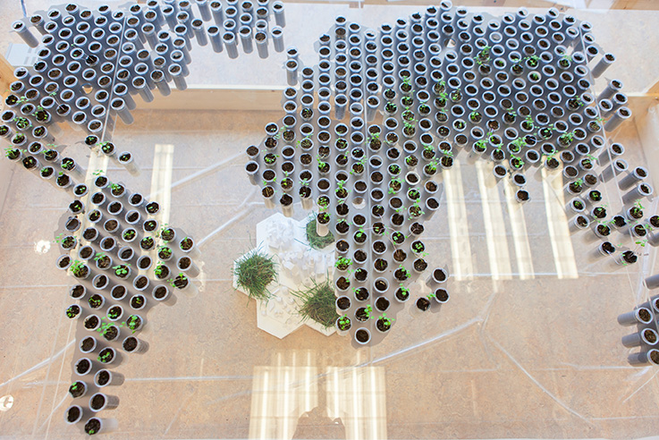
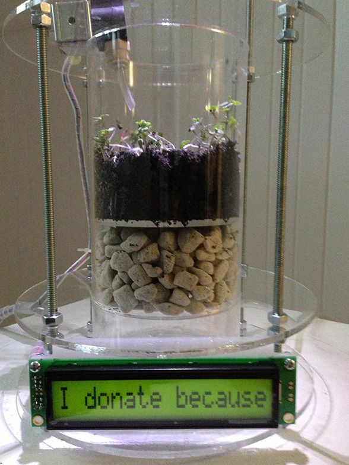

---
Pr-id: MoneyLab
P-id: INC Reader
A-id: 10
Type: article
Book-type: anthology
Anthology item: article
Item-id: unique no.
Article-title: Reversal of Fortune: Visualizing Marketized Philanthropy
Article-status: accepted
Author: Stephanie Rothenberg
Author-email:   corresponding address
Author-bio:  about the author
Abstract:   short description of the article (100 words)
Keywords:   50 keywords for search and indexing
Rights: CC BY-NC 4.0
...

# Reversal of Fortune: Visualizing Marketized Philanthropy

### Stephanie Rothenberg {.author}

## The Veneer of Philanthropy

Several years back while conducting research on crowdfunding, a website
called ‘Kiva’ came up in my search. For as little as \$25 U.S. Dollars I
could empower a poor woman in Bolivia. By contributing to her microloan
of \$250, I could help her purchase a cow for her farm and jump-start
her life as a global entrepreneur. Curious, I clicked on her tentative
but hopeful image that led me to more details. Her finely crafted but
succinct profile shed just enough information about her life to pique my
empathy, alongside a selection of shocking economic statistics for her
country. This information was juxtaposed to a list of lenders, complete
with snapshot selfies and a personal blurb as to why they donate. As I
scrolled down the list, I encountered an amalgam of responses that
ranged from the banal to the self-righteous to the downright erratic: I
donate because giving to others in need is good; I donate because I’m a
post human; I donate because it’s sexy.[^1]

Started as a non-profit venture in 2005, Kiva is, with similar
organizations such as Global Giving, part of a growing network of
so-called ‘alternative’ charities. These philanthropic businesses
leverage social media and mobile money platforms to merge business goals
with social progress. The hybridization has led to a sector of the
microfinance industry that utilizes crowdfunded microlending. The result
is a ‘marketization of philanthropy’, a philanthropy for the masses,
producing a new breed of loan-borrowing ‘entrepreneurs’ rising from the
depths of the global poor.[^2]

As the first and largest charity platform of its kind, Kiva has received
much praise in business circles and the world of celebrities including
Bill Clinton, Oprah Winfrey, and *The New York Times* writer Nicholas
Kristof, known as the ‘White Knight’ for his column on human rights. All
espouse the Kiva mantra that the organization is helping to alleviate
global poverty and empower the global poor through microcredit.

And to some extent it is. Kiva is becoming a household name, at least in
the Global North, along with the concept of microcredit/microloans, due
to the popularity of platforms such as Kickstarter and Indiegogo.
Through Kiva’s website, the organization claims to have raised over
\$605,592,375 million through 1,218,000 lenders giving to 1,403,980
borrowers with a 99.97 percent repayment rate.[^3]

But a few skeptics abound such as author and financial consultant Hugh
Sinclair. Sinclair’s scathing articles and book *Confessions of a
Microfinance Heretic* point to several of Kiva’s statistical fallacies
that get overlooked within its slick marketing apparatus of emotive
words and images. The highlights point towards an overall inefficient
and expensive process that doesn’t necessarily benefit borrowers. These
include questions around the mysterious ‘portfolio yields’ that mask
high interest rates charged by Kiva’s intermediary banks (averaging
33-45 percent), hidden fees accrued by Kiva, unreported borrower
defaults and corrupt bank partners.[^4]

Yet these problems aren’t specific to Kiva, but long regarded concerns
within the microfinance industry. The real issue with platforms such as
Kiva that Sinclair raises is that they produce a veneer of philanthropy.
Do we really care if it works as long as it satisfies our ethical desire
for that ‘warm glow’ we get when we give to the needy?

## Reversal of Fortune

Following on the heels of earlier interactive and participatory projects
that visually map the social and ethical dimensions of crowdfunding on
virtual economies and digital labor, I found this question quite
intriguing. Aside from the aforementioned and a few other books and
articles circulating academia, this area of cultural crowdfunding had
not yet surfaced in recent debates. Most of the critiques have been
focused on Kickstarter-style platforms emphasizing the commodification
of social relations and exploit of immaterial online labor.

I was compelled to unpack the inherent contradictions within this
crowdfunded philanthropy further, and as an artist, I would do so
through a tactical media approach that would confront the veneer of
seductive images and rhetoric with a more realistic narrative. Kiva,
being the most popular platform, seemed the best place to start. In
addition, Kiva had already begun soliciting fans for their creative
surplus labor by making data available through an API.

I searched around and found a few rather underwhelming attempts such as
‘Kiva Cloud’.[^5] As the title states, a text cloud appears on a webpage
showing the most popular words trending in Kiva loans. ‘Business’,
‘women’, ‘poor’, and ‘future’ seemed to always rise to the top.

And then there was the bizarre unseemly visualization created by Kiva’s
own programmers titled ‘Intercontinental Ballistic Microfinance’.[^6] In
this four-and-a-half minute animation, Kiva shows a five year history of
funding activity set to the tune of Tchaikovsky’s 1812 Overture.
If you don’t know the history of the song, this famous war score was
written to commemorate Russia’s defense of its homeland from Napoleon.
In the animation depicting a world map, loans coming from the Global
North are represented by exploding cannon fire shot through the air with
their ‘target’ destination being borrowers in the Global South. Somehow
I don’t think Kiva got the irony here.

Perversely inspired by the above examples, I decided to create my own
infographic interpretations of crowdfunded microfinance. Rather than
using bombs I felt plants, like the delicate leaf in the Kiva logo, were
more appropriate. The outcome has resulted in a series currently in
development called *Reversal of Fortune*, comprised of live and digital
gardens. The gardens reflect on how empathy-at-a-distance is produced
while offering a counter mapping to the flows of microfinance capital
that Kiva provides its audience.

## Crowdsourcing the Telematic Embrace 

In his 2006 Nobel Peace Prize speech, Muhammad Yunus, considered to be
the godfather of modern day microfinance for founding the Grameen Bank
of Bangladesh, referred to poor people as ‘bonsai trees’:

> To me poor people are like bonsai trees. When you plant the best seed
> of the tallest tree in a flowerpot, you get a replica of the tallest
> tree, only inches tall. There is nothing wrong with the seed you
> planted, only the soil-base that is too inadequate.[^7]

For Yunus and for Kiva, and now for me, the metaphor of a plant in its
struggle to survive underscores the complex relationships between human
life and economic growth. This concept is taken a step further in the
groundbreaking project *The Telegarden* created in 1995 by artist and
engineer Ken Goldberg.[^8]

Using a web interface, a global community of online users could
virtually care for a live garden physically located at the University of
Southern California. It is one of the earliest instances of
participatory online interaction and social engagement to meet a shared
goal. By collectively ‘investing’ in the future of the garden combined
with the ‘outsourcing’ of labor to perform tasks to maintain it, *The
Telegarden* foreshadowed new models of labor, production, and
dissemination that now comprise familiar modes of crowdfunding and
crowdsourcing. The project eloquently expresses the interplay of
economic and technological forces realized through a telematic garden.

Even more recently, NASA announced their ‘Lunar Plant Growth
Habitat’ that further extrapolates on these early ideas of telematic
gardening and takes crowdsourcing to the next level – the moon. In an
article in *Forbes* business magazine, the NASA team who ‘has set out to
“boldly grow where no man has grown before”’ explains how they will
utilize crowdsourcing to recruit thousands of citizen scientists.[^9]
The emphasis will be on school children to help them conduct the
experiment both on earth and on the moon. The plants in both habitats
will be grown in coffee-can-sized aluminum containers equipped with
cameras and sensors that enable the team to receive image broadcasts and
monitor the plants environment as they grow.

An interesting comment in the article by planetary scientist Dr. Chris
McKay alludes to this shift in space program mentality towards looking more
like tech startups. The author understates the actual issue of
government funding dwindling and the privatization of the industry. ‘Dr.
McKay sees a world of possibilities emerging from this democratization
[...] When your experiment costs 300 million dollars, and you do one a
decade, you can’t take any risks. [...] But if your experiment is a
million dollars and being done by grad students, you can do crazy and
brilliant things.’[^10]

## Recent Artwork: Garden of Virtual Kinship

`Fig. 1: Reversal of Fortune: Garden of Virtual Kinship. Photo credit: Shasti O’Leary Soudant.`{.caption}

With particular focus on the world of microfinance, my recent series of
artworks draw upon this legacy of expressing the interplay of affect,
technology, and economic forces realized through a telematic garden. The
first garden in the *Reversal of Fortune* series is derived from these
sources and titled *Garden of Virtual Kinship*.[^11] Suggestive of an
aquaponic system with a world map as its focal point, this garden
provides a counter cartography to a real time mapping of lender
donations available on Kiva’s website.[^12] This Kiva webpage
visualization is somewhat similar in concept to the *Intercontinental
Ballistic Microfinance* animation but animates the exchange of loans
from lenders to borrowers on a world map in real time. Every few seconds
candy colored lines jettison from one location to another in a dazzling
display of humanity.

In addition, a side column gives a brief description of the loan
activity that links to the borrower’s webpage encouraging further
funding. For example: ‘John made a loan, which helps Gulmira purchase
additional sheep in order to develop her livestock activity.’[^13] There
are also columns on what’s currently trending such as borrower and
lender countries and how many loans are being funded per minute.
Watching the frenzy of activity is mesmerizing. It appears as if the
world is being saved by your next-door neighbor.

Yet on closer inspection, it becomes apparent that some information is
missing from this big picture. What about the fees from those exorbitant
interest rates? Where is this money going? Who profits?

By redirecting the flow of capital symbolized as moving water, *Garden
of Virtual Kinship* attempts to expose the underbelly of this conflicted
system. In the garden resting at tabletop height, sits a 10 by 5 foot
sheet of clear plastic. Inscribed is an image of a world map constructed
from a dot matrix grid of over 500 small holes. In each hole sits a
pill-sized container filled with soil and seed. These seeds represent
Kiva loan borrowers who have the potential to become plants depending on
the success of their loan fundraising. Overhead at 6 feet high is an
automated (CNC) watering machine. Mirroring Kiva’s data visualization,
when a borrower receives funding, the machine moves the watering head to
the correlating geographic location on the world map and the
plant-borrower receives a specified amount of water.

Yet the plants only receive a portion of the water. A percentage of it
based on the borrower’s fees drains into a reservoir below. This pool of
water continually feeds a model of the future global city flourishing
with lush plants. As the water moves throughout the system scrolling LCD
screens articulate these percentages and reveal the names and profits of
the corporations and institutions driving the industry. Similar to an
aquaponic system, the water is pumped back up to the overhead watering
machine. When data comes in it triggers the machine and the cycle
continues in an endless loop of both excess and scarcity.

## Desiring Subjects, Desiring Plants

In her book *Poverty Capital: Microfinance and the Making of
Development*, scholar Ananya Roy stresses how the alleviation of poverty
has been inserted into our everyday acts of consumption, a ‘politically
correct’ consumption.[^14] She refers back to Yunus’ philosophical
underpinnings for the Grameen Bank ‘credit as a human right’, and how
this idea has become the cornerstone ideology for our current ethical
economics.[^15]

For Roy, microfinance is celebrated as the people’s economy,
democratized capital, and through social media the microcapital of the
poor is converted into new financial global flows.[^16] Roy explains:

> On Kiva.org […] users can integrate such conscientious practices with
> the techno-social rhythms of their daily lives. Kiva “lets you browse
> loans on Facebook, and show off your loans in your Facebook page.”
> There is Kiva for the iPhone, which “lets you get your Kiva fix from
> anywhere you bring your phone,” and Kiva Tweets, which “automatically
> posts new loans to your Twitter account daily or weekly.”[^17]

Through Kiva and similar platforms, the ethical economy meets the
reputation economy. With every ‘like’, the privileged are empowered to
empower the global entrepreneur in a seamless circuit of warm and fuzzy
affective production.

`Fig. 2: Reversal of Fortune: Desiring Subjects, Desiring Plants.`{.caption}

These techno-social rhythms that Roy describes are animated in another
garden in the series entitled *Desiring Subjects, Desiring Plants*.[^18]
In this installation grow lights immerse the viewer in a garden of
illuminated hanging planters constructed from clear plastic tubing. The
effect is suggestive of a strange bio-laboratory setting.

Each hanging planter is equipped with its own automated watering system - an IV bag holding water along with a small LCD screen and audio
speaker. When a loan from the Kiva website receives funding it activates
the system. The IV bag releases a drip of water. The screen displays
text from the lender’s profile page as to why they donate. The audio
speaker speaks the message such as ‘I donate because it’s sexy’. The
result is a real time cacophony of scrolling messages and synthetic
voices emoting the feelings of lenders from around the world, or rather
the Global North.

## Feed the ~~Children~~ Entrepreneurs

Having grown up on American television commercials from the 80s and 90s,
I can never forget the sorrowful face of actress Sally Struthers. Known
for her role as Gloria on the 1970s television sitcom *All in the
Family*, Struthers later became the poster lady for the Christian
Children’s Fund ‘Feed the Children’ campaign.[^19] The campaign set the
standard for the ‘charity’ television commercial. Struthers in the
foreground looking earnest while poor children in the background dirty
and covered with flies, helpless victims of their poverty, arouse your
guilt.

If we fast-forward to the present, Kiva founder Jessica Jackley is the
modern day Struthers outfitted with a young, hip look and a new
narrative. In her TED Talk from 2010 that received 1.1 million views and
counting, the attractive, bright-eyed and spunky Jackley identifies with
the burden of privilege.[^20] Having spent time in Africa during her
college years, she came to the realization that it was more effective to
help the poor help themselves. We no longer need to feel guilty about
our overpriced Starbucks cappuccino. Through the magic of microlending,
we are empowered by empowering a poor farmer in the entrepreneurial
potential of owning his own coffee bean plantation.

Microfinance is considered the new frontier in the manufacturing of
development investment. It follows capitalism’s circuit of primitive
accumulation, constantly seeking out new terrain that will provide
fertile conditions for both development and reconstruction. Roy refers
to an essay written by economist and Senior UN Advisor Jeffrey Sachs,
one of the key interlocutors of the UN’s Millennium Development Project
started in 2002 to alleviate global poverty. Written shortly after 9/11,
the essay titled ‘Weapons of Mass Salvation’ finds Sachs making the case
that ‘one cannot fight a war against weapons of mass destruction through
military means alone’.[^21]

Over ten years later, what is the new weapon of mass salvation? Could it
be philanthropic crowdfunding with its ability to leverage middle class
emotions in order to mobilize new financial assets from the global poor?
And what about crowdfunding’s underlying mechanisms that function to aid
the impoverished but also to fund a work of art?

In a culture of big data that has become increasingly over
aestheticized, can questions such as these still be answered through
visualization? Can the messiness and unpredictability of plants as data
in the *Reversal of Fortune* artworks interrupt the streamlined
algorithms? Can a different story be told through data that embodies and
makes visible the complex lives that are so often overlooked when
abstracted? And for David Bowie’s sake, will there be plant life on
Mars?

## References

Bajde, Domen. ‘Marketized Philanthropy: Kiva's Utopian Ideology of
Entrepreneurial Philanthropy’, *Marketing Theory*, 13.1 (March 2013):
3-18.

Christian Children’s Fund, ‘Feed the Children’ campaign video,
<https://www.youtube.com/watch?v=XsxVy7vyyk0>.

Goldberg, Ken. ‘The Telegarden’,
<http://www.ieor.berkeley.edu/~goldberg/garden/Ars>.

Intercontinental Ballistic Microfinance, <http://vimeo.com/28413747>.

Jackley, Jessica. ‘Poverty, money – and love’, TED, July 2010,
http://www.ted.com/talks/jessica\_jackley\_poverty\_money\_and\_love?langua
ge=en.

Kiva, <http://www.kiva.org>.

Kiva Cloud, <http://www.frazao.org/kivacloud>.\
\
Rothenberg, Stephanie.
[www.stephanierothenberg.com](http://www.stephanierothenberg.com).

Roy, Ananya. *Poverty Capital: Microfinance and the Making of
Development*, New York: Routledge Press, 2010.

Sinclair, Hugh. ‘[The Kiva Fairytale: It's a Microlending Superstar –
But Who is it Really
Serving?](http://nextbillion.net/blogpost.aspx?blogid=3726)”, *Next
Billion*, 10 February 2014,
<http://nextbillion.net/blogpost.aspx?blogid=3726>.

Wadhwa, Tarun. ‘NASA’s Next Frontier: Growing Plants on the Moon’,
*Forbes*, 20 November 2013,

Yunas, Muhammed. Nobel Lecture, Oslo, 10 December 2006,
<http://www.nobelprize.org/nobel_prizes/peace/laureates/2006/yunus-lecture-en.html>.

[^1]: Kiva, [http://www.kiva.org](http://www.kiva.org).

[^2]: Domen Bajde, ‘Marketized Philanthropy: Kiva's Utopian Ideology of
    Entrepreneurial Philanthropy’, *Marketing Theory*, 13.1 (March
    2013): 3-18.

[^3]: Kiva Statistics, [http://www.kiva.org/about/stats](http://www.kiva.org/about/stats),
    accessed 7 October 2014.

[^4]: Hugh Sinclair, ‘The Kiva Fairytale: It's a Microlending Superstar
    – But Who is it Really Serving?’, *Next Billion*, 10 February 2014,
    [http://nextbillion.net/blogpost.aspx?blogid=3726](http://nextbillion.net/blogpost.aspx?blogid=3726).

[^5]: Kiva Cloud, [http://www.frazao.org/kivacloud](http://www.frazao.org/kivacloud).

[^6]: Intercontinental Ballistic Microfinance,
    [http://vimeo.com/28413747](http://vimeo.com/28413747).

[^7]: Muhammed Yunus, Nobel Lecture, Oslo, 10 December 2006,
    [http://www.nobelprize.org/nobel\_prizes/peace/laureates/2006/yunus-lecture-en.html](http://www.nobelprize.org/nobel\_prizes/peace/laureates/2006/yunus-lecture-en.html).

[^8]: Ken Goldberg, ‘The Telegarden’,
    [http://www.ieor.berkeley.edu/\~goldberg/garden/Ars](http://www.ieor.berkeley.edu/\~goldberg/garden/Ars).

[^9]: Tarun Wadhwa, ‘NASA’s Next Frontier: Growing Plants on the Moon’,
    *Forbes*, 20 November 2013,

[^10]: Wadhwa, ‘NASA’s Next Frontier’.

[^11]: Stephanie Rothenberg, ‘Garden of Virtual Kinship’,

[^12]: Kiva live feed,

[^13]: Kiva lender’s page,

[^14]: Ananya Roy, *Poverty Capital: Microfinance and the Making of
    Development*, New York: Routledge Press, 2010, p. 2.

[^15]: Roy, *Poverty Capital*, p. 23.

[^16]: Roy, *Poverty Capital*, p. 32.

[^17]: Roy, *Poverty Capital*, p. 33.

[^18]: Stephanie Rothenberg, ‘Desiring Subjects, Desiring Plants’,

[^19]: Christian Children’s Fund ‘Feed the Children’, campaign video,

[^20]: Jessica Jackley, ‘Poverty, money –and love’, TED, July 2010,

[^21]: Roy, *Poverty Capital*, p. 144.
