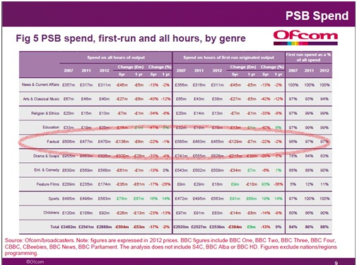

---
Pr-id: MoneyLab
P-id: INC Reader
A-id: 10
Type: article
Book-type: anthology
Anthology item: article
Item-id: unique no.
Article-title: title of the article
Article-status: accepted
Author: name(s) of author(s)
Author-email:   corresponding address
Author-bio:  about the author
Abstract:   short description of the article (100 words)
Keywords:   50 keywords for search and indexing
Rights: CC BY-NC 4.0
...

# Go Crowdfund Yourself! Some Unintended Consequences of Crowdfunding for Documentary Film and Industry in the U.K.

### Inge Ejbye Sørensen {.author}

Since Kickstarter pioneered online crowdfunding in 2009, this form of
financing has entered the mainstream as a way to co-fund projects,
ventures, and startups. Today there are more than 95 crowdfunding sites
in the U.K., up from 87 in 2013. Increasingly sites specialize in
different industries, types of projects, and funding forms. For example,
Kickstarter and Indiegogo are the largest pledge and reward-based
platforms for creative projects; Seedrs caters for start up businesses;
Sponsume innovators and social enterprises; and Gambitious connects game
developers with investors. In 2013, £360 million was raised through a
variety of crowdfunding models: donations, reward-based pledging,
peer-lending, patronage, royalty and equity in the U.K. alone,[^1] and a
study for Nesta estimates that this could rise to £15 billion per year
within five years.[^2] Consequently, this form of funding has won the
attention of politicians, legislators, academics, and the business
community. Barack Obama described crowdfunding as ‘game-changing’[^3]
and the U.S. and U.K. legislated for equity funding in 2012. This year,
the EU is creating a pan-European workgroup to explore the potential and
pitfalls of crowdfunding. These developments and the progressively more
complex crowdfunding types and models, warrant a critical review that
interrogates the intended and unintended outcomes of crowdfunding, here
for documentary films and the documentary film industry.

The crowdfunding of creative productions has been analyzed by a growing
number of scholars across disciplines. Florian Danmayr compares
different funding platforms and the regulation and legislations
surrounding them. Yet new issues around Intellectual Propert (IP) and
co-ownership of crowdfunded projects continue to emerge, as for example
the debates around who really owns the initially crowdfunded Oculus Rift
(and consequently should benefit from Facebook’s \$2 billion acquisition
of) have illustrated.[^4] Similarly, Ordanini, Miceli, Pizzetti, and
Parasuraman explore the motivations of crowdfunders on pledge and
donation platforms, however, since legislation on equity funding has
only recently come into force there is still much more work to be done
in this area. The impact of crowdfunding practices, peer effects and
crowd behavior on the success of projects has been explored by amongst
others, Belleflamme, Lambert and Schwienbacher; Ward and Ramachandran;
and Sørensen. However, few have considered the wider industrial and
socio-economic implications of this funding form for existing and
established industries and economies.

Similarly, crowdfunding in relation to specific art forms and
audiovisual genres has received little academic attention. This despite
the fact that different art forms clearly play out and perform
differently, on distinct crowdfunding platforms, due to their inherent
characteristics, production models, and the structure of their
respective industries. For example, games outperform other genres across
most pledge and donation-based platforms. This is possibly because the
gaming community is closely affiliated with the online community, and
because key stages of the development of a computer game can be
showcased before its release. This allows games creators to spread out
the crowdfunding campaign(s) to finance different stages of the
production and also to increase donations by incorporating stretch goals
in their campaigns. Film production also attract substantial
crowdfunding across platforms, and the practice of offering investors in
feature films ‘executive producer’ credits, has rolled out beyond
Hollywood and translated into the crowdfunding platform Junction
(jct.com) that specializes in equity financing of film for funders with
a net worth of over \$1 million U.S. dollars. Junction’s creator Dominic
Patten sums up the rationale of the platform in this manner: ‘The real
selling point here is the access and that the new Hollywood newbie
investors get the same terms as the original investors.’[^5]
Furthermore, and in marked contrast to the popular conception of
crowdfunding as creating an equal playing field for film makers and
democratizing the film production process, the crowd seems to favor a
less diverse group filmmakers and often prefer to support established
talent with track records and name recognition.[^6] Documentary film
budgets are often significantly lower than those of fiction films and
Morozov and Sørensen have explored whether crowdfunding, as the hype
will sometimes have it, could offer a lifeline to independent
documentary film production in a time of declining budgets. However, as
a funding model for documentary film, crowdfunding has the inadvertent
consequence that only certain types of documentaries are funded.
Typically the crowdfunder is more likely to favor high profile,
issue-led films and polemical documentaries at the expense of, for
example, investigative journalism, poetic-reflexive documentaries and
drama-docs.

This body of research has been invaluable in explaining the dynamics and
mechanics of crowdfunders and the crowdfunding process: the ‘front end’
of production. However, the story of audiovisual projects rarely ends
with the finished product and each stage – development, financing,
production, distribution, and exhibition – must be seen as an
interconnected part of the dynamics of the documentary industry, economy
and ecology. I will therefore shift the focus from individual films and
filmmakers to explore the wider implications of crowdfunding for the
documentary film distributors, film festivals, broadcasters as well as
the documentary film industry at large. The scope of this paper is the
documentary industry in the U.K. but there are similarities across
countries in Europe and the U.S. I take a ‘follow the money approach’
and will make the case that in the final analysis it is not the
crowd-funded documentary makers who benefit most from crowdfunding. This
method of funding documentary content benefits and feeds into
established funding and distribution models. It is the film festivals,
distributors and broadcasters that gain and profit the most from such a
system. Rather than providing an alternative to existing production and
distribution structures, crowdfunding more often than not feeds into,
supports and enforces traditional production and distribution paradigms
and hierarchies.

## In Defense of Crowdfunding

For a nuanced perspective on the discourse around this funding form we
need to take issue with more romantic popular perceptions and
descriptions of online crowdfunding as democratizing documentary making,
and allowing creative expression beyond the traditional gatekeepers –
this is not to reject the idea of crowdfunding *per se.*

Crowdfunding is not a new way to raise funds for films, but rather an
online version of the patronage model that has funded all art forms
throughout history. For instance Emile de Antonio’s 1968 Oscar winner
*In the Year of the Pig* was funded through sponsor parties.[^7] Indeed
online crowdfunders often describe themselves in philanthropic terms
when they explain their reasons for donations.[^8]

In principle, using crowdfunding to support any creative endeavors that
would otherwise struggle to come to fruition can only enrich cultural
expressions across the world. Brilliant and compelling documentaries of
global significance have been funded in this manner. Franny Armstrong’s
*Age of Stupid* is widely credited as one of the first documentaries to
be crowdfunded and distributed online (in fact this film was funded
through Spanner Film’s self-organized profit-sharing and peer-lending
scheme and not through an online crowdfunding platform). Anthony
Baxter’s *You’ve been Trumped*, a documentary about the controversy
surrounding Donald Trump’s development of a golf course in the Scottish
Highlands, would not have been realized without several crowdfunding
campaigns on Indiegogo. Initially, this film was rejected for funding
from BBC and Channel 4, the U.K.’s two public service broadcasters (and
the commissioners of the vast majority of documentaries in the U.K.), as
well as from public film funding through the national arts funders
Scottish Screen (now Creative Scotland) and the BFI (British Film
Institute). Only after its completion, was the film acquired and shown
on BBC’s *Storyville* strand in the U.K.. It then won numerous
prestigious international awards and was distributed across the world.
In the U.S., where the public finding of documentary films is almost
non-existent, the crowdfunded documentary *Inocente* won an Oscar in
2013. Crowdfunding has also become a vital funding avenue in repressive
or totalitarian regimes and countries where public funding is not
awarded to dissenting or non-conformist film makers, or to documentaries
with what is seen as subversive topics. In China Ai Weiwei funds his
films through crowdfunding and in Turkey the LGBT community have
crowdfunded a number of films to raise awareness and focus attention on
the concerns of these groups. The world would indeed be a poorer place
without these films.

## It’s the Distribution, Stupid

The reason we know about the documentaries previously mentioned is that
while initially crowdfunded they were eventually broadcast, shown in
festivals or distributed through traditional and established
distribution channels. They featured in the press because they were
reviewed, promoted by the distributors, broadcasters or festivals that
screened them; because they won accolades at festivals; or were
nominated for awards like the Oscars or BAFTAs.

These crowdfunded documentaries benefitted from being picked up by
traditional distributors and screened at established outlets in several
ways. They increased their reach and audience numbers through being
shown at festivals and aired by broadcasters. In addition to delivering
bums on seats and eyeballs for the documentaries these organizations
also have press departments, officers and PR machines that promote their
programs and schedules, and, by extension, these films. The accolades
and reviews that the PR departments of these institutions can ensure in
turn serve to distinguish these documentaries from all the other films
that are also made. This is further enforced by the cultural and
symbolic capital attached to these traditional distributors and outlets:
put simply it is still more prestigious to have one’s documentary on BBC
than on YouTube, and a premiere at Sundance still has more traction than
a pop-up screening. Moreover, filmmakers have to be screened at
festivals to obtain formal industry and peer esteem, because films
either need to have a cinematic release or be screened at feeder
festivals in order to enter into competition for a BAFTA or an Academy
Award. As a consequence, documentary makers naturally want their films
to be shown at big-name festivals, in cinemas and on TV networks
channels.

## The Documentary Economy and Ecology in the U.K.

On the surface this should be a win-win situation for documentary films
and their makers: crowdfunding allows more documentary makers to make
more documentaries, and some of these secure significant exposure
through traditional outlets. However, there are several problems with
this.

### Declining Documentary Budgets 

In the U.K. the majority of documentaries, 79 percent,[^9] are funded by
the four terrestrial broadcasters who commission and upfront and
outright fund 100 percent of the entire production. The broadcasters
then have the right to show the documentary twice, after which the
rights to the documentary return to the documentary maker. With this
follows the rights to resell the documentaries to other broadcasters,
international distributors or outlets like Netflix and Lovefilm. The
British model of funding documentary films is different from most other
European countries, for example Denmark where co-production and
co-funding is the main form for funding films, and the US where deficit
funding is the norm.[^10] However as the world’s second largest producer
and exporter of documentaries, what is happening within the British
documentary industry is of global importance.

In recent years, the overall budgets for factual programming, including
documentary film, have fallen in the U.K.. There has been a 22 percent
fall in documentary budgets over five years, from a total spend of £585
in 2007 to £455 in 2012, as Figure 1 illustrates. In this same time
period the number of hours of factual programs and documentary films has
gone up. The net effect is that the budget per film is declining.[^11]

Moreover there has been a polarization of budgets, so that high profile
projects have more finance behind them than other productions.[^12] This
is eroding the budgets for more independent types of documentaries
further.

`Fig. 1: Source: Ofcom’s Public Service Broadcasting Annual Report 2013`{.caption}

In addition to the broadcasters’ declining investment in documentary
films, feature-length documentary films received little support from the
public film funders like the BFI and the regional and national screen
offices. This has caused concern for industry professionals and
academics alike. In March 2014 David Hickman, documentary-maker and
senior lecturer in Film & Television Production wrote:

> …there is little significant contribution to British documentary from
> the Big Three U.K. film funders, the BFI, BBC Films and Film4. Despite
> the widely acknowledged fact that feature documentary has been in
> something of a “golden age” in recent years, the idea that these key
> institutions of British film should support feature documentary seems
> to have largely passed them by. As things stand, feature documentary
> makers seeking support from the BBC have one destination:
> *Storyville*, a cash-starved ghetto within BBC television. It’s a
> similar story with Channel 4 – the funds available for feature
> documentaries are vanishingly small.[^13]

Nick Fraser, Series editor of BBC *Storyville* noted the same trend as
early as 2009:

> Documentary-makers were very worried about being overcome by Big
> Brother and “Big Mac” docs, but I think that phase has passed and the
> worry is now much more basic. These people are working for nothing.
> We’re talking such small amounts of money, it’s getting alarming.[^14]

It is in this economic climate that documentary makers are turning to
crowdfunding to produce their films. However, paradoxically,
crowdfunding may in fact further erode documentary budgets.

Crowdfunding offers filmmakers and films many additional benefits beyond
the purely monetary. For example, the process of crowdfunding allows
filmmakers to create and nurture an audience for the film or audiovisual
project before it is made, and can be used as a proof of concept of the
project’s viability. Also, the fan and funder base offer the filmmaker
emotional and practical peer support, as well as create free viral
promotion and advertising for the project.[^15] These benefits pertain
to crowdfunded projects across genres and industries as research by
Ordanini et al. and Belleflamme et al. has shown. Also, crowdfunding
allows filmmakers to produce films outside of the established funding
structures and traditional gatekeepers. This means greater creative
freedom for the filmmakers who do not need to adhere to institutional
guidelines and requirements, or to take into account editorial and
creative contributions from funders and commissioners. However these
benefits come at a less visible price.

Although commissioners and film funders do not have the editorial input
and control over these films in their pre-production or production
stages, having a pool of crowdfunded and already made documentaries at
their disposal has other advantages. Rather than commission ideas and
proposals from scratch, broadcasters can simply chose between a bigger
slate of readymade films to air on their schedules. This makes economic
sense. Documentary budgets in the U.K. vary but, on average, a primetime
documentary on BBC or Channel 4 will be commissioned for around
£150,000-200,000. However, if the film is already produced, the resell
value is significantly less. Again, prices vary and exact terms of trade
are contractually confidential. However, according to six industry
insiders, feature documentaries are regularly bought for BBC’s
*Storyville* and the Danish DR’s *Dokumania* strand for as little as
£1500.00.[^16] In short, instead of an upfront commission for a
documentary that previously may have cost £150,000, the broadcasters can
now acquire a similar finished product for a fraction of the price.

Moreover, as well as being able to choose from a wider selection of
documentary films than they would have been able to commission
themselves the acquisition of these films is totally risk free. Rather
than taking a chance and investing on the basis of an idea or a
proposal, then having to deal with the uncertainties and allow for the
risks involved in any creative process and production, broadcasters can
now view the finished product before buying it. Commissioning editors
thus have less direct editorial influence and creative input into the
individual film in the funding, development and production stages, but
they can choose from a bigger pool of pre-produced products at reduced
price and with no creative risk. In this way, broadcasters now have more
influence over the composition of their overall schedule or stand than
ever before.

It is a similar scenario for documentary film festivals. The success and
esteem of a festival depend on constructing the best possible programs
from as varied and as large a pool of completed documentaries as
possible. There is a disproportional relationship between the ratio of
the numbers of films submitted, the number of films selected and the
profile of the festival: the more films submitted and the fewer
selected, the more exclusive the festival. Moreover, the business models
of most festivals are partly predicated on the submission fees that
documentary filmmakers pay to submit their films to be considered for
the festival. Thus increases in the numbers of films submitted results
in more profit for the festival.

Documentary makers of course know this. However, for all the reasons
listed above, documentary festivals and broadcasters are still the place
where documentary filmmakers and producers want – and need – to show
their films. It is a buyer’s market, because it is the TV stations,
festivals and distributors who can find audiences, promote and turn a
profit for the films. Although more documentaries are produced and
funded through crowdfunding, it is the traditional gatekeepers who still
decide on what gets shown and where. They have the oligopolistic power
and clout to say ‘yes’ or ‘no’ – and now this comes risk free and for a
much lower price.

### Regulations, Legislation, and Professional Standards

There are also wider societal issues and practical industrial problems
with production and funding outside of the traditional funding and
commission structures. Full funding from public funders and
commissioners goes some way to help ensure – at least in principle – the
integrity of the documentary films they fund, the editorial and
journalistic standard to which these are made, and the working
conditions of the crews working on documentary productions.

Terms of trade and compliance procedures are part of the contractual
agreements between public service TV networks or public funders, and the
production companies that they commission or fund to make films and
content. These contractual agreements ensure that productions adhere to
professional standards, health and safety policies, and working
standards for cast and crew. However, there are no rules, guidelines or
legislation governing projects that are funded and produced online and
outside of the legacy funders and commissioners. Therefore there are no
safeguards that guarantee that producers adhere to industry standards,
working practices, conditions or rates set out by unions or alliances
like PACT (representing production companies in the U.K.), NUJ (the
National Union of Journalists), BECTU (the union for crew) or Equity
(the union for cast). Crowdfunded productions are not regulated, and
therefore there are no assurances that media workers working on these
projects are adequately insured, sufficiently trained or working to
professional standards. This has the potential to undercut industry
rates and undermine working conditions for media workers.

Similarly, the editorial standards and attributes traditionally
associated with documentary are potentially challenged in crowdfunded
projects. Notions of ‘balance’, ‘impartiality’, and ‘objectivity’ have
been safeguarded by the TV networks’ producer guidelines and codes of
conduct that producers must adhere to when producing for the BBC and
Channel 4. IP is protected by compliance procedures. Online there are no
such guidelines or procedures. Moreover, a funding process that is open
to all investors can potentially compromise the integrity of a project,
especially if it is a documentary film. Money corrupts, and in
crowdfunding it can be hard to tell where the money is coming from. As
Nick Fraser, the BBC’s series editor of *Storyville*, puts it: ‘If Dr
Goebbels appeared with a huge sack of money, there would be documentary
film-makers queuing around the block to take it.’[^17] Fraser’s point is
valid: notions of impartiality and balance are hard to uphold, if a
documentary is part funded by political parties, an NGO, pressure group,
lobbyist, charity or business.

It is also worth noting that the main funders of documentary films in
the U.K. – BBC, Channel 4, BFI and the regional and national public
funders – all have public service remits. These are in place to ensure
plurality, that a diversity of factual programming and documentary films
are commissioned, expressing the full spectrum of viewpoints across
society and catering for niche tastes and underrepresented audiences and
well as those with popular and mass appeal. Crowdfunding platform have
no such obligations. Although some crowdfunding platforms are charities,
others are businesses. Their remit is profit or turnover, not plurality
or making sure that a variety of films that represent a spectrum of
voices are made. It is increasingly evident that the crowd favors films
of mass appeal or those made by filmmakers with name recognition,[^18]
and another casualty of crowdfunding could be diversity and plurality of
productions and voices.

In these ways, an unintended outcome of crowdfunding is the potential
for the accidental erosion of industry and professional standards as
well as working conditions for journalists, filmmakers and crew within
the documentary film industry. And with this crowdfunding could
undermine the integrity and credibility of documentary film as well as
the plurality and diversity of film and filmmakers. Ironically, although
crowdfunding is hyped as democratizing the means and access to
production, it could well have the reverse effect.

## Go Crowdfund Yourself 

Recently, the public funders, organizations and institutions have also
begun to engage in and use crowdfunding to part-fund projects that they,
until recently, would have fully funded. For example, in order to be
eligible for funding through the publically funded, micro-budget film
schemes *lo-fi* and *Mircowav*e, it is a prerequisite for the filmmakers
to crowdfund a certain part of their budget. Similarly, museums have
started using crowdfunding to realize special projects and part-fund
exhibitions. For example, Glasgow Women’s Library raised £6,839 to
publish a book inspired by its collections; Bowes museum raised £8,680
to commission an artwork by Graham Turk that was installed on the front
of the museum as part of the exhibition of his work; and the William
Heath Robinson trust crowdfunded £33,492 for a permanent gallery.

Donations and memberships have of course always been part of business
model of museums, but taking these trends to their logical conclusion,
why have public arts funding at all? The discourse around democratizing
production and funding through ‘crowds’ and ‘communities’ is alluring,
but it also chimes well with the Conservative British Prime Minister,
David Cameron’s Big Society, as Evgeny Morozov points out.[^19] One
might, if of a neoliberal predisposition, wonder why the state should
subsidize the eight percent who watch ballet and contemporary dance,
when dance fans could just crowdfund it themselves. Or ask why people
should not just pay as they go and fund what they want in museums?
Crowdfunded documentary films always highlight the fact that they are
crowdfunded in their promotional material and use this endorsement of
the crowd as part of their legitimacy and relevance. However, behind the
rhetoric and romance of democratizing both the ability to fund
documentaries as well as to make them, lures the question of why films
should be funded out of the public purse, when crowdfunding evidently
shows that it is feasible to substitute public film funding with
crowdsourced support. In short, one major but serious, unintended
outcome of crowdfunding is the potential to undermine public arts
funding.

In cultural economics it has long been acknowledged that artists
subsidize the arts with their time, free work and self-funding of the
development of projects.[^20] Artists also subsidize each other by
helping out colleagues, collaborators and prospective employers as part
of their practice. ‘Freebies’ is an established term within creative
work, and although not always recognized as such in economic terms,
artists subsidize each other. However, with crowdfunding, so do the
artist’s families, friends and fans. Before simply extolling the wonders
of crowdfunding as public arts funding, we need to ask ourselves how
this funding form impacts not only on existing industries and funding
structures but also on the arts and artists. To what extend is
crowdfunding supplementing or distorting existing cultural and creative
industries? Is crowdfunding a genuine addition and benefit to the arts
and public funding, or is it simply artists and their networks swapping
money, whilst public funding for cultural industries declines and arts
funding falls?

## Conclusion – The ‘Needle in a Haystack’ Problem 

Documentary films perform a crucial role in exchanging and mediating
knowledge and opinions in society. Carl Plantinga argues that the
integrity and quality of non-fiction films is a precondition for the
‘healthy intersubjectivty’ that he sees as fundamental to the
functioning of Western democracies.[^21] The conditions under which
documentary films and content are produced are therefore of paramount
importance. As crowdfunding increasingly becomes a way to fund these
films it is necessary to highlight these unintended consequences for the
documentary films industry.

Although crowdfunding provides some solution to funding and producing
particular documentaries outside of the traditional and legacy systems,
the wider documentary industry is still dependent on the traditional
gatekeepers and media institutions for the promotion, distribution and
success of its films. Documentary film production and distribution are
parts of a network that is still dominated and controlled by established
media institutions. As it stands, crowdfunded films still need the
traditional distributors – festivals, cinemas and broadcasters – to
reach their audiences. Similarly, in order to crowdfund online, artists,
filmmakers and journalists rely on crowdfunding platforms and the
surrounding industry of crowdfunding consultant and facilitators that
have sprung. It is these organizations – not the creators, filmmakers
and artists – that benefit most from crowdfunding.

New ways of organizing distribution and exhibition are emerging.
Distrify provides peer-to-peer file and profit sharing software that
allows people to share films on social networks and receive a cut of the
download price. TUGG or Gathr bring together audiences for
self-organized and on-demand screenings of documentary and feature
films; and VOD services (iTunes, Netflix and Amazon Prime) and
advertising supported streaming (YouTube) provide alternative outlets
for documentary makers. However, these systems have still to accumulate
critical mass and popular support, and have yet to demonstrate the
reliability, financial returns and promotional infrastructure that the
traditional distribution and exhibition networks command.

For crowdfunding to be a viable business model for filmmakers and the
documentary film industry, new sustainable peer-to-peer distribution
routes and exhibition networks that are not predicated and dependent on
legacy media outlets need to emerge. These need to have the reach and
promotion to be able to bring audiences to films, to curate
documentaries to ensure their consistency and quality, as well as to
generate the reviews, awards and accolades that will bring quality
crowdfunded projects to the surface without distorting and undermining
the existing funding systems. Also, mechanisms of safeguarding working
conditions, professional and editorial standards need to be put in place
for productions funded on crowdfunding platforms. Only then will
crowdfunding be able to live up to the current hype about democratizing
the production of documentary films, and offer a truly viable
alternative to existing funding models.

## References

Baxter, Anthony. *You’ve Been Trumped*, 2012,
<http://www.youvebeentrumped.com/youvebeentrumped.com/PRESS.html>.

Belleflamme, Paul, Thomas Labert and Armin Schwienbacher. ‘Crowdfunding:
Tapping the Right Crowd’, Paper presented at the International
Conference of the French Finance Association (AFFI), 11 May 2011.

\_\_\_\_\_. ‘Individual
Crowdfunding Practices’, *Venture Capital: An Internatiuonal Journal of
Entrepreneurial Finance* 15.4 (2013).

Branham, Darren C. ‘[The Myth
of Amateur Crowds: A Critical Discourse Analysis of Crowdsourcing
Coverage](http://www.tandfonline.com/doi/abs/10.1080/1369118X.2011.641991)’,
*Information, Communication & Society,* 15.3 (2012): 394-410.

Chapman, Jane, and Kate Allison. *Issues in Contemporary Documentary*,
Cambridge: Polity, 2009.

Child, Ben. ‘Tom Hanks Film
Seeks Crowdfunding Via “Kickstarter for the Rich” Site’, *The Guardian,*
27 March 2014,
<http://www.theguardian.com/film/2014/mar/27/tom-hanks-film-crowdfunding-kickstarter-junction>.

Collins, Liam, Peter Baeck and
Stian Westlake. *Crowding In*, London: Nesta, 2012.

Collins, Liam, Richard Swart
and Bryan Zhang. *The Rise of Future Finance*, London: Nesta, Berkeley
and University of Cambridge, 2013.

Cox, David. ‘Is This the End
of the Line for the Impartial Documentary’*, The Guardian*, 9 November
2009,
<http://www.theguardian.com/film/filmblog/2009/nov/09/sheffield-docfest-documentary-films>.

Danmayr, Florian. *Archetypes
of Crowdfunding Platforms : A Multidimensional Comparison,* Wiesbaden
Springer Gable, 2014.

Doyle, Gillian.
*Understanding Media Economics*. 2nd ed. London: SAGE, 2013.

Fitzpatrick, Alex. ’Obama
Signs “Game-Changing” Crowd-Funding Jobs Act’, *Mashable*, 5 April 2012,
<http://mashable.com/2012/04/05/jobs-act-signed/>.

Hickman, David. ‘Documentary
Funding Gap Stalls Great Films Like the Act of Killing’, *The
Conversation,* 6 March 2014,
<http://theconversation.com/documentary-funding-gap-stalls-great-films-like-the-act-of-killing-23737>.

Kendall, Geraldine.
‘Trendswatch: Can You Kick Start It?’, *Museums Journal* 114.3 (2014):
39.

Kickstarter.
http://www.[kickstarter.com](http://www.kickstarter.com).

Kocer, Suncem. ‘Social Business in Online Financing: Crowdfunding
Narratives of Independent Documentary Producers in Turkey’, *New Media
and Society* (Forthcoming 2014).

Lovefilms.
<http://www.lovefilm.com>.

Luzar, Charles. ‘Ai Weiwei Secretly Shot a Sci-Fi Film and It’s Funding
on Kickstarter’, *Crowdfunder insider*,
<http://www.crowdfundinsider.com/2014/04/35553-ai-weiwei-secretly-shot-sci-fi-film-funding-kickstarter/>.

Mollick, Ethan R. ‘The
Dynamics of Crowdfunding: An Exploratory Study’, *Journal of Business
Venturing* 29. 1 (2014): 1-16.

Morozov, Evgeny. ‘Kickstarter
Will Not Save Artists from the Entertainment Industry’s Shackles: A New
Study Says Crowdfunding Benefits Only Certain Kinds of Movies’, *Slate
Magazine*, 25 September 2012.

Nesta.
<http://www.nesta.org.uk/news/uk-crowdfunding-platforms-50-cent-2013>.

Ofcom. *Public Service
Broadcasting Annual Report 2013*, London: Ofcom, 2013.

Ordanini, A., L. Miceli, M.
Pizzetti, and A. Parasuraman. ‘Crowd-Funding: Transforming Customers
into Investors through Innovative Service Platforms’, *Journal of
Service Management* 22.4 (2011): 443-470.

PACT. *Pact Policy Survey and
Financial Census 2009*, London: Oliver & Ohlbaum Associates ltd., 2009.

Plantinga, Carl R. *Rhetoric
and Representation in Nonfiction Film*, Cambridge: Cambridge University
Press, 1997.

Reidl, John. ‘Crowdfunding
Technology Innovation’, *Computer* 46. 3 (2013): 100-103.

Sørensen, Inge.
‘Crowdsourcing and Outsourcing. The Impact of Online Funding and
Distribution on the Documentary Film Industry in the UK’, *Media ,
Culture & Society* 34.6 (2012): 726-743.

\_\_\_\_\_. *Documentary in a
Multiplatform Context,* PhD Diss., Department for Media, Cognition and
Communication, Copenhagen University, Copenhagen, Denmark, 2013,
<http://curis.ku.dk/ws/files/44584781/Ph.d._2013_S_rensen.pdf>.

Steemers, Jeanette, *Selling
Television: British Television in the Global Marketplace*, London: BFI,
2004.

Towse, Ruth. *Advanced
Introduction To Cultural Economics*, Cheltenham: Edward Elgar
Publishing, 2014.

Ward, Chris, and Vandana Ramachandran. ‘Crowdfunding the Next Hit:
Microfunding Online Experience Goods’, workshop at NIPS2010, Whistler,
Canada, 10 December 2010,
<http://people.cs.umass.edu/~wallach/workshops/nips2010css/papers/ward.pdf>.

Wells, Nicholas. ‘The Risks
of Crowdfunding: Most Have the Best Intentions When It Comes to
Crowdfunding an Ambitious Project, but Intellectual Property Issues,
Ownership Rights and Perk Obligations Present Potential Hurdles to
Making a Dream Become Reality’, *Risk Management* 60. 2 (2013): 26-9.

[^1]: This figure is the sum of equity, donations, reward-based, and
    revenue-sharing profit crowdfunding in this report by Liam Collins,
    Richard Swart, and Bryan Zhang, The Rise of Future Finance, London:
    Nesta, Berkeley and University of Cambridge, 2013.

[^2]: Nesta, [http://www.nesta.org.uk/news/uk-crowdfunding-platforms-50-cent-2013](http://www.nesta.org.uk/news/uk-crowdfunding-platforms-50-cent-2013).

[^3]: Alex Fitzpatrick, ‘Obama Signs “Game-Changing” Crowd-Funding Jobs
    Act’, *Mashable*, 5 April 2012,
    [http://mashable.com/2012/04/05/jobs-act-signed/](http://mashable.com/2012/04/05/jobs-act-signed/).

[^4]: Some of the implications of crowdfunding for IP are discussed by,
    for example, Nicholas Wells, ‘The Risks of Crowdfunding: Most Have
    the Best Intentions When It Comes to Crowdfunding an Ambitious
    Project, but Intellectual Property Issues, Ownership Rights and Perk
    Obligations Present Potential Hurdles to Making a Dream Become
    Reality’, *Risk Management* 60.2 (2013): 102, and John Reidl,
    ‘Crowdfunding Technology Innovation’, *Computer* 46.3 (2013):
    100-103.

[^5]: Ben Child, ‘Tom Hanks Film Seeks Crowdfunding via “Kickstarter for
    the Rich” Site’, *The Guardian,* 27 March 2014,
    [http://www.theguardian.com/film/2014/mar/27/tom-hanks-film-crowdfunding-kickstarter-junction](http://www.theguardian.com/film/2014/mar/27/tom-hanks-film-crowdfunding-kickstarter-junction).

[^6]: Cf. Brabham’s, Mollick’s, Morozov’s and Sørensen’s research.

[^7]: Jane Chapman and Kate Allison, *Issues in Contemporary
    Documentary*, Cambridge: Polity, 2009, p. 104.

[^8]: As noted by Ethan R. Mollick, ‘The Dynamics of Crowdfunding: An
    Exploratory Study’, *Journal of Business Venturing* 29. 1 (2014), as
    well as Paul Belleflamme, Thomas Lambert, and Armin Schwienbacher,
    ‘Crowdfunding: Tapping the Right Crowd’, paper presented at the
    International Conference of the French Finance Association (AFFI),
    11 May 2011.

[^9]: PACT, *Pact Policy Survey and Financial Census 2009*, London:
    Oliver & Ohlbaum Associates ltd., 2009, p. 14.

[^10]: Gillian Doyle, *Understanding Media Economics*, 2nd edition,
    London: SAGE, 2013, pp. 111-114.

[^11]: These figures are from Ofcom’s *Public Service Broadcasting
    Annual Report 2013*, London: Ofcom, 2013, pp. 9 and 16. However,
    Ofcom’s statistics as well as the BBC’s and Channel 4’s annual
    reports conflate factual programming and documentary in a ‘factual’
    category and it is therefore impossible to discern the exact
    proportion of documentary films in relation to factual programming
    (e.g. cookery, DIY, travel programs, etc.) without conducting a full
    content analysis of the respective broadcasters’ schedule. Added to
    this, varying definitions of what a documentary film is would
    complicate such a breakdown of programming. Are Michael Palin’s
    programs travel, food or documentary content, for example? However,
    given that the number of documentaries in the traditional
    documentary strands, e.g. *Panorama, Storyville, Unreported World,
    Cutting Edge, Horizon,* on average have remained stable over the
    past decade according to BFI’s databases, though budgets have
    declined, it seems reasonable to assume that overall budgets per
    hour for documentary films have diminished. This trend is also
    mirrored by the fact that the over all spending on other categories
    where documentary films would also be included like ‘Current
    Affairs’ and ‘Arts & Music’ have also declined, as Figure 1
    demonstrates.

[^12]: Inge Sørensen, ‘Crowdsourcing and Outsourcing. The Impact of
    Online Funding and Distribution on the Documentary Film Industry in
    the UK’, *Media, Culture & Society* 34.6 (2012): p. 734.

[^13]: David Hickman, ‘Documentary Funding Gap Stalls Great Films Like
    the Act of Killing’, *The Conversation,* 6 Marts 2014,
    [http://theconversation.com/documentary-funding-gap-stalls-great-films-like-the-act-of-killing-23737](http://theconversation.com/documentary-funding-gap-stalls-great-films-like-the-act-of-killing-23737).

[^14]: Nick Fraser is cited in David Cox, ‘Is This the End of the Line
    for the Impartial Documentary’*, The Guardian.co.uk*, 9 November
    2009,
    [http://www.theguardian.com/film/filmblog/2009/nov/09/sheffield-docfest-documentary-films](http://www.theguardian.com/film/filmblog/2009/nov/09/sheffield-docfest-documentary-films).

[^15]: Franny Armstrong relates her perceived benefits of crowdfunding
    in an interview with Inge Sørensen. Full transcript in the appendix
    of Sørensen’s PhD diss., *Documentary in a Multiplatform Context*
    from the Department for Media, Cognition and Communication,
    Copenhagen University, Denmark, 2013,
    [http://curis.ku.dk/ws/files/44584781/Ph.d.\_2013\_S\_rensen.pdf](http://curis.ku.dk/ws/files/44584781/Ph.d.\_2013\_S\_rensen.pdf).

[^16]: Four documentary makers have related this figure in personal
    communications with the author.

[^17]: David Cox, ‘Is This the End of the Line for the Impartial
    Documentary’*, The Guardian*, 9 November 2009,
    [http://www.theguardian.com/film/filmblog/2009/nov/09/sheffield-docfest-documentary-films](http://www.theguardian.com/film/filmblog/2009/nov/09/sheffield-docfest-documentary-films).

[^18]: As described by Inge Sørensen, ‘Crowdsourcing and Outsourcing’
    and Darren C. Brabham, ‘[The Myth of Amateur Crowds: A Critical
    Discourse Analysis of Crowdsourcing Coverage](endnotes.xml)’,
    *Information, Communication & Society,* 15.3 (2012): 394-410.

[^19]: Evgeny Morozov, ‘Kickstarter Will Not Save Artists from the
    Entertainment Industry’s Shackles: A New Study Says Crowdfunding
    Benefits Only Certain Kinds of Movies’, *Slate Magazine*, 25
    September 2012,

[^20]: Ruth Towse, *Advanced Introduction To Cultural Economics*,
    Cheltenham: Edward Elgar Publishing, 2014.

[^21]: Carl R. Plantinga, *Rhetoric and Representation in Nonfiction
    Film*, Cambridge: Cambridge University Press, 1997, p. 219.
