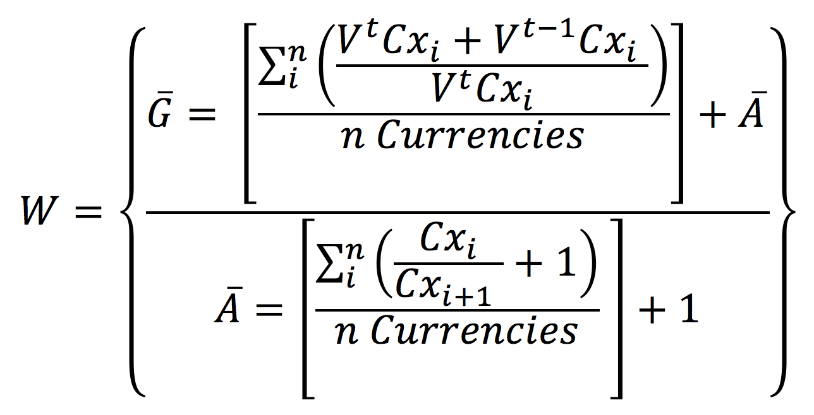
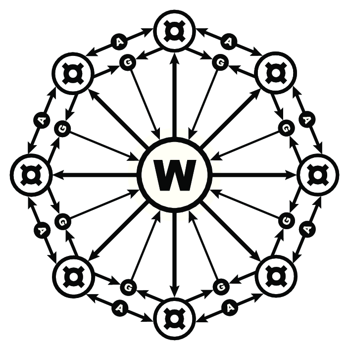

---
Pr-id: MoneyLab
P-id: INC Reader
A-id: 10
Type: article
Book-type: anthology
Anthology item: article
Item-id: unique no.
Article-title: (W)orld Currency
Article-status: accepted
Author: Paolo Cirio
Author-email:   corresponding address
Author-bio:  about the author
Abstract:   short description of the article (100 words)
Keywords:   50 keywords for search and indexing
Rights: CC BY-NC 4.0
...

# \(W\)orld Currency 

###  Paolo Cirio {.author}

(W)orld Currency is an artwork that illustrates a global currency
through the creative formulation of an equation and a trading algorithm
for the currency exchange market. The visionary creation of algorithmic
trading combines art with the material that governs contemporary society
and in doing so, it aims to introduce new art practices. 
 
The artwork seeks to inspire social transformation through envisioning a
positive and innovative economic tool. It addresses the inherent
instability of various currencies, as well as the need for a new
independent global reserve currency that could potentially empower and
unite the world population. As a sustainable financial instrument, the
World Currency Equation will act as a cushion that will protect people
against the increased volatility of individual currencies due to
speculative manipulations and economic swings, while preserving market
access across different geo-political and social domains. 
 
The proposed algebraic equation provides valuation and liquidity for a
new currency (W) based upon the average of an index of individual
currencies. The formula combines and secures dominant national
currencies with new digital and local complementary currencies,
preserving autonomy and diversification within universal acceptance. 
 
The artwork is illustrated through the artistic expression of a
mathematical equation and a diagram of an algorithm. These two elements
indicate how the value of the currency is calculated and how its
liquidity is created and maintained. 
 
## How it Works
World Currency is a global reserve currency backed by popular
currencies. It's based on a value-weighted index, in which each currency
in a basket influences the index in proportion to its exchange rate and
spread for every combination of pairs of currencies traded. The overall
average of the rate exchanges determines (W). In the system, the value
of (W) is kept steady by the daily trading of each currency in the
basket in an interconnected network of deposits. For every node of the
network each currency is stored only for the average amount of the whole
network. The gains and losses are also leveled equally in every deposit.
The equal distribution of multiple reserve currencies always maintains
(W) with liquidity and stable value. 
 
The equation and the algorithm make use of Forex market conventions and
can only include currencies that are tradable electronically. 
 
## The Equation
The following equation illustrates how (W) is calculated upon an
aggregate of exchange rate values of a basket of leading currencies
within the gains and losses that the fluctuations among them generate
over time. The mathematical average of the values of currencies (A) in
the basket keeps the value of (W) steady. The gains compensate the
losses in the total average (G). 
 
 
 
## The Algorithm 
The following diagram illustrates how an algorithm can automatically
aggregate (W) by wiring currencies over the multiple reserve deposits
based on the recursive calculation of the (W) equation. 

 

##  Glossary
W: Value of World Currency. Symbol (W). 

**¤**: Any currency symbol in the basket. 

A: Average of exchange rates between each pair of currencies in the
basket. 

G: Average of spreads between each pair of currencies in the basket over
time. 

N: Number of currencies in the basket. 

Cx: Current exchange rate of the currency of the index. 

V: Current value of the currency of the index. 

T: At past and future time period.

## Credits

Images and picture courtesy by the artist Paolo Cirio

## Commission

*Artistic Bokeh and* Quartier21, Museum Quarter, Vienna - Austria

## Selected shows 
*London Design Festival*, exhibition at Victoria and Albert Museum,
2014, London - UK

*Synthetisch Vernünftig,* exhibition at LEAP, 2014, Berlin - Germany

*In Search of Symmetry*, exhibition at HDLU, 2014, Zagreb, Croatia
