---
Pr-id: MoneyLab
P-id: INC Reader
A-id: 10
Type: article
Book-type: anthology
Anthology item: article
Item-id: unique no.
Article-title: title of the article
Article-status: accepted
Author: name(s) of author(s)
Author-email:   corresponding address
Author-bio:  about the author
Abstract:   short description of the article (100 words)
Keywords:   50 keywords for search and indexing
Rights: CC BY-NC 4.0
...

# The Free Money Movement

### Jim Costanzo {.author}

The Aaron Burr Society (ABS) launched the *Free Money Movement* on Wall
Street on April Fools Day 2009. ABS was inspired by the bailout of Wall
Street banks after the 2008 international financial meltdown. A small
group of videographers and performers joined ABS on the mall between the
New York Stock Exchange and the Federal Building where George Washington
was sworn in as the first president. From there the group marched a few
blocks north to the Federal Reserve Bank, then to the Museum of American
Finance, and returned to where we began.

The goal of the performance was to distribute 100 one dollar bills
stamped with *Free Money* on one side and *Slave of Wall Street* on the
other. ABS’s website[^1] was also stamped on the paper currency, actual
Federal Reserve Notes. The goal was to raise awareness of the predatory
nature of capitalism and the Wall Street agenda of deregulation, fraud,
and bailouts.

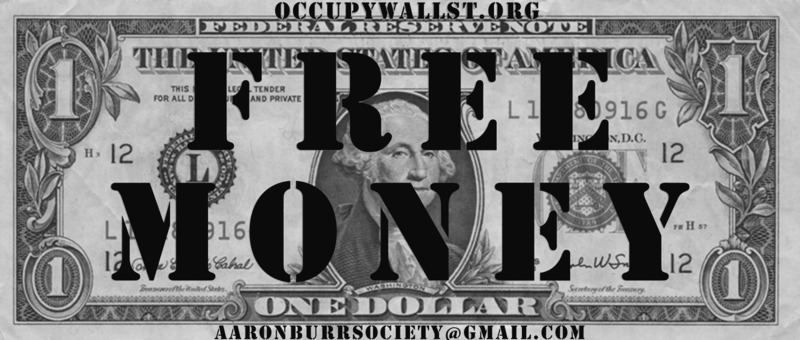

`Fig. 1: Stamped U.S. dollars – Federal Reserve Notes, 2009-2014.`{.caption}

Later in the year, ABS printed *Revolutionary Script* using a
letterpress to print on hemp paper. The *Script*, outlining
philosophical and policy statements, intended to question and suggest
alternatives to capitalist monetary control. The document was printed on
both sides; the front promotes nationalizing the Federal Reserve Bank
(the Fed) by eliminating private bankers who run the national bank.
Other aspects included giving no-interest loans to the people instead of
to Wall Street and calling for a commonwealth based on the 21st century
concept of the commons.[^2] It advocates for ‘Democracy Not Hamiltonian
Plutocracy’, a reference to Alexander Hamilton, America’s first Treasury
Secretary. Hamilton, founder of the First National Bank, introduced the
United States to an early form of British capitalism. ABS’s namesake,
Vice-President Aaron Burr, killed Hamilton in a duel, and although
Burr’s political career eventually ended badly, after killing Hamilton
he returned to Washington DC, and finished his term as Vice-President.

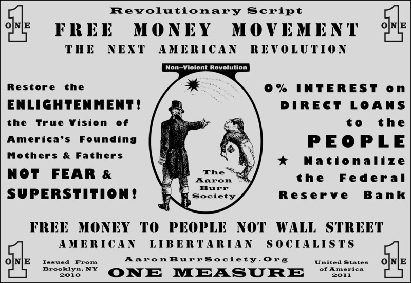

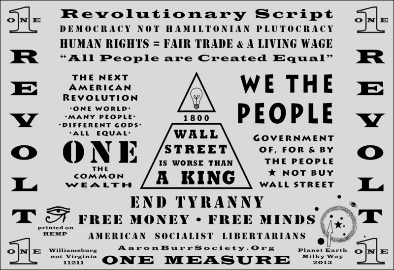

`Fig. 2: Revolutionary Script.`{.caption}

ABS continues to distribute *Free Money* using a viral strategy that
circulates stamped bills through monetary exchanges in bars and shopping
in assorted venues. During Occupy Wall Street (OWS), ABS added an
*OccupyWallSt.org* stamp. Thousands of dollars have been spent across
the U.S. and in 2012 ABS was invited to the 7th Berlin Biennale as part
of Occupy Museums and distributed stamped Euros.

`Fig. 3.1: Free Money Portland, 2013.`{.caption}

`Fig 3.2 Free Money in Humboldt County, 2013.`{.caption}

In 2014 ABS added a *Common Good/Commonwealth* stamp which alternates
with *Slave of Wall Street*, while the opposite side is always *Free
Money*. The latest addition provides a comparison between giving money
to Wall Street and the 1 percent, or using our commonwealth to invest in
the common good.

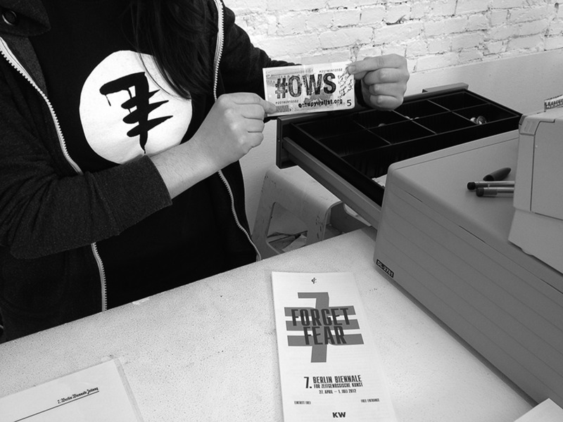

`Fig. 4.1: Back of *Free Money* distributed by 2012 Berlin Biennale bookstore, 2012.`{.caption}

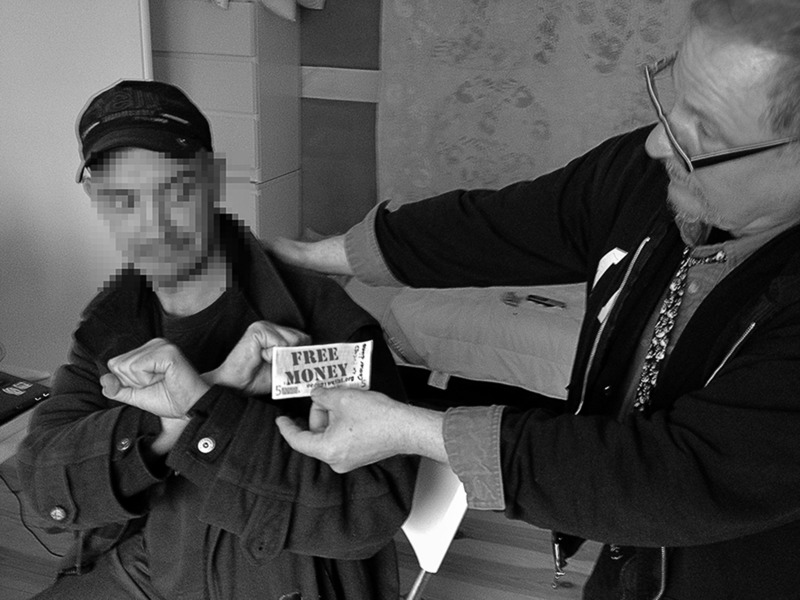

`Fig. 4.2: Dramatic recreation of discussion about Free Money with anonymous M15 member who lives without money, Berlin Biennale, 2012.`{.caption}

Though founded before the corporate sponsored Tea Party, ABS’ goal was
to counter long-standing conservative strategies that distort history by
conflating liberty and nationalism with capitalism. From the beginning,
the plan was to present an alternative American history from a radical,
populist perspective, informed by Marx and emerging theories on the
commons. Though ABS started as an absurdist, conceptual public artwork,
it has always taken great care to be factually accurate. We have
exercised poetic license with terms like *Free Money*, but the issues
addressed are serious.

## Genesis

> Those who control the present, control the past and those who control
> the past control the future.[^3]
> 
> – George Orwell, *1984*

ABS originated in the spring and summer of 2008, just before the crash
of the international financial markets, but it was a sign placed in
front of the New York Stock Exchange in 1992 that forms the basis of
ABS’s philosophy. REPOhistory’s *Lower Manhattan Sign Project* included
an artwork that I created titled *Advantages of an Unregulated Free
Market Economy*. The text on the back of the sign read:

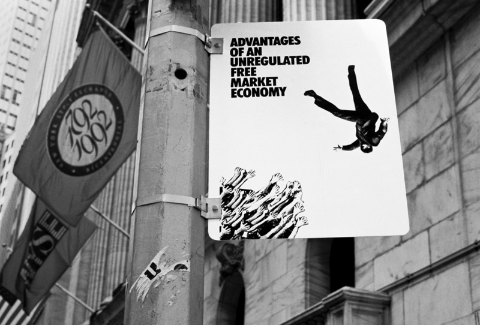

`Fig. 5: REPOhistory 1992, photo Tom Klem.`{.caption}

> **Myth:** Traders and brokers jumped from Wall Street skyscrapers
> after losing their fortunes in the 1929 stock market crash.
>
> **Reality:** No suicides occurred in the Wall Street area immediately
> after the 1929 crash. Brokers and traders make a profit for each
> transaction regardless if the market goes up or down. Investors lost
> money. The real losers were workers who lost their jobs in the
> Depression.
>
> **Facts:** In the late 19th century, the 1920s, and 1980s,
> conservative government policy manipulated the market economy which
> led to artificial economic booms that transferred the wealth of the
> nation to the top 1% of the population. In each era these policies
> caused crashes and depressions.
>
> During the 1980s while corporations and the rich became substantially
> richer, the standard of living for working and middle class Americans
> fell.
>
> Leveraged buyouts, hostile takeovers, insider trading, junk bond
> scandals and Savings and Loan frauds were all aided by administrations
> that opposed government regulation of financial markets. Other
> government policies encouraged industrial deregulation, an increase in
> personal and national debt, high interest rates, and lower taxes for
> the rich and corporations.
>
> These policies have undermined America’s industrial and financial
> institutions. The middle and working classes will spend the 90s paying
> for the excesses of the 80s.

Armed with the knowledge gained from my research, the looming economic
crash of 2008 was obvious. In June of that year, *Harper’s Magazine*
published my letter to the editor in response to an article about how
environmental sustainability would be financed by the next bubble.

## Toil and Trouble

> ‘“The Next Bubble” [Report, February] provides an excellent summary of
> business cycles and the forces that drive them, but Eric Janszen fails
> to make one crucial point: the economic bubbles we have experienced
> were not victimless crimes committed by nameless perpetrators but
> deliberate strategies to drive wealth to the top of the economic
> pyramid. In each and every case, these bubbles have been abetted by
> government deregulation and even fraud, and have ultimately served to
> widen the income gap between the rich and poor.
>
> The real estate bubble targeted African Americans and other minorities
> and is an especially egregious example of this phenomenon. Alan
> Greenspan, who was warned about predatory lending tactics, did nothing
> to curb such practices even as he dropped interest rates to
> unprecedented lows. But Greenspan isn’t alone in his culpability: at
> the height of the bubble, Congress passed laws on credit and
> bankruptcy that undermined borrowers’ ability to cope with debt. A
> close reader of this legislation might be excused for assuming these
> laws were created with the intent to maximize ill effects if and when
> the bubble burst.
>
> Lastly, as our economy descends into chaos, no one should forget the
> personal contribution of President George W. Bush to our financial
> disaster. Given the current state of affairs, his promise to replace
> traditional government welfare programs with a new social order, the
> “Ownership Society”, has proven absurd at best, and at worst
> criminal.’
>
> *Harper’s Magazine, June 2008*

Little has changed but the names since I wrote the letter, while the
neo-liberal economic programs continue. After trillions of dollars spent
on bailouts, quantum easing is still giving banks \$85 billion a month,
keeping the current bubble inflated. The gap in income between the 1
percent and the 99 percent is at an historic high and increases daily.

Following the letter to *Harper’s Magazine*, I began performing on Wall
Street. Wearing a two-sided sandwich board sign, I began panhandling.
The sign, which formed the basis of ABS, proclaimed that I was trying to
raise \$100,000 to attend a political fundraising event so that I could
buy a politician. The ABS is called after Vice-President Aaron Burr who
killed fromer Treasury Secratery Alexander Hamilton in a duel. Hamilton
was America’s first capitalist and he created the first National Bank.
But I also remembered Gore Vidal’s historical novel *Burr* where Burr is
described as a sympathetic though complicated character, not as the
villain of the early Repbulic. I later learned that Burr was a radical
who supported the French Revolution and a more democratic government at
home. For these and other reasons, Burr turned out to be a unique prism
through which to reexamine American history.

***Dedicated to Exposing the Myths of Free Markets and Free Trade While
Challenging the Integrity of Wall Street and their Corporate Cronies***

Aaron Burr Society motto

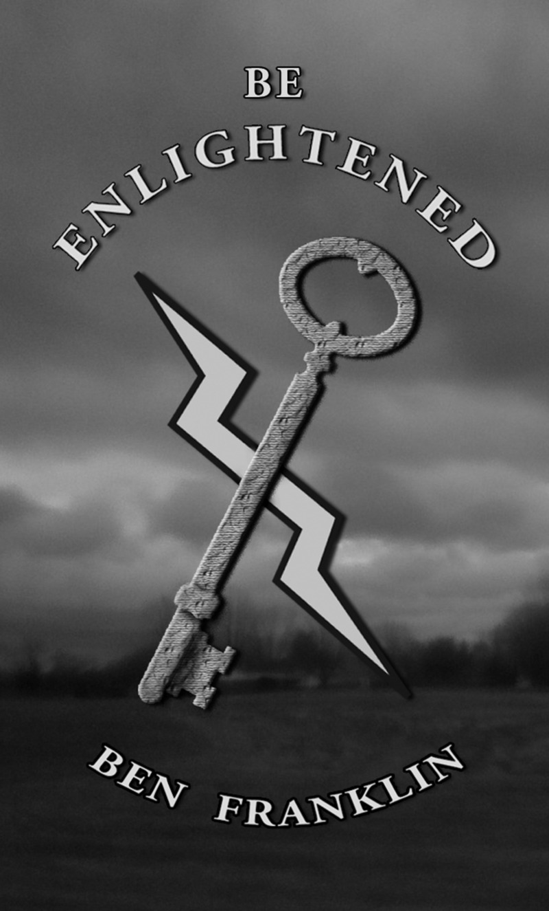

`Fig. 6: Aaron Burr Society card, motto printed on back.`{.caption}

Historically the policies of Wall Street and King George, though
different, are similar in that the king used corporations like the East
Indian Company to extract wealth from the colonies. But because of
distance and length of time involved in communications, the colonies had
a certain degree of autonomy. The American Colonies could issue paper
currency to facilitate local trade and commerce. In 1729 Benjamin
Franklin published a pamphlet about the importance of paper
currency,[^4] not only for trade and commerce, but also for the workers,
craftsmen, and small shop owners. Paper money, or fiat currency, was one
of the reasons that the colonies were prosperous. After the French and
Indian War of 1754-1763, the British government passed the Currency Act
of 1764, limiting the Colonies’ right to issue currency as legal tender
by making that the exclusive right of the Bank of England. This, more
than the Stamp Act or taxes on tea and other goods, transformed the
Colonies from prospersous settlements to communities in debt and
struggling to survive.

After the Revolution, under the Articles of Confederation, individual
states returned to issuing paper money to help farmers and workers pay
their debt. At this time states were under pressure to help their
citizens because financial speculation on Revolutionary War Bonds was an
important reason for raising taxes. Shays’ Rebellion (1786-87) was the
first instance of armed rebellion based on debt.

> The crisis of the 1780s was most intense in the rural and relatively
> newly settled areas of central and western Massachusetts. Many farmers
> in this area suffered from high debt as they tried to start new farms.
> Unlike many other state legislatures in the 1780s, the Massachusetts
> government didn’t respond to the economic crisis by passing pro-debtor
> laws (like forgiving debt and printing more paper money). As a result
> local sheriffs seized many farms and some farmers who couldn’t pay
> their debts were put in prison.[^5]

One of the most important reasons that the Constitution replaced the
Articles of Confederation was to end the pro-debtor laws passed by
individual states. James Madison, the primary author of the
Constitution, was often quoted saying the Constitution would insure that
the ‘right people’ would retain power. Or as Madison wrote in Federalist
Paper \#10, ‘A rage for paper money, for an abolition of debts, for the
equal division of property, or for any other improper or wicked project,
will be less apt to pervade the whole body of the Union...’[^6] The
Constitution guaranteed that *wicked projects* like economic and social
justice were not to be tolerated.

Weeks before Washington took office as the first president, John Scull,
the printer, editor, and publisher of the *Pittsburgh Gazette,* wrote
this editorial:

> The Framers of the Constitution bestowed the most watchful attention
> to prevent you from enjoying, under it, at any future time, an
> opportunity of expressing your sentiments of it by an equal
> representation. They provided no other mode of reformation than the
> inadequate and unequal one of a council of censors. Amendments to the
> Constitution requires a two-thirds majority.[^7]

This editorial laid the foundation of the Whiskey Rebellion of 1791 that
was sparked by Constitution and later fanned by Hamilton’s capitalist
policies.

Money is a form of social exchange. That is why we must look to the
Constitution since it defines and regulates economic, social, and
political exchange. The Constitution set the legal bases for the Supreme
Court’s Citizens United ruling that gave corporations the rights of
citizens and a 2014 decision that Argentina must first pay hedge fund
speculators before paying for education, health care, and
infrastructure.[^8] Another example is a Detroit judge ruling that
debtors who did not pay their bills have no right to water.[^9] These
rulings illustrate that the Constitution values property rights over
human rights. To write a Constitutional Amendment that bans corporate
citizenship will not change the relationship between creditors (the
minority) and debtors (the majority).

Our collective wealth, our commonwealth, is not *Free Money* but what is
rightfully ours. The purpose of the *Free Money* Movement is
pedagogical, designed to enlighten people. The Constitution protects the
rights of creditors who break the law to entrap debtors. That is why the
Declaration of Independence, though flawed, must supersede the
Constitution. This collectively written manuscript calls for universal
human rights beyond the boards of the original thirteen American
colonies. It declares all ~~men~~ people are created equal and has the
right to life, liberty and the pursuit of happiness. This call was taken
up and modified by the French and the Haitian Revolutionaries. These
Enlightened ideals are linked to The Universal Declaration of Human
Rights, a declaration adopted by the United Nations General Assembly in
1948.

## The Whiskey Rebellion of 1791-1794

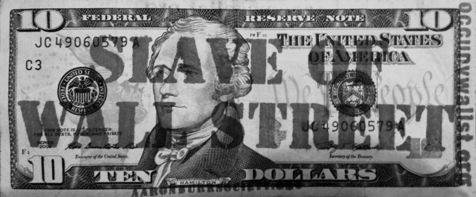

`Fig. 7: Alexander Hamilton’s portrait on stamped \$10 bill.`{.caption}

Before Marx there was opposition to the emerging economic system that
would later become know as capitalism. After the American Revolution,
there were five armed rebellions against the newly formed republic.
Shays’ Rebellion is the best known, but the Whiskey Rebellion was the
most significant. The Whiskey Rebels were centered in the Western
Frontier of Pennsylvania. They rebelled against financial speculation
and a two-tiered economic and tax system that privileged the wealthy and
a Constitution that valued property rights over human rights;
slave-holding and limited voting rights to property-owning white males
being just two examples.

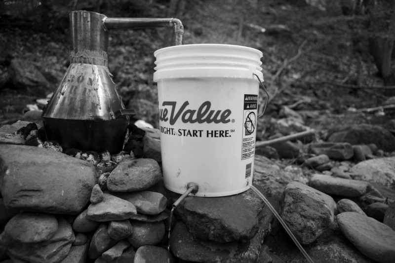

`Fig. 8: The Society’s distillation on Oxbow Creek up-state New York,
2010.`{.caption}

The primary cause of all of the rebellions was speculation on war bonds
that led to high taxes, which often resulted in foreclosures. The
Federal government’s assumption of the individual state’s debt was
actually a bailout of speculators who bought war bonds for pennies on
the dollar. Hamilton insisted that speculators, not the soldiers or
framers who earned the bonds, would receive face value for bonds they
spent pennies acquiring. This was a huge, unearned profit that set a
precedent for 2008 Wall Street bailout.

Other examples of Hamilton’s economic and tax system involved the tax on
whiskey. Whiskey was taxed according to the volume of the still, not on
the actual production. So if a small farmer had a 10-gallon still, she
would pay the same taxes as a slave or factory owner. The farmers in
Western Pennsylvania were limited in the amount of time dedicated to
producing whiskey by the amount of other work needed to run a family
farm. Slave and factory owners could run their stills seven days a week
and could afford the tax that was impossible for the small farmers to
pay. The secondary purpose of the tax was to stop local production and
promote large manufacturers, an essential aspect of capitalism.

The Western Pennsylvanian farmers couldn’t afford the cost of shipping
grain east over the mountains but shipping whiskey was profitable. By
using their own labor to transform grain to whiskey, farmers usurped
capital’s power. And whiskey was also used as a form of local currency
similar to paper money.

Secretary of Treasury Hamilton’s two-tied economic policies replicated
British capitalist programs imposed on the colonies. This included the
establishment of the First National Bank, a precursor to the current
Fed. Working in conjunction with the Constitution’s Article 1 Section 10
that took away individual state’s rights to create money, the National
Bank controlled the monetary system just as the Bank of England before
the Revolution.

After the rebels surrendered, John Skull’s name was taken off the
masthead of the Pittsburgh Gazette during the American Army’s
occupation. Months later his name returned and he wrote this editorial:

> True liberty, like true religion, is known by its fruits. Liberty, the
> daughter of Heaven, and the best gift of God to a favored people, a
> generous principle, whose object is the peace and prosperity of the
> human race; must produce fruits worthy of the divine origin; meekness,
> justice and love of one another. Licentiousness, the offspring of
> hell, and the scourge of an offending nation, selfish in its nature,
> and seeking the degradation of all but itself, bears fruits of an
> opposite nature; sedition, fury, hatred, malice and mischief. By its
> fruits judge, whether our insurrection proceeded from a spirit of
> liberty, or of licentiousness; whether it was the work of God or the
> Devil.[^10]

Skull, like many of the founders, was a Deist so the reference to god
was metaphorical. But the Devil was Hamilton and capitalism.

`Fig. 9: Aaron Burr Society whiskey still at Carnegie Mellon University
2010.`{.caption}

Secretary of State Thomas Jefferson would resign because of Hamilton’s
economic policies. Later Jefferson asked former U.S. Senator Aaron Burr
to be his running mate as Vice-President in the 1800 election. Burr left
the Senate and returned to New York City to organize against fellow New
Yorker Hamilton and the Federalists. By 1799 Burr had created the
Manhattan Company to bring clean water to New York City during a yellow
fever epidemic. But instead of taking profits, Burr used the surplus
capital to give loans to the working classes, shop keeps and others
denied credit by Hamilton’s New York State banking monopoly. Burr also
passed a law allowing inexpensive land coops that permitted the working
classes to own property and vote.

These actions catapulted Burr to a tie with Jefferson. Jefferson
immediately turned against Burr because he was a threat to Jefferson’s
next term. Burr was also against slavery and Jefferson wanted fellow
slave-owners James Madison and James Monroe to follow him in office.
Burr’s radical politics had made enemies of Hamilton’s bankers and
Jefferson’s slave-owners. Together they destroyed Burr’s political
career and personal reputation.

Though largely forgotten, the lessons from the Whiskey Rebellion, the
Manhattan Company and the politics of land coops are important. Local
communities need political power to access capital as a means of social
exchange. This can empower local communities to produce their own food,
energy and other daily necessities based on mutual aid and direct
democracy, conditions that were common to early frontier communities and
are important for contemporary communities. These types of communities
can resist capitalism’s demand for endless growth and the destructive
extraction of resources on a finite planet. Capitalism only values
profits, not people, communities or the environment. Capitalists are
responsible to stockholders, not citizens or governments. People and the
environment are liabilities or expenses that must be repressed or
destroyed for profits. That is why we must move beyond capitalism to
empower people and communities based on mutual aid and autonomous
production.

## Multiple Paths to the Commons

ABS is still active with OWS working groups Strike Debt,[^11] Making
Worlds, a Commons Collation and occasionally Occupy Museums. Strike Debt
published the *Debt Registers’ Operation Manual*[^12] and launched the
Rolling Jubilee.[^13] The *Manual* informs debtors about their rights
and forms of resistance both for individual and government debt. There
is also a chapter on ‘Climate Debt’, the debt industrial nations owe
to the developing world for creating the pollution that causes climate
change. The Rolling Jubilee purchases personal debt that is in default
and sold to vulture capitalists for pennies on the dollar. The vulture
capitalist then try to collect the full amount of the debt by harassing
the debtors, a practice that goes back to Revolutionary War bonds.
Rolling Jubilee has raised over \$700,000 to purchase and abolish \$18.5
million of defaulted debt without any obligations from the liberated
debtors. Though \$18.5 million of debt is a large sum, it is nothing
compared to the trillions of dollars of debt owed by individuals and the
state. The purpose of Strike Debt and Rolling Jubilee is to raise
awareness of the predatory nature of debt and to build a debt resisters
movement. Making Worlds has produced two international forums on the
commons. The range of topics is broad and based on building alternative
structures within capitalism that are transformative. They include land
trusts; worker, energy, and food coops; creating collations that protect
the environment; open source software and collective use of technology.

`Fig. 10.1: Making Worlds meeting at Momenta Art in Bushwick Brooklyn,
part of an Occupy Museum’s month long action, October 2012.`{.caption}

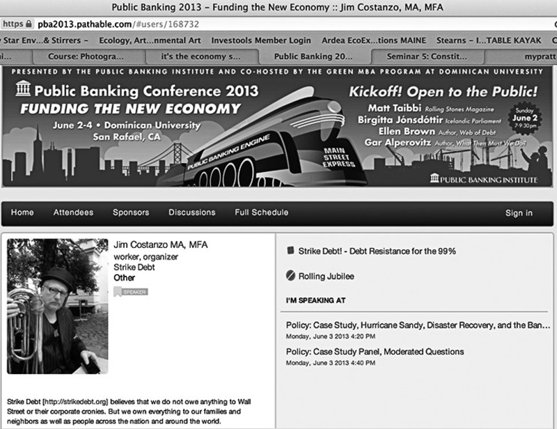

`Fig. 10.2: Author at Public Banking Institute Conference, 2013.`{.caption}

An article twice this length would be needed to describe the activities
of these working groups, so I will stay focused on monetary policy.
Please be aware that I do not speak for OWS or any working group.
However, I have represented different working groups at public venues
including Strike Debt at the 2013 Public Banking Institute conference
Funding the New Economy.

OWS exposed the half public, half private nature of Zuccotti Park, which
is actually the central contradiction of capitalism. Adam Smith’s *The
Wealth of Nations* proposed that the state should create infrastructure,
promote commerce, and then allow entrepreneurs to use Free Markets and
Free Trades for personal profits.

America’s first Treasury Secretary, Alexander Hamilton, didn’t believe
in Free Markets or Free Trade.[^14] Hamilton bailed out speculators and
placed tariffs on imported manufactured items in order to protect
emerging American industries. He did use tax dollars to build
infrastructure but he chose who would profit. Capitalism has never
actually relied on the invisible hand of the market but is based on
usurping tax dollars and exploiting government programs to build private
fortunes. Neither IBM, AT&T, nor any consortium of companies, had the
resources to develop the computer which was bankrolled by government
contracts and research financed by taxes. Cell phone technology was
developed by government research grants to universities. And
corporations profit from technological advances from the military and
space programs. Private corporations are allowed free access to
technology that is paid for by the people’s commonwealth without paying
fees or their fair share of taxes. Since the end of World War II,
approximately half of the U.S.’s budget has been spent on the Military
Industrial Complex that funnels vast sums of money to private
contractors. If half of the budget is controlled by government programs
are there really Free Markets? And can anyone actually argue that there
is Free Trade in light of the number of declared and undeclared oil wars
in the Middle East?

After WWII the U.S. assumed leadership of the ‘Free World’ because of
its military power and the British Empire’s default on its war debt. The
1944 Bretton Woods Agreement established the U.S. dollar as the reserve
currency and created the International Monetary Fund (IMF) and World
Bank to protect the dollar. The reserve currency requires other nations
to hold a significant quantity of U.S. dollars as part of their foreign
exchange reserve and that the U.S. dollar is used in international
transactions.[^15] Money is power and the dollar works with overwhelming
militarily superiority to enforce the rule of the American Empire.

At home the U.S. companies have their taxes reduced by shipping jobs
oversees. The state uses tax payers’ money to subsidies corporations for
building shopping malls dominated by transnational corporation that are
also subsidized. These corporations and monopolies couldn’t survive
without government support. Abroad the American Empire and its
industrial allies use the IMF and the World Bank to place developing
countries in debt, a tactic with a history. Haiti is still paying
reparations, or debt, to France from their slave rebellion in 1791.[^16]
This type of odious debt is the legacy of colonialism, imperialism, and
current neo-liberal policies. This is different but parallel to the
odious debt imposed on the citizens of the industrial world from the
2008 international financial meltdown that resulted in tens of trillions
of dollars in bailouts paid for by taxes on working people and cuts to
social programs. Odious debt[^17], also known as illegitimate debt, is
an international law theory that holds that national debt, sustained by
a regime for purposes that do not serve the best interests of the
nation, should not be enforceable.

In 2012 between \$20 and \$30 trillion went to offshore accounts that
paid no taxes and did not create jobs.[^18] In addition the stock
markets and corporate profits are at record highs while governments
demand austerity. ‘Large-scale tax evasion skews key economic
statistics, it hampers officials’ ability to manage the economy or make
policy.’[^19] Tax evasion and odious debt has enriched transnational
corporations and the 1 percent while crippling the global economy. This
is why austerity is a lie; this is why debt resistance is necessary to
break the political and economic oppression created by deregulation and
fraud.

Cities across France have started debt audits to uncover odious debt
[^20]and Argentina has just passed a law establishing a debt audit
commission.[^21] However, debt resistance is just the first step, there
are thousands of roads necessary to end capitalism but, as previously
stated, ABS is focused on monetary policy. This is not to imply that
this is more import than other strategies but to end capitalism we must
control capital.

The transnational Participatory Budgeting movement is a different way to
manage public money, and to engage people in the political process. It
is a democratic process in which community members directly decide how
to spend part of the public budget.[^22] ABS supports Participatory
Budgeting, but ABS believes that we must look at the entire budget and
combine debt audits with participatory budgeting. We must examine
national, state/regional, and local government budgets and go beyond
auditing odious debt to learn what portion of taxes is used in
supporting corporations and monopoly practices. This would allow an
accurate comparison between transnational corporate production and the
cost of local production by worker coops and small businesses. However,
the fact that corporate capitalism has created great inequities and is
destroying the environment must be measured. And it should also be noted
that emerging trends in technology favor small, customized production,
with 3D printing as just one example.

Another parallel strategy would be the establishment of government or
socialist banks. The Public Banking Institute is campaigning to create
state banks similar to the Bank of North Dakota. The institute also
support the reinstatement of U.S. Post Office banks that were terminated
in the 1960s[^23]. Though ABS supports the Public Banking Institute,
there must be additional forms of redistributing the commonwealth.
Former congressman Dennis Kucinich proposed a bill to nationalize the
Fed titled the NEED Act, HR 2990.[^24] This bill would have placed the
Fed, which is owned and run by private bankers, inside the Treasury
Department and replaced private bankers with civil servants. The goal
was to take Wall Street’s profits an turn them into a people’s equity
that would pay for health care, education and building local
infrastructure.

`Fig. 11.1: Author in front of Federal Reserve Bank, FedUp action,
Washington DC, March 2014.`{.caption}

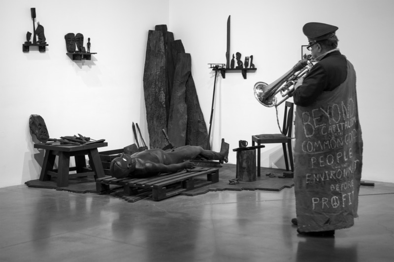

`Fig. 11.2: Author performing at New Museum for Pawel Althamer’s *The Neighbors*, a collaboration started at BB7, March 2014.`{.caption}

`Fig. 11.2: Author and Harrison Tesoura Schultz in front of the New
York Federal Reserve Bank, FedUp action July, 2014.`{.caption}

Again, ABS agrees with the NEED Act but advocates expanding its mission.
The nationalized Fed should directly finance community-based
infrastructure built by members of those communities. All transactions
and policy decisions must be transparent and posted online. The goals
should go beyond building and maintaining roads and schools to refitting
existing structures for environmental sustainability. All buildings and
homes should produce energy and be connected to a public national smart
grid. Larger state owned green power generation could supplement local
power generation. Of course the state and corporations say this would be
too expensive but is that true? There are trillions of dollars in
private, offshore accounts, and unknown amounts of money given as
subsidies to transnational corporations. Add this to the cost of
unending oil wars and the increasing damage from climate driven super
storms. We are not limited by economics but by a failed political
economy that protects existing class and economic structures.

`Fig. 12: Aaron Burr Society poster for performance series at Pine Box
Rock Shop in Bushwick Brooklyn, 2014.`{.caption}

Every school child should be taught the relationship between governments
and the different forms of monetary exchange and production, not only in
theory but also as practiced in their communities. In addition to
understanding budgets, this would empower people to make informed
decision that are currently impossible. Psychologically this has the
potential to reconnect those who have been disenfranchised and
politically disengaged.

In his concluding lines of *Capital in the Twenty-First Century*, Thomas
Piketty writes:

> Yet it seems to me that all social scientists, all journalists and
> commentators, all activists in the unions and in politics of whatever
> stripes, and especially all citizens should take a serious interest in
> money, its measurement, the facts surrounding it, and its history.
> Those who have a lot of it never fail to defend their interests.
> Refusing to deal with numbers rarely serves the interest of the least
> well-off. [^25]

After the 2008 financial meltdown, the world is drowning in debt. Most
of the debt in the industrial world was created by government
deregulation and Wall Street fraud working in conjunction with corporate
capitalism. In the Global South it is the legacy of colonialism and
current neo-liberal policies. As oceans rise with global warming,
drowning in debt is no longer a metaphor. If we want environmental
sustainability our solutions must be global and based on economic
justice with universal human rights. Though I assume Piketty would
disagree, refusing to pay odious debt is the first step that will
undermine oppressive political hierarchies, but we must also create new
systems of global infrastructure from the ground up, outside of the
control of the 1 percent and their corporations. Nationalizing the
international banking system, while at the same time establishing
regional and local public banks, could be one of many important steps
toward building an equitable transnational green economy under a system
of direct democracy.

## References

Beard, Charles A. *An Economic Interpretation of the Constitution of the
United States*, New York: The Macmillan Company, 1921.

Black, William K. *The Best Way to Rob a Bank is to Own One: How
Corporate Executives and Politicians Looted the S&L Industry*, Austin,
TX: University of Texas Press, 2005.

Brown, Ellen J.D. *The Public Bank Solution: From Austerity to
Prosperity*, Baton Rouge, Louisiana: Third Millennium Press, 2013.

Bowers, Simon. ‘Iceland Rises From the Ashes of Banking
Collapse: Populist Programme of New Government Includes a Squeeze on
Foreign Creditors as Country Emerges From Years of Instability’*, The
Guardian*, 6 October 2013,
<http://www.theguardian.com/world/2013/oct/06/iceland-financial-recovery-banking-collapse>.

Caffentzis, George. *In Letters of Blood and Fire: Work, Machines, and
the Crisis of Capitalism*
, Brooklyn, NY and Oakland: Common Notions/PM
Press/Autonomedia, 2013.

Columbia Law School New York. ‘Law, Money and Public Service Series,
Money Democracy And The Constitution’, Series 5*. Revolutionary
Experience In The United States*, Speakers: Gillian Metzger, Christine
Desan, Farley Grubb, Woody Holton, 25 January 2013,
<http://www.modernmoneynetwork.org/seminar-5-constitutional.html>.

Columbia Law School New York. ‘Law, Money and Public Service, Money
Democracy And The Constitution’, Series *7. Rent-Seeking, Instability
And Fraud: Challenges For Financial Reform*, Speakers: Harvey J.
Goldschmid, William K. Black, Michael Norman, Lynn E. Turner, 26
February 2013, <https://www.youtube.com/watch?v=BFk6epIveY8>.

Costanzo, Jim. ‘Letter to the Editor’, *Harper’s Magzine*, June 2008.

Costanzo, Jim. ‘2nd Whiskey Rebellion’*, Journal of Aesthetics &
Protest*, 2010, <http://www.joaap.org/webonly/costanzo.htm>.

Democracy Now. ‘Exhaustive Study Finds Global Elite Hiding Up to \$32
Trillion in Offshore Accounts’, 31 July 2012,
<http://www.democracynow.org/2012/7/31/exhaustive_study_finds_global_elite_hiding>.

Dunn, Susan (ed.). *Something That Will Surprise the World: the
Essential Writings of the Founding Fathers*, New York: Basic Books,
2006.

Federici, Silvia and George Caffentzis. ‘Commons Against and Beyond
Capitalism’, *Upping the Anti: A Journal of Theory and Action* 15
(September 2013): 83-97.

Franklin, Benjamin. *The Nature and Necessity of a Paper Currency,*
1729, <http://etext.lib.virginia.edu/users/brock/webdoc6.html>.

Graeber, David. *Debt: The First 5,000 Years,* Brooklyn, New York:
Melville House, 2011.

Holmes, David L. *The Faith of the Founding Fathers*, New York: Oxford
University Press, 2006.

Holton, Woody. *Unruly Americans And The Origins Of The Constitution*,
New York: Hill and Wang, 2007.

Holton, Woody. *Forced Founders: Indians, Debtors, Slaves, and the
Making of the American Revolution in Virginia*, Chapel Hill, London:
University of North Carolina Press, 1999.

Isenberg, Nancy, *Fallen Founder: the Life of Aaron Burr*, New York:
Viking, 2007.

Kant, Immanuel, *What Is Enlightenment?* James Schmidt (ed.)
*Philosophical Traditions 7*, Berkeley: University of California Press,
1996 (1784),

Klein, Naomi. *The Shock Doctrine: The Rise of Disaster Capitalism*, New
York: Henry Holt and Company, 2007.

Leslie, Jacques. ‘The True Cost of Hidden Money A Piketty Protégé’s
Theory on Tax Havens’, *The New York Times*, 15 June 2014, <http://www.nytimes.com/2014/06/16/opinion/a-piketty-proteges-theory-on-tax-havens.html?ref=opinion&_r=0>.

Mann, Geoff. *Dissembly Required: A Field Guide To Actually Existing
Capitalism*, Edinburgh, Oakland, Baltimore: AK Press, 2013.

McCaleb, Walter Flavius. *The Aaron Burr Conspiracy*, introduction:
Charles A. Beard, New York: Wilson-Ericson Inc., 1936 (1903).

Morgan, Edmund S. *Benjamin Franklin*. New Haven & London: Yale
University Press, 2002.

Orwell, George. *1984*, New York: Signet Classic, 1977 (1949).

Piketty, Thomas. *Capitalism In The Twenty-First Century*, trans. Arthur
Goldhammer, Cambridge, Massachusetts, London, England: The Belknap Press
of Harvard University Press, 2014.

Ross, Andrew. *Creditocracy: And The Case For Debt Refusal*, New York,
London: OR Books, 2013.

Sitrin, Marina and Dario, Azzellini. *They Can’t Represent Us!
Reinventing Democracy from Greece to Occupy*, London and New York:
Verso, 2014.

Skull, John. *Pittsburgh Gazette*, Carnegie Library, Pittsburgh,
Pennsylvania, 16 May 1789.

\_\_\_\_\_ *Pittsburgh Gazette*, Carnegie Library, Pittsburgh,
Pennsylvania, 27 December 1794.

Strike Debt. *The Debt Resisters’ Operation Manual*, Brooklyn, NY and
Oakland: Common Notions/PM Press/Autonomedia, 2014.

\_\_\_\_\_ ‘“Don’t Owe, Won’t Pay!”: A Conversation with a French Debt
Resistor’, 24 June 2013, <http://strikedebt.org/publicdebtaudits/>.

\_\_\_\_\_ Rolling Jubilee, 30 August 2014, <http://rollingjubilee.org>.

Taibbi, Matt. *Griftopia: A Story of Bankers, Politicians, and the Most
Audacious Power Grab in American History*, New York: Spiegel & Grau,
2010.

U.S. History: Pre-Columbian to the New Millennium. ‘15a Shay’s
Rebellion’, <http://www.ushistory.org/us/15a.asp>.

Wheelan, Joseph. *Jefferson’s Vendetta: The Pursuit of Aaron Burr and
the Judiciary*, New York: Carroll & Graf Publishers, 2005.

[^1]: See <http://www.aaronburrsociety.org/aaron_burr_society_home.html>

[^2]: While this is an abstract concept with no set definition, most
    would agree that it is about establishing local autonomy and
    economic independence based on universal human rights. Worker, food,
    and farming coops, local green energy production, open source
    software and direct democracy are often cited as part of the
    commons.

[^3]: George Orwell, *1984*, New York: Signet Classic, 1977 (1949).

[^4]: Benjamin Franklin, ‘Enquiry into the Nature and Necessity o/ a
    Paper Currency*’*, 1729.

[^5]: U.S. History: Pre-Columbian to the New Millennium, ‘15a Shay’s
    Rebellion’,
    [http://www.ushistory.org/us/15a.asp](http://www.ushistory.org/us/15a.asp).

[^6]: *The Federalist No. 10: The Utility of the Union as a Safeguard
    Against Domestic Faction and Insurrection*, Publius [James Madison],
    22 November 1787, Constitution Society,
    [http://www.constitution.org/fed/federa10.htm](http://www.constitution.org/fed/federa10.htm).

[^7]: See John Scull, *Pittsburgh Gazette*, 16 May 1789.

[^8]: Ellen Brown, ‘Cry for Argentina: Fiscal Mismanagement, Odious Debt
    or Pillage? The Web of Debt Blog*’*, 12 August 2014,
    [http://ellenbrown.com/2014/08/12/cry-for-argentina-fiscal-mismanagement-or-pillage/](http://ellenbrown.com/2014/08/12/cry-for-argentina-fiscal-mismanagement-or-pillage/).

[^9]: Rebecca Savastio, ‘Detroit Judge Rules There Is No Basic Human
    Right to Water’, *Guardian Liberty Voice*, 1 October 2014, <http://guardianlv.com/2014/10/detroit-judge-rules-there-is-no-basic-human-right-to-water>.

[^10]: *Pittsburgh Gazette*, Pittsburgh, Pennsylvania, 17 December 1794.

[^11]: See <http://strikedebt.org>.

[^12]: Strike Debt, *The Debt Resisters’ Operation Manual*, Brooklyn, NY
    and Oakland: Common Notions/PM Press/Autonomedia, 2014.

[^13]: Rolling Jubilee, <http://rollingjubilee.org>.

[^14]: Susan Dunn (ed.) *Something That Will Surprise the World: the
    Essential Writings of the Founding Fathers*, New York: Basic Books,
    2006.

[^15]: The BRIC nations are challenging the supremacy of the U.S. dollar
    but they are also capitalist nations and will not change power
    relationships.

[^16]: Kim Ives, ‘Haiti: Independence Debt, Reparations for Slavery and
    Colonialism, and International Aid’, *Global Research, Haïti
    Liberté*, 10 May 2013, <http://www.globalresearch.ca/haiti-independence-debt-reparations-for-slavery-and-colonialism-and-international-aid/5334619>.

[^17]: International Monetary Fund, ‘Odious Debt’, <http://www.imf.org/external/pubs/ft/fandd/2002/06/kremer.htm>.

[^18]: Democracy Now, ‘Exhaustive Study Finds Global Elite Hiding Up to
    \$32 Trillion in Offshore Accounts’, 31 July 2012, <http://www.democracynow.org/2012/7/31/exhaustive_study_finds_global_elite_hiding>.

[^19]: Jacques Leslie, ‘The True Cost of Hidden Money A Piketty
    Protégé’s Theory on Tax Havens’, *The New York Times*, 15 June 2014, <http://www.nytimes.com/2014/06/16/opinion/a-piketty-proteges-theory-on-tax-havens.html?ref=opinion&_r=0>.

[^20]: Strike Debt, ‘“Don’t Owe, Won’t Pay!” A Conversation with a
    French Debt Resistor’*,* 24 June 2013, <http://strikedebt.org/publicdebtaudits/>.

[^21]: Jubilee Debt Campaign, ‘Argentina Passes Law To Establish Debt
    Audit Commission’, 1 October 2014, <http://jubileedebt.org.uk/news/argentina-passes-law-establish-debt-audit-commission>.

[^22]: Participatory Budgeting Project, <http://www.participatorybudgeting.org/about-participatory-budgeting/what-is-pb/>.

[^23]: Records of the Post Office Department, <http://www.archives.gov/research/guide-fed-records/groups/028.html>.

[^24]: National Emergency Employment Defense Act of 2011 [NEED Act, HR
    2990], <https://www.govtrack.us/congress/bills/112/hr2990/text>.

[^25]: Thomas Piketty, *Capitalism In The Twenty-First Century*, trans.
    Arthur Goldhammer, Cambridge, MA and London: The Belknap Press of
    Harvard University Press, 2014.
