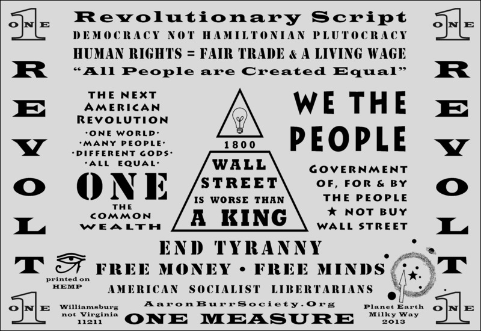
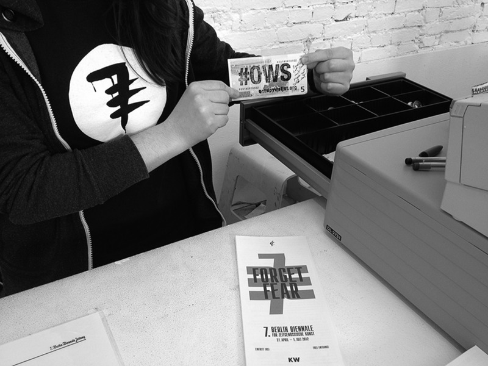

# INC Reader \#10
<!-- backcover text -->

MoneyLab is part of a global movement that demands the democratization
of the design of our financial futures. Audacity is essential in times
of crisis. And so we must engage constructively with hackers,
entrepreneurs, and other creators who take up the call for economic
alternatives. One first step is a map of the present: What works and what
doesn’t? What is worth pursuing and what must be left aside? Which
histories bear on the present moment? And what are the limits of our
economic imagination?

The MoneyLab Reader brings developments in crowdfunding, currency
design, technologies of payment, and other economic experiments into
dialogue. The authors of this volume discuss the implications of the
current architecture of global finance, its impact on ever-growing
income disparity, and question money and finance as such. It is not
always clear, for instance, whether genuine alternatives are unfolding
or if we are simply witnessing the creative extension of neoliberalism.
At stake is the full spectrum of technologies of economic 
(re)distribution.

# MoneyLab Reader: An Intervention in Digital Economy

**MoneyLab Reader: An Intervention in Digital Economy**  
Editors: Geert Lovink, Nathaniel Tkacz and Patricia de Vries  
Copy editing: Annie Goodner, Morgan Currie, Jess van Zyl, Matthew Beros, Miriam Rasch  
Design: Katja van Stiphout  
EPUB development: André Castro   
Cover design: Content Context  
Printer: Drukkerij Tuijtel  
Publisher: Institute of Network Cultures, Amsterdam, 2015  

ISBN: 978-90-822345-5-8 (print)  
ISBN: 978-90-822345-6-5 (EPUB)

**Contact**  
Institute of Network Cultures  
phone: +31205951865  
email: info@networkcultures.org  
web: [www.networkcultures.org](http://networkcultures.org/)  

Order a copy or download this publication freely at:
[www.networkcultures.org/publications/](http://networkcultures.org/publications)

Join the MoneyLab mailing list at:
<http://listcultures.org/mailman/listinfo/moneylab_listcultures.org>

Supported by: Amsterdam University of Applied Sciences
(Hogeschool van Amsterdam), Amsterdam Creative Industries Publishing and the University of Warwick

Thanks to everyone at INC, to all of the authors for their
contributions, Annie Goodner and Morgan Currie for their copy editing,
and to Amsterdam Creative Industries Publishing for their financial
support.

This publication is licensed under Creative Commons Attribution-NonCommercial-ShareAlike 4.0 Unported (CC BY-NC-SA 4.0). To view a copy of this license, visit <http://creativecommons.org/licenses/by-nc-sa/3.0/>.

# Previously published INC Readers

The INC Reader series is derived from conference contributions and
produced by the Institute of Network Cultures. They are available in
print, EPUB, and PDF form. The *MoneyLab Reader* is the tenth publication in
the series.

INC Reader\#9: René König and Miriam Rasch (eds),  
*Society of the Query Reader: Reflections on Web Search*, 2014.

INC Reader \#8: Geert Lovink and Miriam Rasch (eds),  
*Unlike Us: Social Media Monopolies and Their Alternatives*, 2013.

INC Reader \#7: Geert Lovink and Nathaniel Tkacz (eds),  
*Critical Point of View: A Wikipedia Reader*, 2011.  

INC Reader \#6: Geert Lovink and Rachel Somers Miles (eds),  
*Video Vortex Reader II: Moving Images Beyond Youtube*, 2011.  

INC Reader \#5: Scott McQuire, Meredith Martin and Sabine Niederer
(eds),  
*Urban Screens Reader*, 2009.  

INC Reader \#4: Geert Lovink and Sabine Niederer (eds),  
*Video Vortex Reader: Responses to YouTube*, 2008.  

INC Reader \#3: Geert Lovink and Ned Rossiter (eds),  
*MyCreativity Reader: A Critique of Creative Industries*, 2007.  

INC Reader \#2: Katrien Jacobs, Marije Janssen and Matteo Pasquinelli
(eds),  
*C’LICK ME: A Netporn Studies Reader*, 2007.  

INC Reader \#1: Geert Lovink and Soenke Zehle (eds),  
*Incommunicado Reader*, 2005.

All INC Readers, and other publications like the Network Notebooks
Series and Theory on Demand, can be downloaded and read for free. 
See [www.networkcultures.org/publications](http://networkcultures.org/publications/).

# Contents

**Saskia Sassen**  
When Money Becomes an Extraction Tool Rather Than Exchange Medium: Foreword to the MoneyLab Reader

**Geert Lovink and Nathaniel Tkacz**  
MoneyLab: Sprouting New Digital-Economic Forms

## The Long Game

**Keith Hart**  
Money in the Making of World Society

**Franco "Bifo" Berardi**  
Is There Life Beyond Money?

**Ralph and Stefan Heidenreich**  
On a Post-Monetary Network Based Economy

**Douglas Rushkoff**  
Playability and the Search for an Open Source Economy

**Andrew Ross**  
Accumulation and Resistance in the 21st Century

## Financial Interventions

**Primavera De Filippi and Samer Hassan**  
Measuring Value in the Commons-Based Ecosystem: Bridging the Gap Between the Commons and the Market 

**Pekka Piironen and Akseli Virtanen**  
Democratizing the Power of Finance: A Discussion About Robin Hood Asset
Management Cooperative with Founder Akseli Virtanen

**Lena Rethel and Irwan Abdalloh**  
Inculcating Ethical Behaviour in Market Transactions? The Case of the
Sharia Online Trading System in Indonesia

## Critical Currencies

**David Golumbia**  
Bitcoin as Politics: Distributed Right-Wing Extremism

**Beat Weber**  
The Economic Viability of Complementary Currencies: Bound to Fail?

**Tiziana Terranova and Andrea Fumagalli**  
Financial Capital and the Money of the Common: The Case of Commoncoin

**Finn Brunton**  
Heat Exchanges

##  Economies of Imagination

**Max Haiven**  
Money as a Medium of the Imagination: Art and the Currencies of
Cooperation

**Stephanie Rothenberg**  
Reversal of Fortune: Visualizing Marketized Philanthropy

**Paolo Cirio**  
(W)orld Currency

**Jim Costanzo**  
The Free Money Movement

## Technologies of Payment

**Bill Maurer and Lana Swartz**  
Wild, Wild West: A View from Two Californian Schoolmarms

**Rachel O’Dwyer**  
Money Talks: The Enclosure of Mobile Payments

**Erin Taylor**  
Mobile Money: Financial Globalization, Alternative, or Both?

**Eduard de Jong, Nathaniel Tkacz, and Pablo Velasco**  
‘Live as Friends and Count as Enemies’: On Digital Cash and the Media of Payment

## Crowdfunding and Beyond

**Inge Ejbye Sørensen**  
Go Crowdfund Yourself! Some Unintended Consequences of Crowdfunding for Documentary Film and Industry in the U.K.

**Renée Ridgway**  
Crowdfunding the Commons?

**Irina Enache and Robert van Boeschoten**  
The MoneyLab Crowdfunding Toolkit for Creatives

# Appendix

## MONEYLAB: COINING ALTERNATIVES

## March 21-22, 2014, Lab111, Amsterdam

### FRIDAY, March 21, 2014

**Session 1: Monetization of Everything**

Moderators: Geert Lovink, Nathaniel Tkacz

Speakers: Saskia Sassen, Stefan and Ralph Heidenreich, Bill Maurer

**Session 2: Dismantling Global Finance**

Moderator: Nathaniel Tkacz

Speakers: Franco Berardi, Brett Scott, Tiziana Terranova, Brian Holmes

**Session 3: Critical Art Practices**

Moderator: Patricia de Vries

Speakers: Ron Peperkamp, Dadara, Dette Glashouwer

**Session 4: Mobile Money**

Moderator: Bill Maurer

Speakers: Erin Taylor, Taylor Nelms, Gawain Lynch

### SATURDAY, March 22, 2014

**Session 5: Bitcoin and Beyond**

Moderators: Nathaniel Tkacz and Lana Swartz

Speakers: Eduard de Jong, Aaron Koenig, Beat Weber, Quinn DuPont

**Session 6: Alternatives Bazaar On Stage**

Speakers: Bitcoin ATM, Geheimagentur, Noppes, Peerby, Qoin, Kunst
Reserve Bank, Share NL, The Next Nature Network, Timebank CC, Transition
Towns Netherlands

**Session 7: Critique of Crowdfunding**

Moderator: Brett Scott

Speakers: Inge Ejbye Sørensen, Jamie King, Marijke Hoogenboom, Irina
Enache and Robert van Boeschoten

**Session 8: Designing Alternatives**

Moderator: Rob van Hilten

Speakers: Max Haiven, Matthew Slater and Eli Gothill, Lana Swartz

# Author Biographies

**Irwan Abdalloh** is the head of Islamic Capital Market Development at
the Indonesia Stock Exchange (IDX). He is a lecturer in Islamic
Investment in the Postgraduate Program of the University of Indonesia
and at the Tazkia University College of Islamic Economics. He is the
founder of [icmspecialist.com](http://www.icmspecialist.com).

**Franco "Bifo" Berardi** is a writer, media theorist, and media
activist. In 2012 he published *The Uprising*. As a coordinator
of the European School for Social Imagination (SCEPSI), he has taught at
Ashkal Alwan in Beirut, PEI-Macba in Barcelona, Accademia di Brera in
Milano, and has lectured in social centers and universities worldwide.

**Robert van Boeschoten** is a philosopher interested in the cultural
impact of media on society at large, and organizations in particular.
His work is divided over the University of Applied Sciences Amsterdam (HvA) at the
Communication and Multimedia Department and The University for Humanistics (UvH) in Utrecht.

**Finn Brunton** is Assistant Professor in the Department of Media,
Culture, and Communication at NYU's Steinhardt School. He is the author
of *Spam: A Shadow History of the Internet* (MIT, 2013), and the
forthcoming *Obfuscation: A User's Guide* (MIT, 2015) with Helen
Nissenbaum. He is working on a book about cryptocurrencies.

**Paolo Cirio's** art projects investigate issues such as privacy,
transparency, copyright, finance, and democracy. He renders his
conceptual works through performances, photos, drawings, videos, and
installations. His work has unsettled Facebook, Amazon, Google, and
NATO, among others. He currently lives in New York City.

**Jim Costanzo** is the founding director of the Aaron Burr Society. His
conceptually based artwork is diverse and includes installation,
performance, and collaboration. He has shown his work at the Berlin
Biennale, the Whitney Biennial, and Arti et Amicitiae in Amsterdam. He
lives in Brooklyn, New York and teaches at Pratt Institute.

**Primavera De Filippi** is a postdoctoral researcher at the CERSA /
CNRS / Université Paris II (Panthéon-Assas). She is currently a research
fellow at the Berkman Center for Internet & Society at Harvard Law
School, where she is investigating the legal challenges of
‘governance-by-design’ in online distributed architectures, such as
Bitcoin and Ethereum.

**Eduard de Jong** is an Amsterdam-based computer scientist,
entrepreneur and inventor trying to improve security in software
systems. He worked on software for smartcards, later marketed as Java
Card. De Jong started his career working at DigiCash, where he developed
a passion for electronic money.

**Irina Enache** is a communication and new media enthusiast. She has
collaborated with the Institute of Network Cultures as a researcher for
the MoneyLab project in 2013-2014. She gained her BA in Communication
and Public Relations in Bucharest, Romania (2011) and MA in New
Media and Digital Culture in Amsterdam, the Netherlands (2013).

**Andrea Fumagalli** is Associate Professor of Economics in the
Department of Economics and Management at University of Pavia. His
research activity deals with the hypothesis of cognitive bio-capitalism,
basic income, and precarity issues. He is co-editor of *The Global
Economic Crisis* (Semiotext(e), 2011).

**David Golumbia** teaches at Virginia Commonwealth University. He is
the author of *The Cultural Logic of Computation* (Harvard, 2009), and of many articles on digital culture, language, linguistics, and literary
studies. He maintains the blog <http://uncomputing.org>. Golumbia is
completing a book titled *Cyberlibertarianism: The False Promise of
Digital Freedom*.

**Max Haiven** is an Assistant Professor in the Division of Art History
and Critical Studies at the Nova Scotia College of Art and Design,
Canada. He is author of *Crises of Imagination, Crises of Power* (2014),
*The Radical Imagination* (2014) with Alex Khasnabish, and *Cultures of
Financialization* (2014).

**Keith Hart** is Centennial Professor of Economic Anthropology at the
London School of Economics and International Director at the Human Economy
Program, University of Pretoria. His writings on money include ‘Heads or
Tails? Two Sides of the Coin’ (1986), and *The Memory Bank: Money in an
Unequal World* (2000), available at [http://thememoryba
nk.co.uk/book/](http://thememorybank.co.uk/book/).

**Samer Hassan** is an activist and Assistant Professor at the
Universidad Complutense de Madrid. With an interdisciplinary background,
he's been researching on social networks, distributed systems, and
social simulation from positions in Spain, UK, and Lebanon. Engaged in
free/open source software, he co-founded Comunes.org and Move Commons.
Presently he is Principal Investigator in the FP7 P2Pvalue.eu project.

**Ralph Heidenreich** lives in Biberach/Riss and works as a programmer
(<http://www.ralph-heidenreich.de>).

**Stefan Heidenreich** lives in Berlin and holds a research position at
the Center for Digital Culture, Lüneburg University
(<http://www.stefanheidenreich.de>). Together with Ralph Heidenreich he
wrote the books *Mehr Geld* (1998) and *Der Preis der Welt* (2014).

**Geert Lovink** is a media theorist, internet critic and author of
*Zero Comments* (2007) and *Networks Without a Cause* (2012). From
2004-2013 he taught in the new media masters program at Media Studies,
University of Amsterdam. He is the founding director of the Institute of
Network Cultures.

**Bill Maurer** is Dean of Social Sciences and Professor of Anthropology
and Law, University of California, Irvine. He is also the Director of
the Institute for Money, Technology and Financial Inclusion. A cultural
anthropologist, he conducts research on money and finance, focusing on
the technological infrastructures and social relations of exchange and
payment.

**Rachel O’Dwyer** is a post-doctoral researcher and lecturer in the School of Computer Science in Trinity College Dublin. She is the leader of the Dublin Art and Technology Association (www.data.ie) and the initiator and lead curator of Openhere, a festival and conference on the digital commons. She writes about digital media, political economy of communications, and media art and culture.

**Pekka Piironen** a Finnish economic and strategy theorist, known
for his theory of the collective pledge and biopolitics of firms. He is
a founding member of Robin Hood Asset Management Cooperative and the
author of *Economy of Insecurity*.

**Lena Rethel** is Associate Professor of International Political
Economy at the University of Warwick, working on financial development
and Islamic finance. Her publications include *The Problem with Banks*
(Zed Books, 2012; with Timothy J. Sinclair) and *The Everyday Political
Economy of Southeast Asia* (Cambridge University Press, 2015; with
Juanita Elias).

**Renée Ridgway** is an artist, curator, writer, and educator. Ridgway
is currently a PhD fellow at Copenhagen Business School in the
Department of Management, Philosophy and Politics in cooperation with
Leuphana University’s Digital Cultures Research Lab. Her current
research merges artistic and curatorial practice within the digital
economies.

**Andrew Ross** is a social activist and Professor of Social and
Cultural Analysis at NYU. A contributor to *The Guardian*, *The New York
Times*, *The Nation*, and Al Jazeera, he is the author of many books,
including *Creditocracy and the Case for Debt Refusal*, *Nice Work if
You Can Get It*, *Fast Boat to China*, *No-Collar*, and *The Celebration
Chronicles*.

**Stephanie Rothenberg**’s artworks mix physical and virtual spaces to
investigate new models of crowdsourced labor and the power dynamics
between contemporary visions of utopian urbanization and real world
economic, political, and environmental factors. She is Associate
Professor at SUNY Buffalo.

**Douglas Rushkoff** is the author of *Present Shock: When Everything
Happens Now*, as well as a dozen other bestselling books on media,
technology, and culture, including *Program or Be Programmed*, *Media Virus and Life Inc*. He lives in New York, and lectures about
media, society, and economics around the world.

**Saskia Sassen** is a Robert S. Lynd Professor of Sociology and
Co-Chair at Committee on Global Thought at Columbia University. Her
research and writing is focused on globalization (including its social,
economic, and political dimensions), immigration, new-networked
technologies, and changes within the liberal state that result from
current transnational conditions
([www.saskiasassen.com](http://www.saskiasassen.com/)).

**Inge Ejbye Sørensen** is Lord Kelvin Adam Smith Research Fellow in
Digital Economy and Culture at Centre for Cultural Policy Research,
University of Glasgow. She is an award-winning film producer and
academic, who writes about crowdfunding, creative industries,
documentary film production, and digital distribution and delivery of
audiovisual content.

**Lana Swartz** is a PhD candidate at the Annenberg School of Communication and Journalism, University of Southern California. Most of her research is about money and other regimes of value and its transfer.

**Erin B. Taylor** is an economic anthropologist who researches money,
poverty and material culture. She is the author of *Materializing
Poverty: How the Poor Transform Their Lives*. Taylor has researched
squatting in the Dominican Republic and mobile money in Haiti. Her
current project investigates global research in consumer finance.

**Tiziana Terranova** is Associate Professor of Cultural Theory and New
Media in the Department of Human and Social Sciences at the University
of Naples 'L'Orientale'. Terranova is the author of *Network Culture:
Politics for the Information Age* and is currently writing a book on
digital social networks to be published by University of Minnesota
Press.

**Nathaniel Tkacz** is Assistant Professor in the Centre for
Interdisciplinary Methodologies at The University of Warwick. He writes
and researches at the intersection of digital media and politics. His
most recent book is *Wikipedia and The Politics of Openness* (University of Chicago Press, 2014). 

**Pablo Velasco** is a PhD student at the University of Warwick Centre
for Interdisciplinary Methodologies. He holds an MA in Philosophy from
the National Autonomous University of Mexico. His doctoral research
focuses on the topologies and socio-political aspects of digital
currencies.

**Akseli Virtanen** is a theorist of new political finance, born in
Finland and currently based in Santa Cruz, California. He is the author
of *Arbitrary Power, Critique of Biopolitical Economy* and the editor of
*n-1 Edições*. He is a founding member of Robin Hood Asset Management
Cooperative.

**Beat Weber** studied economics at the Vienna University of Economics
and Business. He is an expert at the Division for European Affairs and
International Financial Organizations of Oesterreichische Nationalbank,
the Central Bank of Austria.

# When Money Becomes an Extraction Tool Rather Than Exchange Medium: Foreword to the MoneyLab Reader

### Saskia Sassen {.author}

MoneyLab is an exciting and strategic project. The diversity of
contributions to this volume is exceptional and promising. It is
impossible to do justice to this enormous variety of ideas and proposals
in a short preface. I will focus on what we might think of as one step,
one building block in the larger debate engaged by MoneyLab: the need to
develop new types of currencies to enable new types of economies.

We need exchange mediums, such as money. But today’s versions of money
are mostly the official currencies of countries. And these are becoming
extremely problematic. Why? Because they function less and less as an
exchange medium and more and more as a tool for governments and
corporations to extract household resources for their aims, often
overriding the basic needs of a country’s people.

The official currencies of countries today have become a bridge into
household resources – a mechanism for extracting value from even poor
households. Taxation without citizen participation in how to spend those
taxes is another mechanism. The corporatizing of economies is yet
another. When corporations capture most of what consumers spend then
they also disproportionately control how that household money is
invested and allocated (for instance, extreme increases in corporate
salaries rather than investing in developing organic food).

Under these conditions, money is no longer simply an exchange medium.
Nor is it a medium for ensuring large-scale investments – by either
governments or corporations – into what a locality, a country, needs for
its people. It becomes an instrument for implementing what governments
and corporations want.

Yet not all alternative moneys are necessarily desirable. The key is a
decentralized currency to enable the proliferation of non-corporate
economies, and to do so at scales and with modalities that go beyond
simple barter. Barter is fine for many operations, and it has thrived in
certain settings, notably in parts of Latin America. But it is not
enough. We need to scale-up if we are going to take back economic
terrain now fully captured by large corporations. And we need to do
this, even if some of the larger needs of a locality, notably transport
systems, will have to be built by large corporations.

Digital currencies are clearly one option. Most recently Bitcoin has
drawn a lot of the attention. It has also become a destination for
speculative investment. This has in turn raised some key questions,
notably whether it is a decentralized currency. The challenge is to
avoid the corporatizing of a currency, which is now the situation with
more and more official currencies.

Again, by corporatizing I mean that it serves to transform household
resources (as measured by consumption capacity) into corporate profits,
which can then be invested without any concern or need to know a
locality’s demands. Mostly, a modest firm that depends on a locality’s
choices is going to have to be responsive in a way that the large
corporation is not. Further, the power of large corporations to set up
franchises which might have to be a bit more responsive to a locality’s
needs, mostly winds up eliminating the locally owned businesses so the
franchise can rule uncontested – a take it or leave it stance vis-à-vis
the locality. Finally, and inevitably, the franchise has to pass on some
of the locality’s consumption capacity to central headquarters. Ideally,
a decentralized currency would favor local initiatives and
redistribution in localities.

In the last twenty years this shift towards the corporatizing of
household money has accelerated and become increasingly acute in more
and more of the world. Up to a certain point we need governments and
corporations for some of our needs: vast transport systems, public
buildings, airports, harbors, and so on. But much of this far too easily
winds up using our money for their profit rather than our needs. One
result is growing asymmetries of all sorts, marked by growing
concentrations of wealth and expanded impoverishment at the other end.
There are exceptions here and there, but they are not enough to
obliterate these asymmetries.

Further, to some extent our governments have enabled the power of
corporations to extract household money not just via consumption but
also via their policies. The elegantly named ‘quantitative-easing’ is
one such example. In this post-2008 crisis period, the US has been the
most active government in transferring households’ money to
corporations, especially big banks and major financial firms. Only a
small portion of this (US\$ 320 billion) has been via proper channels –
the legislature, where there is a chance of a public debate where we the
citizens can, in principle, voice our take on it all. But by far most
has been done secretly, and we only found out via freedom of information
requests how our money was spent: over \$7 trillion dollars were
secretly transferred from US households to the global banking system.
Several trillion more were transferred via quantitative easing, a public
event, but incomprehensible to the average household; this is language
that does not spell out that it is households’ money that is being
transferred. Quantitative easing is also what the European Central Bank
wants to implement in the European Union.

Yes, we need decentralized currencies that function as genuine exchange
mediums to handle a vast range of the needs of households, modest firms
and localities. It would mean avoiding franchises and establishing
locally owned operations – the profits then recirculate in the community
or city rather than partly being captured by corporate headquarters. At
the same time, we need national currencies to engage in the vast
infrastructural and servicing projects that a country requires to
address the needs of its people; and this may mean contracting with
large engineering corporations. But this should not be necessary for
most of the food, furniture and such.

Decentralized currencies should enable bringing significant components
of our modern economies back into our communities. And if these
currencies are digitized, local initiatives and innovations can get
replicated across a region, country’s or a continent’s localities.
This is one way of constructing larger multi-nodal operational spaces
that can cut across diverse types of boundaries without losing their
local insertion.

What we do not need is what is happening today in a growing number of
countries: the large scale direct and indirect appropriation of the
income of households and of modest firms to finance the profit-seeking
aims of corporations.

Saskia Sassen, Columbia University. Many of the points raised in this
preface are fully developed in her new book *Expulsions: Brutality and
Complexity in the Global Economy*, Harvard University Press, 2014.

# Money in the Making of World Society

### Keith Hart {.author}

According to writers as varied as John Locke and Karl Marx, ours is an
age of money, a transitional phase in the history of humanity. Seen in
this light, capitalism’s historical mission is to bring cheap
commodities to the masses and to break down the insularity of
traditional communities before it is replaced by a more just society. It
matters where we are in this process, but opinions on that differ
widely. When a third of humanity still works in the fields with their
hands, I would say that capitalism still has a way to go. The Victorians
believed that they stood at the pinnacle of social evolution. I think of
us as being more like the first digging-stick operators, primitives
stumbling into a revolution as significant as the invention of
agriculture. They had no idea that it would culminate in Chinese
civilization and neither can we anticipate what we could be launching
now. We just know that our moment in history is an extremely dangerous
one.

Money has called the present phase of world society into being and I
would like to explore its potential to repair the damage that it has
caused. In the second half of the 20th century, humanity formed a single
interactive social network for the first time. Emergent world society
*is* the new human universal – not an idea, but the fact that 7 billion
of us desperately need to find new principles of association. The task
of building a global civil society for the 21st century is urgent. But
we must lose a lot more before the need to rebuild world society is
likely to be taken seriously. Certainly we have regressed a long way
from the hopes for freedom and equality released by World War II
and the anticolonial revolution that followed it. On the other hand,
growing awareness of the risks for the future of life on this planet
might encourage people to take humanity’s current predicament more
seriously. The ecological (‘green’) paradigm – manifested as concern for
global warming and for scarce food, water and energy supplies – could
replace market fundamentalism as the religion of this emergent world
society. But that will not do us much good if it entails rejecting money
and markets for the illusion of local self-sufficiency.

## The Origins of Our Times

The 1860s saw a transport and communications revolution (steamships,
continental railroads, and the telegraph) that decisively opened up the
world economy. At the same time a series of political revolutions gave
the leading powers of the coming century the institutional means of
organizing industrial capitalism. These were the American Civil War, the
culmination of Italy’s *Risorgimento*, the abolition of serfdom in
Russia, the formation of the Anglo-Indian super-state, Britain’s
democratic reforms at home, and Japan’s Meiji Restoration. German
unification at the end of the decade spilled over into the 1870s through
the Franco-Prussian war, the Paris Commune, and the formation of the
French Third Republic. The First International was formed in 1864 and
Karl Marx published the first volume of *Capital* in 1867. The concentration of so many
epochal events in such a short period would suggest that world society
was quite well integrated even then. But in the 1870s, international
trade accounted for no more than one percent of Gross National Product
in most countries and the most reliable indicator of Britain’s annual
economic performance was the weather at harvest-time.[^1_1-Hart_Keith_1]

Capitalism has always rested on an unequal contract between owners of
large amounts of money and those who make and buy their products. This
contract depends on an effective threat of punishment if workers
withhold their labor or buyers fail to pay up. The owners cannot make
that threat alone: they need the support of governments, laws, prisons,
police, even armies. By the mid-19th century, it became clear that the
machine revolution was pulling unprecedented numbers of people into the
cities, where they added a wholly new dimension to the traditional
problem of crowd control. The political revolutions of the 1860s and 70s
were based on a new and explicit alliance between capitalists and the
military landlord class (who had been sworn enemies in the bourgeois
revolutions) to form states capable of managing industrial workforces
and of taming the criminal gangs that had taken over large swathes of
the main cities. Germany and Japan provide the clearest examples of such
an alliance, which took a specific form in each country.

Before long, governments provided new legal conditions for the
operations of large business corporations, ushering in mass production
through a bureaucratic revolution. The author of this new synthesis
(which I call ‘national capitalism’) was G.W.F. Hegel who argued in *The
Philosophy of Right* that states, run by university-trained bureaucrats,
should regulate capitalist markets with a view to containing their
extreme consequences, while encouraging their material benefits to
accrue to citizens across the board. The national system became general
after World War I and was the dominant social form of 20th
century civilization. Its apogee or ‘golden age’ was in the period
1945-1979.[^1_1-Hart_Keith_2] This was a time of developmental states, economic growth,
and redistribution when, for the first and only time in history, the
purchasing power of working people and the public services available to
them were the principal goals of economic policy everywhere – in the
Soviet bloc and postcolonial states, as well as in the Western
industrial societies. ‘Development’ replaced colonial empire as the norm
of relations between rich and poor countries. When, shortly before his
downfall, Richard Nixon announced that ‘we are all Keynesians now’, he
was reflecting a universal belief that governments had a responsibility
to manage national capitalism in the interests of all citizens.

The 1970s were a watershed. U.S. expenditures on its losing war in
Vietnam generated huge imbalances in the world’s money flows, leading to
a breakdown of the fixed parity exchange-rate system devised at Bretton
Woods in 1944. The dollar’s departure from the gold standard in 1971
triggered a free-for-all in world currency markets, leading immediately
to the invention of money market futures. The world economy was plunged
into depression in 1973 by the formation of the Organization of
Petroleum-Exporting Countries and a hefty rise in the price of oil.
‘Stagflation’ (high unemployment and eroded purchasing power) increased,
opening the way for Reagan, Thatcher, and other neoliberal conservatives
to launch a counter-revolution against social democracy in the name of
giving priority to ‘the market’ rather than ‘the state’. These events
three decades ago and the policies pursued then find their denouement in
the world’s economic crisis today.

In the mid-1970s, all but a minute proportion of the money exchanged
internationally paid for goods and services purchased abroad. Forty
years later, these payments account for only a small fraction of global
money transfers, the vast bulk being devoted to exchanging money for
money in some other form (foreign exchange transactions alone reached
daily turnover rates of U.S. \$5.3 trillion in 2013). This rising tide of
money, sometimes known as ‘the markets’, represents the apotheosis of
financial capitalism, with political management of currencies and trade
having been virtually abandoned in favor of freeing up the global
circuit of capital. As a result, we have lived through an explosion of
money, markets, and telecommunications for more than three decades and
are now experiencing the consequences.

This process of ‘globalization’ represents a rapid extension of society
to a more inclusive level than the 20th century norm, when society was
identified with the nation-state. For us to live in the world together,
we have to devise new ways of doing things for each other that go beyond
the ideal of achieving local self-sufficiency that drove national
economy in the modern era and domestic economy before that.[^1_1-Hart_Keith_3]
Globalization is closely linked to the extension of society by means of
money and markets. I follow a number of writers – Marx, Simmel, Mauss,
Polanyi, Keynes – who believed in money’s centrality to a variety of
options for a better society.

## A Moment in the History of Money

Money is not just a means of exploitation; it also has redemptive
qualities, particularly as a mediator between persons and society. Money
– and the markets it sustains – is itself a human universal, with the
potential to be emancipated from the social engines of inequality that
it currently serves. In the late 90s, I asked what future generations
will be interested in about our times and settled on the development of
communications linking all humanity. This has two striking features:
first, it is a highly unequal market of buyers and sellers fuelled by a
money circuit that has become detached from production and politics; and
second, it is driven by a digital revolution whose symbol is the
internet, the network of networks. Since then I have explored how the
forms of money and exchange are changing in the context of this
communications revolution.[^1_1-Hart_Keith_4]

Money has acquired its apparent pre-eminence because the economy has
been extended rapidly from a national to a global level with much less
social regulation than existed before. Of course, the specialists in
money used their newfound freedom from post-war social democracy to loot
the world in scandalous ways that we will have to repair, if we can.
But, in addition to drawing people *en masse* into unsustainable credit
schemes, they also began to put in place some of the institutional
mechanisms that could make markets work for all of us and not just for
those with lots of money. Capitalism clearly is instrumental in making
world society. It is unlikely to be the basis for its stable
functioning, but it does get us some of the way there.

It is always dangerous when the economy is temporarily extended beyond
the reach of normal society, especially when social frontiers are pushed
rapidly outwards. Our times could be compared with previous episodes in
the history of global capitalism, such as the dash to build continental
railroads, the gold strikes in California, Alaska, and South Africa or
the wild rubber boom of the mid- to late-19th century. Many analogous
episodes may be found in the mercantilist economies that emerged during
the period 1500-1800. The quick wealth and cowboy entrepreneurship we
have witnessed were made possible by the absence of regulation in a
period of global economic expansion. We now have an opportunity to
consider how world markets might be organized in the general interest.

The residue of previous booms and busts included transport and
communication systems; a mildly inflationary gold standard; new
industrial uses for rubber; stock markets, and banking regulations. All
the founders of modern social theory believed that the extension of
society to a more inclusive level has positive features. The world
economy is more integrated than it was even two decades ago; but we need
new forms of political association capable of administering more
effective regulatory frameworks. Fragmentation would be a disaster; but
some would say it has already begun. I would not wish to return to
currency controls and state-managed money, even if they were feasible.
Clearly the political questions facing humanity today concern
distributive justice above all. The long period of Western dominance of
the world economy is coming to an end. New actors on the world stage
will have their say about who gets what. An escalation of war and
general fractiousness is quite likely under these circumstances. A focus
on the socially redemptive qualities of money and markets might then be
quite salutary.

The current crisis of world economy is not merely financial, a phase in
the historical cycle of credit and debt. The removal of political
controls over money in recent decades has led to a situation where
politics is still mainly national, but the money circuit is global and
lawless. The crisis should rather be seen as an irreversible moment in
the history of money, occasioned by the collapse of the money system
that the world lived by in the 20th century. This has been unraveling
since the U.S. Dollar went off gold in 1971, a new regime of floating
currencies emerged, and money derivatives were invented. As the need for
international cooperation intensifies, the disconnection between world
economy and national political institutions makes finding effective
solutions very difficult.

There is still a tendency to see the potential disaster we are living
through in economic rather than political terms. In this respect,
neoliberalism’s detractors often reproduce the free market ideology they
claim to oppose. The Euro is by no means the only symptom of this
crisis, but it may still come to be seen as the decisive nail in the
coffin of the world economy today. We need to ask not what is beginning,
but what is ending. This is not straightforward. What is ending is
‘national capitalism’, the synthesis of nation-states and industrial
capitalism.[^1_1-Hart_Keith_5] Its main symbol has been national monopoly currency
(legal tender policed by a central bank). It was the institutional
attempt to manage money, markets and accumulation through central
bureaucracy within a cultural community of national citizens. It was
never the only active principle in world political economy: cities,
regional federations, and empires are at least as old or much older.

People learn to understand each other as members of communities; they
share meanings as a way of achieving their practical purposes together.
Money is an important vehicle for this. Nation-states have been so
successful in a relatively short time that it is hard for us to imagine
society in any other way. Five different types of community came
together in the nation-state:

-   *political community*: a link to the world and a source of law at
    home;

-   *community of place*: territorial boundaries of land and sea;

-   *imagined or virtual community*: the constructed cultural identity
    of citizens;

-   *community of interest*: subjectively and objectively shared
    purposes in trade and war;

-   *monetary community*: common use of a national monopoly currency.

The rise and fall of single currencies is therefore one way of
approaching national capitalism’s historical trajectory. At present
national politics and media frame economic questions in such narrow
terms that we find it hard to think about the world as a whole. But
money is already global in scope and the need to overcome this
limitation is urgent.

## From Singular to Plural Monies

Mainstream economics says more about what money does than what it is.
Its main function is held to be as a *medium of exchange*, a more
efficient lubricant of markets than barter. Another school emphasizes
money’s function as a *means of payment*, especially of taxes to the
government and hence on ‘purchasing power’. It is also a *standard of
value* or unit of account, with the focus again on government’s role in
establishing the legal conditions for trade; while John Locke conceived
of money as a *store of wealth*, a new form of property that allowed the
accumulation of riches to escape from the limitations of natural
economy.

Karl Polanyi argued that only modern money combines the four functions
(payment, standard, store, and exchange) in a few ‘all-purpose’ symbols,
national currency.[^1_1-Hart_Keith_6] Although his analysis was intended just to
illuminate the history of money, Polanyi’s approach offers profound
insight into the causes of today’s global economic crisis. Our challenge
is to conceive of society once more as something plural rather than
singular, as a federated network rather than as a centralized hierarchy,
the nation-state. The era of national monopoly currencies is very recent
(from the 1850s); it took the United States, for example, half a century
to secure an uncontested monopoly for its ‘greenbacks’; and ‘all-purpose
money’ has been breaking up for four decades now, since the Dollar left
gold.

Since the end of the Bretton Woods system of fixed parity exchange
rates, world economy has reverted to the plural pattern of competing
currencies that was normal before central banks learned how to control
national economies in the late 19th century. One aspect of the present
crisis is that the international rule system imposed after World War II was subverted by the creation of an offshore banking system
which brought the informal economy to the heart of global finance.[^1_1-Hart_Keith_7]
The separation of functions between different types of monetary
instruments was also crucial to money’s great escape from the rules of
the Keynesian consensus. Central bank control has been eroded by a shift
to money being issued in multiple forms by a global distributed network
of corporations of many kinds, not just governments and banks.

Georg Simmel considered money’s twin anchors to be its physical
substance (coins, paper, etc.) and the social institutions supporting
the community of its users.[^1_1-Hart_Keith_8] He predicted that the first would wither
away, making the second more visible. Simmel’s prophecy has been
realized to a remarkable degree, as the digital revolution accelerates
and cheapens electronic transfers. But if the essence of money is its
use in a community with shared social institutions, globalization has
made national capitalism seem a lot less self-sufficient than it did a
century ago. Radical reductions in the cost of transferring information
have introduced new conditions for engagement with the impersonal
economy. The replacement of single currencies by numerous types of more
specialized monetary instruments is one inevitable result of this.[^1_1-Hart_Keith_9]

We must therefore move from singular (national) to plural (federal)
conceptions of society. The infrastructure of money has already become
decentralized and global, so a return to the national solutions of the
1930s or a Keynesian regime of managed exchange rates and capital flows
is bound to fail. But the extension of economy beyond national
boundaries is fraught with danger. We also need to extend systems of
social rights to the global level before the contradictions of the
market system collapse into world war – but local political organization
resists such a move. At the same time, ours is becoming a multi-polar
world marked by a variety of political forms and an income distribution
that is much less divergent than during the age of European imperialism.

## A Global Power Struggle

We are witnessing a global power struggle of awesome consequences and we
cannot afford to stand to one side. The parallels with 1914 are
striking. A global hegemon in decline, the United States (then Britain)
confronts a rising challenger, China (Germany), while some regional
powers are failing – Europe, Japan (Austria-Hungary, the Ottomans) – and
others flex their muscles, India, Russia, Brazil (U.S., France, Japan).
Money is at the heart of this struggle: the U.S. Dollar, currency wars,
BRICS vs. the Bretton Woods institutions; but conventional economics
does not help ordinary people to grasp what is going on. By studying
monetary relations on different geographical scales, from intimate
encounters to foreign exchange markets, we can help create new meanings
and connections between everyday life and the human predicament as a
whole.

Through the internet or phone network, we can now span the world and
connect personally with people whom we will never meet. Humanity has
universal media for the expression of universal ideas. Money is
essential to their dissemination. It is a constitutive part of our
multiple-layered identities, from the most intimate relations to
communities of exchange on a vast scale. Money allows us to express
ourselves and indexes our place in hierarchies, solidarities, and
enclosures. Our identities expand, fragment, and recombine as we move
from the most local transactions to national or regional currencies.
Central banks, insurance companies, pension funds, global and local
banks, savings clubs, and other local credit schemes, all shape the
possibilities for our personalities to develop. We learn about politics
and our membership of larger groups by participation in monetary
networks that exclude and entrap us even as they extend our horizons. As
Marcel Mauss knew, the idea of society itself is reshaped by this
multifarious expansion.[^1_1-Hart_Keith_10] If we hope for a more peaceful and
integrated world society, money will certainly play an important role in
its recovery from the present impasse.[^1_1-Hart_Keith_11]

The economy always has two faces, being pulled both inwards to secure
local guarantees of a community’s rights and interests and outwards to
engage with foreigners through the medium of money and markets of
various sorts – not just the sort we are familiar with. The idea of
world society is still perceived by most people as at best a utopian
fantasy or at worst a threat. We need to build an infrastructure of
money adequate to humanity’s common needs, although this agenda seems
impossibly remote right now. One move in this direction goes by the name
of ‘alter-globalization’ and the idea of a human economy offers a bridge
to that movement.[^1_1-Hart_Keith_12]

## Money in a Human Economy

At the University of Pretoria we have organized a research team to
develop a ‘human economy’ approach.[^1_1-Hart_Keith_13] Our first basic method is
inspired by the ethnographic revolution that launched social and
cultural anthropology in the 20th century. A class of academics chose to
break out of the ivory tower and join the people where they live in
order to discover what they do, think, and want. Second, the economy is
always plural and people’s experience of it across time and space has
more in common that the use of contrastive terms like ‘capitalism’ or
‘socialism’ would suggest. This approach addresses the variety of
particular institutions through which most people experience economic
life. Third, our aim is to promote economic democracy by helping people
to organize and improve their own lives. Our findings must therefore
ultimately be presented to the public in a spirit of pragmatism and made
understandable for readers’ own practical use.

All of this is compatible with a humanist view of the economy. It must
be so, if the economy is to be returned from remote experts to the
people who are most affected by it. But humanism by itself is not
enough. The human economy must also be informed by a vision capable of
bridging the gap between everyday life (what people know) and our common
predicament, which is inevitably impersonal and lies beyond the actor’s
point of view (what we don’t know). For this purpose a variety of
methods must be drawn from philosophy, world history, literature, and
grand social theory. Globalization is clearly reversible and we have to
extend our normal reach to address its contradictions. We urgently need
to make a world where all people can live together. Small may be
beautiful and a preference for initiatives grounded in local social
realities is unchallengeable, but large-scale bureaucracies, whether
governments, cities or business corporations, are also essential if our
aspirations for economic democracy are to embrace the movement of the
world we live in.

So a human economy approach must somehow bridge the gap between everyday
life and a world driven by forces that most people cannot imagine. But,
given our preference to anchor economic strategies in people’s everyday
lives, their aspirations and their local circumstances, the intellectual
movement involved should be conceived of as being one of *extension*
from the local towards the global. We can’t arrive instantly at a view
of the whole, but we can engage more concretely with the world that lies
beyond local society. According to Mauss and Polanyi (founders of modern
social theory too), the chief way of achieving social extension has
always been through money and markets in a variety of forms. Without
money, most people could not juggle the plethora of institutional
factors in their lives. Money and markets are intrinsic to our human
potential, not anti-human as they are often depicted. Of course they
should take forms that are more conducive to economic democracy. It
helps to recognize that money and markets span the extremes of infinite
expansion and finite closure. As Simmel said, money reflects our human
potential to make universal society.

The Human Economy idea may have its origins in small-scale informal
activities and a humanist ideology, but effective resistance to the
corporate takeover of world society will require selective alliances
between self-organized initiatives on the ground and large-scale
bureaucracies of the public and private kind. It will also require the
development of global social networks of the sort from which our human
economy program drew its impetus. The human predicament is impersonal;
there are powerful anti-humanist forces in our common lives. So we have
to build bridges between local actors and the new human universal, world
society. To be human is to be a person who depends on and must make
sense of impersonal social conditions. But in the struggle with the
corporations, we need to be very sure that we are human and they are
not. The drive for economic democracy will not be won until that
confusion has been cleared up.

## Heads or Tails Revisited

In my article ‘Heads or Tails? Two Sides of the Coin’, I argued
following Polanyi[^1_1-Hart_Keith_14] that money is both a *token* of state authority
and a *commodity* made by markets, at the same time an aspect of
relations between persons and a thing detached from persons.[^1_1-Hart_Keith_15] States
and markets are combined in national capitalism, but policy swings
erratically between the two extremes. David Graeber has made a similar
contrast between money as virtual credit and as currency or bullion to
analyze the history of debt over the last five millennia. If money is
the concrete symbol of our human potential to make universal society, we
will first have to get past national capitalism as the 20th century’s
dominant social form.

Money, much as Durkheim argued for religion,[^1_1-Hart_Keith_16] is the principal means
for us all to bridge the gap between everyday personal experience and a
society whose wider reaches are impersonal. It is often portrayed as a
lifeless object separated from persons, whereas it is a creation of
human beings, imbued with the collective spirit of the living and the
dead. Money, as a token of society, must be impersonal in order to
connect individuals to the universe of relations to which they belong.
But people make everything personal, including their relations with
society. This two-sided relationship is universal, but its incidence is
highly variable.[^1_1-Hart_Keith_17] Money in capitalist societies stands for
alienation, detachment, impersonal society, the outside; its origins lie
beyond our control (*the market*). Relations marked by the absence of
money are the model of personal integration and free association, of
what we take to be familiar, the inside (*home*). People want to
integrate division, to make some meaningful connection between their own
subjectivity and society as an object. It helps that money, as well as
being the means of separating public and domestic life, was always the
main bridge between the two. That is why money must be central to any
attempt to humanize society. It is both the principal source of our
vulnerability in society and the main practical symbol allowing each of
us to make an impersonal world meaningful.

The reality of markets is not just universal abstraction, but this
mutual determination of the abstract and the concrete. If you have some
money, there is almost no limit to what you can do with it, but, as soon
as you buy something, the act of payment lends concrete finality to your
choice. Money’s significance thus lies in the synthesis it promotes of
impersonal abstraction and personal meaning, objectification and
subjectivity, analytical reason and synthetic narrative. Its social
power comes from the fluency of its mediation between infinite potential
and finite determination. To turn our backs on markets and money in the
name of collective as opposed to individual interests reproduces by
negation the bourgeois separation of self and society. It is not enough
to emphasize the controls that people already impose on money and
exchange as part of their personal practice.[^1_1-Hart_Keith_18] That is the everyday
world as most of us know it. We also need ways of reaching the parts of
the macro-economy that we don’t know, if we wish to avert the ruin it
could bring down on us all.

It is, however, no longer obvious, as it was for Mauss, Polanyi, and
Keynes, where the levers of democratic power are to be located, since
the global explosion of money, markets, and telecommunications has
severely exposed the limitations of national frameworks of economic
management. Before long, a genuine revival of Keynesian redistributive
politics seems to be inevitable. But the imbalances of the money system
are now global.

Polanyi explained the world crisis of the mid-20th century as the
outcome of a previous round of what we would call ‘globalization’.[^1_1-Hart_Keith_19]
There are substantial parallels between the last three decades and a
similar period before 1914. In both cases, market forces were unleashed
within national societies, leading to rapid capital accumulation and an
intensification of economic inequality. Finance capital led the
internationalization of economic relations, and people migrated in large
numbers all over the world. Money seemed to be the dominant social force
in human affairs; and this could be attributed to its greater freedom of
movement as the boundaries of society were extended outward — then by new
means of transport and communication and colonial empire, now by the
digital revolution and transnational corporations. The main difference
is that the late 19th century was driven by a bureaucratic revolution
which led to the centralization of politics and production; whereas a
century later these same bureaucracies are being dismantled by a
neoliberalism powered by the digital revolution in communications.
Moreover, the immediate winner of ‘the second thirty years’ war’
(1914-1945) was a social democratic version of national capitalism, the
same system that has been unravelling for four decades now. Finally, the
United States’ overwhelming monopoly of the global means of destruction,
the supremacy of the dollar as world currency, and its corporations’
dominant supply of the hardware, software and content of the internet
economy suggest that its vulnerability today is somewhat less than
Britain’s a century ago.

Money opens up local societies to interdependence with foreigners, but
the pressure to reassert local control persists. Hence the internal and
external dimensions of economy are often in conflict. National
capitalism turned away from the world in an era of war and disruption of
trade into an aspiration to self-sufficiency whose symbol was national
currency. On a much smaller scale community currencies of the LETS type
reject money’s capacity to link us to universal society in favor of
local restrictions on exchange.[^1_1-Hart_Keith_20] Even Simmel believed that the
dematerialization of money would reveal to us our dependence on society
in the Durkheimian form of a singular state. All we know now is that the
economy is global and lawless, while national capitalism is in full
collapse. It would be no surprise if we are entering another age of war
and revolution, comparable to that of 1914-1945, the last time that
several decades of financial globalization ended.

We are not entitled, of course, to assume that neoliberalism is played
out.[^1_1-Hart_Keith_21] Neoliberal privatization and the invasion of money into public
and domestic life continue unabated. The penetration of finance into
everyday reproduction poses problems that should be addressed through
developing alternative approaches to money, not by denying its central
role in the organization of complex societies. The attempt to separate
spheres of paid and unpaid labor (‘the market’ vs. ‘home’) was always
unrealizable and is in any case negated by money’s indispensability to
both.

Money is a great equalizer, but it also fuels inequality. I have long
insisted that money is both personal and impersonal, subjective and
objective, analytical and synthetic: and this is related to its ability
to mediate the extremes of human experience. Money as memory links
individual and community, past, present and future, science and story,
local and global.[^1_1-Hart_Keith_22] We must resist the temptation to perch on one
pole of these paired categories, learning rather how to think
dialectically through them and to begin to work out practical ways of
combining them socially.

The two great memory banks are language and money. Anthropologists have
paid much attention to the first, which divides us more than it brings
us together, but not to money whose potential for universal
communication is less ambiguous, in addition to its well-advertised
ability to symbolize differences between us. Exchange of meanings
through language and of objects through money are now converging in a
single network of communication, the internet. We must learn how to use
this digital revolution to advance the human conversation about a better
world. Our political task is to make a world society fit for all
humanity. Money is how we learn to be truly human.

## A Note on Historical Periodization

Finally, I present a historical periodization of the last two centuries
or more, to show that the present rupture opens up the prospect of
several decades of turbulence. The current crisis is often compared with
the 1930s, but the Great Depression was part of a sequence launched when
three decades of financial globalization were interrupted by the
outbreak of war in 1914.

1776-1815            Age of war and revolutions

1815-1848            Industrial revolution

1848-1873            Origins of national capitalism

1873-1914            First age of financial globalization

1914-1945            Second age of war and revolutions

1945-1979            Golden age of national capitalism

1979-2008            Second age of financial globalization

2008- …                 Third age of war and revolutions?

This is not a prophecy that the outcome of the present global crisis
will be inevitably dire, but rather an invitation to public debate at a
more serious level than is usual which may help us to avoid or at least
prepare for such an outcome.

I have suggested here that the extension of society to a more inclusive
level has some positive features and, before we demonize money and
markets, we should try to turn them to institutional ends that benefit
us all. We need new principles of political association with which to
put in place more effective regulatory frameworks. This means addressing
squarely the new combinations of money, machines, and people emerging
today. In order for that to come about, however, we have to be weaned
from old social structures and habits of mind that have not yet been
fully destroyed, as they would be by a period of general war of the kind
that has accompanied all the major revolutions of modern history.

## References

Blanc, Jerome. ‘Community and Complementary Currencies’, in Keith Hart,
Jean-Louis Laville, and Antonio David Cattani (eds) *The Human Economy*,
Malden and Cambridge: Polity, 2010, pp. 303-312.

Dembinski, Paul H. and Christophe Perritaz. ‘Towards the Break-up of
Money. When Reality Driven by Information Technology Outshines Simmel’s
Vision’, *Foresight* 2.5 (2000): 483-97.

Durkheim, Emile. *The Elementary Forms of the Religious Life,* Glencoe,
IL: Free Press, 1965 (1912).

Graeber, David. *Debt: The First 5,000 Years*, New York: Melville House,
2011.

Hann, Chris and Keith Hart. *Economic Anthropology: History,
Ethnography, Critique*, Cambridge: Polity, 2011.

Hart, Keith. ‘Heads or Tails?
Two Sides of the Coin’, *Man* 3.21 (1986): 637-56.

Hart, Keith. *The Memory Bank:
Money in an Unequal World*, London: Profile, 2000.

Hart, Keith. ‘Money is Always Personal and Impersonal’, *Anthropology
Today* 23.5 (2007): 16-20.

Hart, Keith. ‘Money in the Making of World Society’, in Chris Hann and
Keith Hart (eds) *Market and Society*. Cambridge: Cambridge University
Press, 2009, pp. 91-105.

Hart, Keith. ‘Marcel Mauss’s Economic Vision, 1920-1925: Anthropology,
Politics, Journalism’, *Journal of Classical Sociology* 14.1 (2014):
34-44.

Hart, Keith, Jean-Louis Laville, and
Antonio Cattani (eds) *The Human Economy: A Citizen’s Guide*, Cambridge:
Polity, 2010.

Hart Keith and Horacio Ortiz. ‘The Anthropology of Money and Finance:
between Ethnography and World History’, *Annual Review of Anthropology*
43 (2014): 465-482.

Hegel, Gottfried Wilhelm Friederich. *The
Philosophy of Right*, Oxford: Oxford University Press, 1967 (1821).

Hobsbawm, Eric. *The Age of Extremes: The Short Twentieth Century
1914-1991*, London: Little Brown, 1994.

Lewis, W. Arthur. *The Evolution of the International Economic Order*.
Princeton: Princeton University Press, 1978.

Locke, John. *Two Treatises of Politics*, Cambridge: Cambridge
University Press, 1960 (1690).

Mauss, Marcel. *Écrits politiques,* M Fournier (ed.) Paris: Fayard,
1997.

Mirowski, Philip. *Never Let a Serious Crisis Go to Waste*, New York:
Verso, 2013.

Parry, Maurice and Jonathan Bloch (eds). *Money and the Morality of
Exchange*, Cambridge: Cambridge University Press, 1989.

Pleyers, Geoffrey. *Alter-Globalization:
Becoming Actors in A Global World*, Cambridge: Polity, 2010.

Polanyi, Karl. *The Great Transformation: The Political and Economic
Origins of Our Times*, Boston: Beacon, 2001 (1944).

Polanyi, Karl. ‘Money Objects and Money
Uses’, in *The Livelihood of Man. Studies in Social Discontinuity*, Karl
Polanyi (ed.) New York: Academic, 1977 (1964), pp. 97-121.

Shaxson, Nicholas. *Treasure Islands: Tax Havens and the Men Who Stole
the World*, New York: Vintage, 2011.

Simmel, Georg. *The Philosophy of Money*. London: Routledge, 1978
(1900).

Zelizer, Viviana A. *The Social Meaning of Money*, New York: Basic
Books, 1994.

[^1_1-Hart_Keith_1]: W. Arthur Lewis, *The Evolution of the International Economic
    Order*, Princeton: Princeton University Press, 1978.

[^1_1-Hart_Keith_2]: Eric Hobsbawm, *The Age of Extremes: The Short Twentieth Century
    1914-1991*, London: Little Brown, 1994.

[^1_1-Hart_Keith_3]: Chris Hann and Keith Hart, *Economic Anthropology: History,
    Ethnography, Critique*, Cambridge: Polity, 2011.

[^1_1-Hart_Keith_4]: Keith Hart, *The Memory Bank: Money in an Unequal World*, London:
    Profile, 2000.

[^1_1-Hart_Keith_5]: Keith Hart, ‘Money in the Making of World Society’, in Chris Hann
    and Keith Hart (eds) *Market and Society*. Cambridge: Cambridge
    University Press, 2009, pp. 91-105.

[^1_1-Hart_Keith_6]: Karl Polanyi, ‘Money Objects and Money Uses’, in *The Livelihood
    of Man. Studies in Social Discontinuity*, New York: Academic, 1977
    (1964).

[^1_1-Hart_Keith_7]: Nicholas Shaxson, *Treasure Islands: Tax Havens and the Men Who
    Stole the World*, New York: Vintage, 2011.

[^1_1-Hart_Keith_8]: Georg Simmel, *The Philosophy of Money*. London: Routledge, 1978
    (1900).

[^1_1-Hart_Keith_9]: Paul H. Dembinski and Christophe Perritaz, ‘Towards the Break-up
    of Money: When Reality Driven by Information Technology Outshines
    Simmel’s Vision’, *Foresight* 2.5 (2000): 483-97.

[^1_1-Hart_Keith_10]: Marcel Mauss, *Écrits politiques,* M. Fournier (ed.) Paris:
    Fayard, 1997; Keith Hart, ‘Marcel Mauss’s Economic Vision,
    1920-1925: Anthropology, Politics, Journalism’, *Journal of
    Classical Sociology* 14.1 (2014): 34-44.

[^1_1-Hart_Keith_11]: Keith Hart and Horacio Ortiz, ‘The Anthropology of Money and
    Finance: Between Ethnography and World History’, *Annual Review of
    Anthropology* 43 (2014): 465-482.

[^1_1-Hart_Keith_12]: Geoffrey Pleyers, *Alter-Globalization: Becoming Actors in A
    Global World*, Cambridge: Polity, 2010.

[^1_1-Hart_Keith_13]: See Keith Hart, Jean-Louis Laville, and Antonio Cattani (eds)
    *The Human Economy: A Citizen’s Guide*, Cambridge: Polity, 2010,
    [http://www.up.ac.za/human-economy-program/](http://www.up.ac.za/human-economy-program/),
    [http://thehumaneconomy.blogspot.com/](http://thehumaneconomy.blogspot.com/).

[^1_1-Hart_Keith_14]: Karl Polanyi, *The Great Transformation: The Political and
    Economic Origins of Our Times*, Boston: Beacon, 2001 (1944).

[^1_1-Hart_Keith_15]: Keith Hart, ‘Heads or Tails? Two Sides of the Coin’, *Man* 3.21
    (1986): 637-56.

[^1_1-Hart_Keith_16]: Emile Durkheim, *The Elementary Forms of the Religious Life,*
    Glencoe, IL: Free Press, 1965 (1912).

[^1_1-Hart_Keith_17]: Keith Hart, ‘Money is Always Personal and Impersonal’,
    *Anthropology Today* 23.5 (2007): 16-20.

[^1_1-Hart_Keith_18]: Jonathan Parry and Maurice Bloch (eds) *Money and the Morality of
    Exchange*, Cambridge: Cambridge University Press, 1989; Viviana A.
    Zelizer, *The Social Meaning of Money*, New York: Basic Books, 1994.

[^1_1-Hart_Keith_19]: Polanyi, *The Great Transformation*.

[^1_1-Hart_Keith_20]: Jerome Blanc, ‘Community and Complementary Currencies’, in Keith
    Hart, Jean-Louis Laville, and Antonio David Cattani (eds) *The Human
    Economy*, Malden and Cambridge: Polity, 2010, pp. 303-312.

[^1_1-Hart_Keith_21]: Philip Mirowski, *Never Let a Serious Crisis Go to Waste*, New
    York: Verso, 2013.

[^1_1-Hart_Keith_22]: Keith Hart, *The Memory Bank*.

# Is There Life Beyond Money?

### Franco "Bifo" Berardi {.author}

> What is the price of Experience? Do men buy it for a song?  
> Or wisdom for a dance in the street? No, it is bought with the price  
> Of all that a man hath, his house, his wife, his children  
> Wisdom is sold in the desolate market where none come to buy  
>
> – William Blake

I’m far from being an expert in the field of finance. So I should
explain why I’m writing on the subject of money. The problem is that
money invaded the space of everyday life, spreading far beyond the mere
space of the economy, and turning into a sort of all pervading fluid.

The expanding pervasiveness of the economic sphere in social life is a
marking feature of modern capitalism, after the dissolution of the
traditional forms of subsistence economy. The expanding pervasiveness of
money in the economic sphere is the marking feature of contemporary
financial capitalism that can be named semiocapital, simply because
signs take the prominent place in the process of production. Money is
certainly a sign, and this sign has a history. While in the past of
industrial capitalism it was a referential sign, representing a certain
amount of physical things – today it is a self-referential sign that has
acquired the power of mobilizing and dismantling the social forces of
production. Since the end of the fixed regime of monetary exchange, the
arbitrary game of financial speculation has taken the central place of
the global economy: the consequence is the aleatority of every relation
between things, and the precarization of every relation between persons.

One after the other every space of daily life – learning, affection, sex
– is invaded by the brutality of the arbitrary power of money, and the
undifferentiated abstraction swallows every dimension of experience,
depriving it of its special flavor and concreteness.
This is why the discourse on money can no longer be reserved to the
experts in financial science; this is why I’m going to discuss money and
finance.

While money has turned into the gate of access to any kind of
experience, the access to money has become more and more difficult for
the majority of people: precarity and unemployment spread all over,
particularly among young people. Neoliberal privatization strips a large
part of society of welfare, forcing people to fight for the elementary
requirements of survival.

At a certain point, particularly in the wake of the financial collapse
of September 2008, many people who, like me, do not have any special
interest in financial science have been obliged to try to understand the
incomprehensible words of the financial agents in order to try and
resist the aggression that the financial abstraction was waging against
our concrete lives.

At the beginning of the new century the so called dotcom crash dissolved
the illusion of an alliance between cognitive workers and venture
capital, the alliance that in the 90s has made possible the creation
and spread of the net. After the first crisis of the virtual economy in
the year 2000, disempowered cognitive workers entered the cycle of
precarization. Then the society at large was attacked by the menace of a
metaphysical debt.

At the end of the 90s Jean Baudrillard wrote:

>The debt will never be paid. No debt will ever be paid. The final counts
will never take place. If time is counted, the missing money is beyond
counting. The United States is already virtually unable to pay, but this
will have no consequence whatsoever. There will be no judgment day for
this virtual bankruptcy. It is simple enough to enter an exponential or
virtual mode to become free of any responsibility, since there is no
reference anymore, no referential world to serve as a measuring
norm.[^1_2-Berardi_1]

The prediction of Baudrillard proved false: the orbitalization of the
debt has failed. The debt, which was in orbit around the globe has
fallen down, and is haunting the economy of the West. Facing the
de-orbitalization of the debt, the financial class multiplied the
attempts to create value from nothing. But in order to do that, the
financial class is turning the products and
institutions of social activity into nothing. A sort of black hole began to swallow
the richness produced in the last two hundred years, particularly in
Europe. The credit derivatives market is the place where destruction
replaces production. Since the ’80s, when ‘futures’ became commonplace
in the deregulated financial markets, financial agencies have started to
invest their money in a paradoxical way: if they win they cash money, if
they lose they cash more money from insurances on credit default swaps
and similar financial tricks.

The old industrial model of accumulation was based on the cycle M-G-M
(Money-Goods-more Money). The new financial model of accumulation is
based on the cycle M-P-M (Money-Predation-more Money), which implies the
following: Money-Social impoverishment-more Money. This is the origin of
the black hole that is swiftly dissipating the legacy of industrial
labor and of the very structures of modern civilization. As an attractor
and destroyer of the future, financial capitalism is capturing energies
and resources and transforming them into monetary abstraction: nothing.
In 2008, financial emergency was declared after the collapse of the
American derivative market and of Lehmann Brothers: as a
consequence society at large was forced to pay for the reckless
dissipation brought about by these financial dynamics.

In the wake of the 2008 breakdown a wave of movements spread in many
cities of the world, creating new expectations. While the financial
abstraction was swallowing the life and future of the new generation, a
movement of unprecedented extent exploded reaching a peak in the year
2011. The London riots of November 2010, the Spanish *acampada* of May
and June 2011, and the Greek resistance of students,
precarious workers, artists, and intellectuals tried to overthrow the
financial dictatorship. In vain.

In the Spring of 2011 the Arab cities saw a large uprising of young
people against local dictators and global financial capitalism, but the
movement of precarious cognitive workers, the avant-garde of the
Egyptian and Syrian rebellions, proved unable to lead a long lasting
democratic transformation of their countries, and the process was
hijacked and diverted by all kinds of identitarian fanaticism.

In September 2011 the uprising exploded in New York City, the very heart
of financial globalism. The outburst of Occupy Wall Street was followed
by a fresh wave of occupations aimed at the reactivation of the social
body of cognitive precarious labor. The global uprising has obviously
involved different social forces according to the diversity of the areas
where it erupted, but precarious cognitarians mobilized everywhere
giving the global process a common character and meaning. The search for
autonomy of knowledge and technology to escape from the grip of
financial capitalism is the common content of the cognitarian forces,
which are the innovative core of the uprising.

Everywhere cognitive workers – students, researchers, journalists,
artists, and programmers – have been at the frontline of the
mobilization, precariousness has been their main concern everywhere, and
autonomy of knowledge and technology has been their main issue. The
attempt to resist and subvert the corporate capture of knowledge and
skills has thus been the defining novelty of this movement.
Media-activism, the development of P2P technologies, and the
experimentation with alternative currencies can be viewed as examples of
the attempt to re-appropriate the product of knowledge, while the
occupation of spaces – the overall process named Occupy – has been the
example of a process of recomposition of the erotic body of society
trying to connect with the cognitive potency of the general intellect.

In the days of Spring 2011, with a group of students and professors of
the Academy of Brera, I went to the Milano Stock Exchange building, and
together we occupied that space. The police came, and forced us out.
Then we occupied the square where the beautiful monument by Maurizio
Cattelan is raising the middle finger towards the sky just in front of
the temple of finance.

In the air there was the expectation of an uprising, of a wave of
solidarity and resolve to stop capitalist aggression. Provided
that in the future there will be people who can remember, the year 2011
will be recorded as the year of an enigmatic insurrection, an
insurrection full of rage and indignation but devoid of solidarity and
perseverance, an uprising that immediately after gave way to the
sentiment of a deep rooted impotence. Notwithstanding many scattered
events of protest and revolt, the movement proved unable to unite in a
general European upheaval, and finally pulled back, and sunk in the
livid waters of depression where we are at the moment. This is why a
non-expert like me dares to speak about a highly specialized subject as
the adventures of money; the best way to speak of financial matters
nowadays is to start from an understanding of the effects that
monetarism has provoked on work and society.

## Money and Work

‘The workday is not an extension of human nature; long working hours
are not rooted in need and are not something that workers have
willingly, freely or joyfully agreed to…’[^1_2-Berardi_2]

My point of view will be the recent history of work, particularly the
imposed extension of work time. In *The New York
Times* columnist Frank Bruni wrote the following, referring to the recent
surge in American employment rate, after the crisis that followed the
2008 financial collapse: ‘The new jobs don’t feel as sturdy as the old
ones. It takes more hours to make the same money or support the same
lifestyle. Students amass debt. Upward mobility increasingly seems a
mirage, a myth.’[^1_2-Berardi_3]

It takes more hours to make the same money. This is the crucial
transformation that is a result of the neoliberal policy, and has
been pushed by the financial class. Western workers are working more and
more and earning less and less.

In 1998 Aronowitz and Cutler already wrote in *Post-Work*:

>We can understand the political history of the last thirty years in
terms of the largely successful effort of the Right to impose social
amnesia on the American people, to snuff out the memory of a time we
began to seriously consider a post work future. Organized labor has
given up its historical demand for shorter hours at no reduction of pay
and has instead come to accept the thinking that shorter hours involves
a reduction in total wages. Labor has abandoned its engagement in the
struggle for control over the workday. People no longer imagine the
possibility of the end of work. The workaholic model, once regarded as
an individual pathology, has become the enforced, ethically approved
standard: the workday has again become the central feature of human
existence.[^1_2-Berardi_4]

In the last decades – since Margaret Thatcher’s rise to power in the United Kingdom – the workers of the
world have been subjected to the most ferocious aggression imaginable. The
factory workers in the early 20th century had
negotiated the reduction of work time, and in the 1960s and 70s the alliance between factory workers and knowledge workers opened the way to general automation of production and
emancipation of human life from the chains of work. The neoliberal
reversal of the scene, since the late 70s, has marked the beginning of a
never-ending class war waged by capitalists against society and against
workers. 

Democracy, friendship, and the pleasures of life have been trashed during this
war. 

In the aftermath of the First World War, in the days of Roosevelt’s New
Deal, the emancipation of social time from the unnecessary (less and
less necessary) daily obligation of salaried work began to be
envisioned as a possibility. In the decades prior to the worldwide
movement of ’68, many believed the eight-hour day was just the beginning
of the struggle to reduce working hours further. Time for education,
time for self-care, time for friendship, affection and pleasure: this
was the agenda of the age of democracy and progress. This was not a
utopia, but the pragmatic expectation of conscious workers and
progressive intellectuals in an era with large developments in new
technologies for automation. 

But the accumulation of value is based on the exploitation of human
time, and power is based on the hierarchical division of social time, therefore
capitalists and their ideological agents never lost sight of their goal:
namely to re-establish ten or twelve hours hour work days as the cultural standard. They enforce
discipline by any means: the blackmail of misery, the violence of war,
and the pervasive potency of advertising, ideology and consumerism. As
Aronowitz and Cutler write: ‘consumption was created as a new motive: a
new human nature was constructed around an insatiable need to shop and
accumulate commodities of all kinds.’[^1_2-Berardi_5]

The cultural reduction of individual needs and habits to uniformity, the
mass production of material expectations and the massive commodification
of desire is the totalitarian pre-condition of the process of subjection
of social time to the dictatorship of work. The privatization of daily
life – individual houses, nuclear families, private transportation
– promoted as a condition of freedom has resulted in cultural manacles,
the condition of a form of slavery which, blended with puritanical
ideology, finally intoxicates life and culture and politics.

Elisabeth Kolbert argues:

>According to Keynes the size of the global economy would increase
sevenfold in the following century, and this, in concert with
ever-greater “technical improvements”, would usher in the fifteen-hour
week. Keynes assumed that people work in order to earn enough to buy
what they need. And so, he reasoned, as incomes rose, those needs could
be fulfilled in ever fewer hours. Workers would knock off earlier and
earlier, until eventually they’d be going home by lunchtime. But that
isn’t what people are like. Instead of quitting early, they find new
things to need. Many of the new things they’ve found weren’t even around
when Keynes was writing – laptops, microwaves, Xboxes, smartphones,
smart watches, smart refrigerators, Prada totes, True Religion jeans,
battery-powered meat thermometers, those gizmos you stick in the freezer
and then into your beer to keep it cold as you drink it. Suggestively,
what’s come to be known as the “long-hours premium” – the return that
salaried employees effectively receive for each hour of work they put in
beyond the usual forty – has more than doubled in the past thirty
years.[^1_2-Berardi_6]

According to Joseph Stiglitz consumption choices become
self-reinforcing. We ‘learn how to consume by consuming,’ he writes, and
how to ‘enjoy leisure by enjoying leisure’.[^1_2-Berardi_7] Most people feel bad
when they are not obliged to work all day long. They do not know what to
do, because they have never learned what life might be in conditions of
freedom. 

Money is crucial in this process: money, in fact is a sort of universal
*ersatz*: it is making life possible but simultaneously it is replacing
life. In exchange for money people accept to give away their life. So
what is money? Money is the tool that shapes life as a container of
exchangeable time. Thanks to money our life can be translated in the
language of universal exchange, but also in the language of accumulation
of (exchanged) time. 

Can we imagine the reversal of the function that money has historically
fulfilled? Can we imagine, as some theorists have recently proposed, a
sort of ‘money of the commons’?  The crucial function of such ‘money of
the commons’ should be to reduce the workers dependence on the economic
constraints that force them to accept any blackmail, and particularly
force them to sell their labor time for an unfair salary in
precarious conditions.

## A Digression About Language and Money

Thanks to Wittgenstein I know that the limits of my language are the
limits of my world.[^1_2-Berardi_8] When we talk of ‘limit’ however we are dealing
with two dimensions: what is here, inside the space of our limited
world, and what is there, beyond the limit. The limit is the tangle in
which our world is captured, and it is a linguistic tangle. How can we
disentangle the possible from the present form of the world? 

What Wittgenstein says about the limit of language has interesting
implications at the political level: social communication is limiting
the range of political imagination. What we cannot imagine we cannot do,
and we cannot imagine what is excluded from the field of the
expressible. Money, by this point of view, can be considered as a
formidable limit to our imagination.

According to Marx money is the general equivalent, the translator of any
thing into every other thing. In some parts of his work (namely in the
*Grundrisse*) Marx suggests that money is not only a signifier, whose
signified is infinitely varied, but is also an engine, a source of
energy that transcends referentiality and measurability.

Since French and Russian Symbolists declared that the intention of the
poet is not to describe but to evoke, the late modern poetry revolution
is based on the emancipation of the sign from the referent.
Mallarmé’s words are no longer intended to designate the real, but are
intended to evoke the real, to make the real emerge from nothingness.
Virtual technology has made real the old Symbolist dream of evocation,
in many ways. The monetary sphere in the second part of the 20th century
becomes a force of evocation, a magical circulation of something that does
not exist.

The current financialization of the economy demands self-referentiality
of the monetary system as a condition. In fact, financial accumulation
is essentially based on the automation of the relation between financial
algorithms and the dynamics of production and exchange. The financial
function (which once upon a time was dependent on the general interests
of capitalism) has now become the automated language of the economy, a
sur-codification, which is subjecting the sphere of reality (production
and exchange) to a mathematical rationale that is not inherent to the
rationale of production itself.

Nixon’s decision in 1971 to emancipate the American dollar from the
universal regime of fixed exchange, presumed that the
financial variable is independent from any referent, and is only based
on the arbitrary power of self-regulation and self-affirmation. The
creation of the digital web paved the way to the automation of the
relation between financial code and economic dynamics, and therefore
social life was subjected to financial semiotization.

Chomsky’s structural theory is based on the idea that linguistic signs
can be exchanged in a bank of shared structures: a common cognitive
competence makes the exchange possible. Language is therefore, like
money, a general equivalent and universal translator of different goods. We
can exchange everything with money, as we can exchange everything with
words.[^1_2-Berardi_9]

But money (like language, of course) is also a tool for the mobilization
of energies, a pragmatic act of self-expansion. In the sphere of
financial capitalism money is less an indicator than a factor of
mobilization. It is suitable to provoke participation or
submission. Look at the reality of debt, look at the awful effects of
impoverishment and exploitation that debt is provoking in the body of
society. Debt is a transformation of money into blackmail. Money, which
was supposed to be the measure of value, has been turned into a tool for
psychic and social subjugation. This metaphysical debt is linking money,
language, and guilt. Debt is guilt, and as guilt it is entering the
domain of the unconscious, and shaping language according to structures of
power and submission.

Language and money have something in common: from a
physical point of view they are nothing, yet they move everything in human history. Words
move people to believe, words create expectations and the impulse to act
in the pursuit of their goals. Words are tools for persuasion and the
mobilization of psychic energies. Money acts similarly, based on trust,
on the belief that a piece of paper means everything that can be bought and sold in the world.

In* *‘Money The Poor Man’s Credit Card’,* *chapter fourteen
of *Understanding Media*, Marshall McLuhan writes:

> Money talks, because money is a metaphor, a transfer, and a bridge.
> Like words and language, money is a storehouse of communally achieved
> work, skill, and experience. Money, however, is also a specialist
> technology like writing; and as writing intensifies the visual aspect
> of speech and order, and as the clock visually separates time from
> space, so money separates work from the other social functions. Even
> today money is a language for translating the work of the farmer into
> the work of the barber, doctor, engineer, or plumber. As a vast social
> metaphor, bridge, or translator, money – like writing – speeds up
> exchange and tightens the bonds of interdependence in any
> community.[^1_2-Berardi_10]

Money is a tool for the simplification of social relations, and it makes
possible the automation of acts of enunciation. While the industrial
automaton was mechanical and thermodynamical and consisted, as Marx
writes in *Fragment on Machines,* ‘of numerous mechanical and
intellectual organs so that workers themselves are cast merely as its
conscious linkages’*,* the digital automaton is electro-computational,
involves* *the nervous system, and unfolds in networks of electronic and
nervous connections. The bio-informational automaton is the product of
the insertion of the digital automaton in the flow of socio-linguistic
interactions.

## Abstraction and Automation

Abstraction is the main trend of the last century in the field of art,
language, and the economy. Abstraction can be defined as the mental
extraction of a concept from a series of real experiences, but it can be
also defined as the separation of the conceptual dynamics from the
bodily process. Since Marx spoke of ‘abstract labor’ in order to
refer to the working activity as separate from the useful production of
concrete things, we know that abstraction is a powerful engine. Thanks to
abstraction, capitalism has detached the process of valorization from
the material process of production. As productive labor turns into a
process of info-production, abstraction becomes the main source of
accumulation, and the condition of automation. Automation is the
insertion of abstraction into the machinery of social life, and
consequently it is the replacement of an action (physical and cognitive)
with a technical engine. From the point of view of cultural history the
first part of the 20th century is marked by the emancipation of the sign
from its referential function: this may be seen as the general trend of
late modernity, the prevailing tendency in literature and art as well as
in science and in politics.

In the second part of the century, the monetary sign reclaims its
autonomy, and since Nixon’s decision, following the process of
monetary deregulation, the arbitrary self-definition of monetary
dynamics is established: money shifts from referential to
self-referential signification. This is the condition for the automation
of the monetary sphere, and for the submission of social life to this
sphere of abstraction. Automation, which is electronic, does not
represent physical work so much as programmed knowledge. As work is
replaced by the sheer movement of information, money as a store of work
merges with the informational forms of credit and credit cards.[^1_2-Berardi_11]

Retracing the history of money, from exchange commodity to
representative money to standard value to electronic abstraction,
McLuhan writes:

> The Gutenberg technology created a vast new republic of letters, and
> stirred great confusion about the boundaries between the realms of
> literature and life. Representative money, based on print technology,
> created new speedy dimensions of credit that were quite inconsistent
> with the inert mass of bullion and of commodity money. Yet all efforts
> were bent to make the speedy new money behave like the slow bullion
> coach. J. M. Keynes stated this policy in *A Treatise on Money*: Thus
> the long age of Commodity Money has at last passed finally away before
> the age of Representative Money. Gold has ceased to be a coin, a
> hoard, a tangible claim to wealth, of which the value cannot slip away
> so long as the hand of the individual clutches the material stuff. It
> has become a much more abstract thing - just a standard of value; and
> it only keeps this nominal status by being handed round from time to
> time in quite small quantities amongst a group of Central Banks.[^1_2-Berardi_12]

Only when it is abstracted (separated from the referent, and
dis-embodied) can the monetary dynamics be automated and submitted to the
rules of a non-referential sphere of signification and attribution of
value. Information takes the place of things, and finance – which once
upon a time used to be the sphere where productive projects could meet
capital, and where capitals could meet productive projects, emancipates
itself from the constraints of physical production: the process of
capital valorization (increase of money invested) no longer passes
through the creation of use value. As the referent is cancelled and
financial accumulation is enabled by the mere circulation of money, the
production of goods become superfluous. The accumulation of abstract value depends on the subjection
of the population to debt, and on the predation of existing resources.
This emancipation of capital accumulation from the production of useful
things results in the dismantling of social welfare.

In the sphere of the financial economy, the acceleration of financial
circulation and valorization implies the elimination of the concrete
usefulness of products because the faster information circulates, the
faster value is accumulated, and purely financial information is the
fastest of things, while the production and distribution of goods is
slow. The process of realizing capital, namely the exchange of
goods with money, slows the pace of monetary accumulation. The same phenomenon happens in the field of communication: the less meaningful the message,
the faster, given that meaning production and interpretation takes time,
while the circulation of pure information with no meaning is
instantaneous.

In the last twenty years computers, electronic exchanges, dark pools,
flash orders, multiple exchanges, alternative trading venues, direct
access brokers, OTC derivatives, and high-frequency traders have totally
changed the financial landscape and particularly the relation between
human operators and self-directing algorithmic automatons. The more you
remove references to physical things, physical resources, and the body,
the more you can accelerate the circulation of financial flows. This is
why at the end of this process of abstraction-acceleration value does
not emerge from a physical relationship between work and things, but
rather from infinite self-replication of virtual exchanges of nothing
with nothing. 

## Alternative Currencies and the Automation Trend

Is it possible to undo the financial system from the inside? Is it
possible to use money as a lever against the financial trap and against
the obligation to precarious labor? Some open-minded techno-financial
agents, and also groups of social activists are promoting the idea that
alternative currencies can be useful in that sense.

The open minded financial agents are inspired by the libertarian
persuasion that the economic sphere has to be free from the State, and
from centralized monetary control. The social activists are looking for
a possibility to democratize the financial sphere. Can the function of
money be subverted? Can money be used as a tool for disentangling social
life and production from financial capitalism, which is using the
monetary dynamics as a tool for subsuming knowledge and work? Or should
we rather come to the conclusion that money can only act as an
automator, the essential automator of social life? In that case we
should conclude that only by subtracting spaces of life from
monetary exchange and codification can we overcome the limit of money, as a linguistic codification of time, activity and life.

The Occupy movement that exploded in many cities of the world in 2011 was essentially an attempt in deconstructing the financial
automation of social life, an attempt in suspending the grip of the
financial machine over the process of production and distribution of
wealth. Despite its widespread effect at the symbolic level, despite its
ability to denounce the dangers of financialization of the economy, the
Occupy movement has been unable to fulfill its goal. The financial
automation of social life, and the implied dismantlement of the welfare
state and impoverishment of workers, seems unstoppable. So people have
to find the means for defending their life, their education, their
health. In the countries (like Greece, Spain, and Italy) that have suffered
most from the financial aggression, people have experimented with forms of
social self-help, mutual services, time banks, and alternative
currencies.

Insolvency – the active refusal to pay debt and undeserved taxation, the
refusal to pay for basic services, the permanent occupation of spaces
and buildings, and the sabotage of austerity – is the most effective way
to repel financial blackmail. But the organization of insolvency is
only possible when social solidarity is strong, and in the present
condition the links of solidarity are weak because of the precarization
of work. Despite mass protests in the streets,
people have not been able to keep solidarity alive in the long run. This
is why insolvency has not really grown roots in the social scene during
the last few years. Rudimentary forms of alternative currencies for local
exchange have begun appearing in many places in Europe, adding to experiences like sharing time and basic services and
goods. But community currencies can only become a significant form of
exchange when social solidarity is strong enough to nurture trust and
mutual help. More sophisticated forms of alternative currencies have
recently been promoted by high skilled programmers: Bitcoin being the best
known example. Generating money is a technical problem, but replacing
financial money with alternative money is a problem of trust. 

According to Giorgio Griziotti and Carlo Vercellone: ‘a money of the
common should take into account three essential elements, hardwired into
its algorithms and its implementation’:[^1_2-Berardi_13] 

> The impossibility to accumulate and thus impeding it from becoming the
> object of speculation. Consequently, it must lose some of its value
> over time. It would therefore be a currency that melts down, a
> ‘demurrage charged money’. Mitigating workers’ dependency on the
> economic restrictions that force them to sell their labor power and
> therefore wage relations themselves; thus reducing
> precarity. Allowing, on these premises, for more free time and
> resources for developing alternative forms of cooperation based on the
> common pooling of knowledge, production and, in any case, on exchange
> networks that exclude the logic of profit. Participation in networks
> where a currency of the common circulates implies adhering to these
> principles, whether participants are individuals, businesses or
> institutional subjects, as in the case of certain alternative currency
> models experimented with on a local level.[^1_2-Berardi_14]

Alternative currencies can act as a game changer, this is quite
possible, and it is already happening up to a certain point, but it is
not clear how they can act as a surrogate for a lack of social solidarity. Algorithmic
money may act as the ultimate tool for automation: automation of
behavior, language, relation, automation of evaluation and
exchange.

Regardless of the intentions of Bitcoin miners, their monetary
action is going to heighten the level of automation in the sphere of
social exchange. Coding personal relationships into a programming
language is the tendency: cryptomoney and cryptocontracts are
more and more turning the relations between people into the execution of a
programing language, into a sequence of acts that one must accomplish in
order to access the following step. The normative function of law is
replaced by the automatic implication of human agents reduced to
operational functions. The overcoming of the industrial system has been
enabled by the translation of physical acts into information. The
automation of linguistic interaction and the replacement of cognitive
and affective acts with algorithmic sequences and protocols is the main
trend of the current tranformation.

Although we can expect a process of disruption of the monetary cycle
from the inside, although alternative currencies and cryptomoney can
play a role in the disarrangement of the monetary flow, it is difficult
to guess how money, a tool for automation, can disentangle our life from
the financial automation.

## References

Aronowitz, Stanley and Jonathan Cutler. *Post-Work*, New York:
Routledge, 1998.

Bruni, Frank. ‘Lost in America’, *The International New York Times*, 27
August 2014.

Baudrillard, Jean. ‘Global Debt and Parallel Universe’, trans. François
Debrix, *Liberation,* Paris, 15 January 1996.

Chomsky, Noam. *Syntactic Structures,* New York: Mouton, 1957.

\_\_\_\_\_. *Aspects of the Theory of Syntax*, Cambridge: MIT, 1975.

Kolbert, Elizabeth. ‘No Time. How Did We Get So Busy?’ *The* *New
Yorker*, 26 May 2014.

McLuhan, Marshall. *Understanding Media: The Extensions of Man*, New
York: McGraw Hill, 1964.

Vercellone, Griziotti. *‘*Biorank vs Commoncoin: Algorithms and
Crypto-Currencies in the Bios of Cognitive Capitalism*’*, in *Quaderni
di San Precario*, Vol. 8, (June 2014),
<http://quaderni.sanprecario.info/2014/06/biorank-vs-commoncoin-algorithms-and-crypto-currencies-in-the-bios-of-cognitive-capitalism-di-giorgio-griziotti-and-carlo-vercellone/>.

Wittgenstein, Ludwig. *Tractatus Logico-Philosophicus*, Mineola: Dover
Publications, 1998 (1921).

[^1_2-Berardi_1]: Jean Baudrillard, ‘Global Debt and Parallel Universe’, trans.
    Franciois Debrix, *Liberation Paris*, 15 January 1996.

[^1_2-Berardi_2]: Stanley Aronowitz and Jonathan Cutler, *Post-Work*, New York:
    Routledge, 1998, p. 59.

[^1_2-Berardi_3]: Frank Bruni, ‘Lost in America’, *The International New York
    Times*, 27 August 2014.

[^1_2-Berardi_4]: Aronowitz and Cutler, *Post-Work*, p. 68.

[^1_2-Berardi_5]: Aronowitz and Cutler, *Post-Work*, p. 61.

[^1_2-Berardi_6]: Elisabeth Kolbert,‘No Time. How Did We Get So Busy?’ *The* *New
    Yorker*, 26 May 2014, pp. 52-56.

[^1_2-Berardi_7]: Kolbert, ‘No Time’, p. 54.

[^1_2-Berardi_8]: Ludwig Wittgenstein, *Tractatus Logico-Philosophicus*, Mineola:
    Dover Publications, 1998 (1921).

[^1_2-Berardi_9]: Noam Chomsky, *Syntactic Structures,* Mouton, 1957; *Aspects of
    the Theory of Syntax*, Cambridge: MIT, 1975.

[^1_2-Berardi_10]: Marshall McLuhan, *Understanding Media: The Extensions of Man*,
    Toronto: McGraw Hill, p.136.

[^1_2-Berardi_11]: McLuhan, *Understanding Media*, p. 41.

[^1_2-Berardi_12]: McLuhan, *Understanding Media*, p. 41.

[^1_2-Berardi_13]: Griziotti Vercellone, *‘*Biorank vs Commoncoin: Algorithms and
    Crypto-Currencies in the Bios of Cognitive Capitalism’, in *Quaderni
    di San Precario*, Vol. 8 (June 2014). 
    http://quaderni.sanprecario.info/2014/06/biorank-vs-commoncoin-algorithms-and-crypto-currencies-in-the-bios-of-cognitive-capitalism-di-giorgio-griziotti-and-carlo-vercellone/. 

[^1_2-Berardi_14]: Vercellone, ‘Biorank vs Commoncoin: Algorithms and
    Crypto-Currencies in the Bios of Cognitive Capitalism’’.

# On a Post-Monetary Network Based Economy

### Ralph and Stefan Heidenreich {.author}

> The love of money as a possession – as distinguished from the love of
> money as a means to the enjoyments and realities of life – will be
> recognized for what it is, a somewhat disgusting morbidity, one of those
> semi-criminal, semi-pathological propensities which one hands over with
> a shudder to the specialists in mental disease.
>
> – John Maynard Keynes

## Allocation, Distribution

The economy as a whole deals with allocating work and distributing
goods. Both operations are based on relations between economic agents,
objects, and humans. Who gets something and who has a task to do, is a
question of matching. As such we have to deal with a network-centered
problem that could theoretically be solved by network-based algorithms.
Most likely there is no general problem solving routine that addresses
tasks in a generalizing, universalist way. We have to make do with local
solutions, or with interest-specific routines, or with a variety of
algorithms embedded in an eco-system of diversified economies.

Throughout history, issues of distribution and allocation have been
solved through money. But also before the introduction of money, goods
were distributed and tasks were allocated according to different
practices. As David Graeber has recently shown, many standard accounts
on the history of a pre-monetary economy were wrong.[^1_3-Heidenreichs_1] The narratives
about the appearance of money were retrospectively arranged according to
practices introduced by money itself. But the imagined societies based
on barter exchange were never found. Also, the idea of private property
was largely absent before money was introduced.

Like all other media, money is far from being a neutral tool. It shapes
the way we perceive economic transactions. Rules that we take for
granted today derived from the introduction of money, like the ideas of
buying and selling, consistent valuation, or property. The history of
economy can show that money was neither the beginning nor does it need
to be the end.

Ideas about a post-monetary system do not necessarily need to look very
utopian or far away. Already now, our situation is approaching a point
at which very many services render money either obsolete or an avoidable
obstacle. The monetary layer of our economy is being carried along, as
it facilitates the extraction of profits and allows to tie sharing and
other collaborative practices to the schemes of the old economy.

What would be the advantages of a post-monetary economy? Having much
more data at its disposal, a post-monetary algorithm may distribute and
allocate much more directly and efficiently than a money-based market
mechanism. Additionally, there is one important feature of our monetary
system, that would be difficult to implement, and that is the
accumulation of vast sums of wealth and the inequalities of income.
Technically it might still be possible to tweak a post-monetary system
to keep redistributing wealth to the rich, but morally those practices
would be regarded highly doubtful systemic bugs.

## Matching

The core routine of a money-free economy is the matching algorithm. Its
main purpose is to make needs and capabilities meet. Matching is not to
be confused with today’s market mechanisms. It is not about setting a
price. Prices are needed when information about the participants of the
transaction, their needs and capabilities, is lacking. Under these
constraints, the exchange at an abstract level replaces a match on
the basis of needs. Money based markets operate on a high level of
abstraction, and they involve very many institutions of production and
services, that adapted to, mirror and create this level of abstraction.

On the contrary, without money and with abundant information, one could
imagine a matching algorithm that addresses each economical agent and
offers the opportunities and goods available. The domain of personal
decisions, as far as they concern an economic relation to others, will
then be accessed by the matching algorithm.

On the aggregate level, matching could aim for an optimal distribution.
It is open to discussion what type of optimum counts as desirable, and
if only one type of optimum has to cover the whole economy. One could
also think of very many, even conflicting or competing solutions.
Optimizing a network with complex links – bundles of desires and
capabilities – may either aim at resource efficiency, or at an
equilibrium of production and consumption within each agent, or at the
overall benefit for a group or the society as a whole. Each solution
comes with its own ethical settings. One could even go so far to say
that each different economic procedure installs its suitable set of
rules, frames it as morally correct behavior and codifies it as law.[^1_3-Heidenreichs_2]

In this sense early monetary systems established their respective laws
referring to property, stealing and the assignment of goods to persons;
rules that were not needed under pre-monetary conditions. Setting the
rules was governed by the same institutional bodies that also
implemented the calendar for agriculture and the storehouses for seeds.
Some facets of them survived in the shell institution of religion up to
our present times. But also today, law making and public morals are
narrowly affiliated with economic practices.

The practical implication of an optimizing algorithm cannot be
predicted. Emergent behavioral patterns tend to turn technical or
governmental routines into a contingent playground. That in turn creates
the need to implement etiquettes, guidelines, or sanctions. These
dynamics count for economic processes no less than for all sorts of
communication.

## Money as Medium 

Within the current economy matching is handled by markets mediated
through money. Each good is assigned an owner and a price. The price is
said to reflect the relation of demand and supply in the markets, but
the market itself is an idealized site of optimal allocation and
efficient information.[^1_3-Heidenreichs_3] But after all, it forms the core procedure of
a monetary system of distribution and allocation. Its matching function
operates at aggregated quantifications provided by money, and that
creates a situation far from any optimum. Products and services are
rather given triple or more to people in possession of money, than to
the ones who actually would need it. Manipulation of demand and supply
contributes to the inefficiency of markets. However, more dangerous and
damaging turned out the inherent drive – not towards equilibrium as the
classical theory postulates – towards exaggeration and instability.[^1_3-Heidenreichs_4]

Usually, resistance against our current monetary regime starts with
alternative currencies. But the overall scope of this approach remains
entirely within models of monetary value and limits itself to the
substitution of the issuers and institutions that regulate the rules and
the circulation of money. Our economic thinking is so bonded with
monetary exchange, that it requires quite a bit of imagination to shun
the idea of the necessity of money altogether. To call into question the
very idea of a general equivalent sounds like an implausible idea given
the current conditions. How to measure value? How to construe a basis
for exchange? Questions like these come to mind immediately, but they
disregard the fact that the very idea of a unified value and an
immediate exchange are linked to the monetary regime. As ethnographers
have shown, economic relations can be built with the absence of both
concepts. In other words: these concepts only appear with the ascent of
money, and may not survive its end.

Early pre-monetary economies usually did not extend much over the clan,
or the village, or a tribe. Their reach was severely hindered by the
fact that the reach of transactions and memorized records was restricted
to friends or friends of friends. Most objects did not circulate much
beyond the local community within which all kinds of ‘IOUs’ had to be
remembered.[^1_3-Heidenreichs_5] Seen from this perspective, the history of credit and
money can be told as a story of record keeping, of databases,
bookkeeping techniques and network complexity. For our purpose, it is
sufficient to briefly sketch out the outlines of such a history.

Human memory has a limited capacity for keeping track of past
transactions. Within a small village or a tribe, the collective memory
of the members may be enough to record all mutual economic relations.
But whenever the social entities become bigger, data traffic grows.
Human memory does not scale very well when confronted with these
challenges. The first writing systems, implemented by temples and other
semi-economic institutions, were used to record huge numbers of past
transactions. Religion may, in this respect, be understood as a belated
moral justification of early bookkeeping practices and its laws and the
roles assigned to the vigilantes of the pre-monetary exchange, its
funding narratives and its cults of debt, forgiving, and indebtedness.

With early bookkeeping rose the extension of the economic empires. For
the exchange with foreigners, and that means with agents outside of the
range of local laws and records, new modes of transactions had to be
invented. The main feature of this kind of exchange was to avoid
extensive record keeping. After the transaction is done, both parties
had to leave without mutual obligations. This erasing of memory was one
of the main functions of money, which is commonly referred to as
payment. For transactions money operates like a compression algorithm.
The mapping of this ritual to minor transactions lead to our current
daily social practice of monetary exchange. It made transactions amongst
non-friends not only possible, but turned it into the economic standard.

Today, the compression function of money is no longer needed as the
situation on the data side of economy has changed considerably. There is
no longer a lack in technical memory and data capacities. Systems of
distribution and allocation that once relied on friendship can be scaled
to the global level with the help of digital data and networks. But
there is no simple way back to pre-monetary practices, because a
post-monetary system would face two additional requirements. It cannot
be built from scratch, as we live in a functioning economic environment
based on money. And second, it faces the challenge to be more efficient
and to bring advantages over the old system in order to make people
participate. Even as the old monetary regime becomes more and more
inefficient, given the immense inequality it has to maintain, this is no
easy task.

Conceptually, there are two different options for post-monetary
economies. The first system would keep the agents as they are in place
and would model a networked, data-driven process. The second approach
would expand the set of economic agents and might then arrive at a
surprisingly lean and elegant solution.

## Data Transactions

Money can fully be replaced by memory, according to a paper by N.
Kocherlakota, at least for certain types of economic systems.[^1_3-Heidenreichs_6]
Keeping track of all transactions would allow for a system of
bookkeeping that enables us to regulate an economy. But within a data
driven system of this kind, underlying theoretical problems appear. A
memory system would still have to operate on the basis of assigned
values. It would not be able overcome money completely, but only codify
it in different ways. Without abolishing the idea of a general
equivalent, this practice would not be better than another money
substitution, even if it were more sophisticated than very simple
substitutive forms like Bitcoin.

When approaching the issue of economic transaction from the side of a
matching algorithm, there is no need to calculate a value for a good.
Sufficient conditions for its operation would be the ability to make
decisions whether a desire is fulfilled, a task is assigned, or a
product is delivered – whether a transaction takes place or not.
Assigning value is only necessary when the transaction has to be mapped
to a universal, all encompassing unit of measurement. We all know that
this type of measurement does not correspond to our daily experience.
Wishes and desires change. A thing may posses an immense value for one
person, while another one perceives it as a waste. One might wish to
have one and the same object at certain moment, and get rid of it at
other times. From its very invention, the idea of a general value has
been a fictitious form adapted to monetary exchange and markets.

It may require a completely different approach to solve the issue of
economic circulation of needs from another angle. If a need is
expressed, it can either be served, or it stays in the system as an open
ticket. In case there is more demand than supply, the good would be
ideally assigned to the person who needs it most, or who makes most out
of it. This would be a relational value. At the same time a message is
sent to whomever is willing and able to provide more of the same good.
The basic communication around a transaction would consist in the
activation of this network-based relation.A communication environment of this type is far from trivial. As it
easily extends over a more than two connected positions, it tends to
produce huge flows of data even for small transactions. How do we
compare recursive factors like the degree of need or an expected
productive use? How can the desires of one person trigger the needs of
another one? What about the global impacts, like sustainability or
climate efficiency?

Even the simplest relation can stretch over various links. Each
transaction would then become an operation that entails the whole world
like Leibnizian monades. It goes without further explanation that a
data-driven system would generate huge amounts of information, with all
the negative consequences of misuse, surveillance, and the rule of
control regimes.

On the other hand, such an algorithm would help to prevent some of the
injustices of our current regime. Just to give an example: why should a
new flat be given to someone who has already five others, if there is
someone who needs a flat to actually dwell there instead of keeping it
empty as mere financial asset? Present day distributions, that routinely
ignore needs and replace them by the law of the economically stronger,
would be laid bare in all its moral doubtfulness. But not everything is
distributed along these rules; there are plenty of non-monetary
practices around. Just to give one example – in bars, beer is usually
not served to the one who is willing to pay most.

Some of the perverse incentives coming with money were still obvious
shortly after its introduction.[^1_3-Heidenreichs_7] But once the monetary regime had
become the general rule, they appear to be the new normal.

## Ticklish Objects

The obstacles of a data rich exchange-oriented system may be overcome by
reconsidering the participants in the market. Whomever or whatever
partakes in an economic transaction may be regarded as an economic
object, with its needs and desires and its own interests. This does not
only refer to human beings, but also to all kinds of objects, even to
objects in the sense of programmable objects, like events or
communications.For each object included in a transaction, there should be an
optimization function. A car wants to be driven. A house wants to be
inhabited. A beer wants to be drunk. The bottle may even command a car
to be taken to a place most suitable for that purpose getting emptied. A
world of this type, in which objects communicate with each other, is not
out of reach.

Purpose-driven, intelligent and communicating objects may resolve one of
the big obstacles of a data driven economy. Once an object knows what it
is made for, it is possible to operate an economy without relying on a
data-rich memory system. In this model, each thing or agent would know
its own use and its own degrees of freedom. One may overwrite an
assigned purpose and change what a thing strives to do. But overwriting
and changing its own desires would by default be a privilege of
self-conscious beings.

The object-based system does not need to be completely rational and
standardized, not even consistent or universal. On the contrary, in the
same way humans have their changing moods and desires, objects may be as
ticklish as subjects. Their behavior towards possible transactions may
rather resemble dating than just being sold. They may want to enter into
negotiations or complex arguments, may withdraw and reappear, may change
sides and features. The system does not need to have preset rules for
once and forever. Its life depends on how humans interact with things, and
how objects mirror the world.

## Human Agents

As much as objects, humans have an economic agency, which can be
described by sets of needs or desires. A strong concept of subjectivity
or identity is not needed to operate as an economic agent. One and the
same person may take different roles to appear under different
circumstances. In a data rich, transaction-oriented system, the agent would be declared
the site of a possible equilibrium. That means that each agent should
strive to give as much as it gets. Within an object-oriented economy,
the personalized equilibrium can be replaced by the optimization
function of the objects.

One of the crucial distinctions between objects and human agents lies in
the term ‘dignity’. According to Kant, dignity is what exempts the human
from the realm of submission under the economic sphere. ‘In the realm
of ends everything has either a price or a dignity’.[^1_3-Heidenreichs_8] Unlike objects,
dignity allows humans to withdraw form economic pressure, without
risking their existence.

Whilst objects may exist entirely within the economic sphere, humans
have to be able and enabled to choose which part of their life and their
activities they submit to the rules of the economic domain. That means
that the descriptor of a human agent has to be up to her or his choice.
There may be capabilities or needs that one does not want to be public
or to be offered to the matching function. Without this clause, economic
algorithms and their drive towards optimization could easily turn into
an algorithmic dictatorship.[^1_3-Heidenreichs_9] Digital profiles would replace, as they
already do, parts of our personality and would more or less subtly
direct our wishes and needs according to manipulative matching
procedures.

Humans, in contrast to objects, have to be recognized as non-efficient,
often non-rational and unpredictable beings. The model of whatever
algorithm should be a ‘homo non-economicus’, and for sure not the profit
maximizing automata of current economic modeling. Freedom of decision
making has to be granted not only as the freedom to choose amongst given
alternatives, but on a far deeper level as the freedom to choose amongst
a variety of games, or even to step out of the economic circuit as such,
which would bring us back to the antique idea of freedom as being freed
from the need to work at all. After all, algorithms and laws would have to be implemented according to
four basic principles of human rights – dignity, public welfare,
equality, and freedom. Given the poor performance of our current
monetary regime, it should not be impossible to surpass the current
system with its inclination to exclusive freedom for the wealthy and
rising inequality.

## Multidimensional Values, Ecosystem of Games

The economic field does not need to be governed by one universal
algorithm alone. A diversity of needs, different products and services
may be distributed according to their own set of rules. It could even be
that some of these game-like instances deploy money or money-like units
or whatever other mode of ranking and measurement, like karma or health.

Rhetoric and narratives around the matching algorithms may derive from
contemporary computer games. In our current digital online environment,
games deliver possible procedures of how to manage the exchange and
matching of activities among large groups.[^1_3-Heidenreichs_10] Players should be
allowed to transfer their characters from one game to the other. We
don’t want to be slaves to another game, when self-models are affected
by technical protocols, and individuality or persistence of a
personality turn into derivatives of online formats.

After all, behind the diversity of possible games, a basic economy needs
to be put into place. For that matter, the whole ecosphere of diverse
games has to participate and contribute to the basic provision for
everyone. In the end, this situation may lead to a system of
contribution that could replace taxation. In such a social environment,
territorial boundaries would not necessarily withhold their current
impact. States as entities of taxation and policing may loose their grip
and be replaced by other forms of organization.[^1_3-Heidenreichs_11] The administration
of the commons could as well operate on a non-territorial basis of a
meta-game.

The pluralism of possible modes of interaction shapes concepts of value.
We are still accustomed to assume that each thing has to have a value
that is consistent over time and equal for all persons. In a
post-monetary economy this rigid concept of value becomes obsolete. It
could be replaced by a radically personalized concept of valuation that
takes the temporal and situative needs of economic agents as an index of
value. In this case, one and the same objects could have different
values for different users. The other mode of valuation would be the
result of a recursive operation that integrates it with systemic needs,
very much like the Google ranking does for the relevance of information.
The example of Google and the way it ranks information shows the
conflicts of personalized and generalized concepts of value. As much as
with Google, the two concepts need to be leveled against each other in a
continuous process of adjustment.

Objects don’t have to be assigned one value only. Given a system in
which things can be part of a multitude of different rules, they may
possess different values according to which game they figure in. To give
an example: an hour of electricity has a certain production cost. The
price for raw material may be set in a geopolitical game that has little
to do with market value. Sustainability requires a third type of
valuation that counts the effects on the ecosystem at large. All these
value dimensions may be kept in parallel and enter the calculation of a
transaction according to the politically agreed rules.

## Commons and Infrastructure

The kind of services and products that are made available to the whole
population as common goods, is the result of a communal decision taken
by a political body. As mentioned before, there is no need to have these
institutions construed along territorial boundaries. They may well
derive from games and their rule sets, which would mean that individuals
also can be citizens of more than one entity.

Under post-monetary conditions, common goods and services need no longer
be included into an economic system, and especially not an exploitative
regime. Without state controlled money circulation, and hence without
taxation, commons may be organized along liturgical practices, so that
services and tasks in the common interest are being offered to the
ecosphere of games against some form of retribution.

We are educated to things being scarce. This runs along common myths of
current capitalism that things are in short supply and therefore have a
market value. There is an intrinsic tie between money and scarcity, as
money itself is a scarce good to which all other scarce goods have to
be mapped. ‘The innovation consists in the duplication of scarcity. The
scarcity of money is placed next to the very different scarcity of
goods. That means, that *scarcity itself is codified.*’[^1_3-Heidenreichs_12] This
relation implies that scarcity may be overcome in the moment that money
as its codification is driven out of the system.

Today, most of our products are no longer scarce. Usually, we have
things in such an ample supply, that scarcity has to be artificially
introduced. Just to name some examples: there is no shortage in shoes.
Most of the efforts of brand marketing go into codifying a shoe model
with social distinctions and thereby add the distinctive quality
associated with scarcity. Practices of this kind may even persist in a
post-monetary world. They could be part of a particular game, in which
people with accordingly distinctive needs may strive to achieve the
qualifications needed to obtain the precious items.

A more critical case can be found in immaterial goods and intellectual
property. Consisting in data, there is absolutely no need to limit the
circulation of digital goods. Technically, each individual can
contribute to the distribution of a text, a piece of music or a video by
sharing it. The desperate attempt to create a legal environment that
artificially curtails what is technically possible is an example of how
an defunct economic value system seeks to prolong its existence and to
retain its outdated set of rules. A game that calculates values along networked recursions would give
higher value to what is most linked and liked. That does not imply that
other participants would have to ‘pay’ more in order to obtain the
content. As all products of intellectual labor, it would be available
for free, but its producers would in some ways benefit from their
success, be it by being entitled to receive more of other people’s labor,
or by other types of incentives depending on which game they participate
in. That system turns the current regulation on intellectual property upside
down. Instead of trying to shape the distribution of intellectual goods
according to the economy of material production, one should rather
transform the market of material goods along the distribution models of
intellectual labor and file sharing.

## Futures

One of the main problems with all planning economies is innovation.
Algorithmic economies are very different from planned economies in this
respect. Their starting point lies not in a fixed regime of planned
production, but in a communication about needs and desires, only that
this communication is organized differently than in a monetary economy.
What facilitates the drive for creation and invention is in the end a
mixture of technical progress, social relations, and personal desire. As
of now, the task of mediating between desires, needs, and progress is
left to the market-based institution of the private company. Profit
extraction and market monopolization use personal greed as the driving
force for innovation.

In a post-monetary environment, a collective expression of needs may
find more human ways to get translated into production. Needs for
non-existing products and services will instigate research and
development. With a common drive towards the non-existing the idea of
social progress, that has largely vanished from our competitive and
monopolized capitalist environment, could be reappropriated by the
users. Their communication may feed in an informal manner into a
productive environment that does not face the high barriers of market
entry and subsequent monopolistic appropriation.

Without monetary constraints, games of innovation could also be less
goal-driven and more experimental. As is known from a long history of
media revolutions and transformations, the initially predicted purpose
rarely corresponds with the final social practice that develops around a
technology. Misunderstandings and inappropriate modes of use are key
factors in the dissemination of communication technologies.

## Consequences

In its consequences, post-monetary economies would come very close to
what Keynes envisions in his essay on the ‘Economic Possibilities for
our Grandchildren’.[^1_3-Heidenreichs_13] With his prediction that the economical problem
may be solved by a rise in welfare for everyone, he could not have been
proven more wrong. Current capitalism has managed to install a system in
which the accumulation of wealth even creates a situation of declining
standards for the large majority of the population.

However, when it comes to production and supply, Keynes’ optimism could
be actually right, if it were not for the lack of distribution and
equality. One of the major consequences in a post-monetary world would
solve the main obstacle for a more equal society. Once left without
means of storing value and bound to an algorithmic distribution of
transactions, the claims of a small but rich part of the population to
exert power on the workforce of the rest become unsustainable.

The impossibility of today’s exaggerations in inequality will of course
lead to resistance towards replacing our current well functioning system
of wealth extraction. A transition may take very many different forms,
other than revolutionary movements or even active resistance, which are
close to impossible given the current conditions of communication and
surveillance. Neither a spectacular breakdown, nor a big crisis or an
increasing acceleration may lead to a change, but the slow and steady
erosion of an increasingly dysfunctional monetary regime. In its niches
the conditions for a different post-monetary economy are already set and
growing under the shelter of and within the old structure. Retrospectively, our current world will appear as a strange, somewhat
backwards, and self-destructive place. The fury with which we exhaust
our resources, produce overabundance without distributing it, and insist
in making workers’ lives miserable, will be looked back at with
amazement and awe.

## References

Aristotle. *Politics*, trans. D.C. Reeve, Indianapolis: Hackett, 1998.

Graeber, David. *Debt: The First 5,000 Years*, New York: Melville House,
2011.

Harcourt, Bernard E. *The Illusion of Free Markets*, Cambridge: Harvard
University Press, 2011.

Kant, Immanuel. *Groundworks for the Metaphysics of Morals*, trans.
Allan Wood, New Haven: Yale University Press, 2002.

Keynes, John Maynard. ‘Economic Possibilities for our Grandchildren,’ in
*Essays in Persuasion*, New York: W.W. Norton 1963 (1930), pp. 358-373.

Kocherlakota, Narayana R. ‘Money is Memory’, *Federal Reserve Bank of
Minnesota*, Research Department Staff Report 218, October, 1996.

Luhmann, Niklas. *Die Wirtschaft der Gesellschaft*, Frankfurt am Main:
Suhrkamp, 1988.

Minsky, Hyman. *Stabilizing an Unstable Economy*, New Haven: Yale
University Press, 1986.

Polanyi, Karl. *The Great Transformation: The Political and Economic
Origins of Our Time*, Boston: Beacon Press 2001 (1944).

Rouvroy, Antoinette. ‘Technology, Virtuality, and Utopia:
Governmentality in an Age of Autonomic Computing’, in Mireille
Hildebrandt and Antoinette Rouvroy (eds) *Law, Human Agency and
Autonomic Computing*: *The Philosophy of Law meets the Philosophy of
Technology*, Abingdon: Routledge 2011, pp. 119-140.

Sassen, Saskia. *Territory, Authority, Rights,* Princeton: Princeton
University Press, 2006.

Fizek, Sonia. ‘Why Fun Matters: In Search of Emergent Playful
Experiences’, in Matthias Fuchs, Sonja Fizek, Paolo Ruffino, and Niklas
Schrape (eds) *Rethinking Gamification*, Lüneburg: Meson Press, 2014,
pp. 273-287.

Wray, L. Randall. *Credit and State Theories of Money: The Contributions
of A. Mitchell Innes*, Cheltenham: Edward Elgar 2004.

[^1_3-Heidenreichs_1]: See David Graeber, *Debt: The First 5,000 Years*, New York:
    Melville House, 2011, pp. 21-42.

[^1_3-Heidenreichs_2]: Bernard E. Harcourt, *The Illusion of Free Markets*, Cambridge:
    Harvard University Press, 2011, p. 241: ‘In truth, however, the
    “liberalization” of markets and “privatization” of industries during
    portions of the nineteenth and twentieth centuries merely
    substituted one set of regulations, of governmental forms of
    rule-making, with other regulatory systems that merely favored a
    different sort of actors’.

[^1_3-Heidenreichs_3]: See Karl Polanyi, *The Great Transformation*, Boston: Beacon
    Press, 2001 (1944), p. 171.

[^1_3-Heidenreichs_4]: Hyman Minsky, *Stabilizing an Unstable Economy*, New Haven: Yale
    University, 1986 p. 106: ‘What we seem to have is a system that
    sustains instability even as it prevents the deep depression of the
    past.’

[^1_3-Heidenreichs_5]: Larry Randall Wray, *Credit and State Theories of Money: The
    Contributions of A. Mitchell Innes*, Cheltenham: Edward Elgar, 2004,
    p. 79.

[^1_3-Heidenreichs_6]: Narayana R. Kocherlakota, ‘Money is Memory’, *Federal Reserve Bank
    of Minnesota*, Research Department Staff Report 218, October 1996.

[^1_3-Heidenreichs_7]: See the Aristotelian characterization of wealth acquisition in
    Aristotle, *Politics*, I, 10, 1257b, trans. C.D.C. Reeve,
    Indianapolis: Hackett, 1998, p.16.

[^1_3-Heidenreichs_8]: Immanuel Kant, *Groundworks for the Metaphysics of Morals*, trans.
    Allan Wood, New Haven: Yale University Press, 2002, p. 52.

[^1_3-Heidenreichs_9]: Antoinette Rouvroy, ‘Technology, Virtuality, and Utopia:
    Governmentality in an Age of Autonomic Computing’, in Mireille
    Hildebrandt and Antoinette Rouvroy (eds) *Law, Human Agency and
    Autonomic Computing: The Philosophy of Law meets the Philosophy of
    Technology*, Abingdon: Routledge, 2011, pp. 119-140.

[^1_3-Heidenreichs_10]: Sonia Fizek,‘Why Fun Matters. In Search of Emergent Playful
    Experiences’, in Matthias Fuchs, Sonja Fizek, Paolo Ruffino, and
    Niklas Schrape (eds) *Rethinking Gamification*, Lüneburg: Meson
    Press, 2014, pp. 273-287.

[^1_3-Heidenreichs_11]: Saskia Sassen, *Territory, Authority, Rights*. Princeton:
    Princeton University Press, 2006, p. 319.

[^1_3-Heidenreichs_12]: Niklas Luhmann, *Wirtschaft der Gesellschaft*, Frankfurt am Main:
    Suhrkamp, 1988, p. 197: ‘Die Innovation besteht in der Duplikation
    von Knappheit. Neben die Knappheit der Güter wird eine ganz
    andersartige Knappheit des Geldes gesetzt. Das heißt, *Knappheit
    wird selbst codiert.*’ [trans. from German to English by authors].

[^1_3-Heidenreichs_13]: John Maynard Keynes, ‘Economic Possibilities for our
    Grandchildren’, in *Essay in Persuasion*, New York: W.W. Norton
    1963, pp. 358-373.

# Playability and the Search for an Open Source Economy

### Douglas Rushkoff

> You can’t compete with a monopoly by playing the game by the
> monopolist’s rules. The monopoly has the resources, the distribution
> channels, the R&D resources; in short, they just have too many
> strengths. You compete with a monopoly by *changing* the rules of the
> game into a set that favors your strengths.[^1_4-Rushkoff_1_4-Rushkoff_1]
>
> – John R. Young, founder of SourceForge, the world’s largest provider
> of hosting for Open Source development projects.

Approaching the market as a game allows us to challenge the inherent
biases of centralized currency and monopolies as rules of a game.[^1_4-Rushkoff_1_4-Rushkoff_2]
The rules are not inherent to the medium; they are agreements and
impositions of laws that favor the people who put them in place. The
landscape itself is tilted towards certain players and away from others,
and every medium of exchange contains its biases. The biases of the
market economy, which are consistently upheld by scientists,
technologists, and economists, are scarcity and competition. But these
biases can be addressed and redefined through the playability of the
medium.

From language to Facebook to the commercial market, these tools rely on
a continual agreement to the social contract of the game, i.e.
acceptance of the biases and adherence to the rules. However, beyond
simply strategizing how to ‘win’ in the given rule set of the commercial
marketplace, players may also attain the ability to take charge of the
game and rewrite the rules themselves – thus redefining the biases.[^1_4-Rushkoff_1_4-Rushkoff_3]
This means moving beyond a culture of media production to a culture of
rule production, changing roles from content makers acting within the
structure to programmers acting upon the structure. It is exactly these
rules of the game, who has access to them, who is able to write, to
edit, to hack, to play, that make all the difference.

Play is characterized by both freedom and constraints. Players are first
aware of their freedom to choose whether or not to play.[^1_4-Rushkoff_1_4-Rushkoff_4] Players are
also aware of the guiding rules of play, including boundaries such as
physical demarcations, time constraints, and behavioral procedures.[^1_4-Rushkoff_1_4-Rushkoff_5]
From this, we can define ‘playability’ as a metric for how much play a
medium or game allows, as well as a person’s or society’s capacity for
interactivity and agency. Playability is comprehension of the rules of a
game and freedom to participate or opt out. Assessing the playability of
a medium such as the market economy allows for a new measure of access
to the medium itself.

In terms of playability, the net offers people the opportunity to build
economies based on different rules – commerce that exists outside the
economic map that is mistaken for the territory of human interaction.
Entrepreneurs can start and even scale companies with little or no
money, making the banks and investment capital on which business once
depended obsolete. (I have argued in talks and papers that this was the
real reason for the so-called economic crisis: there is less of a market
for the debt on which the top-heavy game is based.)[^1_4-Rushkoff_1_4-Rushkoff_6] People can
develop local and complementary currencies,[^1_4-Rushkoff_1_4-Rushkoff_7] barter networks,[^1_4-Rushkoff_1_4-Rushkoff_8] and
other exchange systems independently of a central bank, and carry out
secure transactions with smart phones using add-ons and applications.

There were once other kinds of money with very different slopes to them.
In fact, throughout history, we find some of the most highly prosperous
peoples using more than one currency at a time. It’s only when they are
conquered by a centralized regime, usually from a great distance, that
their regional currency systems are outlawed in favor of a single coin
of the realm. Then, prosperity drains from the newly conquered territory
to the center, in a monolithic fiscal scheme more like the one in use
today.

From about the 10th through the 13th century – the Age of Cathedrals, as
it was once called – most of Europe enjoyed two main kinds of currency:
centralized money, used for long distance transactions, and local
currency for daily transactions.[^1_4-Rushkoff_1_4-Rushkoff_9] Local currency worked very
differently from centralized currency. Instead of being issued by a
central bank, it was quite literally worked into existence, accurately
reflecting the bounty produced. And because of the peculiar bias of this
money, the people who used it were among the most prosperous working
classes ever.[^1_4-Rushkoff_1_4-Rushkoff_10]

During this time period, a farmer would reap his harvest and bring it to
a grain store. The grain-store operator would then hand the farmer a
receipt, indicating the amount of grain, wine, or other commodity he was
storing on the farmer’s behalf. This receipt then served as money. In
ancient Egypt, where this practice was first introduced, the receipt was
a shard of pottery – an ostracon – that could be broken into pieces as
the farmer ‘spent’ the grain stored in his name.[^1_4-Rushkoff_1_4-Rushkoff_11] In the Middle
Ages, the money was mostly made of precious metal banged into thin foil
coins – *brakteaten* – which could be torn into smaller segments.[^1_4-Rushkoff_1_4-Rushkoff_12]
This local coinage was not saved for long periods, because it didn’t
earn any interest. In fact, the longer it was kept, the less it was
worth.

We can reframe this analysis in the language of media ecology,[^1_4-Rushkoff_1_4-Rushkoff_13] that
is, by studying these transactions as carriers of meaning, with impact
and influence on a larger, more complex and shifting media environment.
By doing so, we see why the bias of local currency was not toward saving
but toward spending. Hoarding money meant losing value, so everyone
sought to get rid of his money before the next recoinage. Capital meant
nothing if it wasn’t actively invested. People put their money to work
maintaining their equipment, building windmills, improving their wine
presses, and so on. The fact that the currency cost money encouraged
people to think of other ways to create value over time. In the Age of
Cathedrals, even small towns invested in tremendous architectural
projects to generate tourism spending by pilgrims. Cathedrals were not
funded by the Vatican Bank, they were local, bottom-up investments made
by farmers and other laborers on behalf of future generations.[^1_4-Rushkoff_1_4-Rushkoff_14]

Like their Middle Ages forebears, the founders of the open source
movement were looking primarily to set standards through which a
community could invest in its own future. At its most fundamental, open
source simply requires that the code on which software runs be freely
available to anyone. This transparency invites innovation and growth by
allowing anyone to build upon existing software programs. ‘Open Source
began as an attempt to preserve a culture of sharing and only later led
to an expanded awareness of the value of that sharing.’[^1_4-Rushkoff_1_4-Rushkoff_15] Open source
did not invent these behaviors but it seeks to maintain them in a way
that benefits the individuals involved in creating value, those
benefiting off their creations, and the greater good yet to be defined.

The open source model was developed at the close of the 20th century by
computer software engineers, motivated by genuine fears that innovation
would be hindered as increasing commercial capital was invested into the
development of their science.[^1_4-Rushkoff_1_4-Rushkoff_16] The creativity that was necessary to
drive growth in their fairly young field of inquiry could be
definitively and swiftly cut short if it had to take place within the
closed, competitive climate of proprietary commercial software
development. Instead of seeking standards, sharing innovations, and
building on each other’s successes, engineers in a proprietary scheme
would be required to keep secrets, to re-invent one another’s
advancements, and be denied the benefit of working together on the same
problems.

For the programmers, open source served as a code of business ethics.
While individual people and companies could still package and sell the
fruits of open source labor, the underlying code was a shared resource
that anyone could utilize. So while the Linux operating system might be
free to anyone, an individual developer could create a particularly
simple installation disk for it, and charge whatever he pleased. The
Linux operating system itself was developed in a culture that combined
collaboration with independent, autonomous development.[^1_4-Rushkoff_1_4-Rushkoff_17] Many
technologists and businesspeople alike were awed by the technologies and
the profits this seemingly new model of collaboration engendered – from
Linux to Mozilla and Redhat to Firefox. It was not long before open
source was acknowledged as ‘the natural language of a networked
community’[^1_4-Rushkoff_1_4-Rushkoff_18] which ‘nobody owns, everybody can use and anybody can
improve.’[^1_4-Rushkoff_1_4-Rushkoff_19]

The success of open source as a programming methodology became the
inspiration for its application across a wide number of fields. How many
other cultural institutions might benefit from engaging their
communities in collective, shared production? My own books, from *Open
Source Democracy* to *Nothing Sacred: The Case for Open Source
Religion*, looked at the application of the open source ethos to
government and religion, which I believed to be suffering from insider
cultures and lack of access. Even pro-corporate *Wired* magazine ran
pieces such as ‘Open Source Everywhere’[^1_4-Rushkoff_1_4-Rushkoff_20] and ‘Collaborative
Culture’, suggesting that the proprietary way of doing things may have
run its course.[^1_4-Rushkoff_1_4-Rushkoff_21]

However, open source ideology is most practically aligned with economic
theory. Open source means more people creating and contributing value
and ultimately invested in the resulting outcome. It creates new markets
by competing against under-consumption and non-consumption. And as seen
in the case of Netscape/Firefox vs. Microsoft Explorer, open source can
be used to break up monopolies while still allowing individuals to
participate in a system of value exchange. It reflects a business more
concerned with sustainability in the long term, treating its users as
equivalent stakeholders, as investors, rather than prioritizing short
term or exponential growth. As Eric Raymond eloquently argued, open
source is the ethos of the bottom-up bazaar.[^1_4-Rushkoff_1_4-Rushkoff_22]

For now, however, we must acknowledge the fact that what playability the
net might offer in this regard is not generally embraced or
acknowledged. Yes, bloggers and YouTubers have had many successes,
particularly against government. They have brought down a Republican
senator, an attorney general, and even made headway against the
repressive net censorship of the Chinese. WikiLeaks has released
thousands of documents much to the consternation of the US government,
and the people of Egypt and Syria have utilized technologies as
corporate-driven as Facebook to organize resistance to repressive
regimes. YouTube not only embarrassed then-candidate Barack Obama about
his minister’s race-toned rants; it also exposed political repression in
Myanmar and FEMA incompetence in New Orleans.

But this activity is occurring on a platform that has almost nothing to
do with the commons. The internet may have been first developed with
public dollars, but it is now a private utility. We create content using
expensive consumer technologies and then upload it to corporate-owned
servers using corporate-owned conduits, usually for a fee. More
significantly, we are doing all this with software made by corporations
whose interests are embedded in its very code. Maybe this is why
governments, and rarely corporations, are the ultimate targets of most
internet activism.

While examples exist, most resistance to corporatism still occurs on the
bigger stage, created and dominated by the corporate players,
themselves. The unique potential of interactive technologies to
undermine the dominance of the single, ‘closed source’ reality of the
corporate-sponsored spectacle is left untapped. Instead, the media
environment informing resistance and would-be extra-corporate activity
is that of television and other closed source, top-down media. Speaking
‘truth to power’ seems more important than sharing truth with one
another.

Meanwhile, the decentralizing effect of new media promised by the likes
of Tim O’Reilly and John Batelle in prominent essays such as ‘Web
Squared’[^1_4-Rushkoff_1_4-Rushkoff_23] has been met by an overwhelming concentration of corporate
conglomeration. New web companies are purchased by giants like Google,
Facebook, and Microsoft as much for the programmers working within them
as for whatever decentralized technologies they might be
developing.[^1_4-Rushkoff_1_4-Rushkoff_24] As a result, whatever visions or agendas these
programmers may have had for starting their companies in the first place
are subsumed by the conglomerates who acquire them, and their
programming abilities are applied to wholly different projects.[^1_4-Rushkoff_1_4-Rushkoff_25]

As a result, when a potentially destabilizing and decentralizing
technology or principle such as shareware, viral media, or open source
emerges, this half-true and half-hearted style of inquiry follows the
story only until a means to arrest its development is discovered and new
strategies may be offered. Like a radical garage band discovered by a
record label, anything radical is neutralized before the CD gets to the
mall.[^1_4-Rushkoff_1_4-Rushkoff_26]

The open source ethos, through which anyone who understands the code can
effectively redesign a program to his own liking, is repackaged by
culture guru Jeff Howe as ‘crowdsourcing’[^1_4-Rushkoff_1_4-Rushkoff_27] through which
corporations can once again harness the tremendous potential of real
people acting in concert, for free. My own concept of ‘viral media’[^1_4-Rushkoff_1_4-Rushkoff_28]
is reinvented by Malcolm Gladwell as ‘social contagion’, or Tim Draper
as ‘viral marketing’ – techniques through which mass marketers can once
again define human choice as a series of consumer decisions. My other
main contribution to culture studies, the notion of ‘social currency
through which people develop non-monetary value’,[^1_4-Rushkoff_1_4-Rushkoff_29] is now the name
for an American Express Card rewards program: ‘The Social Currency’. The
decentralizing bias of new media is thus accepted and interpolated only
until the market’s intellectual guard or hired marketers can devise a
new countermeasure for their patrons to employ on behalf of preserving
business as usual.

Indeed, the internet might pose a threat to both centralized media and
centralized value creation. But the dominance of the corporatist system,
the triumph of the corporatist spectacle, as well as the legacy of a
central currency operating system, has limited the thinking of most net
theorists and economists. In short, without a media ecological
framework, these practitioners remain woefully unaware of the contexts
defining their activity.

The self-styled revolutionary ‘net economics’ of these internet authors
are in fact reactionary responses well within the boundaries defined by
their corporate patrons. Instead of imagining genuinely participatory or
peer-to-peer possibilities, they simply offer new ways for companies and
individuals to participate in the status quo corporatist economy.

The muting of the net’s greater potential for playability reduces it
from a peer-to-peer medium back to something more like a broadcast
medium, at least insofar as its potential to shift the relationship of
people to the corporations with and through which they transact and make
meaning. True playability involves access to the playing field itself,
and even the ability to rewrite those rules or transcend the game
altogether.

The crucial capacity of the internet to introduce increased playability
to the corporatist system will depend on the public’s willingness to
embrace the new demands of the internet environment. On the internet,
this means learning the languages through which rules of interaction are
written, protocols are established, and technologies are either opened
or closed to participation. By extension, this applies as well to the
cultural software and operating systems defining our participation in
the public sphere and marketplace alike. The public must not only
achieve a base level of computer and media literacy, but we must also
become aware of the way that media and technology create environments,
and how we can participate in this process – or at least become more
conscious of the media ecology in which we are functioning as a first
step toward an alternative to corporatism.

## **References**

Berger, Frank. Die Mittelalterlichen Brakteaten im Kestner-Museum,
Hannover 2, Hannover: Teil, 1996.

Carse, James P. Finite & Infinite Games: A Vision of Life in Play and
Possibility, New York: Free Press, 1986.

Frank, Thomas. The Conquest of Cool, Chicago: University of Chicago
Press, 1997.

Glas, René. Games of Stake: Control, Agency and Ownership in World of
Warcraft, PhD diss., Amsterdam: Faculty of Humanities, University of
Amsterdam, 2010.

Goetz, Thomas. ‘Open Source Everywhere’, Wired, November 2003,
http://www.wired.com/wired/archive/11.11/opensource.html.

Howe, Jeff. ‘The Rise of Crowd Sourcing’, Wired, June 2006.

Lietaer, Bernard A. and Stephen M. Belgin. Of Human Wealth: Beyond Greed
& Scarcity, Boulder, CO: Human Wealth Books and Talks, 2004.

Huizinga, Johan. Homo Ludens: A Study of the Play-Element in Culture,
Boston: Beacon Press, 1971.

De Mul, Jos. ‘The Game of Life: Narrative and Ludic Identity Formation
in Computer Games,’ in Joost Raessnes and Jeffrey Goldstein (eds)
Handbook of Computer Game Studies, Cambridge: MIT Press, 2005.

Lietaer, Bernard. The Mystery of Money: Beyond Greed and Scarcity,
Munich: Riemann Verlag, 2000.

O’Reilly, Tim. ‘The Open Source Paradigm Shift,’ in Chris DiBona,
Danese Cooper and Mark Stone (eds) Open Sources 2.0, Sebastopol:
O'Reilly, 2006.

O’Reilly, Tim and John Battelle. ‘Web Squared: Web 2.0 Five Years On.’
Web 2.0 Summit, 10 October 2009,
http://www.web2summit.com/web2009/public/schedule/detail/10194.

Postman Neil and Charles Weingartner. Teaching As a Subversive Activity,
New York: Delacorte Press, 1969.

Raymond, Eric S. Cathedral and Bazaar, Cambridge, MA: O’Reilly, 2001.

Rosoff, Matt. ‘Google’s 15 Biggest Acquisitions And What Happened To
Them Read More’, Business Insider, 14 March 2011,
http://www.businessinsider.com/googles-15-biggest-acquisitions-and-what-418happened-to-them-2011-3\#\#ixzz1WO6AhkU3.

Rushkoff, Douglas. Get Back in the Box, New York: Collins, 2005.

Rushkoff, Douglas. Media Virus. New York: Ballantine Books, 1994.

Searls, Doc and David Weinberger. ‘World of Ends: What the Internet Is
and How to Stop Mistaking It for Something Else, 10 March 2003,
http://worldofends.com.

Wolk, D. ‘Future of Open Source: Collaborative Culture’, Wired, June
2009,
http://www.wired.com/dualperspectives/article/news/2009/06/dp\_opensource\_wired0616.

Young, Robert. ‘Giving it Away: How Red Hat Software Stumbled Across a
New Economic Model and Helped Improve an Industry’, in Chris DiBona, Sam
Ockman, and Mark Stone (eds) Open Sources: Voices from the Open Source
Revolution, Sebastopol: O’Reilly, 1999.

[^1_4-Rushkoff_1_4-Rushkoff_1]: Robert Young, ‘Giving it Away: How Red Hat Software Stumbled
    Across a New Economic Model and Helped Improve an Industry’, in
    Chris DiBona, Sam Ockman, and Mark Stone (eds) *Open Sources: Voices
    from the Open Source Revolution,* Sebastopol, Ca.: O’ Reilly, 1999,
    p. 118.

[^1_4-Rushkoff_1_4-Rushkoff_2]: Jos de Mul, ‘The Game of Life: Narrative and Ludic Identity
    Formation in Computer Games’, Joost Raessens and Jeffrey Goldstein
    (eds) *Handbook of Computer Game Studies*, Cambridge: MIT Press,
    2005.

[^1_4-Rushkoff_1_4-Rushkoff_3]: James P. Carse, *Finite & Infinite Games: A Vision of Life in Play
    and Possibility,* New York: Free Press, 1986; René Glas, *Games of
    Stake: Control, Agency and Ownership in World of Warcraft,* PhD
    diss., Faculty of Humanities, University of Amsterdam, Amsterdam,
    2010; Douglas Rushkoff, *Get Back in the Box,* New York: Collins,
    2005.

[^1_4-Rushkoff_1_4-Rushkoff_4]: Johan Huizinga, *Homo Ludens: A Study of the Play-Element in
    Culture,* Boston: Beacon Press, 1971, p. 7.

[^1_4-Rushkoff_1_4-Rushkoff_5]: Carse, *Finite & Infinite Games*, 1986, p. 9.

[^1_4-Rushkoff_1_4-Rushkoff_6]: See Rushkoff, 2009.

[^1_4-Rushkoff_1_4-Rushkoff_7]: Carse, *Finite & Infinite Games*, 1986.

[^1_4-Rushkoff_1_4-Rushkoff_8]: See http://www.itex.com.

[^1_4-Rushkoff_1_4-Rushkoff_9]: Bernard Lietaer, *The Mystery of Money: Beyond Greed and
    Scarcity,* Munich: Riemann Verlag, 2000, p. 183.

[^1_4-Rushkoff_1_4-Rushkoff_10]: Bernard Lietaer and Stephen M. Belgin, *Of Human Wealth: Beyond
    Greed &* *Scarcity,* Boulder, CO: Human Wealth Books and Talks,
    2004, p. 104.

[^1_4-Rushkoff_1_4-Rushkoff_11]: Lietaer, *The Mystery of Money*, 2000, p. 88.

[^1_4-Rushkoff_1_4-Rushkoff_12]: Frank Berger, *Die Mittelalterlichen Brakteaten im
    Kestner-Museum, Hannover 2,* Hannover: Teil, 1996, p. 9.

[^1_4-Rushkoff_1_4-Rushkoff_13]: Neil Postman and Charles Weingartner, *Teaching As a Subversive
    Activity,* New York: Delacorte Press, 1969.

[^1_4-Rushkoff_1_4-Rushkoff_14]: Lietaer, *The Mystery of Money*, p. 145.

[^1_4-Rushkoff_1_4-Rushkoff_15]: Tim O’Reilly, ‘The Open Source Paradigm Shift’, in Chris DiBona,
    Danese Cooper, and Mark Stone (eds) *Open Sources 2.0,* Sebastopol,
    CA: O’Reilly, 2006, p. 255.

[^1_4-Rushkoff_1_4-Rushkoff_16]: For the history of Open Source, told by an assortment of its
    early participants, see DiBona, Ockman and Stone, 1999.

[^1_4-Rushkoff_1_4-Rushkoff_17]: As well as a central, overseeing arbiter meant to stand in for
    the user and judge the contributions of the many.

[^1_4-Rushkoff_1_4-Rushkoff_18]: O’Reilly, ‘Open Source’ 2006, p. 260.

[^1_4-Rushkoff_1_4-Rushkoff_19]: Doc Searls and David Weinberger, ‘World of Ends What the Internet
    Is and How to Stop Mistaking It for Something Else’, 10 March 2003,
    http://worldofends.com.

[^1_4-Rushkoff_1_4-Rushkoff_20]: Thomas Goetz, ‘Open Source Everywhere*’, Wired*, November 2003,
    http://www.wired.com/wired/archive/11.11/opensource.html.

[^1_4-Rushkoff_1_4-Rushkoff_21]: D. Wolk, ‘Future of Open Source: Collaborative Culture’*, Wired*
    (June 2009):
    http://www.wired.com/dualperspectives/article/news/2009/06/dp\_opensource\_wired0616.

[^1_4-Rushkoff_1_4-Rushkoff_22]: Eric S. Raymond, *Cathedral and Bazaar,* Cambridge, MA: O’
    Reilly, 2001.

[^1_4-Rushkoff_1_4-Rushkoff_23]: Tim O’Reilly and John Battelle, ‘Web Squared: Web 2.0 Five Years
    On’, *Web 2.0 Summit,* 10 October 2009,
    http://www.web2summit.com/web2009/public/schedule/detail/10194

[^1_4-Rushkoff_1_4-Rushkoff_24]: Matt Rosoff, ‘Google’s 15 Biggest Acquisitions and What Happened
    to Them’, *Business Insider,* 14 March 2011,
    http://www.businessinsider.com/googles-15-biggest-acquisitions-and-what-happened-to-them-2011-3?op=1&IR=T.

[^1_4-Rushkoff_1_4-Rushkoff_25]: As just one example, the purchase of Dodgeball by Google in 2005.

[^1_4-Rushkoff_1_4-Rushkoff_26]: Thomas Frank, *The Conquest of Cool,* Chicago: University of
    Chicago Press, 1997.

[^1_4-Rushkoff_1_4-Rushkoff_27]: Jeff Howe, ‘The Rise of Crowd Sourcing’, *Wired*, June 2006.

[^1_4-Rushkoff_1_4-Rushkoff_28]: Douglas Rushkoff, *Media Virus.* New York: Ballantine Books,
    1994.

[^1_4-Rushkoff_1_4-Rushkoff_29]: Rushkoff, *Get Back in the Box*, 2005, p. 78.

# Accumulation and Resistance in the 21st Century

### Andrew Ross {.author}

Thanks to Thomas Piketty and Emmanuel Saez, a lot of attention has been
focused recently on wealth accumulation at the top. The income data they
have gathered shows that the primary source of accumulation for the 1
percent now comes in the form of economic rents (from debt-leveraging,
capital gains, manipulation of paper claims through derivatives, and
other forms of financial engineering).[^1_5-Ross_1] The corresponding
accumulation of household debt (you can’t have one without the other)
has been neglected, however, despite evidence that it continues to
increase, posing a threat to the capacity of democracies to protect
their citizenry from economic harms imposed by the creditor class.[^1_5-Ross_2]

For a while, there seemed to be some good news on this front. Overall
household debt was on the decrease from its sky-high levels just before
the financial crash. In the U.S., debt service, which reached more than
14 percent of after-tax income by the end of 2007, had fallen to 10.5
percent by April 2013.[^1_5-Ross_3] Much of the deleveraging was due to low
interest rates, and to a reduction in mortgage debt, though it is not
clear how much of the decrease came from banks writing off delinquent
loans rather than from faithful repayment. In the third quarter of 2013,
this decline ended, and mortgage debt started to rise again, by \$56
billion. The fourth quarter showed a 1.9 percent leap in mortgages and
3.9 percent in non-housing household debt. Auto loans and credit card
balances also started to move upward, and the trend continued through
the first quarter of 2014, with an advance of 1.1 percent, taking
overall U.S. household debt to \$11.65 trillion. Similar figures were
recorded for most of the industrialized economies, though none could
compare with the U.S.’s outlier figures on the student debt burden,
which has not abated at all in the six years since 2008, and is now
approaching 1.3 trillion, with default rates averaging a million a year.

If these numbers continue to rise, as it seems likely, then it’s clear
that the bottom of the debt deflation trend turned out to be not very
deep. Once people are persuaded it is safe to start borrowing again,
then interest rates will be hiked – an invitation for the banks to stop
hoarding their cash reserves and embark on a new season of predatory
lending. This invitation to the banks is backed by the proven
willingness of governments to bail them out even in the face of high
rates of personal default and mass immiseration among the citizenry.
Such assurances that the banks will always be made whole are critical to
any creditor’s calculation that higher levels of debt service are
sustainable. The gap between the deflated bottom and projected, or
aspirational, levels of rent extraction is now large enough for them to
jump back into the lending game, an outcome that no amount of
quantitative easing has been able to bring about.

Equally serviceable is the gathering consensus among economists – even
those critical of neoliberalism – that the so-called ‘debt overhang’
from the 2008 crash has largely been resolved and that it is not only
safe to begin borrowing again but also it is necessary if GDP-driven
growth is to get back to business as usual. This is not particularly
good analysis nor is it good advice. A debt overhang is one of these
dodgy concepts economists use to rationalize an otherwise unsustainable
or high-risk condition. And as for GDP-driven growth, all the evidence
shows that any such economic program is a recipe for ecological
collapse.

## Rise of Creditocracy

Today we live in the kind of society – I call it a creditocracy – where
pretty much everybody is up to their neck in debt that can never be
repaid, nor is supposed to be.

The gut liberal response is to say, ‘That’s not fair, no one should have
debts that can never be repaid, and besides, why would banks want that?’
This is to miss the point entirely. It’s important to understand that
our creditors don’t want us to pay off our debts entirely – for the same
reason that credit card issuers don’t want us to pay off our credit card
balance every month. Customers who do this diligently are known in the
industry as ‘deadbeats’, because they appear to get credit for free. The
ideal citizens in a creditocracy are the revolvers who cannot make ends
meet, and who pay the minimum along with merchant fees and penalties
every month, rolling over their credit from month to month.

Creditors’ profits come from extending our debt service as long as they
possibly can. After all, if we pay down our debts, we are no longer
serviceable to the banks. The goal is to keep us on the hook until we
die, and even beyond the grave in the case of student debts that are
co-signed by parents or grandparents. Not surprisingly, there has been a
marked generational shift in the debt burden toward the elderly. In the
postwar model of life-cycle lending, it was more or less assumed that
middle-class borrowers would earn the right, in their senior years, to
live debt-free, and it was a source of pride among the elderly,
especially debt-abhorrent Depression babies, to have never paid a
finance fee. That is no longer the case, and not just because
debt-tolerant boomers have entered the ranks of the retired. Patterns of
capitalist profit have shifted, and are more tied to lifelong financial
extraction.

The major banks are bigger and more profitable than before the 2008
crash. The exposure of American banks to derivatives alone has increased
to \$232 trillion, almost a third more than before 2008 when the
escalation of these risky bets helped to bring on the financial crash.
The big six U.S. banks collectively are carrying a debt load of \$8.7
trillion. With that combination of debt overhead, exposure to dodgy
derivatives, leverage over the national economy, and continued weak
regulatory oversight, there is a very high risk of a repeat of the 2008
meltdown. Indeed, many industry insiders believe that an equally ruinous
relapse is already in the making. Legislators are all but powerless to
bring the banks to heel. U.S. Attorney General Eric Holder himself
acknowledged publicly last year in testimony to the Senate Judiciary
Committee that when banks acquire so much concentrated power, it is
‘difficult for us to prosecute them… if you do bring a criminal charge,
it will have a negative impact on the national economy, perhaps even the
world economy’.[^1_5-Ross_4]

Holder’s admission that the government lacked the wherewithal to punish
bankers for their widely-publicized record of extortion was a
significant milestone, particularly for a democracy that has long
struggled to contain the damage inflicted by plutocrats in its midst.
But the ability of Wall Street barons to hold the government in thrall
is nothing new.[^1_5-Ross_5] In a 1933 letter, Franklin D. Roosevelt wrote: ‘The
real truth of the matter is, as you and I know, that a financial element
in the large centers has owned the government ever since the days of
Andrew Jackson.’[^1_5-Ross_6] Owning lawmakers may be a venerable prerogative for
American financiers, but the rise of a full-blown creditocracy is more
recent. Financialization had to creep into every corner of the household
economy before the authority of the creditor class took on a sovereign,
unassailable character.

In other words, it is not enough for every social good to be turned into
a transactional commodity, as is the case in a rampant market
civilization. A creditocracy emerges when the cost of access to each of
these goods, no matter how staple, has to be debt-financed, and when
indebtedness becomes the precondition not just for material improvements
in the quality of life, but for the basic requirements of life.
Financiers seek to wrap debt around every possible asset and income
stream, placing a tollbooth on every revenue source, ensuring a flow of
interest from each. Furthermore, when fresh sources of credit are
routinely needed to service existing debt (neatly captured in the 1990s
bumper sticker, ‘I Use MasterCard to Pay Visa’),[^1_5-Ross_7] we can be sure we
are entering a more advanced phase of creditor rule.

This kind of arrangement – borrowing to cover existing debt service –
was formally institutionalized in the so-called debt trap of the 1970s
and 1980s, which put paid to the developmental aspirations of so many
global South countries. IMF loan installments were offered, not to
support social or economic development, but specifically to ensure
Northern creditors would continue to see debt service on their older
loans. When the debt trap migrated to the North, the same formula got a
good airing during the Eurozone crisis, especially in Greece, where the
‘rescue package’ offered by the troika was expressly aimed at making
German, French, and Swiss bankers whole.

But for the working poor, this kind of permanent indebtedness is a very
familiar arrangement, and has long outlived its classic expression under
feudalism, indenture, and slavery. Each of these systems of debt bondage
gave birth to successor institutions – sharecropping, company scrip,
loan sharking – and their legacy is alive and well today on the subprime
landscape of fringe finance, where ‘poverty banks’ operate in every
other storefront on Loan Alley. But the bonds generated by household
debt have also spread upwards in recent decades, and now affect the
majority of the population, tethering two generations of the
college-educated. In the U.S., 77 percent of households are in serious
debt, and one in seven Americans is being, or has been, pursued by a
debt collector.[^1_5-Ross_8]

Even those without personal loans are debtors, because public debts,
especially municipal obligations, have been structured in such a way
that the service costs to Wall Street are now routinely passed on to all
of us in the form of austerity policies. And what about the
beneficiaries? The tipping point for a creditocracy occurs when
‘economic rents’ are no longer merely a supplementary source of income
for the creditor class, but have become the most reliable and effective
instrument for the amassing of wealth and influence. In that respect, a
full-blown creditocracy may be considered distinct from earlier forms of
monopoly capitalism in which profits from production dominated.

There are many ways of illustrating this historic development. Consider
the balance of power between banks and government. In 1895, J.P. Morgan
was called upon to save the U.S. Treasury from default (and again in
1907), and yet the shoe was on the other foot by 2008, when the Treasury
was forced to bail out JPMorgan Chase, and few doubt that it would be
obliged to do so again today. The shift is also displayed in how
corporations make profits. Jumbo firms, like General Electrics and General Motors, that commanded
the economy on the strength of their industrial production have become
much more dependent, for their revenue, on their firms’ respective
finance arms. Companies are no longer regarded primarily as worthy
recipients of productive loans for tangible outputs but as targets for
leveraged buy-outs, to be loaded down with debt and ruthlessly used to
extract finance fees and interest. The difference between Mitt Romney’s
career, at Bain Capital, and his father’s, at the American Motor
Company, neatly summarizes the transition from industrial to financial
capitalism.[^1_5-Ross_9] As for ordinary individuals, we are now under constant
financial surveillance by the major credit bureaus (Equifax, Experian,
and TransUnion), whose credit reports, scores, and ratings of our
conduct as debtors control the gateways to so many areas of economic
need and want. Operating outside of public oversight, these agencies
answer only to the requirements of the creditor class, and the profiles
they assign to us are like ID tags, marking our rank and class, in the
present and in the years to come, since they are used to predict future
behavior.

We know that more and more of the 99 percent are suffering from undue
debt burdens – financial claims that can never be repaid – but is it so
clear who belongs to the class of creditors? Following Margaret
Thatcher’s promotion of ‘pension fund capitalism’, the pension funds of
workers have been drawn into the financial markets. Indeed, these funds
now hold a significant portion of the public debt, especially municipal
debt, currently being used as a justification for pushing through
austerity policies. In a formal and legal sense, the workers are
creditors, and they stand to lose if the debts are written off
indiscriminately in a bankruptcy proceeding. In accord with the ‘popular
capitalist’ mentality encouraged by Thatcher and her neoliberal
successors, their investments, like all others, are exposed to risk.
Indeed, pension funds managers are forced to make speculative
investments to meet their long term promises (as much as 8 percent in
annual returns) to contributors, and so they entrust the money to Wall
Street hucksters looking to charge high fees and offload high-risk
derivatives. Corporate pension funds are routinely looted by corporate
raiders, and state pension funds have become an especially ripe target
for employers or governments looking to borrow cash, or turn them over
to hedge funds and private equity funds.

But investing savings for retirement has little bearing on workers’
primary identity as waged labor, though contradictions clearly arise
when the investments are handled by Wall Street funds that inflict
damage on workers’ interests in general. Even if the annuities do turn
out as promised, decades hence, the recipients have not been generating
their main income from investment, as is the case for the principal
beneficiaries of a creditocracy. Workers who are part of the ‘real’
economy, and whose household debts have risen while their wages
stagnated, do not really inhabit the same world as the players who live
off unearned income in the undertaxed world of financial engineering.
For sure, the diversification of pension funds, and the growth of 401(k)
retirement plans, means that many more of us who do productive work are
tied into the world of finance than was once the case. But this
circumstance has not substantially altered our sense of being in the
world, and it is far outweighed by our ensnarement, like everyone else
we know, in the bankers’ debt trap.

Banks, hedge funds, private equity firms and other entities that operate
in the shadow banking system have an interest in gathering influence and
immunity for themselves, but they are first and foremost tools of
accumulation for their owners, clients, shareholders, and direct
beneficiaries. As such, their business is to grab as much as the
economic surplus as they can by keeping everyone else in debt, for as
long as possible. The fact is that debts, especially at compound
interest, multiply at a much faster rate than the ability to repay.
Original lenders know this fact, which is why they sell on the loans as
fast they can.

## Democracy and Debt

Managing the lifelong burden of debt service is now an existential
condition for the majority, but what about its impact on citizenship?
How can a democracy survive when it is on the road to debt serfdom? The
history of the struggle for political liberty is closely tied to the
growth of credit. As James MacDonald has argued, the democratic
institutions of liberal societies were able to survive and flourish
because government bonds made it possible to borrow cheaply, especially
in times of war.[^1_5-Ross_10] But today’s bond markets, which are globally
networked and susceptible to speculative bets from hedge funds, are more
likely to ‘judge’, ‘discipline’, and ‘reward’ policymakers than to
faithfully serve their ends. Central banks increasingly act to ensure
the solvency of banks, and not sovereign governments struggling with
public deficits. The right of creditors to be made whole now routinely
overrides the responsibility of elected national representatives to
carry out the popular will, resulting in ‘failed democracies’ all over
the world. Everywhere we look, officials are being pressured to use
governments as collection agents for foreign bondholders or pass on the
costs of bankers’ speculative investments to the most vulnerable
populations. This is not just an economic arrangement, it is also a
relationship of power, with devastating impact upon popular sovereignty.
Even Mario Monti, the placid technocrat appointed in 2012 as Italian
prime minister in order to dampen popular opposition to financial power,
spoke out against what he called the emergence of ‘creditocracy’ in
Europe. He was referring specifically to how sovereign governance was
being circumvented by the priority given to foreign bondholders, as
represented through the big German, French, Swiss, and Dutch banks.

The historical record shows that a society unable to check the power of
the creditor class will quickly see the onset of debt bondage;
democracies segue into oligarchies, credit becomes a blunt instrument
for absorbing more and more economic surplus, and rents are extracted
from non-productive assets. Are we heading down this path, once again?
Or is it just loose talk? Many commentators are saying as much when they
point to the revival of debtors’ prisons, speak of student debt as a
form of indenture, and compare banking practices, on Wall Street as well
as on Loan Alley, to the most extreme forms of usury. So, too, the
revival of interest in a debt jubilee, not only in developing countries,
but here in the global North, is evocative of macro-solutions hatched in
the ancient world by rulers who were so desperate to restore the balance
of popular power in their favor that they abolished all existing debts,
freed debt slaves, and returned land to original owners.

This kind of talk is indicative of the extremity of the current debt
crisis. All the evidence shows that drastic relief measures are needed,
and that a new kind of non-extractive economy, benefitting from what
Keynes called the ‘euthanasia of the rentier’, ought to be built.
Pursuing that alternative path – to a society guided by the productive
use of credit – may be the only way of salvaging democracy. But for
establishment economists, even those who question the credo of
neoliberalism, there is no crisis, only a debt ‘overhang’ that needs to
be reduced to manageable levels before the normal pattern of
debt-financed growth can reassert itself.

There is no easy return to that debt-growth formula. After incomes
stagnated in the 1970s, respectable growth rates could only be achieved
through a series of speculative asset bubbles. Each time the bubble
burst, we could see how the formula rested on an insubstantial
foundation. As far as lasting prosperity goes, we can say that much of
the growth was fake, producing only phony wealth, and that future
efforts to inflate prices will end the same way. Also from an ecological
perspective, this pattern is entirely unsustainable. There now exists a
mountain of scientific evidence, beginning with the seminal 1974 report,
*Limits to Growth,* which testifies to the calamitous impact of
GDP-driven growth on the biosphere. Restoring business as usual, once
that pesky ‘overhang’ disappears, can only be a recipe for eco-collapse.

As with any unjust social arrangement, a creditocracy has to be stripped
of its legitimacy in the public mind before its actual hold on power is
dissolved. How far along this road have we come? Given the battering
that bankers have taken over the past five years, it’s a testament to
their self-projected mystique that they still command even a fraction of
their standing as indispensable members of society. Every other day
brings a fresh headline about their misconduct and profiteering, as
swindle after swindle is uncovered. The judicial investigations
multiply, producing few convictions (and only of junior employees) but
an ever-longer roster of fines, refunds, and other penalties. Some of
the settlements to end the criminal and civil charges are massive.
JPMorgan Chase, for example, negotiated a \$13 billion settlement the
U.S. Justice Department over packing mortgage-backed securities with
dodgy home loans. Notably, less than \$3 billion was claimed in fines
and only \$4 billion in relief for homeowners, while more than \$6
billion was allocated for investors who suffered losses.[^1_5-Ross_11] Bank of
America settled for \$17 billion under similar terms. But the profits of
these banks and their peers are so large that such penalties are
shrugged off as the cost of doing business. Public trust, the crucial
quality that banks have customarily relied on in order to trade, has
long been decimated; we have come to regard their ingenious financial
products as little more than scams, and we know that the bill for all of
their risky conduct will likely end up with us. Yet the banks retain
their cachet as essential institutions, and most importantly, their
lobbying firepower ensures that legislators will look out for their
interests.

In *The Bankers’ New Clothes*, Anat Admati and Martin Hellwig argue that
‘there is a pervasive myth that banks and banking are special and
different from all other companies in the economy. Anyone who questions
the mystique and the claims that are made is at risk of being declared
incompetent to participate in the discussion.’[^1_5-Ross_12] Finance, we are
encouraged to believe, is too complex for lay people to understand. One
of the outcomes of this mystique is that too many of us are trapped in
the payback mindset. Though we may be more and more aware of the
irresponsibility and fraud of big creditors who won’t pay their own
debts, and who offload all their risky loans to others, we still accept
that it is immoral to fail to repay our debts to them. Of course, there
are lawyers, courts, and police standing at the ready to enforce this
payback morality, and a ruined credit score to live with in the case of
a default. But these are instruments of coercion; they serve as backups
if the mechanism of consent falters. When the psychology of the debtor
shifts, as it is now slowly doing, from resignation to reluctance, or
even resistance, then the authority of the creditors’ self-interested
moralism begins to lose its sway. Then, and only then, are we able to
honestly question whether we owe anything at all to people and
institutions that, were it not for the figment of the banker’s new
clothes, would rightly be seen as engaged in extortion.

## Abolishing the Debt Sentence

More public education is needed about how creditor rule is upheld, and
it is in that spirit that we must make the case for the refusal of
household debts. When a government cannot protect its people from the
harms inflicted by rent extractors, and when debt burdens become an
existential threat to a free citizenry, then the refusal to pay is a
defensible act of civil disobedience. For those aiming to reinvent
democracy, this refusal is nothing short of a responsibility. The case
for debt cancellation in developing countries has already been made by
groups within or allied to the Debt Jubilee movement.[^1_5-Ross_13] These
advocates have devised moral and legal arguments for repudiating the
external debts of governments, and have had some success in delivering
relief for some of the world’s poorest populations. Public debts in the
Global North are now at the core of the austerity policies being
implemented from the battered periphery of the Eurozone to the
beleaguered cohort of ex-industrial cities like Detroit and Baltimore.
The process of questioning which of these debts is legitimate – and
deserving of repayment – and which are unfair impositions to be
rightfully rejected, is already underway.[^1_5-Ross_14] Now is the time to
extend this initiative to household debts, especially those taken on
simply to gain access to basic social goods.

In what follows, I summarize some of the arguments underpinning the case
for debt refusal. Most appeal to broad moral principles, as opposed to
quantifiable rules, but there is no reason why these principles could
not be applied in a way that would produce some hard numbers:

-   Loans which either benefit the creditor only, or inflict social and
    environmental damage on individuals, families, and communities,
    should be renegotiated to compensate for harms.

-   The sale of loans to borrowers who cannot repay is unprincipled, and
    so the collection of these debts should not be honored.

-   The banks, and their beneficiaries, awash in profit, have done very
    well; they have been paid enough already, and do not need to be
    additionally reimbursed.

-   Even if household debts were not intentionally imposed as political
    constraints, they unavoidably stifle our capacity to think freely,
    act conscientiously, and fulfill our democratic responsibilities.

-   Extracting usurious, long-term profits from our short-term need to
    access subsistence resources is immoral, and no less so in the case
    of vital common goods like education, healthcare, and public
    infrastructure.

-   Each act of debt service is a non-productive addition to the banks’
    balance sheets, and a subtraction from the ‘real’ economy which
    creates jobs, adequately funds social spending, and sustains the
    well-being of communities.

-   The credit was not theirs to begin with; it was obtained through the
    dubious power of money creation, thanks to fractional reserve
    banking and to the ‘magic’ of derivatives. Obliging debtors to
    forfeit future income is a form of wage theft, if the debts were
    incurred simply to prepare ourselves, in mind and body, for
    employment.

-   Given the fraud and deceit practiced by bankers, and the likelihood
    that they will not refrain from such anti-social conduct, it would
    be morally hazardous of us to reward them any further.

## References

Admati, Anat and Martin Hellwig. *The Bankers’ New Clothes: What’s Wrong
with Banking and What to Do About It*, Princeton: Princeton University
Press, 2013.

Chesnais, François. *Les dettes illégitimes: Quand les banques font
main basse sur les politiques publiques*, Paris: Liber, 2012.

Eavis, Peter and Ben Protess. ‘Considering the Fairness of JPMorgan’s
Deal’, *The New York Times*, 22 October 2013.

Hudson, Michael. ‘Democracy and Debt: Has the Link been Broken?*’
Frankfurter Algemeine Zeitung*, 5 December 2011, accessible in English
at <http://michael-hudson.com/2011/12/democracy-and-debt/>.

MacDonald, James. *A Free Nation Deep in Debt: The Financial Roots of
Democracy*, New York: Farrar, Strauss & Giroux, 2003.

Madrick, Jeff. ‘A Bit of Good News’, *Harper’s*, April 2013.

Manning, Robert. *Credit Card Nation: The Consequences of America’s
Addiction to Credit Cards*, New York: Basic Books, 2000.

Millet, Damien and Eric Toussaint. *Who Owes Who? 50 Questions about
World Debt* London: Zed Books, 2004.

Millet, Damien and Eric Toussaint. *Debt, the IMF, and the World Bank:
Sixty Questions, Sixty Answers*, New York: Monthly Review Press, 2010.

Piketty, Thomas. *Capital in the Twenty-First Century*, Cambridge:
Harvard University Press, 2014.

Prins, Nomi. *All the Presidents’ Bankers: The Hidden Alliances that
Drive American Power*, New York: Avalon, 2013.

Reinhardt, Carmen and Kenneth Rogoff. *This Time is Different: Eight
Centuries of Financial Folly*, Princeton: Princeton University Press,
2009.

Roosevelt, Elliott (ed.). ‘Letter to Col. Edward Mandell House’ (21
November, 1933), in *F.D.R.: His Personal Letters, 1928-1945*, New York:
Duell, Sloan and Pearce, 1950.

Ross, Andrew. *Creditocracy and the Case for Debt Refusal*, New York: OR
Books, 2014.

[^1_5-Ross_1]: Thomas Piketty, *Capital in the Twenty-First Century,* Cambridge:
    Harvard University Press, 2014; ‘Striking it Richer: The Evolution
    of Top Incomes in the United States’, a series of data reports by
    Emmanuel Saez and Thomas Piketty, outlines how the 1 percent have
    captured income growth. The first in the series was ‘Income
    Inequality in the United States, 1913-1998’, *Quarterly Journal of
    Economics*, 118.1 (2003): 1-39. The most recent update can be found
    at
    [http://elsa.berkeley.edu/\~saez/saez-UStopincomes-2012.pdf](http://elsa.berkeley.edu/\~saez/saez-UStopincomes-2012.pdf)
    showing that the top 1 percent earners captured 95 percent of the
    income gains since the recession officially ended. Also see Josh
    Bivens and Lawrence Mishel, ‘The Pay of Corporate Executives and
    Financial Professionals as Evidence of Rents in Top 1 Percent
    Incomes’, *Journal of Economic Perspectives* (Summer 2013), and
    Edward N. Wolff, ‘The Asset Price Meltdown and the Wealth of the
    Middle Class’, New York University, 2012 accessible at
    [https://appam.confex.com/appam/2012/webprogram/Paper2134.html](https://appam.confex.com/appam/2012/webprogram/Paper2134.html).

[^1_5-Ross_2]: Many of the arguments, and a good deal of the content, for this
    article are drawn from Andrew Ross, *Creditocracy and the Case for
    Debt Refusal*, OR Books, 2014. Available at
    [http://www.orbooks.com/catalog/creditocracy/](http://www.orbooks.com/catalog/creditocracy/).

[^1_5-Ross_3]: Jeff Madrick, ‘A Bit of Good News’, *Harper’s*, April 2013:
    6-7.

[^1_5-Ross_4]: See [http://dealbook.nytimes.com/2013/03/11/big-banks-go-wrong-but-pay-a-little-price/](http://dealbook.nytimes.com/2013/03/11/big-banks-go-wrong-but-pay-a-little-price/)

[^1_5-Ross_5]: See Nomi Prins, *All the Presidents’ Bankers: The Hidden
    Alliances that Drive American Power,* New York: Avalon, 2013.

[^1_5-Ross_6]: Letter to Col. Edward Mandell House (21 November 1933), in
    Elliott Roosevelt (ed.) *F.D.R.: His Personal Letters, 1928-1945*,
    New York: Duell, Sloan and Pearce, 1950, p. 373.

[^1_5-Ross_7]: As quoted in Robert Manning, *Credit Card Nation: The
    Consequences of America’s Addiction to Credit Cards,* New York:
    Basic Books, 2000, p. 27.

[^1_5-Ross_8]: According to an August 2013 report from the Federal Reserve
    Bank of New York, almost 15 percent of all credit reports – covering
    an estimated 30 million consumers – displayed collection items from
    debt collection. In other words, one in seven Americans was being,
    or had been, hounded by debt collectors. *Quarterly Report on
    Household Debt and Credit* (August 2013) accessible at
    [http://www.newyorkfed.org/research/national\_economy/householdcredit/DistrictReport\_Q22013.pdf](http://www.newyorkfed.org/research/national\_economy/householdcredit/DistrictReport\_Q22013.pdf).

[^1_5-Ross_9]: Matt Taibbi, ‘Greed and Debt: The True Story of Mitt Romney
    and Bain Capital’, *Rolling Stone*, 29 August 2012.

[^1_5-Ross_10]: James MacDonald, *A Free Nation Deep in Debt: The Financial
    Roots of Democracy*, New York: Farrar, Strauss & Giroux, 2003.

[^1_5-Ross_11]: Peter Eavis and Ben Protess, ‘Considering the Fairness of
    JPMorgan’s Deal’, *The New York Times,* 22 October 2013.

[^1_5-Ross_12]: Anat Admati and Martin Hellwig, *The Bankers’ New Clothes:
    What’s Wrong with Banking and What to Do About It,* Princeton:
    Princeton University Press, 2013, p. 2.

[^1_5-Ross_13]: Damien Millet and Eric Toussaint, *Who Owes Who? 50
    Questions about World Debt,* London: Zed Books, 2004; *Debt, the
    IMF, and the World Bank: Sixty Questions, Sixty Answers* New York:
    Monthly Review Press, 2010.

[^1_5-Ross_14]: François Chesnais, *Les Dettes Illégitimes: Quand les
    Banques Font Main Basse sur les Politiques Publiques*, Paris: Liber,
    2012.

# Bitcoin as Politics: Distributed Right-Wing Extremism 

### David Golumbia {.author}

Theorists of science and technology have long insisted that their
objects of study can and should often be construed as profoundly
implicated in, and at least in part constituted by, the social systems
out of which they have been produced and in which they are embedded.
Frequently this perspective is hard to reconcile with what look to be
obvious facts of common sense: jet rockets really do enable space
travel, lasers really do read and write to digital media discs,
transistors really do enable miniaturized digital devices, and so on; so
what point is there to declaring that these objects ‘are’ social or
political, as if somehow social or political will might have altered or
prevented the objects from coming into being, or enabled space travel or
miniature digital devices without the relevant technological
underpinning? Yet it is hard to deny that political and social contexts
play significant roles in the adoption and proliferation of technical
devices and methods, and the line between these roles and the literal
construction and operation of technologies is at best blurry.

In his famous 1980 essay ‘Do Artifacts Have Politics?’ technology
scholar Langdon Winner asked us to consider whether a ‘given device
might have been designed and built in such a way that it produces a set
of consequences logically and temporally prior to any of its professed
uses.’[^3_1-Golumbia_1] For some technologies and in some contexts, this kind of
dynamic can be hard to see, and the apparently common-sense insistence
that technologies develop autonomously, as it were, continually urges us
to reject the idea that technologies might be in part or even largely
social constructions. This is the case even when the technologies themselves, as we see
in so much promotion of computational devices and methods today, are
advertised as having socially beneficial effects. Technologies are
neutral, this view seems to suggests, when human beings use them for
ends we (whoever ‘we’ are) don’t like; they are socially embedded and
the result of democratic or social power (as determined, almost
exclusively, by markets or market-like aggregations) when they are used
for ‘good’ purposes (again, *pace* the fact that what appears good from
one point of view may appear not at all good from another). In many
ways, the very effectiveness of technologies is used as self-justifying
evidence against the view that technologies might be deeply political,
especially when the politics in question might be ones ‘we’ oppose.

Bitcoin (along with the other distributed ledger cryptocurrencies of
which it is the best-known and most widely-used exponent) provides us
with an unusually pointed example of the relationship between the social
and the technical; for unlike many technologies critiqued by scholars, Bitcoin is not a technology that fails, either altogether due to
errant premises (e.g. cold fusion) or, in part, due to social pressures
(e.g. the Betamax videocassette format). Bitcoin is a technology that
*works* – that is hard to doubt. Furthermore, it is widespread and being
adopted at a furious pace. Yet despite all that, Bitcoin *does not* work
– at least not as its advocates suggest it does. Bitcoin absolutely does
*something*, yet it does not do what many of its advocates claim it
does. Bitcoin is a technology whose social and political functions far
outstrip its technical ones. In this sense, Bitcoin can be seen as a
technical object that is structured to an unusual extent by politics.
Pushing this even further, there are salient perspectives from which
Bitcoin appears to be *mostly* a realization of these political
concerns: that is, whatever the software itself does, what ‘Bitcoin’ as
a cultural object does is to promote a politics that is visible only if
one knows where to look. In this sense, we can argue that Bitcoin is
politics masquerading as technology, or technology soliciting and
promoting a very specific politics, one that despite its public
prominence has trouble penetrating fully into some of the social spaces
into which Bitcoin provides an important entrée.

Bitcoin is promoted as an alternative form of currency, and even at
times as an alternative form of money, but neither Bitcoin’s development
nor its promulgation emerges from thoughtful analyses of money or
currency as these currently exist, let alone the thought and history
that have figured in their development. The grounding problems that
Bitcoin advocates consider central are not the ones that major thinkers
about money or currency, from the right or the left, have deemed
important. On the contrary, those grounding problems are to a lesser
degree problems endemic to current technological infrastructure
(particularly the ‘double spending problem’, or the ease of
counterfeiting digital transactions) and to a greater degree
ideological: the desire to bypass the (apparently lawful) credit card
and PayPal ‘blockade’ of WikiLeaks, on the one hand (usually mentioned
as the instigating event in the widespread use of Bitcoin), and the
desire to bypass central and/or commercial banks for either the creation
of money (as many of the more rabid advocates insist) or the provision
of financial services (the main interest of Satoshi Nakamoto’s original
Bitcoin paper), on the other.[^3_1-Golumbia_2] The former ideas emerge from a
specifically right-wing, libertarian, anti-government politics familiar
from much of the WikiLeaks story. The latter ideas emerge from the
profoundly ideological and overtly conspiratorial anti-Central Bank
rhetoric propagated by the extremist right in the U.S. from as far back
as the Liberty Lobby and the John Birch Society, and which despite its
overt ‘anti-bank’ rhetoric, on most thoughtful analysis, serves rather
than resists the interests of banks and big finance (despite its
anti-bank rhetoric, Bitcoin itself is now promoted by banks, investors,
and venture capitalists).[^3_1-Golumbia_3] Like many aspects of contemporary
political discourse, especially as it is evinced on the right, these
formations work to keep power concentrated, and their main goal is to
steer the masses of disenfranchised voters toward supporting candidates
(in particular) and policies (to a lesser extent) that, on most
reasonable accounts, actually work against their own class and even
individual interests – the most famous example being the emblematic U.S.
Tea Party protestors holding signs declaring some variant on the
expression ‘Government: Keep Your Hands Off My Medicaid’.[^3_1-Golumbia_4]

Scholars of money like Mary Mellor and Ann Pettifor have suggested
meaningful alternatives to the current money system, but Bitcoin has
very little in common with their analyses or their positive proposals,
which would require societal and political assent as well as technical
innovation.[^3_1-Golumbia_5] The lack of any valid, non-conspiratorial analysis of
our existing financial systems means that Bitcoin fails to embody any
substantial alternative to them. The reasons for this have little to do
with technology and everything to do with the financial systems in which
Bitcoin and all other cryptocurrencies are embedded, systems that
instantiate the forms of social power that cannot be eliminated through
either wishful thinking or technical or even political evasion: the rich
and powerful will not become poor and powerless simply because some
people decide to operate alternate exchange economies. Lacking a robust
account of transforming these systems of power, even without Bitcoin’s
flaws, a ‘perfect’ cryptocurrency would exacerbate, rather than address,
the existing serious problems with our monetary and financial systems.
Because it operates without such an account, Bitcoin’s real utility and
purpose (and that of the cryptocurrency movement in general) can be
better understood as a ‘program’ for recruiting uninformed citizens into
a neoliberal and (nominally) anti-government political discourse,
understanding the nature and effects of which requires just the
attention to political theory and history that Bitcoin enthusiasts rail
against.

Its advocates tell us to focus on the way that Bitcoin’s intricate and
original technology promises to solve urgent political problems. But it
is not Bitcoin’s technology that fails to live up to these promises.
Rather, the flaws lie in the diagnosis itself. Like many of the most
influential ideas associated with what I and other scholars have called
*cyberlibertarianism*, enthusiasts demand we understand Bitcoin as a
welcome political intervention, but when pressed for details about that
political intervention, its advocates unfailingly turn back to technical
and engineering matters.[^3_1-Golumbia_6] In Bitcoin’s case this is especially
notable, because the *financial* matters Bitcoin is said to ‘fix’ are
complex, technical, and hard even for experts to understand; Bitcoin
advocates routinely reject this complexity and argue that well-regarded
economists do not know what they are talking about.[^3_1-Golumbia_7]

The word ‘coin’ in the name Bitcoin tends to imply *money*, and many
talk about Bitcoin as if it were money, but more sober advocates who are
a little more familiar with money talk about it almost exclusively as a
*currency*.[^3_1-Golumbia_8] Money and currency are not the same thing. ‘Money’, as
we use the word today and as economists define it, has three attributes:
it is a medium of exchange, a store of value, and a measure of
value.[^3_1-Golumbia_9] ‘Currency’ refers to the medium-of-exchange function, but it
is well known that almost *anything* can serve as a medium of exchange.
The store and measure of value functions require state (or other
overarching institutional) authorization and, historically, have
required state interventions to ensure stability – functions that
Bitcoin cannot force nations to relinquish. It is very basic economics
that ‘store of value’ and ‘medium of exchange’ are not the same thing,
yet reading Bitcoin materials it often seems as if its advocates refuse
to acknowledge they are different.[^3_1-Golumbia_10]

‘Money’ names the instrument in which official transactions in that
nation-state are conducted: all other things being equal, US Government
bonds have a value in US dollars, and taxes in the US must be paid in
dollars. As another economist puts it, ‘in post-Keynesian monetary
theory money is anything that will settle a legal contractual
obligation. And by the civil law of contracts, the government determines
what settles a legal monetary contractual obligation’.[^3_1-Golumbia_11] This is the
fundamental point, critical to all monetary theory, that Bitcoin
advocates seem unable or unwilling to recognize (and admittedly it is
what was until now a fairly arcane point of economic theory): the State
decides what money *is*, and no assertion otherwise by individuals or
groups can change that – only the law can.

The nature of money is highly complex. As the Cambridge sociologist and
political scientist Geoffrey Ingham wrote in 2004 in *The Nature of
Money*, ‘perhaps the greatest paradox is that such a commonplace as
money should give rise to so much bewilderment, controversy, and, it
must be said, error. It is not well understood’.[^3_1-Golumbia_12] Ingham reports
that Joseph Schumpeter, who has become the patron economist for digital
disruption, could not sort out his own ideas about money sufficiently to
complete a monograph about it, despite trying for much of his career.
Yet Bitcoin supporters continually write as if money is simple,
straightforward, that any attempt to delve into its complexities is
disinformation propounded by central bankers, and so on – despite
themselves being unwilling even to investigate the basic parameters of
the thing they claim to have bettered.

The most florid claim of Bitcoin advocates is that Bitcoin poses ‘an
existential threat to the nation-state’, because nation-states
supposedly live in fear that their hold on monetary policy via central
banks like the Federal Reserve is threatened by the existence of
alternatives to money.[^3_1-Golumbia_13] One of Bitcoin’s most vocal advocates, Jon
Matonis, wrote during Bitcoin’s first wave of wide publicity in 2012
that ‘Bitcoin prevents monetary tyranny’ and that ‘just as the Second
Amendment in the United States, at its core, remains the final right of
a free people to prevent their ultimate political repression, a powerful
instrument is needed to prevent a corresponding repression – State
monetary supremacy’.[^3_1-Golumbia_14] But as many economists have pointed out,
alternatives to national *currencies* abound – from frequent flyer miles
to credit card bonus point programs, from grocery-store coupons to
high-value goods like fine art, precious metals, and gems – and it is
only in this trivial and colloquial sense that Bitcoin is money.[^3_1-Golumbia_15]
None of these alternative currencies pose any threat whatsoever to
national sovereignty over money, a fact that Bitcoin advocates seem
unable to process. In fact, they make continual reference to the
superiority of gold-backed money, despite the fact that governments
fixed even the price of gold at many moments in history to tame
volatility, and in the face of current stories about gold and silver
prices being part of the conspiratorial LIBOR price fixing scandal.[^3_1-Golumbia_16]
This preference for gold versus what they somewhat inaccurately call the
‘fiat currency’ of nation-states only shows the ideological nature of
their assertions, since gold exists right now, is widely traded and
untraceable, largely resistant to counterfeiting, and yet is widely used
(though not as a currency peg) *by the very nation-states and central
banks* that Bitcoin advocates dislike.

The comparison with gold opens the door to the cryptopolitics that
underlie too much writing and thinking about Bitcoin. Many of its most
vociferous advocates rely on characterizations of the Federal Reserve as
a corrupt idea in and of itself, a device run by conspiratorial bankers
who want ‘the state to control everyone’s lives’.[^3_1-Golumbia_17] These claims are
grounded in rhetoric propounded in the U.S. and across the world by
far-Right politicians like Ron Paul, a vocal advocate of Bitcoin, whose
bald declarations about the Federal Reserve are far more ideological
than substantive in nature. Paul claims to want the abolition of the Fed
and a return to the Gold Standard, as if this would result in the kind
of absolute economic freedom libertarians demand, which is itself a line
of argument with deep connections to racist conspiracy theories in which
both Pauls have long been implicated.[^3_1-Golumbia_18] Yet history shows that gold
standards themselves are regulatory in nature, and no more free from
manipulation, derivation and speculation than are any other currencies;
gold itself provides clear evidence of this, in its recent price
volatility.[^3_1-Golumbia_19]

Such beliefs require one to ignore the direct evidence before one’s own
eyes. Precisely because it is outside of regulatory structures, Bitcoin
is particularly prone to the kinds of hoarding, dumping, derivation, and
manipulation that characterize all instruments that lack central bank
control and regulatory oversight by bodies like the SEC. Contrary to the
advocates’ claims, unregulated securities instruments are everywhere in
contemporary finance; there is convincing evidence that the inability of
the Commodities Futures Trade Commission to establish regulatory
authority over CDOs and CMOs is the proximate cause for the economic
crisis of 2008.[^3_1-Golumbia_20] Now the lack of regulation of Bitcoin means that
hoarders (as of December 2013, half of all Bitcoins were owned by
approximately 927 people, such fight-the-power revolutionaries as the
Winklevoss twins of Facebook infamy among them) can use all sorts of
sophisticated trading methods to manipulate the market.[^3_1-Golumbia_21] It means
that fly-by-night operations can come and go, stealing huge amounts of
Bitcoin for themselves (as the operators of the short-lived Silk Road
drug supermarket replacement ironically called the Sheep Marketplace
appear to have done), or being emptied out by others, all of which may
be the story of Mt. Gox.[^3_1-Golumbia_22]

Bitcoin’s incredible volatility and lack of regulation, celebrated by
cyberlibertarians, actually prevent the cryptocurrency from being used
in just the way its advocates claim. The very reason central banks
regulate the value of currencies is to ensure one of the three major
functions of money: to be a stable source of value. The Bitcoin
experiment demonstrates a law of finance that has never yet been
disproven: absolutely unregulated markets result in extreme boom and
bust cycles.[^3_1-Golumbia_23] If Bitcoin becomes regulated enough to serve as a
stable store of value and to ensure debacles like Mt. Gox don’t happen
in the future, it may be useful as a global system of payments (but so
are generally non-transformative technologies like PayPal and Dwolla).
But that will hardly shake world political structures at their
foundations. If it remains outside of all forms of both value and
transactional regulation, Bitcoin will continue to be a very dangerous
place for any but the most risk-tolerant among us (i.e., the very
wealthy, whose interest in Bitcoin should indicate to advocates how and
why it cannot be economically transformative) to put our hard-earned
money.

As Bitcoin hit an all-time high (albeit briefly) of more than U.S.\$ 900
mark in late 2013, it wasn’t hard to find – in fact it was difficult to
avoid – cyberlibertarians of all stripes celebrating this surge and
similar ones in the past as proof of Bitcoin’s importance.[^3_1-Golumbia_24] While
the surge does indicate something, it is beyond remarkable to read
celebrations of the surge as if it demonstrates Bitcoin’s feasibility as
what it is advertised to be, a currency: because it is only through an
incredibly blinkered and uninformed worldview, one typical of the
paradoxes found throughout cyberlibertarian discourse, that dramatic
surges in the (relative) value of an instrument can be understood this
way, since under any conventional economic theory such surges prove
*not* that it is a new government-toppling currency, but to the
contrary, that it is nearly *useless* as a currency. Like so many other
parts of cyberlibertarian discourse, Bitcoin’s supposed power is so
fully and transparently perched on blatant contradictions that it is
surprising to find people taking it seriously, and yet if anything
exposure of these contradictions seems only to inspire a renewed
seriousness and missionary zeal on the part of Bitcoin advocates.

In many ways this is a familiar story about the arrogance of those who
identify strongly with ‘the digital’. Engineers imagine that their
domain-specific knowledge translates into universal knowledge (‘guys
[who] are really good at what they do, and [who] think that makes them
an expert at everything’[^3_1-Golumbia_25]); that all problems are engineering
problems and that unsolved problems simply indicate that nobody as smart
as they are has come along to solve those problems; that domain-specific
knowledge is a kind of ‘elitism’ meant to keep out true experts like
them.[^3_1-Golumbia_26] It’s also a story about the permeability of
cyberlibertarianism to Tea Party-style libertarianism, as lurking under
the celebration of Bitcoin is an endorsement of Ron Paul-ite
conspiratorial assertions about monetary policy that do not stand up to
scrutiny, even, for the most part, from more reputable Right and
Libertarian economists.[^3_1-Golumbia_27] Together, we have the spectacle of rabid
cyberlibertarians like Pirate Party leader Rick Falkvinge promoting
Bitcoin *because it displays exactly those features that disqualify it
for its putative use*. While Falkvinge may be the most visible and
loudest advocate of this contradictory ‘analysis’, one need only check
the comment boards for any article raising critical questions about the
economics of Bitcoin to see it being repeated, *ad nauseum*, and in a
typically trolling and dismissive style of any point of view not based
directly on grasping the genius of the Bitcoin algorithm.[^3_1-Golumbia_28]

To see this, one need only start at the beginning. Bitcoin is touted as
a replacement for ‘fiat currency’. Although it has a longstanding basis
in many economic theories, ‘fiat currency’ is today mostly a buzzword
from the extreme edge of libertarian economics and especially from
Paulites. The ordinary definition of ‘fiat currency’ is:

> **Fiat money** is money that derives its value from government
> regulation or law. The term **fiat currency** is used when the fiat
> money acts as the main currency of the country. The term derives from
> the Latin *fiat* (‘let it be done’, ‘it shall be’)
>
> The Nixon Shock of 1971 ended the direct convertibility of the United
> States dollar to gold. Since then all reserve currencies have been
> fiat currencies, including the U.S. dollar and the Euro.[^3_1-Golumbia_29]

In the simplest terms, ‘fiat money’ is money without ‘intrinsic value’ –
that is, where the token used as currency for that money has reasonable
value in another context. The most typical example of non-fiat currency
is gold, because gold has many uses and is still valuable even when not
in circulation as currency; paper money, on the other hand, is taken to
be fiat because the paper on which it is printed is nearly valueless as
paper. This distinction is actually much harder to make than advocates
want us to think; more on this below. As the Wikipedia entry goes on,
‘while gold- or silver-backed representative money entails the legal
requirement that the bank of issue redeem it in fixed weights of gold or
silver, fiat money’s value is unrelated to the value of any physical
quantity. Even a coin containing valuable metal may be considered fiat
currency if its face value is higher than its market value as metal’.

What is supposed to be wrong with fiat money? This is an age-old story
for ideologues to the right of economic libertarians; it’s one of the
favored talking points of the Paul clan.[^3_1-Golumbia_30] The supposed problem with
fiat currency is that it makes impossible one of the three functions of
money: its role as a *store of value*. The stability of value they claim
(erroneously) proceeds from either the use of valuable instruments as
currency (e.g., gold used for coinage) or as a grounding mechanism for
money itself (i.e., using a ‘gold standard’ for a nation’s money supply)
– while these two concepts are not at all the same, they are frequently
blurred in gold-bug propaganda – not just economic instability but
actual totalitarian political power is the inevitable result. As Ron
Paul himself put it in 2003 before the U.S. House of Representatives,
‘if unchecked, the economic and political chaos that comes from currency
destruction inevitably leads to tyranny’.[^3_1-Golumbia_31]

What people like Paul supposedly hate about ‘fiat’ currencies is that
‘central bankers’ can manipulate the value of the currency, supposedly
unlike asset-backed currencies like gold. The whole point of this is to
have a stable currency. A currency whose value does not fluctuate
wildly. But because Bitcoin is completely uncontrolled, it cannot
separate its asset from currency functions. That means that when it
appears to be deflating, investors (i.e. ‘hoarders’) will jump in, as
they are doing now. The problem with this is that, in just the way the
libertarians scream about, it makes the instrument *too volatile to use
as a store of value*.

The problem with ‘fiat currency’ is value fluctuation. The most
dangerous kind of value fluctuation is the deflationary spiral – it’s
usually considered worse, even, than the kind of inflationary spiral
experienced in the 1990s and 2000s by the Zimbabwean dollar. That is, a
merchant cannot hold onto their Bitcoins as profit, because they have no
guarantee that their profits will be worth the amount they were when
they took the profit. The 6 Bitcoins I get for selling a lawnmower
today, may (likely will) only buy me a box of cereal tomorrow. This
forces people to constantly transfer their Bitcoins into the
supposedly-outdated national currencies underpinning Bitcoin, which are
actually necessary for it, rather than being the old-fashioned
predecessors to it.

Which world currency is currently experiencing among the most dramatic
deflationary spirals anyone has ever seen? Bitcoin itself, the
‘existential threat to the liberal nation state’.[^3_1-Golumbia_32] Any sane person
putting their life’s savings into Bitcoin among all world currencies
right now is as foolish as a Dutch person buying tulip bulbs. That is
because the problems with currencies actually aren’t formal, or
mechanical, or algorithmic, despite what Bitcoin propagandists
desperately want us to believe. They are social and political problems
that can only be solved by political mechanisms. That is why, despite
the rhetoric of Bitcoin advocates, right now most sovereign currencies
are far more stable than Bitcoin will ever or can ever be (since Bitcoin
has no mechanism for value control whatsoever, and its eventual limit to
a total number of coins is designed to be deflationary, apparently due
to a built-in conspiratorial and typically right-wing suspicion of
inflation). Bitcoin advocates have an historically-disproven belief that
lack of regulation produces stability – when the historical data shows
time and time again that lack of regulation produces boom-and-bust
cycles of an intensity far greater than the central bank regulation
Bitcoin advocates loathe so much.

Many economists recognize something that appears to have been beyond the
inventors and advocates of Bitcoin. Without direct regulatory structures
that prevent an instrument from being used as an investment (aka
‘hoarding’), any instrument (*even gold*) will be subject to derivation,
securitization, and ultimately extreme boom-and-bust cycles that central banks are tasked to prevent. The more Bitcoin
fluctuates in value, the less functional it can be as a currency. The
less impact it can have on ‘world governments’, whatever that is
supposed to mean. *The more Bitcoin ‘rises in value’* – *that is,
experiences radical deflationary spirals* – *the more it fails to be
money.*

In fact, because the cycles of rapid deflation and inflation provoke
constant exchanges of Bitcoin for other stores of value, usually
national currencies, Bitcoin can more readily be understood not merely
as a commodity, as just one among many other digital commodities, but
also as a kind of derivative itself – an option or futures contract
related to the value of other instruments and on which investors of all
sorts can speculate and, depending on the volume of transactions, even
manipulate the market. Given Bitcoin’s foundational anti-regulatory
stance, it is almost inconceivable that major players are refraining
from such manipulation. Thus the involvement of high-profile players
like the Winkelvoss twins, too, cannot be a cause for celebration of
Bitcoin’s potential as a currency, but rather demonstrates its utility
as a manipulable commodity for typical, existing capital to use to its
own ends. In this sense, it becomes a tool for existing power to
concentrate itself, rather than a challenge to the existing order – as
many of its more economically-informed commentators consistently point
out, ‘more like a speculative investment than a currency’.[^3_1-Golumbia_33]

Few attitudes typify the paradoxical digital libertarian mindset of
Bitcoin promoters (and many others) more than those of ‘Sanjuro’, the
alias of the person who created the Bitcoin ‘assassination market’
written up by Andy Greenberg.[^3_1-Golumbia_34] He believes that by incentivizing
people to kill politicians, he will destroy ‘all governments,
everywhere’. This ‘will change the world for the better’, producing ‘a
world without wars, dragnet panopticon-style surveillance, nuclear
weapons, armies, repression, money manipulation, and limits to trade’.
While not directly about the revolutionary powers of Bitcoin, the
sentiment flows from the same fount of misguided computational ‘wisdom’.
Only someone so blinkered by their ideological tunnel vision could look
at world history and imagine that murdering democratic governments out
of existence would do anything but make every one of these problems
immeasurably worse than they already are.

To be fully accurate, Bitcoin is not really a piece of software on its
own – or rather, it is software written using a model that is applicable
both to other very similar pieces of software (other cryptocurrencies
like Litecoin, Dogecoin, and so on), and also to a wide array of other
technical functions. The concept of the cryptographically-enabled
distributed ledger, and the ‘blockchain’ used to implement it by current
cryptocurrencies, advocates tell us, have wide application outside of
their uses: a technology as revolutionary today as were ‘personal
computers in 1975, the internet in 1993’, we hear not infrequently.[^3_1-Golumbia_35]
Networks built on such technologies are *technically* decentralized, we
are told, in a way that the current internet is not, and thus allow a
range of services and opacity to inspection (and therefore legal as well
as unlawful surveillance). Advocates are right that it is difficult to
grasp the potential uses of such networks without seeing them in action,
but on the surface they seem structured around promises that appeal to
and reinforce specific political ideologies.[^3_1-Golumbia_36] These are almost
exclusively ideologies that are broadly libertarian in character and
that serve the neoliberal agenda: they follow Friedrich Hayek and his
disciple Jimmy Wales in believing that markets, not formal political
structures, are the only valid means for knowledge to be gained and
power to be wielded, and that ‘the good will win out’ if we impose
competitive market structures over parts of society, like the issuance
of money, that governments have claimed as part of their domain. Despite
their frequent use of the word ‘democratization’, such efforts are
profoundly anti-democratic, insisting that the introduction of devices
and software by a self-identified technocratic elite trumps duly-enacted
laws and law enforcement mechanisms, and that a kind of market – a
market in adoption of such services – is the exclusive method society
should use to judge the provision of these services. The most fervent
advocates of such strategies are open in their rejection of democratic
governance:

> "We see this as part of the total sublation of the state", said Cody
> Wilson […] who gained fame earlier this year when he published online
> the blueprints to a pistol that could be manufactured with a 3D
> printer. "I know I sound like some kind of weird Jehovah’s Witness,
> but we’ve only just begun. We admit that we are ideologues."[^3_1-Golumbia_37]

There was a time when it would have been relatively difficult to imagine
a software platform that had more power in a political sphere than in its stated
uses; it also used to be hard to imagine right-wing extremists like Cody
Wilson being quoted as authoritative about anything in our nation’s
leading newspapers. It is an index of Bitcoin’s power as ideology that
today such statements pass without notice, and it is no less an index of
the threat such technologies pose to democracy itself.[^3_1-Golumbia_38] It is a
threat the advocates of such technologies themselves frequently
advertise, and it is this feature of Bitcoin and cryptocurrencies that
political thinkers of different orientations need to take seriously.

## References

Allen, Katie. ‘Gold Price Volatility Hits Pawnbroker’s Profits’, *The
Guardian*, 29 September 2013,
<http://www.theguardian.com/business/2013/sep/29/gold-price-volatility-pawnbroker-profits>.

Andolfatto, David. ‘Why Gold and Bitcoin Make Lousy Money’, *Economist’s
View*, 24 April 2013,
<http://economistsview.typepad.com/economistsview/2013/04/why-gold-and-bitcoin-make-lousy-money.html>.

Andreessen, Marc.‘Why Bitcoin Matters’, *The New York Times*, 21 January
2014,
<http://dealbook.nytimes.com/2014/01/21/why-bitcoin-matters/?_php=true&_type=blogs&_php=true&_type=blogs&_r=1>.

Barbrook, Richard and Andy Cameron. ‘The Californian Ideology’, *Science
as Culture* 6:1 (January, 1996): 44-72.

Berlet Chip and Matthew N. Lyons. *Right-Wing Populism in America: Too
Close for Comfort*, New York: Guilford Press, 2000.

Bitcoin wiki.‘Myths’, <https://en.bitcoin.it/wiki/Myths>.

Blodget, Henry. ‘Bitcoin Could Go To \$1 Million’, *Business Insider*, 8
November 2013, <http://www.businessinsider.com/bitcoin-price-2013-11>.

Cesca, Bob. ‘Keep Your Goddamn Government Hands Off My Medicare’,
*Huffington Post*, 5 September 2009,
<http://www.huffingtonpost.com/bob-cesca/get-your-goddamn-governme_b_252326.html>.

Davidson, Paul. ‘Is Bitcoin “Money”? The Post-Keynesian View’,
*Real-World Economics Review Blog*, 27 November 2013,
<http://rwer.wordpress.com/2013/11/27/14335/>.

Edwards, Jim. ‘Two Guys on Reddit Are Chasing a Thief Who Has \$220
Million in Bitcoins’, *Business Insider*, 4 December 2013,
<http://www.businessinsider.com/220-million-sheep-marketplace-bitcoin-theft-chase-2013-12>.

Falkvinge, Rick. ‘The Target Value for Bitcoin Is Not Some \$50 or
\$100. It is \$100,000 to \$1,000,000’, *Falkvinge.net*, 6 March 2013,
<http://falkvinge.net/2013/03/06/the-target-value-for-bitcoin-is-not-some-50-or-100-it-is-100000-to-1000000/>.

Feuer, Alan. ‘The Bitcoin Ideology’, *The New York Times*, 15 December
2013,
<http://www.nytimes.com/2013/12/15/sunday-review/the-bitcoin-ideology.html>.

Galloway, Alexander R. ‘The Reticular Fallacy’, 6 October 2014,
<http://cultureandcommunication.org/galloway/the-reticular-fallacy>.

Gans, Joshua. ‘Time for a Little Bitcoin Discussion’, *Economist’s
View*, 25 December 2013,
<http://economistsview.typepad.com/economistsview/2013/12/time-for-a-little-bitcoin-discussion.html>.

‘Gold Fix: The London Gold Fix’, *BullionVault*,
<https://www.bullionvault.com/guide/gold/Gold-fix>.

Golumbia, David. ‘Bitcoinsanity 1: The (Ir)relevance of Finance, or,
It’s (Not) Different This Time’, *Uncomputing*, 6 January 2014,
http://www.uncomputing.org/?p=307.

\_\_\_\_\_. ‘Bitcoinsanity 2: Revolutions in Rhetoric’, *Uncomputing*,
26 June 2014, <http://www.uncomputing.org/?p=1390>.

\_\_\_\_\_. *The Cultural Logic of Computation*, Cambridge, MA: Harvard
University Press, 2009.

\_\_\_\_\_. ‘Cyberlibertarianism: The Extremist Foundations of “Digital
Freedom”’, talk delivered at Clemson University, 5 September 2013, full
text posted at *Uncomputing*, <http://www.uncomputing.org/?p=276>.

\_\_\_\_\_. ‘Cyberlibertarians’ Digital Deletion of the Left’,
*Jacobin*, 4 December 2013,
<https://www.jacobinmag.com/2013/12/cyberlibertarians-digital-deletion-of-the-left/>.

\_\_\_\_\_. ‘Paul Krugman Trolls Bitcoin Fans. Guess What Happens Next’,
*Huffington Post* 30 December 2013,
<http://www.huffingtonpost.com/2013/12/30/paul-krugman-bitcoin_n_4518979.html>.

Goodley, Simon. ‘Could Gold Be the Next LIBOR Scandal?’, *The Guardian*,
13 March 2013,
<http://www.theguardian.com/business/2013/mar/13/london-financial-sector-gold-market>.

Greenberg, Andy. ‘Meet the “Assassination Market” Creator Who's
Crowdfunding Murder With Bitcoins’, *Forbes*, 18 November 2013,
<http://www.forbes.com/sites/andygreenberg/2013/11/18/meet-the-assassination-market-creator-whos-crowdfunding-murder-with-bitcoins/>.

Hoepman, Jaap-Henk. ‘Distributed Double Spending Prevention’, arXiv
(2008), [arXiv:0802.0832](http://arxiv.org/abs/0802.0832)

Hutchinson, Frances, Mary Mellor, and Wendy Olsen. *The Politics of
Money: Towards Sustainability and Economic Democracy*, London and
Sterling, VA: Pluto Press, 2002.

Ingham, Geoffrey. *The Nature of Money*, Malden, MA: Polity Press, 2004.

‘Interview with Brooksley Born’. *Frontline*, October 2009,
<http://www.pbs.org/wgbh/pages/frontline/warning/interviews/born.html>.

Kostakis, Vasilis and Chris Giotitsas. ‘The (A)Political Economy of
Bitcoin’, *TripleC: Communication, Capitalism, & Critique* 12:2 (2014):
431-440.

Korda, Patrik. ‘Bitcoin: Money of the Future or Old-Fashioned Bubble?’,
Ludwig von Mises Institute, 9 April 2013,
<https://mises.org/daily/6401/>.

Krefetz, Gerald. *Jews and Money: The Myths and the Reality*, Boston,
MA: Ticknor and Fields/Houghton Mifflin, 1982.

Krugman, Paul. ‘Bitcoin Is Evil’, *The New York Times*, 28 December
2013, <http://krugman.blogs.nytimes.com/2013/12/28/bitcoin-is-evil/>.

Lee, Timothy. ‘Everything You Need to Know About the Bitcoin “Bubble”’,
*The Washington Post*, 8 November 2013,
<http://www.washingtonpost.com/blogs/the-switch/wp/2013/11/08/everything-you-need-to-know-about-the-bitcoin-bubble/>.

Lietaer, Bernard. ‘Commercial Credit Circuit: A Financial Innovation to
Structurally Address Unemployment’, *Lietaer.com*, 30 January 2010,
<http://www.lietaer.com/2010/01/commercial-credit-circuit-a-financial-innovation-2008/>.

Lietaer, Bernard and Jacqui Dunne. *Rethinking Money: How New Currencies
Turn Scarcity into Prosperity*, San Francisco, CA: Berrett-Koehler
Publishers, 2013

Liu, Alec. ‘Why Bitcoins Are Just Like Gold’, *VICE Motherboard*, 21
March 2013,
<http://motherboard.vice.com/blog/why-bitcoins-are-just-like-gold>.

Matonis, Jon. ‘Bitcoin Prevents Monetary Tyranny’, *Forbes*, 4 October
2012,
<http://www.forbes.com/sites/jonmatonis/2012/10/04/bitcoin-prevents-monetary-tyranny/>.

\_\_\_\_\_. ‘WikiLeaks Bypasses Financial Blockade With Bitcoin’,
*Forbes*, 20 August 2012,
<http://www.forbes.com/sites/jonmatonis/2012/08/20/wikileaks-bypasses-financial-blockade-with-bitcoin/>.

Maurer, Bill, Taylor C. Nelms, and Lana Swartz. ‘“When Perhaps the Real
Problem Is Money Itself!”: The Practical Materiality of Bitcoin’,
*Social Semiotics* 23.2 (April, 2013): 261-277.

Mellor, Mary. The Future of Money: From Financial Crisis to Public
Resource, London and Sterling, VA: Pluto Press, 2010.

Mihm, Stephen. ‘Are Bitcoins the Criminal’s Best Friend?’, *Bloomberg
View*, 18 November 2013,
<http://www.bloombergview.com/articles/2013-11-18/are-bitcoins-the-criminal-s-best-friend->.

Nakamoto, Satoshi. ‘Bitcoin: A Peer-to-Peer Electronic Cash System’,
2008, <http://bitcoin.org/bitcoin.pdf>.

Paul, Ron. ‘Paper Money and Tyranny’, Speech in U.S. House of
Representatives (September 2003),
<http://www.house.gov/paul/congrec/congrec2003/cr090503.htm>.

‘Ron Paul Sites Are Obsessed with Jews, Zionists, and Israel’,
*RonPaulSupporters.com*, 27 December 2011,
<http://ronpaulsupporters.com/ron-paul-sites-are-obsessed-with-jews-zionists-and-israel/>.

Pettifor, Ann. *Just Money: How Society Can Break the Despotic Power of
Finance*, Margate, Kent: Commonwealth Publishing, 2014.

Rizzo, Pete. ‘Tokyo Police Launch Investigation into Missing Mt. Gox
Bitcoin’, *CoinDesk*, 30 July 2014,
<http://www.coindesk.com/japan-police-launch-investigation-missing-mt-gox-bitcoin/>.

Rumpelstatskin. ‘Everything I Was Afraid to Ask About Bitcoin But Did’,
*Naked Capitalism*, 21 November 2013,
<http://www.nakedcapitalism.com/2013/11/everything-i-was-afraid-to-ask-about-bitcoin-but-did.html>.

Scott, Brett. ‘Visions of a Techno-Leviathan: The Politics of the
Bitcoin Blockchain’, *E-International Relations*, 1 June 2014,
<http://www.e-ir.info/2014/06/01/visions-of-a-techno-leviathan-the-politics-of-the-bitcoin-blockchain/>.

Shoff, Barbara. ‘Ron Paul Sound Currency Message is Resonating with
Worldwide Leaders, Including China’, *PolicyMic*, 18 October 2012,
<http://mic.com/articles/16690/ron-paul-sound-currency-message-is-resonating-with-worldwide-leaders-including-china>.

Shostak, Frank. ‘The Bitcoin Money Myth’, Ludwig von Mises Institute, 17
April 2013, <https://mises.org/daily/6411/>.

Silverman, Jacob. ‘A Gun, a Printer, an Ideology’, *The New Yorker*, 7
May 2013,
<http://www.newyorker.com/tech/elements/a-gun-a-printer-an-ideology>

Soltas, Evan. ‘Bitcoin Really Is an Existential Threat to the Modern
Liberal State’, *Bloomberg View*, 5 April 2013,
<http://www.bloombergview.com/articles/2013-04-05/bitcoin-really-is-an-existential-threat-to-the-modern-liberal-state>.

Sorrentino, Nick. ‘Paul Krugman Is Scared. He Says “Bitcoin Is Evil”.
Undermines Central Banks’, *Infowars.com*, 29 December 2013,
<http://www.infowars.com/paul-krugman-is-scared-he-says-bitcoin-is-evil-undermines-central-banks/>.

Weiner, Keith. ‘Paul Krugman Is Wrong: Bitcoin Isn’t Evil, But Monetary
“Stimulus” Is’, *Forbes*, 30 December 2013,
<http://www.forbes.com/sites/realspin/2013/12/30/paul-krugman-is-wrong-bitcoin-isnt-evil-but-monetary-stimulus-is/>.

Wikipedia contributors. ‘Fiat Money’,
<http://en.wikipedia.org/wiki/Fiat_money>, accessed 15 September 2014.

Wile, Rob. ‘927 People Own Half of All Bitcoins’, *Business Insider*, 10
December 2013,
<http://www.businessinsider.com/927-people-own-half-of-the-bitcoins-2013-12>.

Winner, Langdon. ‘Cyberlibertarian Myths and the Prospects for
Community’, *ACM SIGCAS Computers and Society* 27:3 (September, 1999):
14-19.

\_\_\_\_\_. ‘Do Artifacts Have Politics?’, *Daedalus* 109:1 (Winter,
1980): 121-136.

Yarow, Jay. ‘Tech People Are Passing Around this Paul Krugman Quote on
the Internet After He Called Bitcoin “Evil”’, *Business Insider*, 30
December 2013,
<http://www.businessinsider.com/paul-krugman-bitcoin-2013-12>.

Yermack, David. ‘Is Bitcoin a Real Currency? An Economic Appraisal’,
*SSRN*, 1 April 2014,
<http://papers.ssrn.com/sol3/Papers.cfm?abstract_id=2361599>.

[^3_1-Golumbia_1]: Langdon Winner, ‘Do Artifacts Have Politics?’, *Daedalus* 109:1
    (Winter, 1980): 125.

[^3_1-Golumbia_2]: The original paper is Satoshi Nakamoto, ‘Bitcoin: A Peer-to-Peer
    Electronic Cash System’, 2008,
    [http://bitcoin.org/bitcoin.pdf](http://bitcoin.org/bitcoin.pdf). On the
    adoption of Bitcoin in the wake of the so-called ‘blockade’ against
    WikiLeaks, see Jon Matonis, ‘WikiLeaks Bypasses Financial Blockade
    with Bitcoin’, *Forbes*, 20 August 2012,
    [http://www.forbes.com/sites/jonmatonis/2012/08/20/wikileaks-bypasses-financial-blockade-with-bitcoin/](http://www.forbes.com/sites/jonmatonis/2012/08/20/wikileaks-bypasses-financial-blockade-with-bitcoin/).
    On the double-spending problem see Jaap-Henk Hoepman, ‘Distributed
    Double Spending Prevention’, arXiv (2008).

[^3_1-Golumbia_3]: For the Liberty Lobby, the John Birch Society, and their
    connection to contemporary far-right U.S. politics, see Chip Berlet
    and Matthew N. Lyons, *Right-Wing Populism in America: Too Close for
    Comfort*, New York: Guilford Press, 2000, especially chapter 9.

[^3_1-Golumbia_4]: See e.g., Bob Cesca, ‘Keep Your Goddamn Government Hands Off My
    Medicare’, *Huffington Post,* 5 September 2009,
    [http://www.huffingtonpost.com/bob-cesca/get-your-goddamn-governme\_b\_252326.html](http://www.huffingtonpost.com/bob-cesca/get-your-goddamn-governme\_b\_252326.html).

[^3_1-Golumbia_5]: See Frances Hutchinson, Mary Mellor, and Wendy Olsen, *The
    Politics of Money: Towards Sustainability and Economic Democracy*,
    London and Sterling, VA: Pluto Press, 2002; Mary Mellor, *The Future
    of Money: From Financial Crisis to Public Resource*, London and
    Sterling, VA: Pluto Press, 2010; and Ann Pettifor, *Just Money: How
    Society Can Break the Despotic Power of Finance*, Margate, Kent:
    Commonwealth Publishing, 2014. For a specific experimental currency
    that does attempt to address structural economic issues that is not
    based in a conspiratorial view of finance, see the Commercial Credit
    Circuit (C3) currency being tested in Uruguay and Brazil. C3 has
    been developed principally by Bernard Lietaer, see Bernard Lietaer,
    ‘Commercial Credit Circuit: A Financial Innovation to Structurally
    Address Unemployment’, *Lietaer.com*, 30 January 2010,
    [http://www.lietaer.com/2010/01/commercial-credit-circuit-a-financial-innovation-2008/](http://www.lietaer.com/2010/01/commercial-credit-circuit-a-financial-innovation-2008/),
    and Bernard Lietaer and Jacqui Dunne, *Rethinking Money: How New
    Currencies Turn Scarcity into Prosperity*, San Francisco, CA:
    Berrett-Koehler Publishers, 2013.

[^3_1-Golumbia_6]: For cyberlibertarianism, see, in particular, Richard Barbrook and
    Andy Cameron, ‘The Californian Ideology’, *Science as Culture* 6:1
    (January, 1996): 44-72, and Langdon Winner, ‘Cyberlibertarian Myths
    and the Prospects for Community’, *ACM SIGCAS Computers and Society*
    27:3 (September, 1999): 14-19. I have recently tried to adapt these
    analyses with an eye toward developments since these classic works
    were written; see David Golumbia, ‘Cyberlibertarians’ Digital
    Deletion of the Left’, *Jacobin*, 4 December 2013,
    [https://www.jacobinmag.com/2013/12/cyberlibertarians-digital-deletion-of-the-left/](https://www.jacobinmag.com/2013/12/cyberlibertarians-digital-deletion-of-the-left/);
    and David Golumbia, ‘Cyberlibertarianism: The Extremist Foundations
    of “Digital Freedom”’, talk delivered at Clemson University, 5
    September 2013, text posted at uncomputing.org,
    [http://www.uncomputing.org/?p=276](http://www.uncomputing.org/?p=276).

[^3_1-Golumbia_7]: See Paul Krugman, ‘Bitcoin Is Evil’, *The New York Times*, 28
    December 2013,
    and the comments on the article, as well as responses to this piece
    such as Mark Gongloff, ‘Paul Krugman Trolls Bitcoin Fans. Guess What
    Happens Next’, *Huffington Post*, 30 December 2013,
    Keith Weiner, ‘Paul Krugman Is Wrong: Bitcoin Isn’t Evil, But
    Monetary “Stimulus” Is’, *Forbes*, 30 December 2013,
    and Jay Yarow, ‘Tech People Are Passing Around this Paul Krugman
    Quote on the Internet After He Called Bitcoin “Evil”’, *Business
    Insider*, 30 December 2013,
    Notably for understanding the political context of Bitcoin
    enthusiasm, a similar story appeared on the far-right *Infowars*
    site run by the extremist demagogue Alex Jones: see Nick Sorrentino,
    ‘Paul Krugman Is Scared. He Says “Bitcoin Is Evil”. Undermines
    Central Banks’, *Infowars.com*, 29 December 2013, <http://www.infowars.com/paul-krugman-is-scared-he-says-bitcoin-is-evil-undermines-central-banks/>.

[^3_1-Golumbia_8]: See Marc Andreessen, co-founder of the Andreessen Horowitz venture
    capital firm which is one of Silicon Valley’s main backers of
    Bitcoin-related enterprises, in his ‘Why Bitcoin Matters’, *The New
    York* Times, 21 January 2014, <http://dealbook.nytimes.com/2014/01/21/why-bitcoin-matters/?_php=true&_type=blogs&_php=true&_type=blogs&_r=1>.

[^3_1-Golumbia_9]: On Bitcoin’s lack of fit with standard economic definitions of
    money and currency, see David Yermack, ‘Is Bitcoin a Real Currency?
    An Economic Appraisal’, *SSRN*, 1 April 2014, <http://papers.ssrn.com/sol3/Papers.cfm?abstract_id=2361599>; Paul Davidson, ‘Is Bitcoin “Money”? The Post-Keynesian View’, Real-World Economics Review Blog, 27 November 2013, <http://rwer.wordpress.com/2013/11/27/14335/>.
    Paul Davidson, ‘Is Bitcoin “Money”? The Post-Keynesian View’,
    *Real-World Economics Review Blog*, 27 November 2013,
    Joshua Gans, ‘Time for a Little Bitcoin Discussion’, *Economist’s
    View*, 25 December 2013, <http://economistsview.typepad.com/economistsview/2013/12/time-for-a-little-bitcoin-discussion.html>.

[^3_1-Golumbia_10]: Yermack, ‘Is Bitcoin a Real Currency?’, concludes that Bitcoin is
    neither money nor a currency. For Bitcoin advocates dismissing many
    widely-shared economic principles without offering substantive
    arguments against them, see, e.g., Bitcoin wiki, ‘Myths’, <https://en.bitcoin.it/wiki/Myths>.

[^3_1-Golumbia_11]: Davidson, ‘Is Bitcoin “Money”? The Post-Keynesian View’.

[^3_1-Golumbia_12]: Geoffrey Ingham, *The Nature of Money*, Malden, MA: Polity Press,
    2004, p. 4-5.

[^3_1-Golumbia_13]: Evan Soltas, ‘Bitcoin Really Is an Existential Threat to the
    Modern Liberal State’, *Bloomberg View*, 5 April 2013, <http://www.bloombergview.com/articles/2013-04-05/bitcoin-really-is-an-existential-threat-to-the-modern-liberal-state>. 

[^3_1-Golumbia_14]: Jon Matonis, ‘Bitcoin Prevents Monetary Tyranny’, *Forbes*, 4
    October 2012, <http://www.forbes.com/sites/jonmatonis/2012/10/04/bitcoin-prevents-monetary-tyranny/>.

[^3_1-Golumbia_15]: On Bitcoin’s similarity to the wide spectrum of non-monetary
    media of exchange, such as ‘Chocolate Hanukkah Coins, Casino Chips,
    Monopoly Money and Your Frequent Flyer Miles’, see Gans, ‘Time for a
    Little Bitcoin Discussion’.

[^3_1-Golumbia_16]: For the view that gold-backed money is superior and that Bitcoin
    is valuable because it is ‘like gold’, see, e.g., Alec Liu, ‘Why
    Bitcoins Are Just Like Gold’, *VICE Motherboard*, 21 March 2013, <http://motherboard.vice.com/blog/why-bitcoins-are-just-like-gold>.
    On the historical fixing of gold prices, see ‘Gold Fix: The London
    Gold Fix’, *BullionVault*, <https://www.bullionvault.com/guide/gold/Gold-fix>. 
    On the potential implication of gold and silver price fixing in the
    LIBOR scandal, see Simon Goodley, ‘Could Gold Be the Next LIBOR
    Scandal?’, *The Guardian*, 13 March 2013, <http://www.theguardian.com/business/2013/mar/13/london-financial-sector-gold-market/>. 

[^3_1-Golumbia_17]: Weiner, ‘Paul Krugman Is Wrong: Bitcoin Isn’t Evil, But Monetary
    “Stimulus” Is’.

[^3_1-Golumbia_18]: On the anti-Semitic content of anti-Federal Reserve and pro-gold
    discourse, see, e.g., Gerald Krefetz, *Jews and Money: The Myths and
    the Reality*, Boston, MA: Ticknor and Fields/Houghton Mifflin, 1982.
    On the many connections between the Paul’s and racist conspiracy
    theories, see, e.g., ‘Ron Paul Sites Are Obsessed with Jews,
    Zionists, and Israel’, *RonPaulSupporters.com*, 27 December 2011, <http://ronpaulsupporters.com/ron-paul-sites-are-obsessed-with-jews-zionists-and-israel/>.

[^3_1-Golumbia_19]: On manipulation of gold and Bitcoin, see David Andolfatto, ‘Why
    Gold and Bitcoin Make Lousy Money’, *Economist’s View*, 24 April
    2013, <http://economistsview.typepad.com/economistsview/2013/04/why-gold-and-bitcoin-make-lousy-money.html>.
    On the recent volatility of gold, see Katie Allen, ‘Gold Price
    Volatility Hits Pawnbroker’s Profits’, *The Guardian*, 29 September
    2013, <http://www.theguardian.com/business/2013/sep/29/gold-price-volatility-pawnbroker-profits>.

[^3_1-Golumbia_20]: See ‘Interview with Brooksley Born’, *Frontline*, October 2009, <http://www.pbs.org/wgbh/pages/frontline/warning/interviews/born.html>.

[^3_1-Golumbia_21]: Rob Wile, ‘927 People Own Half of All Bitcoins’, *Business
    Insider*, 10 December 2013, <http://www.businessinsider.com/927-people-own-half-of-the-bitcoins-2013-12>.

[^3_1-Golumbia_22]: On the Sheep Marketplace, see Jim Edwards, ‘Two Guys on Reddit
    Are Chasing a Thief Who Has \$220 Million in Bitcoins’, *Business
    Insider*, 4 December 2013, <http://www.businessinsider.com/220-million-sheep-marketplace-bitcoin-theft-chase-2013-12>.
    On Mt. Gox, see Pete Rizzo, ‘Tokyo Police Launch Investigation into
    Missing Mt. Gox Bitcoin’, *CoinDesk*, 30 July 2014, <http://www.coindesk.com/japan-police-launch-investigation-missing-mt-gox-bitcoin/>.

[^3_1-Golumbia_23]: David Golumbia, ‘Bitcoinsanity 1: The (Ir)relevance of Finance,
    or, It’s (Not) Different This Time’, *Uncomputing*, 6 January 2014, <http://www.uncomputing.org/?p=307>.

[^3_1-Golumbia_24]: See e.g., Rick Falkvinge, ‘The Target Value for Bitcoin Is Not
    Some \$50 or \$100. It is \$100,000 to \$1,000,000’,
    *Falkvinge.net*, March 2013, <http://falkvinge.net/2013/03/06/the-target-value-for-bitcoin-is-not-some-50-or-100-it-is-100000-to-1000000/>.

[^3_1-Golumbia_25]: From a comment by ‘volokh\_disqus2’ to Orin Kerr, ‘A Few Thoughts
    on the DOJ Brief in the Lavabit Case’, *The Volokh Conspiracy*, 14
    November 2013, <http://www.volokh.com/2013/11/14/thoughts-doj-brief-lavabits-case/#comment-1124546635>.

[^3_1-Golumbia_26]: Discussed at some length in Golumbia, *The Cultural Logic of
    Computation*, Cambridge, MA: Harvard University Press, 2009.

[^3_1-Golumbia_27]: For libertarian economic criticisms of Bitcoin that distinguish
    themselves from Paulite/Tea Party conspiratorial theories about
    central banking, see, e.g., the writings of the Mises Institute
    economists, including Frank Shostak, ‘The Bitcoin Money Myth’,
    Ludwig von Mises Institute, 17 April 2013, <https://mises.org/daily/6411/>,
    and Patrik Korda, ‘Bitcoin: Money of the Future or Old-Fashioned
    Bubble?’, Ludwig von Mises Institute, 9 April 2013, <https://mises.org/daily/6401/>.
    Also see well-known internet investment analyst Henry Blodget making
    much the same fiscal argument I am advancing here, in ‘Bitcoin Could
    Go To \$1 Million’, *Business Insider*, 8 November 2013, <http://www.businessinsider.com/bitcoin-price-2013-11>.

[^3_1-Golumbia_28]: In addition to their ubiquity on Bitcoin advocacy sites like
    Falkvinge.net and Coindesk.com, they are the rule in the comments
    sections in most stories about Bitcoin, especially those which
    entertain any skepticism at all about Bitcoin’s transformative
    power; see for example the comments to Timothy Lee, ‘Everything You
    Need to Know About the Bitcoin “Bubble”’, *The Washington Post*, 8
    November 2013, <http://www.washingtonpost.com/blogs/the-switch/wp/2013/11/08/everything-you-need-to-know-about-the-bitcoin-bubble/>,
    to Stephen Mihm, ‘Are Bitcoins the Criminal’s Best Friend?’,
    *Bloomberg View*, 18 November 2013, <http://www.bloombergview.com/articles/2013-11-18/are-bitcoins-the-criminal-s-best-friend->,
    and to Rumpelstatskin, ‘Everything I Was Afraid to Ask About Bitcoin
    but Did’, *Naked Capitalism*, 21 November 2013, <http://www.nakedcapitalism.com/2013/11/everything-i-was-afraid-to-ask-about-bitcoin-but-did.html>. 
    Also see the comments collected by the Twitter account ‘Shit
    /r/Bitcoin says’ (@shit\_rbtc\_says,
    https://twitter.com/shit\_rbtc\_says), some of which are discussed
    in David Golumbia, ‘Bitcoinsanity 2: Revolutions in Rhetoric’,
    *Uncomputing*, 26 June 2014, <http://www.uncomputing.org/?p=1390>.
    Vasilis Kostakis and Chris Giotitsas, ‘The (A)Political Economy of
    Bitcoin’, *TripleC: Communication, Capitalism, & Critique* 12:2
    (2014): 431-440, attempt to integrate thinking about Bitcoin with
    more community- and labor-oriented analyses of issues in money and
    currency.

[^3_1-Golumbia_29]: Wikipedia contibutors, ‘Fiat Money’, <http://en.wikipedia.org/wiki/Fiat_money>,
    accessed 15 September 2014.

[^3_1-Golumbia_30]: See e.g., Barbara Shoff, ‘Ron Paul Sound Currency Message Is
    Resonating with Worldwide Leaders, Including China’, *PolicyMic*, 18
    October 2012, <http://mic.com/articles/16690/ron-paul-sound-currency-message-is-resonating-with-worldwide-leaders-including-china>.

[^3_1-Golumbia_31]: Ron Paul, ‘Paper Money and Tyranny’, Speech to U.S. House of
    Representatives (September 2003), <http://www.house.gov/paul/congrec/congrec2003/cr090503.htm>.

[^3_1-Golumbia_32]: Soltas, ‘Bitcoin Really Is an Existential Threat to the Modern
    Liberal State’.

[^3_1-Golumbia_33]: Yermack, ‘Is Bitcoin a Real Currency?’: 1.

[^3_1-Golumbia_34]: Andy Greenberg, ‘Meet the “Assassination Market” Creator Who's
    Crowdfunding Murder With Bitcoins’, *Forbes*, 18 November 2013, <http://www.forbes.com/sites/andygreenberg/2013/11/18/meet-the-assassination-market-creator-whos-crowdfunding-murder-with-bitcoins/>.

[^3_1-Golumbia_35]: Marc Andreessen,‘Why Bitcoin Matters’, The New York Times, 21 January 2014.

[^3_1-Golumbia_36]: See Alexander R. Galloway, ‘Reticular Fallacy’, 6 October 2014, <http://cultureandcommunication.org/galloway/the-reticular-fallacy>
    on presumptions about the politics of networks.

[^3_1-Golumbia_37]: Alan Feuer, ‘The Bitcoin Ideology’, *The New York Times*, 15
    December 2013, <http://www.nytimes.com/2013/12/15/sunday-review/the-bitcoin-ideology.html>.
    For background on Cody Wilson and his support for 3D-printed guns,
    see Jacob Silverman, ‘A Gun, a Printer, an Ideology’, *The New
    Yorker*, 7 May 2013, <http://www.newyorker.com/tech/elements/a-gun-a-printer-an-ideology>.

[^3_1-Golumbia_38]: Exceptions to this rule – political analysis that recognizes how
    closely tied is Bitcoin discourse to far-right political beliefs –
    include Maurer, Nelms, and Swartz, ‘Practical Materiality of
    Bitcoin’, and Brett Scott, ‘Visions of a Techno-Leviathan: The
    Politics of the Bitcoin Blockchain’, *E-International Relations*, 1
    June 2014, <http://www.e-ir.info/2014/06/01/visions-of-a-techno-leviathan-the-politics-of-the-bitcoin-blockchain/>.

# The Economic Viability of Complementary Currencies: Bound to Fail?

### Beat Weber[^3_2-Weber_1] {.author}

Bitcoin and similar cryptocurrencies are the latest embodiments of a
longer history of attempts to establish something that is frequently
labeled as ‘complementary currency’ (CC). Complementary currencies are
issued by entitities other than national central banks and are intended
to circulate alongside official currencies, as well as occasionally
serving particular purposes thought to be underserved by official
currencies. To some, CC projects look like attractive shortcuts to solve
various problems. But almost all attempts ultimately fail to take off
after initial enthusiasm. Why?

In times of economic and financial crisis, the issue of money becomes
paramount. The number of people and areas where money is sparse is
increasing. The institutions specialized in handling money (banks and
the financial system in general) suffer from decreasing trust in the
wake of banking crises and their consequences: expensive public
assistance to stabilize the financial system, high debt burdens, and
receding credit availability. In this context, the appropriate level and
means of collective action to remedy the situation becomes an issue of
debate. In many grassroots circles, currency reformers propose what
seems to be a radical solution through the creation of one’s own
currency. Instead of engaging in the exhausting struggle for appropriate
national economic policies to remedy the situation, the creation of a
complementary currency seems to allow likeminded people to go it alone.
Such a currency project promises to bypass the resistance of established
powers and divided public opinion, and to help its users build their own
economic community.

Making the connection between political communities and currencies is
not unfounded: most currency areas in the current world coincide with
national borders, (the Euro being a noteable exception), so currencies
reflect community building around national states. If a nation is split
into divisive political camps, why not create communities around common
goals and create currencies to represent these communities in the
economic sphere? Indeed, grassroots complementary currency projects can
initiate enthusiasm and effort that promotes ties among community
members and in that way yield many social benefits.[^3_2-Weber_2] In democratic
theory, legitimacy can be conceived as input and output legitimacy.
Input legitimacy refers to the extent to which community members have a
voice in a project. Output legitimacy refers to the ability of the
project to deliver expected results. While complementary community
currencies can claim input legitimacy by building on participation of
community members, the question of output legitimacy is trickier. Can
complementary currencies work as money?

Money is the general equivalent in capitalism – commodities do not buy
each other, but all commodities can be bought with money. Based on this
status, money is used for three purposes: 1. As unit of account in which
prices are measured and compared in money; 2. As means of payment: goods
and services are purchased and debts settled with money; 3. As the most
liquid store of value. Facing an uncertain future with respect to their
income and their economic needs and obligations, people hold money to
insure themselves against unforeseen expenditures. In contrast to other
forms of storing wealth (real estate, financial assets, and other items
of value), money offers the advantage of being immediately available to
buy commodities. That feature is referred to as money’s superior
liquidity.[^3_2-Weber_3]

In general, the price system is based on the single unit of account. In
the Eurozone, all prices are calculated and displayed in Euro. This
aspect of money tends to be a monopoly within a currency area. The more
goods and services are denominated in a single unit of account, the
better people can compare prices among competing offers and get the best
value for their money.

Under one unit of account there can be several media of payment. While
the central bank is the issuer of money denominated in the unit of
account of the same name, claims on banks and other issuers of media of
payment circulate alongside central bank issued money. But banks as
issuers must guarantee a par relationship with cash (i.e. one Euro is
one Euro, irrespective of the form and issuer – cash or bank issued
non-cash).

Concerning the third aspect of money (store of value), many things can
be used to store value, money only being the most liquid one. Money in
this case is particularly important in situations of crisis, where
people may lose their faith in the value of everything except money.

In most of Europe, money consists today of notes, coins (i.e. cash) and
bookkeeping entries issued by the central bank and the sovereign mint,
and of bank deposits which represent a claim on the former. Most
payments among people in everyday life consist of bank deposit transfers
(while banks settle the resulting net balances among each other with
deposits at the central bank). In addition, transactions among
enterprises are sometimes based on mutual credit.

Banks, as the most important issuers of media of payment in the modern
economy, are subject to regulation and supervision by the state and the
central bank. The means of payment issued by banks and central banks can
be considered part of the same currency: they share the same unit of
account, banks strive to uphold their promise to exchange bank deposits
into cash on demand, and the issuing behaviour of banks is subject to
surveillance by authorities.

In contrast, complementary currencies could be characterized as means of
payment issued by entities that are not subject to coordination with
official money issuing authorities (state and central bank). Their media
of payment are not necessarily denominated in the official unit of
account and do not necessarily guarantee par relationship with official
currency.

To answer the question whether CCs can work as money, a typology of
possible meanings of complementarity is proposed as a first step and
illustrated with historical examples. In a second step, I discuss
determinants of succesful currencies in general.

## What Does Complementarity Mean?

Today cash, consisting of notes and coins, is issued exclusively by the
state and its central bank in most currency areas. Banks issue checkable
deposits that serve as means of payment in everyday economic
transactions and are subject to state regulation and supervision.

Historically, the state was not always the sole issuer of cash. In many
English speaking and a few contintental European countries, private
banks issued their own notes in the 18th and 19th century, redeemable in
precious metal.[^3_2-Weber_4] Costly non-par exchange among competing issuers,
widespread counterfeiting and reocurring bank failures made the costs of
such a system so striking that public support grew for a stronger state
role.[^3_2-Weber_5]

But even after centralization, in a number of episodes in modern
economic history, complementary currencies issued by entities other than
the sovereign or banks have circulated. We can distinguish these
episodes by the CCs respective field of application, giving specific
meanings to the term *complementarity* in each.

### a) Complementarity with Respect to Specific Currency Denominations 

Examples include small denomination coins privately issued by shops and
bars to overcome shortage of small change in times when the availability
of official coins was impaired due to war, crisis, or specific policies.

In the U.S. in the 19th century, private banknote issue was dominant.
But banks were legally prevented from issuing small-denomination
banknotes.[^3_2-Weber_6] Merchants, farmers and companies filled the gap by
issuing paper currency notes and tokens in small denominations,
denominated in dollars, or goods and services rendered. These tokens
could be used to pay for products of the issuer and sometimes circulated
among the general public. The same happened during the U.S. civil war,
when inflation led the price of precious metals to rise above their
minted value in coins, causing metallic coins to disappear from
circulation. Eventually, authorities filled the temporary gap again, and
the use of private substitutes receded.[^3_2-Weber_7]

Many observers see small denomination online payments as a current
example where usage of official currency is impaired by high transaction
fees of payment service providers, opening a window for complementary
currencies. In this case, it is not the unavailability of official
currency in small denominations per se but the prevailing transaction
costs involved in making online payments, which may deter users from
making small denomination payments in official currency. Established
payment service providers (like Paypal, credit card firms, Western Union
etc.) charge fees for their services which can be so high in relation to
the payment sums as to deter small-sum transactions altogether. Filling
that gap is one of the uses which Bitcoin and similar cryptocurrency
schemes are designed for. By making the provision of payment services a
byproduct of competition among Bitcoin ‘miners’ for obtaining new
currency from the vault, transaction fees for users are kept very low in
the introductory phase of the project. In contrast to payment service
providers in official currencies, who have to recover their costs
through fees, the Bitcoin network compensates their service providers
with newly issued currency. Based on the expectation that limited supply
will increase Bitcoin’s value in terms of official currency, the network
has so far been able to attract sufficient volunteers (‘miners’) ready
to engage in that gamble, in turn enabling cheap transactions among
users of its payment network (that nevertheless entail considerable loss
risks).[^3_2-Weber_8]

### b) Complementarity with Respect to Specific Geographical Areas

There were a number of episodes in history where regions (or private
actors within regions) temporarily introduced complementary currencies
because they experienced shortage of cash in the wake of interruptions
of the financial infrastructure.

Mining and lumber companies of the 19th century in the U.S. and
elsewhere were often active in remote locations. Setting up company
towns and serving their staff through company stores, these companies
often issued their own currency (redeemable against goods in the company
store) to pay workers. They could thereby overcome costs and risks
involved in large distance transportation of physical currency,[^3_2-Weber_9] and
profit from the advantages in holding a local monopoly in offering
employment and goods, pricing them and issuing the means of payment.
Prisoner of war camps, military bases abroad and ships on long voyages
have also set up similar schemes. With growing reach of financial
infrastructure and the diffusion of electronic forms of payment, such
arrangements have become more or less superfluous.

During the Great Depression of the 1930s, banks in many regions closed
or restricted the amount of cash customers could withdraw after
experiencing runs on their deposits. To counter the resulting liquidity
shortages, many regional authorities in the U.S., Germany, Austria, and
other countries resorted to issuing so called ‘scrip money’. These were
means of payment denominated in the official unit of account and
redeemable for either proper money at a future date, for goods (as
offered either by the issuer or some other producers ready to accept
scrip) or as discharge of local tax liabilities.[^3_2-Weber_10] A similar
phenomenon was observed in Russia’s transition from a centrally planned
economy in the 1990s.[^3_2-Weber_11] In a political crisis concerning the state
budget in 2009, even the state of California resorted to issuing IOUs to
meet its short-term financial obligations for a few months.[^3_2-Weber_12] In the
recent crisis of 2008 – which in many ways was compared to the Great
Depression – policy makers in most industrialized countries took
measures to prevent deflation and breakdown of the financial
infrastructure comparable to the 1930s. In some countries though, policy
constraints prevented the use of such measures, leading to a renewed
interest in currency related innovations.

An often-cited modern case in this respect is Argentina. When Argentina
was hit by a financial crisis in 2001, access to bank accounts was
severely impaired, leading to a surge in surrogate means of payment.
Regional authorities issued scrip money and individuals joined barter
clubs, where club means of payment were issued to facilitate trade of
goods and services among members. After a few months, instances of fraud
and mismanagement within these arrangements and an improvement of
overall financial stability led to the decline of private complementary
currency use.[^3_2-Weber_13]

Some regional complementary projects aim at reducing leakage of
purchasing power and reorienting economic circulation towards the
regional level. As envisaged by currency reformer Silvio Gesell in the
1920s, some of these projects involve demurrage. These currencies
deliberately lose value over time, thereby encouraging their fast
circulation and discouraging hoarding. Sometimes such currencies are
taken up and seem partly succesful, to some extent because their novelty
factor makes them popular with tourists and currency collectors. But in
general they fail to cover much ground because they entail structural
problems. Offers, which prove uncompetitive on the market, cannot be
rendered competitive by offering potential customers a different
currency unless it gives access to a hidden form of price reduction,
i.e. when local currencies are de facto vouchers granting their users
discounts off list prices at local merchants. Typical regional
currencies offer less choice than official currency. At best they are
accepted by local merchants, and if they entail demurrage, they favor
fast consumption spending which might not be in line with consumers
preferences. Their use does not provide access to any goods that are
unavailable in official currency. So the network is smaller compared to
official currency, offering a smaller choice of uses. Those uses (i.e.
the goods and services accessible via the currency) are non-distinct
from the potential uses of official currency, and – in the case of
demurrage-based operation – the issuer deliberately impairs the
currency’s full functioning as money by making it useless for storing
wealth.

Making use of the currency mainly promises to contribute to the
collective good of regional prosperity, although that depends on whether
and how any additional incomes created by regional currency circulation
are distributed within the region. But if people before the introduction
of regional currency were not willing to ‘buy local’ with official
currency and instead preferred greater choice, why should they give up
official currency in favor of a complementary currency which offers less
choice? The discrepancy between people’s individual consumer preferences
and their wish for regional prosperity reflects a tension between
individual and collective rationality.

Introducing a regional currency does not eliminate this dilemma but
simply shifts it from the stage where consumption decisions are made
towards the stage where the means of payment are chosen. It is only
under specific circumstances that such a shift might indeed make a
difference. If the choice of the means of payment is exposed to greater
transparency and closer community surveillance, peer pressure could be
more effective than in the application on dispersed individual shopping
behavior. Regional currencies can also have a marketing effect that
raises awareness among potential users. But as long as the economy is
based on markets where individual choices of producers and consumers
determine outcomes, instead of collective decision making with binding
consequences for individuals, individual preferences are likely to
prevail whenever there is a dilemma between individual and collective
rationality.

Complementary currency projects with demurrage features assume that
money can be reduced to serve as means of payment in a process of mutual
exchange. Uncertainties deriving from the current reality of a
non-transparent economy, the decentralized decision making of private
property owners, and the implications for investors dependent on
expectation-based production efforts, are ignored. But in the modern
economy, money fulfills an essential function beyond being a means of
payment. Money is a unit of account, which is decisive for the formation
of comparable prices, and it is the most liquid store of value.
Liquidity offers a hedge against uncertainty intrinsic to a capitalist
market economy. Many reformers want to do away with this function
because if uncertainty increases and people make increased use of money
as a store of value instead of investing it, money is hoarded and its
circulation slows. The consequence can be a fall in consumption and
investment and rising unemployment. Thus individually rational behavior
yields dysfunctional collective results.

In order to succesfully reduce uncertainty, economic prospects must be
improved by economic policy. Depriving people of a store of value and
trying to force them to spend is not a means to protect against
uncertainty. Making money dysfunctional as store of value does not
encourage people to stop hoarding; they simply start searching for
different modes to preserve value or for a different kind of money.

### c) Complementarity with Respect to Specific Contracts

Suppliers can decide to make specific goods, services, and transaction
types more or less exlusively available through certain CCs. Examples
include currencies issued by computer game producers that give access to
virtual goods in online games, and private cryptocurrencies that enable
illegal transactions and tax evasion.

In virtual online games like World of Warcraft or Second Life, the
designers have introduced virtual currencies. In Second Life, users can
enter into transactions with each other using Linden Dollar. The
currency can be purchased from the game owner or from third party
exchanges and used to purchase virtual goods and services (as offered by
the game owner or other game users) within the game. The game owner
tries to keep a stable exchange rate with the US dollar by creating new
Linden Dollars as demand increases. In World of Warcraft, users can buy
equipment with digital ‘gold coins’ in order to help them advance in the
game. Digital coins are given away by the game owners as rewards for
succesful players. They can also be obtained by selling virtual
commodities produced or found by users. In addition, they can be
obtained on exchanges, where ‘gold farmers’ sell the products of their
in-game labour against official currency. In this way, players short on
time can outsource the time-intensive advancement in the game for their
online character by paying official currency. The work is typically done
by young gamers rich in time but poor in money from countries like China
and elsewhere. The game owners try to discourage and prevent the latter
kind of transactions.

Game owners issue these currencies in order to financially motivate
players, provide an incentive for customers to return once they have
accumulated certain wealth (‘lock-in’), and generate additional revenue
for themselves.[^3_2-Weber_14] The basis of game currency success is that their
issuers control access to goods in demand, which creates demand for the
currency among game users.

In some respects, anonymous cryptocurrencies like Bitcoin and many of
its variants are further examples due to their offering anonymity in
making payments. Bitcoins do not have a central issuer but are issued by
a community of users from a stock according to predetermined rules
encoded in an open source software platform. The project does not offer
any goods for sale that are exclusively available through Bitcoin. While
Bitcoin and similar projects are intended by their inventors to rival
existing currencies in all kinds of transactions, their main advantage
as means of payment lies in transactions where there are reasons for
transaction partners to avoid official currency (apart from the small
denomination payments referred to above). In particular, money
laundering and transactions in illegal goods can benefit from the
anonymity offered by making payments in Bitcoin. (For regular consumer
and business transactions, a currency like Bitcoin will not be widely
used. When a currency is designed to increase in value over time, it is
better to hoard it, and pay current expenditure with a currency that is
more stable. Without an issuer guaranteeing a certain stability, Bitcoin
is underqualified to serve as unit of account.)

In projects like the Japanese Fureai kippu and other time bank projects
around the world, services like care work are evaluated based on labor
time spent and rewarded with a credit for the supplier which can be
spent at a future date on consumption of care benefits provided by other
network members. Many members seem to perceive care work contributed
under this system as being of superior quality, providing an incentive
to join. In contrast to industrial labor, general care work is not
subject to productivity differentials, making labor time spent a useful
unit of account comparable among persons and over time: spending one
hour with a person five years ago can be equalized with spending one
hour with another person in five years. In contrast, one hour of
industrial labor, for instance, in the garment industry may have
resulted in one T-shirt five years ago, but may result in five T-shirts
in five years, due to the continual technical advancement of machinery.
As a consequence, time bank arrangements can be suitable in settings
where one type of homogenous service of roughly constant quality is
exchanged among people who deliver their contribution at different
points in time. Their main challenge relates to uncertainty about
whether one’s own contributions can be exchanged at a future date for
some reciprocal service – depending on the attractiveness of the network
over time. When such arrangements attempt to include a broader range of
goods and services, they run into the problem that their unit of account
(units of labor time) does not make it profitable for all kinds of
service suppliers to exchange their services according to such
evaluation criterion. Would an experienced, productive craftsman be
prepared to exchange one hour of her labor for an hour of labor by an
apprentice? Would a doctor, who invested years of study, be prepared to
exchange one hour of her labor for an hour of labor by an unprofessional
care worker? Such issues typically trigger disputes over the appropriate
value standard and lead to the exit of suppliers that can get a better
deal in markets based on official currency.[^3_2-Weber_15]

### d) Complementarity with Respect to Specific Groups

In many grassroots campaigns, complementary currencies are envisaged as
a way to promote economic exchange among participants lacking jobs and
income in official currency. In local exchange trading systems (LETS),
complementary currencies are introduced to overcome market exclusion of
certain segments of the population or regional economic decline. While
sharing some features with regional currency projects referred to above,
their design does aim to a lesser extent at replacing official currency
in existing trading relationships within a whole region than in creating
new trading relationships among members of groups that may or may not be
located within a specific region. In this context, ‘a complementary
currency […] is an agreement to use something else than legal tender
(i.e. national money) as a medium of exchange, with the purpose to link
unmet needs with otherwise unused resources.’[^3_2-Weber_16]

Since the 1980s, there has been growing interest in such initiatives.
But while a number of grassroots projects have created early local
enthusiasm for such projects, none of them has flourished for long or
managed to reach a critical mass. Most falter after initial support
energies fade.[^3_2-Weber_17]

LETS networks use interest-free local credit, so direct bilateral
barter-like swaps do not need to be made. No physical money is issued,
but rather transactions are recorded in a central location open to all
members. As credit is issued by the network members, for the benefit of
the members themselves, LETS are considered mutual credit systems.[^3_2-Weber_18]

The main challenge is to attract a significant number of reciprocal
trade opportunities. Participants lacking alternative income sources
will be easy to attract. Their motive is to get access to goods and
services in high demand, but suppliers of the latter tend to have
alternative sources of income and tend to be deterred by the perceived
risk to lose out in LETS trades: the unemployed carpet cleaner and the
piano teacher might join in the hope of offering their services for
something they need, like food and clothing. But supermarkets offering
food and clothing will tend to prefer official currency in payment and
won’t be attracted by a network offering piano lessons, carpet cleaning
and related services in exchange for their products. As the Wikipedia
entry on LETS puts it, ‘Conventional national currency is generally hard
to earn, but easy to spend. To date LETSystems are comparatively easy to
earn, but harder to spend’.[^3_2-Weber_19]

## Why Currencies are Accepted

Having reviewed experience and prospects of various approaches towards
complementary currencies, we can step towards some general observations
drawing on economic theory. As the economist Hyman Minsky once quipped,
‘Everyone can create his own currency, the problem is to have it
accepted’. If that is so, what determines the acceptance of a currency
by users?

In many accounts critical of existing monetary arrangements, it is
assumed that official money is forced on users, based on ‘legal tender’
status.[^3_2-Weber_20] But there is less behind this status than commonly
believed. If you use the official currency in payment you will be
protected by law against your transaction partner sueing you for
non-payment (unless the underlying contract specifies otherwise). And if
you print your own banknotes, you will be prosecuted for counterfeiting.
But you are free to agree on another means of payment than the official
currency with your transaction partner in a private transaction. As long
as you pay all applicable taxes in the official currency, you can, for
instance sell your car in exchange for socks, Bitcoins, or something
else. The episodes mentioned above meant to illustrate our typology,
show that time and again in modern economic history privately issued
currencies were able to gain foothold in the economy. So the legal
status of official currency does not necessarily imply a full currency
monopoly. In a world of multiple currencies there are always
alternatives available to some extent. The extent of their use depends
on the availability and advantages various currencies offer in
comparison to available alternatives. Whenever there is more than one
currency available, currencies must offer advantages to users in order
to gain and uphold their acceptance.

Among the four types of complementarity reviewed above, I identified
examples for successes and failures for all types except those based on
complementarity with respect to specific groups, where no successful
example was found. From the succesful examples, I can infer that CCs can
gain traction in two cases. The first case is where they fill a gap left
by official currency – when there are hurdles to accessing or using
official currency despite the presence of potential transactions among
solvent transaction partners. In such cases, even currencies inferior to
the official currency can gain acceptance due to lack of alternatives
(e.g. private currencies issued by employers in remote locations lacking
access to official currency). The second case is where CCs can claim
exclusivity over specific trades due to various reasons. The currency
issuer is a sought after contracting party, accepting only her own
currency in payment for goods and services she offers (for example,
in-game currencies sold to users by producers of popular computer
games); advantages of cost and/or convenience over official currency in
certain transactions (for example use of Bitcoin for small denomination
online payments and purchase of illicit goods). So CCs seem (at least
temporarily) successful in episodes where the official currency is
suddenly unavailable in cash, where it is not applicable at all towards
the trades concerned or its use is entangled with disadvantages in the
transactions concerned. But as the modest success of LETS shows, they
fare far less well when exposed to competition with official money.

Why is that? Returning to the functions of money introduced above, we
can expect a good currency to exhibit the following features: a unit of
account that covers the broadest possible range of commodities and
contracts, thereby enabling consumers to compare prices to get the best
deal. That is a central reasoning behind the introduction of the Euro as
common currency for the European Community’s common market; prices in
Spain and Finland can now be compared without having to confront
conversion rates, conversion costs and fluctuating exchange rates.

Concerning the means of payment and store of value function, we can
expect users to choose a currency which is as widely accepted as
possible, and which can best be expected to keep its value over time,
making it also the most liquid store of value (at least for short
periods of time).

The features described above imply that, if several currencies offer the
same access to goods and services, it would be inefficient for users to
use all or many of them in parallel unless they can be considered
perfect equivalents (sharing the same unit of account and credibly
keeping par relationship among each other). If different currency
issuers offer different units of account, currency competition will
ensue. If faced with a choice between competing currencies, a currency
user has to form expectations about the behavior of two (groups of)
actors, the issuer and other users. Currencies can be conceived as
networks comparable to telephone networks – the benefits of using a
specific currency for each individual grows with the service quality of
the network and the number of participants. If one among several
competing networks of comparable quality succeeds in reaching a critical
mass of initial users, they will soon achieve a position that is very
hard to contest by competitors. If there are competing value standards,
we can expect people to prefer the standard which holds its value over
at least shorter periods of time and which covers the most (and the most
attractive) goods and services. The possibility and credibility of the
issuer to assure the quality of a currency, and the likelihood of other
users adopting it are therefore decisive features in currency network
competition.[^3_2-Weber_21]

### The Role of the Issuer

The issuer can promote the acceptance of its currency by offering
contracts (concerning goods, services or liabilities) in high demand
among potential users against payment of its own currency, and by
credibly promising to stabilize the purchasing power of the currency
over time.

How is the stability of money’s purchasing power assured? Money issuers
have used different mechanisms to signal a commitment towards future
stability. The choice depends on the available options and various
political economy considerations. Historically, in uncertain times
characterized by war, shifting political authorities and general
mistrust, precious metal has been used as the monetary base. In the 20th
century, after the consolidation of national states and currencies, and
the democratization of states, it has been possible to decouple the
issuance of money from metal backing. Checks and balances against
irresponsible monetary practice now seem in many cases to be sufficient
to stabilize expectations that ensure trust in unbacked currencies. That
was considered a welcome development, because stabilization of
purchasing power in a dynamic economy characterized by permanent change
requires permanent adjustment by the issuer. Under such circumstances,
tying currency issuance to some scarce metal has inconveniences. It
takes away the flexibility to adjust the means of payment to the needs
of a growing economy. Without that restriction, stability with respect
towards metallic reserves in the vault of monetary authorities makes way
for the more useful notion of stability with respect to the evolving
development of the economy, i.e. stability in terms of purchasing power.
Such stability can be expected over the short term only, though. Over
the longer term, rarely any currency in the 20th century has kept
constant purchasing power. This is not a defect, because a functioning
economy is not well served by too much encouragement for storing wealth
in cash over longer periods. Instead, it requires people to invest their
savings either directly in business enterprises or indirectly via
financial intermediaries in order to stimulate economic activity. So
over the long term, inflation must be low enough to prevent users from
searching out alternative currencies, and high enough in order to
encourage the accumulation of wealth by investing instead of hoarding
cash.

In industrialized countries, central banks steer the provision of cash
and its electronic substitutes by the financial system according to
public mandates. The ability to stabilize complementary currencies
depends on their issuing principles. In regional currency arrangements,
issuing 1:1 against official currency is common. In mutual credit
clearing arrangements, credit is issued in the process of exchange
against supply of goods and services. Other concepts envisage backing by
natural resources. In order to assist in stabilizing their currency’s
value, many complementary currency issuers try to restrict the formation
of a private market where units of complementary currencies could be
sold at a discount against official currency. The disadvantage of such a
restriction is that the lack of ability to get out of the currency can
deter potential users to get in, in the first place. The concept of
Bitcoin is different. Based on a unit of account without any stable
reference towards another currency or some sort of backing, its supply
is subject to an arbitrary upper limit to be reached over time. When the
number of users grows, its value in terms of other currencies can be
expected to grow – that’s the signal Bitcoin wants to send to potential
users in order to attract them. The currency’s purchasing power is
completely determined by supply and demand in private currency markets.
The resulting volatility of its exchange rate with other currencies
makes for an interesting speculative object, but is detrimental for
being used as unit of account and means of payment, two of the central
functions of money.

Many CCs offer design features that depart from those of established
currencies, and which would become operational once CCs are in
circulation. The problem is that many such features (e.g. automatic loss
of value over time, limited acceptability etc.) prevent such CCs to
become accepted by users in the first place. While Bitcoin is quite
unique among CCs in having strong features to attract users (i.e. the
promise of value appreciation), its design is oblivious to the fact that
precisely these features make its use as money unattractive.

Sharing the same unit of account with the official currency can increase
chances of a CC’s acceptance (because it then benefits from the price
system established under the main currency). Convertibility with the
official currency also does (because having the exit option reduces the
odds of entry for users), but limits autonomy in issuance because the
latter has to operate under the constraint of keeping par relationship
with official currency. The issuer must be able to always redeem the CC
in official money 1:1. Still, issuers of payment media in the official
unit of account must offer some adavantage to users in order to actually
get acceptance. For instance, paying by bank deposit transfer instead of
cash offers advantages in large value payments (because the alternative
– carrying around a suitcase full of cash – is inconvenient and risky)
and in transactions where buyer and seller do not physically meet.

Having a different unit of account than the official currency (like
Bitcoin does) creates barriers between currencies, as their exchange
rate can be subject to significant fluctuations. The risks associated
with the latter feature is a user deterrent unless the CC’s unit of
account can lay exclusive claim on sought after commodities.

### What Currency Users Expect

Apart from the issuer, the behavior of other users is decisive for
individual decision making about whether to accept a certain currency.
Will I be able to spend the money received for something I want to buy
at a later date? Only if an individual user can expect that a
significant number of her potential transaction partners will accept
that currency for payment of goods, services and liabilities, she will
be prepared to accept that currency herself.

Among users, some are more important than others. Users offering
contracts in high demand by other users make a more significant
contribution to the attractiveness of the network than others when
switching to the network’s unit of account. If one grocery shopkeeper
accepts a certain currency in payment, that is a higher contribution to
the attractiveness of the currency in question than acceptance of ten of my neighbors who have no specific supplies to offer. In
other words, a network’s attractiveness consists in the kind and range
of goods, services and debt contracts it allows access to, and the
conditions under which a currency offers this access (i.e. evolution of
purchasing power, and transaction costs related to making payments in
that currency).

The modern state is in most cases succesful in issuing its own currency
and having it accepted, not due to its monopoly of force, but because it
is usually the single biggest economic entity in the economy and it
collects taxes on economic activity to finance public services. By
accepting exclusively the sovereign currency in tax payments, states
create a substantial demand for their own money. If a shop owner has to
pay her taxes in Euro, she will likely want to be paid by her customers
in Euro. And by being a significant player in the national market (by
employing people in public administration and contracting public works),
the state creates a lot of income within the population paid in official
currency. These factors are likely to create a critical mass of currency
users, which is decisive for the development of network effects. Even
for people that are initially free from tax obligations, the
establishment of an initial network of taxpaying state currency users
can make joining the network attractive. Because taxes are usually paid
on economic activity, the tax-initiated network is at the same time a
network consisting of attractive suppliers of goods and services: you
can only tax when there is production and trade going on among citizens.

### Elements of Monetary Networks 

By relying on network effects, the state establishes its unit of account
as the standard measure of value in the economy. All the prices for
goods, services and debt contracts will be denominated in the official
currency. It also issues coins and notes (usually via the central bank
and mint) that function as means of payment in economic transactions and
discharge of debt obligations.

With respect to means of payment, the central bank and mint are not the
exclusive issuers. Balances in bank accounts are claims on money, which
can be used instead of cash in payments among citizens. The balances
resulting from the transfer of credit among banks on behalf of their
customers are settled in central bank money. As long as people’s cash
needs stay within usual limits, banks can operate payments, grant credit
and incur liabilities in the form of checking and saving accounts while
holding only a fraction of their balance sheet in cash. In order for
this system to be stable, banks have to make sure that the public’s
trust in their ability to convert balances in deposit accounts into
cash, i.e. to fulfill claims on money held by the public, is upheld.

In a way, the use of bank deposits as means of payment could be
considered a complementary currency. But its relationship to central
bank money entails a peculiar hierarchical feature. By being a claim on
money, bank account balances are denominated in the official unit of
account and must be managed by banks with a view to keep par
relationship with central bank money. Banks usually offer depositors
interest rates as compensation for the risk involved in parting with
cash, the most liquid form of value. Deposit insurance and eventual
crisis back-up by state institutions assist in maintaining the promise
of par relationship. In turn, banks submit to regulation, supervision
and are subject to monetary policy operated by central banks. When trust
in banks evaporates, customers may start to doubt whether their deposits
are still of equivalent value to money, and reject banks’ means of
payment. A run on the bank’s cash reserves can ensue – customers try to
exercise their deposit claims on cash in huge numbers, eventually
surpassing the cash reserves of the bank concerned and bringing it down.

The ability for credit to act as money substitute is not restricted to
credit issued by banks. For instance, inter-company loans such as trade
credit granted among firms represents a significant part of the
liabilities of the industrial sector.[^3_2-Weber_22] When firms issuing
liabilities have good reputation, their debt might even circulate as
means of payment among other firms.

But among credit forms, bank credit is the most developed one. Banks
specialize in collecting and assessing information about
creditworthiness of all kinds of borrowers. By pooling the resulting
promises to pay and being subject to regulation and supervision, bank
liabilities usually enjoy the highest degree of trustworthiness among
credit forms, ranking highest among other money substitutes in the
hierarchy established by the prevailing unit of account. The issuers of
credit claims promise full payment of the nominal amount in official
currency, and try to establish a reputation by repeatedly making good on
that promise.

Deep political and economic crises often entail monetary crises. In such
a case, the arrangements in place for keeping the promise of value
stability are shattered. If instability surpasses a certain threshold
(e.g. in episodes of hyperinflation), users can be induced to look for
alternatives. In many economically weak countries in economic history,
currency substitution has taken place. Would such a deteriorating
performance pose a chance for rivaling CCs based on private initiative?
The answer tends to be no. Usually, substitutes are almost exclusively
chosen from among the rank of other state supported currencies.[^3_2-Weber_23]
Private CCs are inevitably positioned at the bottom of the hierarchy of
credit claims. In a situation of eroding trust in the national currency
at the top of the domestic credit hierarchy, users usually try to
exchange national currency for a currency further up the international
hierarchy, not a private one of lower hierarchical status. Bigger
existing networks and a more credible stability track record are what
typically attract users. Therefore, we can observe ‘Dollarization’,
‘Euroization’, etc. in small countries suffering from lack of public
trust in their official currency, instead of a spread of private
start-up currencies.

## Conclusion

The criteria of capitalism and the criteria of democratic civil society
often clash. There are segments in the economy, which are not appraised
by the market despite being considered a useful contribution to public
welfare by many members – care work and art are just two. Some regions
experience economic distress that triggers social crisis. Time and
again, the whole economy experiences crisis, which leads to hardship
among the population. Poor groups are permanently disadvantaged by the
inequality resulting from the normal operation of markets. The
traditional solution for such tensions is taxing market income and
wealth or incurring government debt, and using the proceeds to finance
government transfers to correct market outcomes considered incompatible
with democratic will. The distributional issues involved in such
measures can lead to a thorny political process hindered by tax
resistance, divided opinion about what is to be considered of public
value etc. Could a complementary currency provide a short-cut towards an
alternative solution, offering a route for a minority to express value
appraisals differing from those of the rest of society?

Complementary currencies can work if they are able to provide exclusive
access to certain transactions (or exclusive benefits in relation to
such transactions like discounts or anonymity) with respect to their
content, their location, their size or the transaction partners,
provided there is sufficient solvent demand for such transactions.

Absent such attractions, keeping a CC in use requires measures to
decouple community members from the rest of the economy, which goes
beyond the mere introduction of a currency. But even in that case,
alternative economic circuits revolving around CCs will need official
currency to pay for taxes and at least some imported commodities from
the outside world. This requirement entails difficult choices involving
the means of acquiring outside currency and managing the implications
this has for the loyalty of CC community members and the management of
exchange rates with the official currency. Because decentral entities
issuing complementary currencies usually lack powerful instruments like
capital controls, legal tender laws or taxing authority, they must
either attract voluntary users with economic features that prevail in
competition with official currency, or they must induce people to
substitute individual economic motives by collective values enforced by
peer pressure or non-economic benefits.

Of course, community members can choose to adopt complementary
currencies despite their failure to prevail in competition against
competing currency networks according to purely economic criteria.
Whether such non-economic motives can prevail over economic advantages
of joining official currency networks is an empirical question that
cannot be settled once and for all. But it has to be kept in mind that
enforcement mechanisms to foster community participation can gain a
repressive character beyond a certain limit. And while social and
community building effects may be considered successful features of
complementary currency projects which go beyond economic aspects,[^3_2-Weber_24]
possible disputes among network members over valuation standards,
distribution of benefits and governance issues are also part of the
reality of CCs which have to be included in any assessment.

Transregional monetary networks are an expression of advanced societal
division of labor in capitalism, governed by profit expectations. They
can bring advantages in terms of profit making, specialization,
efficiency and quality improvements. But they also entail transregional
dependency of people across the globe from each other, which is
especially felt in crisis. The autonomy of any economic project that
does not completely decouple from this global division of labor can only
be relative.

If currency areas are not congruent with the division of labor, local
currency users who want to benefit from the translocal system are faced
with costs (for exchanging the currency, coping with exchange rate risk,
etc.). The smaller these currency areas, the more pronounced these
costs. All people hoping to benefit from the wider system will try to
avoid that cost.

If a currency circulates within a stable network of users, monetary
policy is possible by the issuer, which has a bearing on economic
activity. But issuing a complementary currency is not an instrument able
to force the economy to work according to different rules. The
capitalist economy works based on competition among unequal private
property owners, resulting in production, transactions and wealth
accumulation accounted for and paid in money. The supply of money can
have effects on these processes, but on its own it is not a means to
alter their logic.

Some CC projects are based on the hope that a different currency can
stop the growth of inequality, thought as being triggered by the
accumulation of money and the alleged tendency of money to grow through
the compound interest mechanism.[^3_2-Weber_25] But such an approach rests on the
conflation of money and wealth. Wealthy people do not hoard cash or bank
accounts to a large extent.[^3_2-Weber_26] The primary form of wealth in
capitalism is business ownership and income derived from owning or
managing firms, as well as housing property and various financial
assets. None of these are touched upon by reforming money. Inequality is
not the result of monetary distortions of the market but of its normal
functioning, assisted by a very benign tax treatment of wealth and its
private transfer among generations. This wealth is the result of
profit-oriented production based on private property and free labor,
organized by competition on markets. Money symbolizes, measures, stores,
and transfers wealth. Manupulating or reforming money does not yield an
economy based on different principles. The expectation that through
reformed money, the market would turn into a neutral forum of exchange
among independent, small and equal individual producers is subject to
disappointments.

## References

Blanc, Jérôme.‘Classifying “CCs”: Community, Complementary and Local
Currencies’ Types and Generations’, *International Journal of Community
Currency Research* 15 (2011) D 4-10,
<https://ijccr.files.wordpress.com/2012/05/ijccr-2011-special-issue-02-blanc.pdf>.

Champ, Bruce. *Private Money in Our Past, Present, and Future*,
<http://www.clevelandfed.org/research/commentary/2007/010107.cfm>.

Champ, Bruce. *Stamp Scrip: Money People Paid to Use*,
<http://www.clevelandfed.org/research/commentary/2008/0408.pdf>.

Cohen, Benjamin. *The Future of Money*, Princeton, NJ: Princeton
University Press, 2006.

ECB – European Central Bank. *Virtual Currency Schemes*, Frankfurt,
2012.

Greco, Thomas. *The End of Money and the Future of Civilization*, White
River Junction: Chelsea Green Publishing (Kindle Edition), 2009.

Ingham, Geoffrey. *The Nature of Money*, Cambridge: Polity Press, 2004.

Itoh, Makoto and Costas Lapavitsas. *Political Economy of Money and
Finance*, Hampshire and London: MacMillan Press, 1999.

Mehrling, Perry. ‘The Inherent Hierarchy of Money’, in Lance Taylor,
Armon Rezai, and Thomas Michl (eds) *Social Fairness and Economics:
Economic Essays in the Spirit of Duncan Foley,* New York: Routledge,
2012, pp. 394-404.

Paul, Axel T. ‘Die Legitimität des Geldes’, *Leviathan* 21 (2002):
109-129.

Piketty, Thomas. *Capital in the 21st Century*, Cambridge, MA: Harvard
University Press (Kindle Edition), 2014.

Schmitz, Stefan W. ‘Will Central Banking Survive Electronic Money?’, in
Stephen Millard, Andrew Haldane and Victoria Saporta (eds) *The Future
of Payments*, London: Routledge, 2007, pp. 233-254.

Seyfang, Gill and Noel Longhurst. ‘Money, Money, Money? A Scoping Study
of Grassroots Complementary Currencies for Sustainability’, *3S Working
Paper,* 2012.

Task Force of the Monetary Policy Committee of the European System of
Central Banks. Corporate Finance and Economic Activity in The Euro Area.
Structural Issues Report, *ECB Occasional Paper Series* 151 (2013).

Weber, Beat. ‘Can Bitcoin Compete With Money?’, *Journal of Peer
Production* 4 (2014),
<http://peerproduction.net/issues/issue-4-value-and-currency/invited-comments/can-bitcoin-compete-with-money/>.

Weber, Warren E. ‘The Efficiency of Private E-money-like Systems: The
U.S. Experience with State Bank Notes’, *Bank of Canada Working Paper*,
2014-15.

White, Lawrence H. ‘Competing Money Supplies’, in David R. Henderson
(ed.) *The Concise Encyclopedia of Economics*, Indianapolis: Liberty
Fund, 2007, pp. 71-73.

Woodruff, David. ‘Monetary Surrogates and Money's Dual Nature’, in
Jocelyn Pixley and G.C.Harcourt (eds) *Financial Crises and the Nature
of Capitalist Money. Mutual Developments from the Work of Geoffrey
Ingham,* Houndsmill/New York: Palgrave, 2013, pp. 101-123.

[^3_2-Weber_1]: The views expressed in this text do not necessarily coincide with
    those of my employer. I am grateful to Stefan Schmitz for comments
    on an earlier draft of this paper.

[^3_2-Weber_2]: Gill Seyfang and Noel Longhurst, ‘Money, Money, Money? A Scoping
    Study of Grassroots Complementary Currencies for Sustainability’,
    *3S Working Paper*, 2012.

[^3_2-Weber_3]: Geoffrey Ingham, *The Nature of Money*, Cambridge: Polity Press,
    2004; Makoto Itoh and Lapavitsas Costas, *Political Economy of Money
    and Finance*, Hampshire and London: MacMillan Press, 1999.

[^3_2-Weber_4]: Lawrence H. White, ‘Competing Money Supplies’, in David R.
    Henderson (ed.) *The Concise Encyclopedia of Economics*,
    Indianapolis: Liberty Fund, 2007, pp. 71-73; Stefan W. Schmitz,‘Will
    Central Banking Survive Electronic Money?’, in Stephen Millard,
    Andrew Haldane, and Victoria Saporta (eds) *The Future of Payments*,
    London: Routledge, 2007, pp. 233-254.

[^3_2-Weber_5]: Warren E. Weber, ‘The Efficiency of Private E-money-like Systems:
    The U.S. Experience With State Bank Notes’, *Bank of Canada Working
    Paper*, 2014-15.

[^3_2-Weber_6]: The reason for this ban can be found in an attempt by banks to
    install a disciplining device against banknote overissuance. In the
    system under consideration, banknotes had to be redeemable in gold
    held by banks. With large-denomination notes, so the argument went,
    the public would have a greater incentive to continually redeem them
    in gold. Small denomination notes on the other hand would circulate
    for too long a time, therefore offering banks an incentive to
    overissue them.

[^3_2-Weber_7]: Bruce Champ, *Private Money in Our Past, Present, and Future*, in:Economic Commentary, Federal Reserve Bank of Cleveland, January 2007.

[^3_2-Weber_8]: Beat Weber, ‘Can Bitcoin Compete With Money?’, *Journal of Peer
    Production* 4 (2014),
    [http://peerproduction.net/issues/issue-4-value-and-currency/invited-comments/can-bitcoin-compete-with-money/](http://peerproduction.net/issues/issue-4-value-and-currency/invited-comments/can-bitcoin-compete-with-money/).

[^3_2-Weber_9]: Bruce Champ, *Private Money in Our Past, Present, and Future*, in:Economic Commentary, Federal Reserve Bank of Cleveland, January 2007.

[^3_2-Weber_10]: Bruce Champ, *Stamp Scrip: Money People Paid to Use*, 2008, Available at: [http://core.ac.uk/download/pdf/6670241.pdf](http://core.ac.uk/download/pdf/6670241.pdf).

[^3_2-Weber_11]: David Woodruff, ‘Monetary Surrogates and Money’s Dual Nature’, in
    Jocelyn Pixley and G.C.Harcourt (eds) *Financial Crises and the
    Nature of Capitalist Money. Mutual Developments from the Work of
    Geoffrey Ingham,* Houndsmill and New York: Palgrave, 2013, pp.
    101-123.

[^3_2-Weber_12]: See [http://www.sco.ca.gov/eo\_news\_registeredwarrants.html](http://www.sco.ca.gov/eo\_news\_registeredwarrants.html).

[^3_2-Weber_13]: Thomas Greco, *The End of Money and the Future of Civilization*,
    White River Junction: Chelsea Green Publishing (Kindle Edition),
    2009, p. 2943.

[^3_2-Weber_14]: ECB (European Central Bank), *Virtual Currency Schemes*,
    Frankfurt, 2012.

[^3_2-Weber_15]: Ingham, *The Nature of Money*, p. 185.

[^3_2-Weber_16]: Wikipedia, ‘Complementary Currency’,
    [http://en.wikipedia.org/wiki/Complementary\_currency](http://en.wikipedia.org/wiki/Complementary\_currency),
    accessed 17 August 2014.

[^3_2-Weber_17]: Jérôme Blanc, ‘Classifying “CCs”: Community, Complementary and
    Local Currencies’ Types and Generations’, *International Journal of
    Community Currency Research* 15 (2011) D 4-10,
    [https://ijccr.files.wordpress.com/2012/05/ijccr-2011-special-issue-02-blanc.pdf](https://ijccr.files.wordpress.com/2012/05/ijccr-2011-special-issue-02-blanc.pdf);
    Greco, *The End of Money and the Future of Civilization*, p. 2659.

[^3_2-Weber_18]: Wikipedia, ‘Local Exchange Trading System’,
    accessed 23 November 2014.

[^3_2-Weber_19]: Wikipedia, ‘Local Exchange Trading System’,
    accessed 23 November 2014.

[^3_2-Weber_20]: Greco, *The End of Money and the Future of Civilization Money and
    the Future,* p. 2079.

[^3_2-Weber_21]: Benjamin Cohen, *The Future of Money*, Princeton: Princeton
    University Press, 2006, p. 11.

[^3_2-Weber_22]: Task Force of the Monetary Policy Committee of the European
    System of Central Banks, ‘Corporate Finance and Economic Activity in
    The Euro Area’, Structural Issues Report 2013, *ECB Occasional Paper
    Series* 151 (2013): 7.

[^3_2-Weber_23]: Cohen, *The Future of Money*, p. 25.

[^3_2-Weber_24]: Axel T. Paul, ‘Die Legitimität des Geldes’, *Leviathan* 21
    (2002): pp. 109-129.

[^3_2-Weber_25]: Greco, *The End*, p. 2032.

[^3_2-Weber_26]: Thomas Piketty, *Capital in the 21st Century*, Cambridge, MA:
    Harvard University Press (Kindle Edition), 2014.

# Heat Exchanges

### Finn Brunton {.author}

## Hot Bits

This is a story about two beautiful abstract entities awkwardly
struggling to exist in the constraints of the actual universe. These
entities are called *money* and *the wire.* Like Gnostic forces, they
are the crude form of what they could be, haunted by their other forms:
perfect information, permanent value, lossless transmission. You’ve
almost certainly already encountered them today before reading this.
What follows is a history of how they met in the genesis of
cryptocurrencies, and what they can tell us about how computers compute
and how money holds value – about how they draw strength and solidity
precisely from their friction-laden failure to live up to our models.

Starting with the wire: singular, because it is as free of individual
peculiarities and distinguishing characteristics as one Platonic sphere
from another, as exact as an axiom. The engineer and scientist Danny
Hillis, part of the team that produced the massively parallel
supercomputer the Connection Machine, describes the wire as a ‘costless
and volumeless idealized connection’.[^3_4-Brunton_1] You put data into one end of
the wire, and the data appears in one or many other places. It is
instantaneous, it is cheap, it is tiny, and it dissipates no power. It
can be ordered from the same catalog as the frictionless boards and
massless pulleys of introductory physics. It is fantastically useful for
thinking and design, but sadly it must share our universe with us. Wire
transmission can therefore be as good as instantaneous – but it will
still take a bit more than three nanoseconds under ideal conditions for
a signal to travel a meter. Factor in less-than-ideal media, and
handoffs, interchanges, and switching systems, and you can produce one
of the earliest and still most beautiful ‘phone phreak’ hacks:
routing a call from relay to relay around the planet all the way back to
another line in the same room. Two phones sit on a table, and when you
speak into one your voice comes out of the other after a brief delay,
making the Earth into your Echoplex effect pedal.[^3_4-Brunton_2] The wire is
instant, but wires take time, however little. Wires cost, however cheap,
and occupy space, and they must dissipate power – which means generating
heat.

As a practical matter, the work of computation is the work of managing
heat. The history of computing is also a history of air conditioning and
temperature control. Start when you like: Charles Babbage discovered
that the gears of his programmable, calculating Difference Engine
generated enough friction to challenge the limits of Victorian-era
tooling technology, in the effort to avoid ‘all possibility of
derangement in the machinery’,[^3_4-Brunton_3] and therefore of the results it
produced. In early electrical computers, the challenge of keeping the
results of a given computation in working memory – available to be fed
back into an ongoing process – resulted in the marvelously improbable
solution of *delay line memory*, which used the propagation of a
circulating wave as the equivalent of repeating a phone number over and
over to yourself as you hunt for a pen with which to write it down. Of
course, for this to work, you had to know reliably how long it would
take a wave you’ve sent out to come back, which means having exactly the
right fluid at exactly the right temperature. Getting things in time,
for computing, means having them in space, with a clear picture of the
speed of sound: therefore tubes filled with glittering mercury were
wrapped in coils keeping them at 40 degrees centigrade, storing hot and
noisy bits. (UNIVAC I had pulses of sound set aside to confirm that
travel at the right speed was happening, to correct the temperature
accordingly – a thermostat that used time as a picture of space, which
was in turn an index of heat.[^3_4-Brunton_4]) ‘Noisy bits’, literally: many sources
of inaccuracy or noise, like reflections off the interior of the tube,
had to be accounted for, and the delay line pipes themselves were nice
and loud, a rattling click track for the operation of an algorithm.

Over the years the source of the noise shifts from discrete to
continuous, from the distinct waves rolling through the hot mercury to
the roar of the air conditioning, the sound of computational work being
done. Moving current through a conductor results in Joule heating,
collisions between electrons and atomic ions giving off kinetic energy –
an amount of heat proportional to the square of the current.
Illustrations of this abound, most obviously in the warm glow of an
incandescent light bulb, whose filament shines with resistance to the
current passing through it. Heat pours out of the digital machines built
with vacuum tubes, akin to light bulbs, whose on-ness or off-ness holds
the state of a computation; EDVAC had more than 3,000 tubes, and needed
an air conditioner that consumed about half its power.[^3_4-Brunton_5] In the
Princeton summers, attending to the ENIAC machine – with its special
refrigeration units because it ‘ran very hot’,[^3_4-Brunton_6] constantly failing –
was like working in a ship’s furnace, and the gunk messing up the IBM
punch cards was tar that had melted and dripped down from the roof. Air
was blasted over the mechanism at 4,500 cubic feet a minute and the
humid atmosphere of New Jersey iced over the coils.[^3_4-Brunton_7]

‘Big iron’, the massive mainframe machines that stood apart from early
personal computing – stood, indeed, like plinths or menhirs, full of
complex engineering and design choices to maximize processing power –
had to be embedded in a *thermal architecture* capable of sustaining
their operation. The IBM 704 (still with vacuum tubes, now featuring
floating point operations) was the computer used for the voice synthesis
experiments that inspired the demise of HAL 9000 in Kubrick’s *2001: A
Space Odyssey*, whose melancholy song is carried on in eerie quiet,
presumably because HAL could vent waste heat to space.[^3_4-Brunton_8] The actual
704 needed an air conditioning apparatus rumbling away: the machine
installed at RAND had an entire under-floor plenum devoted to pumping
cold air up through the cabinets, over the tubes.[^3_4-Brunton_9] The 704 at MIT had
air conditioning failure alarms, so engineers could come sprinting in,
like emergency room doctors in a TV drama, to yank panels off the box
and keep the patient from overheating.[^3_4-Brunton_10]

As the transistor and the integrated circuit condense these room-sized
architectures into the thumbnails and postage stamps of chips,
microscopically etched with photolithography, this problem becomes more
extreme: the chips now have to get heat out of themselves, out of their
envelopes of ceramic and plastic, and then the machine that encloses
them must in turn do something with it. Moore’s Law means the number of
transistors that can fit on a chip doubles every eighteen months, and
each doubling is another threshold of power dissipation to be crossed.
The first Cray – a supercomputer for scientific projects that required
processing huge volumes of data (Las Alamos National Laboratory got the
test machine with serial number 001), developed by a team led by Seymour
Cray – was a masterpiece of heat management. It used high-speed
integrated circuits set back-to-back on sheets of copper mounted on
tubes of Freon, the now-restricted refrigerant gas from DuPont, working
like the coils of an air conditioner.[^3_4-Brunton_11] The center of each ‘module’,
the stack of circuit boards, could never get above 65°C, which meant the
plates, bars, and refrigerant system were connected to two twenty-ton
compressors outside the computer room. Construction delays rested on
getting the pumping system right; all the patents for the original
Cray-1 were for innovations in cooling. The cool, ice blue, virtual
world of *Tron* – parts of which were rendered on a Cray-1 – rested on a
vast cloud of searing hot air.

This heat became part of the everyday practice of personal computing,
signaled by the moment you hit the key command to save a Photoshop file
and the program lurches, hangs, and suddenly the fans kick on. PC gamers
running high-end graphics began building hot-rod boxes with fans like
turbines, the parts assembled inside refrigerators with the gleaming
edges of the components softened by the fog of condensation on the
exterior glass. Gamers wanting laptops can buy or build custom machines,
like Christian Sandvig’s *Sager Notebook*, with a motherboard plated in
copper. When the system switches to the powerful desktop graphics card,
‘[t]here is a sound like a jet engine starting up and the person sitting
to my left is from then on continuously bathed in a stream of hot
air’.[^3_4-Brunton_12] Or, like the sociologist danah boyd, people needing a lot of
computational work in laptop form could burn their thighs and hope for a
firmware upgrade.[^3_4-Brunton_13]

The heat of computation is now, for many, less of a daily experience
than before, but that isn’t because the heat is a solved problem and the
bits move without resistance. More and more of the heavy computational
lifting is now exported to the cloud. The phones and tablets and
netbooks can be as light as they are, and keep what battery life they
have, by relying on the serious work being done elsewhere, in places
like Sweden, Finland, and the higher latitudes of the Pacific Northwest,
where massive server farms can be chilled by wintry air and geothermal
power.[^3_4-Brunton_14] Whether under the aurora or in a New York City summer in one
of the AT&T buildings downtown, the server racks are arranged within
their own thermal architecture of hot and cool aisles, a structure that
ensures the steady flow of air, the highest possible
cubic-feet-per-minute throughput, rushing like a river carrying heat
away from the venting machines.[^3_4-Brunton_15] Behind the chainlink, under the
trunks of tagged and zip-tied ethernet cables, layouts of flowing air
and carefully chosen temperature gradients have created an accidental
version of Yves Klein’s ‘air architecture’, in constant motion.

One of Seymour Cray’s other patents concerns the use of a liquid from 3M
called Fluorinert for immersion-cooling circuit boards: ‘Unfortunately,
that theoretically possible high density cannot be achieved in practice
unless a very considerable amount of heat generated by such a high
density assemblage of circuits can be successfully removed.’[^3_4-Brunton_16] In
Hong Kong just such a set-up exists, with an inert liquid (one in which
electricity does not conduct, making it safe for computer components)
boiling in tanks filled with ranked circuit boards. But the chips aren’t
cranking through climate models or rendering polygons for cinematic
airships. They’re solving a set of arbitrary challenges to produce
hashes of data – that is, they’re mining Bitcoin.[^3_4-Brunton_17]

## Making Money Money

‘Superdollars’, said a Europol anti-counterfeiting officer, ‘are just US
dollars not made by the US government’.[^3_4-Brunton_18] He was speaking of the
counterfeit U.S. hundred called the Supernote, believed to originate
from North Korea (likely cranked out on the excellent currency presses
inherited from East Germany after the fall of Berlin Wall, where they’d
served to fund the activities of spies in need of ready foreign
currency). The Supernote is a beautiful production. Indeed, one of the
very few ways that one run of the notes could be distinguished from
Federal Reserve issue was that a few of the minute scenes were *too*
perfectly rendered, with lines crisper and clearer than they ought to
be, though even that was only visible to the best-trained currency
specialists looking through loupes.[^3_4-Brunton_19] It cuts to the heart of the
strangeness of currency, to the multi-layered problem of trust. We trust
that the notes we pass are real – to knowingly pass a counterfeit note
is a crime – and that the body issuing the notes will not print too much
money, and they will retain their value more generally. We need
confidence, and the notes must reflect this through a combination of
security technologies and public assurance.

Thus currency is pulled from circulation when it starts looking shabby,
and each note is embedded in networks of material scarcity and
complexity that will enable it to meet the criteria of mints and central
banks: that it be easy to produce and easy to verify, and very difficult
to reproduce or to fake. There is a certain structural similarity here
that will echo for those familiar with the P versus NP problem in
computer science. There are classes of problems for which a computer can
quickly determine whether a solution is valid, but which will take a
long time for the computer to solve – so it can swiftly verify that a
private key is the right solution to the problem that deciphers the
encrypted message, but it would take epochs of time to arrive at the
right solution itself. All the labor of currency work, with the reactive
inks, security threads and special fibers, watermarks and holograms, is
the work of making it so one institution can produce units by the
millions, enough to keep not just a country but the international
movement of trade flush with ready money, while another institution
would find it difficult to produce a single such unit.

Of course, what makes money money is an enormously complex, abstract
question that touches, at its deepest, on the foundations of human
community and communication itself: on language, shared understanding,
trust and everything contained in the concept of *exchange.* We could
tell stories about cigarettes or beautiful snow-white slabs of salt on
the backs of Bactrian camels on the Silk Road; we could cite trading
networks of beads made from the pearl teeth of red deer around the
Mediterranean basin about 46,000 years ago, or *World of Warcraft*
gold.[^3_4-Brunton_20] But, for purposes of this essay, let’s keep it simple. Money
is what passes for money – that is, what you can pass in exchange for
other things, and much, but not all, of what passes is a matter of
sovereign decision. The sovereign, whether a monarch with a crown or the
authority vested in a central bank by a representative government, has
the right of mint and issue. They can do things like, in the case of the
United States, make it law that a debt you owe can be paid by you in
U.S. Dollars – your creditor cannot insist you pay it in euros, gold, or
cocoa beans. They can police who is allowed to produce money that
passes, and under what conditions. This work is obviously, trivially,
about authority, but it is also about trust and confidence.

‘The same ignorance makes me so bold as to absolutely deny the truth of
the various ghost stories’, this is Kant speaking, in his small book on
the visionary mystic Emanuel Swedenborg, ‘and yet with the common,
although queer, reservation that while I deny any one of them, still I
have a certain faith in the whole of them taken together’.[^3_4-Brunton_21] I’ve
started taking pictures of the little signs I see up at coffee shops,
movie theaters, grocery stores and other spots that do a lot of business
in cash, announcing that they no longer accept hundred, and in some
cases fifty, dollar bills. These often hang in the foreground of the
signs behind the register that itemize the traits identifying
counterfeits and giving hotline numbers. It is easy for us to distrust
any particular note while still believing in ‘the whole of them taken
together’. The question of when that general trust begins to shift is a
fascinating one – consider Wesley Weber, whose counterfeiting of the
Canadian hundred-dollar note was sufficiently high volume that it made
Canadian hundreds effectively unspendable in many large cities until the
new issue. (In this context we can also look at Operation Bernhard, the
Nazi project to counterfeit Bank of England notes to finance espionage
and imports, and to drop in huge volumes from the air over the U.K. to
crash the economy through inflation and insecurity in the currency.)
There are larger reasons for the trust in currency generally, from the
participation in imagined communities to the simple fact of ‘passing
current’ – consensus understanding within a community that something
accepted for payment here can be redeemed there – but part of it is
technological: the technology of trust as embedded in currency itself.

A moneyer with Suns of Liberty Mint in the United States described
perhaps the simplest form of this experience of trust to me: ‘Silver is
silver, and the weight is the weight.’[^3_4-Brunton_22] He captures a whole world –
one lost to most of us now – of monetary experience built around the
intimate empiricism of metal: biting into a coin, weighing it in a scale
or the palm of a hand, striking it to hear the chime. Far more elaborate
versions of this process are still performed at events like the Trial of
the Pyx at the Royal Mint (or, to be more precise, at Goldsmith’s Hall
in London), where a gathering of experts assay the coin issued by the
Mint as they have for several centuries. However, even for non-experts, metallic currency contains mechanisms making it possible to do
the work of evaluation – like ‘milling’ or ‘reeding’, the fine,
narrow-set hatching on the edges of coins. This makes it easy to spot,
or to feel with a fingertip, if a coin has been ‘clipped’, part of its
precious metal content shaved away with a sharp knife so the coin can be
spent for face value while the clipper can keep a bit of the bullion
value.

Paper money takes these challenges much further: we recognize real notes
by feel, by reactions under ultraviolet light or to a special pen (which
doesn’t actually identify valid bills, but rather reacts to the
properties of toner used in color copiers and printers), by optical
tricks (ink that modulates green-black in color when turned) and
holograms, by size, by texture (whether the delicate, slubby feel of
intaglio printing on cotton, or the crisp, glossy quality of plasticine
notes), by special fibers like security threads and watermarks. Even so,
counterfeit notes are surprisingly easy to pass. The canonical reference
for prop money produced for film, television, and theater captures the
problem.[^3_4-Brunton_23] The bills have to look good on camera – stuffed in a
briefcase, flashed by a villain, and so on – but they are rarely in
close-up, so the production facilities that produce them have found many
ways to make it clear that these are not real notes. They will have fake
political figures, gibberish text, misspelled words, even warnings like
‘For Motion Picture Use Only’ (albeit in the appropriate typeface and
color for the bill, to keep it from being noticeable to an audience).
Even so, prop notes have been spent. ‘If it’s green and says 20 on it,’
said a Secret Service agent policing prop money production, ‘somebody
will take it.’[^3_4-Brunton_24]

The problem of electronic digitization and duplication means that
currency also now exists not simply as notes with particular
characteristics, but as a set of international agreements embedded in
software and firmware on color photocopiers, printers, and graphics
editing systems like Photoshop. The EURion Constellation is a pattern of
dots whose arrangement triggers currency recognition systems built into
copiers, which will then be unable to reproduce the item.[^3_4-Brunton_25] (If you
are holding the Mexican 20 peso note, it’s the small yellow circles
in the band by Benito Juárez’s head; on the 10 euro note they’re in the
visual echoes of the arch; the American \$ 20 dollar hides them in small yellow
‘20’s.) This is a fairly obvious ploy, and the properties that make a
banknote distinguishable so Photoshop will not allow it to be scanned
and manipulated are still being researched.[^3_4-Brunton_26] To manage the problem
of counterfeiting even physical currency must function digitally, within
a political framework of agreements and common standards, to keep its
object-ness from falling into question.

Of course, on the flip-side of the question of confidence and trust is
that of the behavior of the *legitimate* producers of money. Will they
print too much? Will they print too little? As the cultural historian
Bernd Widdig has identified, one of the crucial symbols of the
experience of Weimar hyperinflation was the sheer volume of paper money:
the walls lined with stacks of bound bundles of notes being tallied by
clerks, the devalued notes being sold by weight for fuel.[^3_4-Brunton_27] The
crisis of legitimacy – of confidence in the issue of new money – was
expressed in the properties of the notes themselves. Their ink was
sometimes still wet when they were rushed out to banks and businesses, a
physical index of the scramble to stay ahead of the inflationary spiral;
extra zeroes were stamped onto notes; under the worst conditions, some
were only printed on one side. The weight, the mass of money was a
direct concrete expression of how valueless it was: one would no more
gather it than you would armfuls of wet, decaying leaves in the fall.
Hyperinflation, underinflation, black markets in currency – Venezuela,
Poland, Argentina, Brazil, Taiwan trust and confidence is a problem
for the individual notes themselves (is this one good?) and for all of
them generally (will it stay stable?), spurred by the illegitimate
producers, selling bricks of bills for pennies on the dollar to
professionals in the business of laundering them through casinos,
restaurants, laundromats and retail, and by the legitimate producers who
may cause the value to climb too high or fall too fast and low.

Silver is silver; notes are notes. On what other basis could trust in
money rest?

##The Trust Bulb

‘I’m done with Bitcoin’, writes the anonymous contributor. ‘It was easy
money, but it wasn’t worth the (literal) heat’.[^3_4-Brunton_28] This was posted in
the summer of 2011, when Bitcoin mining was still a somewhat easy-money
proposition. He or she spins a tale of woe. They were running the mining
machinery in their bedroom: four boxes of ‘overclocked 5850s,’ meaning
graphics cards with chips optimized to execute certain classes of
operations, whose performance had been pushed beyond the preset limit by
adjusting the clock speed, the rate at which it performs those
operations. They were using these chips to produce solutions to the
challenges posed by the Bitcoin system by generating hashes of
transaction data that meet the escalating difficulty set by the
algorithm. Hashes are a very well established product in computer
science, a way of producing data of fixed length from data of arbitrary
length. And, like the P versus NP problems mentioned above, hashing
problems (appropriately configured) can take time to solve but are very
quick to verify when you want check if you’ve got a correct solution.

The Bitcoin system, from the original paper circulated by the
pseudonymous ‘Satoshi Nakamoto’ up to the present state of refinement
and implementation, takes advantage of this property in quite a
brilliant way. Or, rather, it adopts a version of hashing from prior
systems like Adam Back’s Hashcash proposal, which are in some ways more
conceptually straightforward and easier to understand, so we’ll start
there.[^3_4-Brunton_29] Hashcash was an idea for stopping the problem of spam email
(among other uses). If it takes a little time to generate a unique hash
of a message’s content, its recipient, and the timestamp of its sending,
but almost no time to verify that the hash attached to an email is
correct, then you can effectively ‘rate-limit’ the amount of email
someone can send. When you send me a message, I won’t even notice that
my email client has checked to confirm that the message you sent
includes an accurate, unique hash particular to this message; nor will
you notice that your machine has produced one – it only becomes an issue
if you are sending, say, hundreds of thousands or millions of messages
at once (as spammers must, to cast the net wide enough for a
cost-effective catch of suckers and naïfs), in which case all those
little hashes add up and render sending mass quantities of messages
onerous. Your computers slow way down, the fans kick on, the heat
billows from the vents.

Now imagine you have a network for transacting money that relies on all
the nodes – everybody participating in the network – to verify that all
the transactions taking place are accurate and above-board. To sustain
confidence, you need to confirm that nobody’s making fake money and
nobody’s spending the same money multiple times. Perhaps you can have
all the nodes cast votes that each transaction accurately matches their
record of what should be happening. What’s to stop many nodes under the
control of one malevolent actor from casting masses of fake votes, and
validating bad transactions? You rate-limit the process of validation.
When participants in the Bitcoin system, or rather their machines,
receive the updated ledger of transactions, they begin generating
enormous numbers of hashes of the data, looking for one that meets a
steadily escalating criterion of difficulty. Once it is found, they push
their ‘answer’ out to the network, where it is swiftly confirmed by
others; that block of transactions added to the blockchain, the master
ledger, and they receive a batch of newly-minted bitcoins and all the
transaction fees connected with that round of exchanges. To confirm a
block of transactions yourself, fooling everyone else into agreeing with
you, it’s therefore not just enough to have a bunch of fake voters under
your control – you must be able to do more computational work than 51
percent of everyone else on the network, so you can consistently
outguess them when it comes to generating hashes of the data.[^3_4-Brunton_30] There
are other classes of attack on this system as well, most notably the
‘selfish mining’ protocol which uses a decision process in the ledger to
manipulate what is taken as the definitive blockchain.[^3_4-Brunton_31] While these
dangers are quite real, they don’t undercut the interest of the idea:
using limits within mathematics, computationally expressed, to establish
a rigorous form of *timing* and build trust on that basis*.*

The bitcoins generated by ‘mining’ – that transaction validation process
– are the only source of new bitcoins, meaning the ratcheting of
difficulty is a throttle on the issue of new currency (making Bitcoin as
a whole effectively deflationary, in ways that speak the cultic language
of the Austrian school of economics). As users join the new network in
the early days, adopters are rewarded by comparatively easy pay-outs
from the system; as more sophisticated hardware and the associated
powerful mining rigs and cartels hop on the bandwagon, the work entailed
by mining goes up accordingly. It’s very straightforward in practice:
periodically, as the difficulty escalates, the system demands the hash
of the data include an additional zero. This makes finding the correct
hash proportionally more improbable – now it’s not enough to find a hash
valid for the data, but a valid hash like:

‘00000000000000002b2d53213b1c58a82f728e2c80583f769436d6a2177c48d82’

which includes a whopping sixteen zeroes, all together, at the
beginning. Stumbling across a number like this by guesswork is like
hoping that a bunch of chimpanzees living in the jungle canopy will fix
a crashed helicopter. To get these characters before others beat you to
it on the network, and thereby get the new bitcoins and the fees, you
need machines rated in terms of gigahashes per second – numbers of
billions of possible hashes, produced every second. Which brings us back
to the anonymous Bitcoin miner, in search of easy money, in their
bedroom.

All that computational work doesn’t come free, or even cheap. In the
early days, it was possible to mine Bitcoin using your computer’s CPU.
Meeting the demands of the system soon escalated to GPUs – graphics
cards, that is, better-engineered for cranking out hashes – and then, in
short order, to ASICs. These Application Specific Integrated Circuits
could be made to order for exactly one kind of work: not only to churn
out hashes, but to meet Bitcoin’s precise constraints. All this takes
electricity, and all that electricity and consequent Joule heating means
a new and awful world of dissipation to manage. The unfortunate miner
with four mining rigs of 5850 Radeon graphics cards had been blessed
with pretty good weather, so the room was ‘warm, but tolerable’ – but
the fans on the enclosures were going at 100 percent already. The
weather got hotter one day, and by the time he or she (luckily) woke up,
they’d already developed heatstroke. Rushed to the ER, iced and
hydrated, their story ended with permanent minor brain damage resulting
from their brain swelling inside their skull, as though they’d barely
survived a brutal malarial fever.

The photographs from the first round of Bitcoin’s popularity, the images
of people’s awesomely eccentric home-built mining rigs, were pictures of
improvised heat management. Box fans, big stretches of the corrugated
tubing normally used to channel the waste heat from clothes driers,
precariously poised air conditioners, and USB-powered fans resting
directly on the finned heat sinks of boards were the rule. Stories
abounded of early Bitcoin devotees rerouting their home flues to keep
the warm, hash-generating air circulating through their houses in
winter. The serious mining projects now, like Cloud Hashing in
Reykjanesbaer, Iceland, and MegaBigPower in Washington (the state with
the cheapest electrical rates in the U.S. due to an abundance of
hydroelectric dams), are built on similar lines to the server farms
described before: structured around efficient heat transfer through hot
and cold corridors, with machinery neatly labeled in locked cages of
perforated sheet metal, alight with flickering LEDs, and rows of
Ethernet jacks.[^3_4-Brunton_32]

Iceland, Finland, Sweden, the Pacific Northwest: one detail has been
left out of this overview of cryptocurrencies and heat, a detail easy
enough to miss because it’s too big to see. Every cooling system is
really just a heat redistribution system, exporting heat from here (the
apartment, the refrigerated truck cab or train car, the interior of the
computer’s chassis) to there. And ‘there’ is always ultimately the same
there. The Earth’s thermal system – atmosphere, hydrosphere, cryosphere,
lithosphere, biosphere – is the terminal heat sink, taking both the
dissipative heat, and the exhaust of whatever moves it from here to
there. This is often carbon, the incineration of coal or gasoline for
the power that keeps the fans on and the refrigerant pumping through the
coils, and the electricity pushing through the chips generating all
those gigahashes-per-second. The irony of this situation has escaped no
one: a ‘virtual’ currency (requiring no bulldozer-dug bank vaults,
idling armored cars, or 70-ton offset presses) which consumes a lot of
electrical power in the form of cooling and computational work. ‘Work’,
furthermore, that serves no purpose beyond limiting the issue of new
coins and maintaining the trustworthiness of the blockchain – a system
that is, as one says of an irksome person, difficult for the sake of
being difficult. The ASIC machines custom-built for this purpose can’t
be used for anything else; if Bitcoin should wipe out as a currency they
couldn’t be retooled to simulate protein folding or composite special
effects. There are entire Bitcoin spinoffs, altcoins, devoted to
resolving precisely this sense of inutility, like Primecoin, which uses
the proof-of-work process to find prime number chains of mathematical
interest.[^3_4-Brunton_33]

‘A lot’: how much electricity does the whole Bitcoin system in fact
consume? This keenly debated topic is full of untrustworthy,
back-of-the-envelope estimates and calculations. The hyperbolic
upper-bound estimates for Bitcoin’s power consumption and carbon
footprint (the whole nation of Cyprus! 0.03 percent of the world’s total
carbon output!)[^3_4-Brunton_34] are based on wildly varying numbers for the
electricity demands made by different forms of mining equipment.
Commentators look at the current gigahash rate, roughly average out the
watts-per-gigahash demands of the mining equipment presumed to be most
popular, squint, and end up with colossal numbers which can then be
interpreted in terms of the megawatt hours in carbon according to some
guesswork about countries in which mining takes place.[^3_4-Brunton_35] The
lower-bound estimates, by contrast, tend to glide over the questions of
infrastructure external to the work of pushing electrons around on ASIC
boards – all that air conditioning. Many of the biggest mining
operations enjoy significant economies of scale and make reference to
various efficient load-balancing and energy management systems, all of
which are of course proprietary. Hard numbers are hard come by.

Those we have, furthermore, are often framed by implicit moral
arrangements in which Bitcoin work is ‘waste’, as opposed to really
*useful* forms of computational work like running multiplayer online
video games, streaming *Snow Dogs 2* and the abyssal ocean of
pornography, and brokering and serving ads – to say nothing of energy
costs for TVs and lights on in vacant rooms, half-empty refrigerators,
inefficient homes, and the marquees in Times Square. In conversation
with cryptocurrency advocates the question of the energy budget of
conventional currency often comes up. Consider, they say, all those
ATMs, guards with handguns, shipments from various mints and reserve
banks, and the armored trucks loaded with hundreds of 500-dollar boxes
of U.S. quarters, each weighing a bit more than 11 kilograms. To which
we could add the ruined, alien-planet landscapes produced by the
extraction of precious metals, the mountains of tailings and sumps of
cyanide and mercury and other heavy metals. The gigahashes wasted in
search of block authentication can look pretty lightweight compared to
the deca-tons of waste ore produced and dumped to generate an ounce of
gold.

Zoomed out to this scale – where we’re weighing Bitcoin mining against
the total cost of the circulation of currency, and following the transit
of heat from the interior of the chip to the edge of the tropopause – we
can see a useful similarity. ‘Computational friction’, writes Paul
Edwards, ‘expresses the resistance that must always be overcome, the
sociotechnical struggle with numbers that always precedes reward.’[^3_4-Brunton_36]
This strikingly apposite sentence is taken a little out of context, but
fruitfully so. Edwards is writing, in *A Vast Machine,* about a
different kind of heat management: the labor of recording, modeling, and
understanding the global climate, and particularly the question of
temperature, as the planetary heat sink’s properties are changed by all
the carbon (and methane, and various hydrofluorocarbons) added in. To
understand this project as Edwards describes it we need to understand
how hard it is to do things with data. Getting it into a useful format
(a format that is itself a moving target as systems and platforms
upgrade), checking and storing it, moving it to where it needs to be,
employing it in operations, maintaining contextual knowledge about it:
data friction, metadata friction, computational friction – think
debugging, repairing, doing feature extraction, struggling at the
Heisenbergian limits of modeling where complexity trades off against
resolution.

‘It’s not a bug, it’s an undocumented feature!’ It’s an old programmer’s
joke: this weird unforeseen issue is actually (seen in the right light)
functionality – the machine crashing whenever you try to edit *n*+1
documents at once is a helpful feature reminding you to go for a walk
outside. This essay is about two big bugs, which cryptocurrency
platforms refashion into complementary features. Computational friction,
taking the most literal facet of Edwards’ idea, turns the frustrating
ceiling on computational work into a floor, a foundation, on which an institution (of sorts) can
be built. The frustrating unreality of money,
of the realness of any given note and trust in overall issue, is made
explicit and featureful, with flawed open source code turning trust in
all transactions that constitute the blockchain ledger into the basis of
the trust in new money. (What makes the money money? The heat. What
makes the heat valuable? That it’s treated as the basis of the money.)

This is a system, in other words, in which the grain of the universe –
the movement of particles, the collisions of electrons and ions –
becomes a kind of friction brake on the operation of a social mechanism.
Joule heating has been used as a source of visible light, and now it’s
been repurposed as a source of trust, a trust bulb. Like an incandescent
bulb, it mostly produces heat, but it has trust as a side effect.
Bitcoin’s political baggage now runs the spectrum from those who’d like
it ‘boring’, a regulated, taxed payment rail, to those who work to make
it a source of great, fruitful chaos in the world, the infrastructure of
an agorist society bringing down statist institutions. If we temporarily
jettison that complex political cargo, it is revealed as an elegant,
almost metaphysical parallel construction uniting computing and
money.[^3_4-Brunton_37] Both are utterly quotidian matters that become mystical with
a few pointed questions. What is it that gives money its value, built on
nothing yet real enough to shape or deform the course of a life or a
society? When does a physical system compute? Just about anything can be
‘money’ and move the agreements that constitute debt and credit. Given
time, we can do the work of computing using pebbles in matchboxes, or
water in ductwork, sticks and strings, cellular automata following
rules.[^3_4-Brunton_38] The oblique ingenuity of cryptocurrency development was the
realization that the awkward place where computing scrapes,
friction-hot, against its physical substrate was precisely the place
where a new kind of money could be built as an awkward fit between idea,
confidence, trust, and material foundation. In their failure to be the
perfect abstract models we understand them to be, lies the basis for a
new, promising form where they meet in their deficiency. Made of nothing
but hot air, technical ingenuity, and social fascination, the balloon
takes off into the open sky.

## References

Andreev, Oleg. ‘Crypto-Anarchy Does Not Require Anonymity’,
<http://blog.oleganza.com/post/71410377996/crypto-anarchy-does-not-require-anonymity>.

Back, Adam. ‘Hashcash – A Denial of Service Counter-Measure’, 2002,
<http://www.hashcash.org/papers/hashcash.pdf>.

boyd, danah. ‘Blotchy Burns on My Legs from my Macbook’, *Zephoria*, 9
September 2007,
<http://www.zephoria.org/thoughts/archives/2007/09/09/blotchy_burns_o.html>.

Cao, Xiaogang. ‘Visit of ASICMINER’s Immersion Cooling Mining Facility’,
*Bitcoin Forum*, 25 November 2013,
<https://bitcointalk.org/index.php?topic=346134.0>.

Carney, Michael. ‘Bitcoin Has a Dark Side: Its Carbon Footprint’,
*PandoDaily*, 16 December 2013.

Cloudhashing. <https://cloudhashing.com/>.

Cray, Seymour. ‘U.S. Patent No. 4,590,538: Immersion Cooled High Density
Electronic Assembly’, United States Patent Office, 18 November 1982.

Dayal, Geeta. ‘Max Mathews (1926-2011)’, *Frieze*, (May 2011),
<http://blog.frieze.com/max-mathews/>.

[Dubz mining]. ‘had 4 machines’, 4chan.org, 2011-07-01 06:08.

Dyson, George. *Turing’s Cathedral: The Origins of the Digital
Universe*, New York: Vintage, 2012.

Edwards, Paul. *A Vast Machine: Computer Models, Climate Data, and the
Politics of Global Warming*, Cambridge, MA: MIT Press, 2010.

Eyal, Ittay and Emin Gün Sirer. ‘Majority is Not Enough: Bitcoin Mining
is Vulnerable’, arXiv:1311.0243v5 [cs.CR], November 2013.

Fausset, Richard and Andrew Blankstein. ‘Films’ Fake Cash Can’t Look Too
Real’, *Los Angeles Times*, 6 June 2001.

Godfrey, M.D. and D.F. Hendry. ‘The Computer as von Neumann Planned It’,
*IEEE Annals in the History of Computing* 15.1 (1993): 11-21.

Hillis, William Daniel. *The Connection Machine*, PhD diss.,
Massachusetts Institute of Technology, Cambridge MA, 1985.

Horsman, Clare, et al. ‘When Does a Physical System Compute?’,
arXiv:1309.7979v2, 7 March 2014.

Kant, Immanuel. *Dreams of Spirit-Seer by Immanuel Kant and Other
Related Writings*, trans. John Manolesco, New York: Vantage Press, 1969.

King, Sunny (pseudonym). ‘Primecoin: Cryptocurrency with Prime Number
Proof-of-Work’, 7 July 2013,
<http://primecoin.io/bin/primecoin-paper.pdf>.

Kolodzey, James S. ‘CRAY-1 Computer Technology’, *IEEE Transactions on
Components, Hybrids, and Manufacturing Technology* 4.2 (June 1981).

Kroll, Joshua A., Ian C. Davey, and Edward W. Felten. ‘The Economics of
Bitcoin Mining, or Bitcoin in the Presence of Adversaries’, *The Twelfth
Workshop on the Economics of Information Security* (WEIS 2013), June
2013.

Lane, Guy. ‘Bitcoin’s carbon footprint is out of control’, 19 December
2013, *bitcarbon*, <http://bitcarbon.org/bitcarbon/>.

Levy, Steven. *Hackers: Heroes of the Computer Revolution*, Sebastapol:
O’Reilly Press, 2010.

MegaBigPower. <https://megabigpower.com/>.

Mihm, Stephen. ‘No Ordinary Counterfeit’, *New York Times Magazine*, 23
July 2006.

Murdoch, Steven J. ‘Software Detection of Currency’,
<http://www.cl.cam.ac.uk/~sjm217/projects/currency/>.

Nieves, Javier, Igor Ruiz-Agundez, and Pablo G. Bringas. ‘Recognizing
Banknote Patterns for Protecting Economic Transactions’, *2010 Workshops
on Database and Expert Systems Applications*, 2010.

Reed, Fred. *Show Me the Money!: The Standard Catalog of Motion Picture,
Television, Stage and Advertising Prop Money*, Jefferson, NC: McFarland,
2005.

Rosenbaum, Ron. ‘Secrets of the Little Blue Box’, *Esquire Magazine*,
October 1971.

Schrader, Charles. *History of Operations Research in the United States
Army, Vol. I: 1942-1962*, Washington D.C.: CMH Pub 70-102-1, 2006.

Simonite, Tom. ‘The Man Who Really Built Bitcoin’, *MIT Technology
Review*, 15 August 2014.

Smail, Daniel Lord, Mary C. Stiner, and Timothy K. Earle. ‘Goods’, in
*Deep History: The Architecture of Past and Present*, Oakland:
University of California Press, 2012, pp. 219-240.

Sperry Rand Co. *UNIVAC I Maintenance Manual For Use With UNIVAC I
Central Computer*, New York: Sperry Rand Corporation, 1956.

Starosielski, Nicole. ‘Digital Media: Hot or Cool?’, *Flow* 15.5
(January 2012).

Unsigned obituary. ‘Charles Babbage, Philosopher’, *Van Nostrand’s
Engineering Magazine*, October 1871.

Ware, Willis H., et al. *RAND and the Information Evolution: A History
in Essays and Vignettes*, Santa Monica: RAND, 2008.

Widdig, Bernd. *Culture and Inflation in Weimar Germany*, Oakland:
University of California Press, 2001.

Wolman, David. *The End of Money: Counterfeiters, Preachers, Techies,
Dreamers – And the Coming Cashless Society*, New York: Da Capo, 2012.

Zhou, Rongliang et al. ‘Modeling and Control for Cooling Management of
Data Centers with Hot Aisle Containment’, *Proceedings of the ASME 2011
International Mechanical Engineering Congress & Exposition*, November
2011.

[^3_4-Brunton_1]: William Daniel Hillis, *The Connection Machine,* PhD diss.,
    Massachusetts Institute of Technology, Cambridge MA, 1985.

[^3_4-Brunton_2]: Ron Rosenbaum, ‘Secrets of the Little Blue Box’, *Esquire
    Magazine,* October 1971.

[^3_4-Brunton_3]: Unsigned obituary, ‘Charles Babbage, Philosopher’, *Van Nostrand’s
    Engineering Magazine,* October 1871.

[^3_4-Brunton_4]: Sperry Rand Co., *UNIVAC I Maintenance Manual For Use With UNIVAC
    I Central Computer,* sections 1-75 to 1-99, New York: Sperry Rand
    Corporation, 1956.

[^3_4-Brunton_5]: M.D. Godfrey and D.F. Hendry, ‘The Computer as von Neumann Planned
    It’, *IEEE Annals in the History of Computing* 15.1 (1993): 13.

[^3_4-Brunton_6]: Charles Schrader, *History of Operations Research in the United
    States Army, Vol. I 1942-1962,* Washington D.C.: CMH Pub 70-102-1,
    2006.

[^3_4-Brunton_7]: George Dyson, *Turing’s Cathedral: The Origins of the Digital
    Universe,* New York: Vintage, 2012.

[^3_4-Brunton_8]: Geeta Dayal, ‘Max Mathews (1926-2011)’, *Frieze,* May 2011,
    [http://blog.frieze.com/max-mathews/](http://blog.frieze.com/max-mathews/).

[^3_4-Brunton_9]: Willis H. Ware et al., *RAND and the Information Evolution: A
    History in Essays and Vignettes,* Santa Monica: RAND, 2008.

[^3_4-Brunton_10]: Steven Levy, *Hackers: Heroes of the Computer Revolution,*
    Sebastopol: O’Reilly Press, 2010.

[^3_4-Brunton_11]: James S. Kolodzey, ‘CRAY-1 Computer Technology’, *IEEE
    Transactions on Components, Hybrids, and Manufacturing Technology*
    4.2 (June, 1981).

[^3_4-Brunton_12]: Personal communication with the author.

[^3_4-Brunton_13]: danah boyd, ‘Blotchy Burns on My Legs from my Macbook’,
    *Zephoria*, 9 September 2007,
    [http://www.zephoria.org/thoughts/archives/2007/09/09/blotchy\_burns\_o.html](http://www.zephoria.org/thoughts/archives/2007/09/09/blotchy\_burns\_o.html).

[^3_4-Brunton_14]: Nicole Starosielski, ‘Digital Media: Hot or Cool?’, *Flow* 15.5
    (January, 2012).

[^3_4-Brunton_15]: Rongliang Zhou et al., ‘Modeling and Control for Cooling
    Management of Data Centers with Hot Aisle Containment’, *Proceedings
    of the ASME 2011 International Mechanical Engineering Congress &
    Exposition,* November 2011.

[^3_4-Brunton_16]: Seymour Cray, ‘U.S. Patent No. 4,590,538: Immersion Cooled High
    Density Electronic Assembly’, United States Patent Office, 18
    November 1982.

[^3_4-Brunton_17]: Xiaogang Cao, ‘Visit of ASICMINER’s Immersion Cooling Mining
    Facility’, *Bitcoin Forum,* 25 November 2013,
    [https://bitcointalk.org/index.php?topic=346134.0](https://bitcointalk.org/index.php?topic=346134.0).

[^3_4-Brunton_18]: David Wolman, *The End of Money: Counterfeiters, Preachers,
    Techies, Dreamers – And the Coming Cashless Society,* New York: Da
    Capo, 2012.

[^3_4-Brunton_19]: Stephen Mihm, ‘No Ordinary Counterfeit’, *New York Times
    Magazine,* 23 July 2006.

[^3_4-Brunton_20]: Daniel Lord Smail, Mary C. Stiner, and Timothy Earle, ‘Goods’,
    *Deep History: The Architecture of Past and Present,* Oakland:
    University of California Press, 2012, pp. 219-240.

[^3_4-Brunton_21]: Immanuel Kant, *Dreams of Spirit-Seer by Immanuel Kant and Other
    Related Writings,* trans. John Manolesco, New York: Vantage Press,
    1969.

[^3_4-Brunton_22]: Personal communication with author.

[^3_4-Brunton_23]: Fred Reed, *Show Me the Money!: The Standard Catalog of Motion
    Picture, Television, Stage and Advertising Prop Money,* Jefferson,
    NC: McFarland, 2005.

[^3_4-Brunton_24]: Richard Fausset and Andrew Blankstein, ‘Films’ Fake Cash Can’t
    Look Too Real’, *Los Angeles Times,* 6 June 2001.

[^3_4-Brunton_25]: Javier Nieves, Igor Ruiz-Agundez, and Pablo G. Bringas,
    ‘Recognizing Banknote Patterns for Protecting Economic
    Transactions’, *2010 Workshops on Database and Expert Systems
    Applications,* 2010.

[^3_4-Brunton_26]: Steven J. Murdoch, ‘Software Detection of Currency’,
    [http://www.cl.cam.ac.uk/\~sjm217/projects/currency/](http://www.cl.cam.ac.uk/\~sjm217/projects/currency/).

[^3_4-Brunton_27]: Bernd Widdig, *Culture and Inflation in Weimar Germany,* Oakland:
    University of California Press, 2001.

[^3_4-Brunton_28]: [Dubz mining], ‘had 4 machines’, 4chan.org, 2011-07-01 06:08.

[^3_4-Brunton_29]: Adam Back, ‘Hashcash – A Denial of Service Counter-Measure’,
    2002, [http://www.hashcash.org/papers/hashcash.pdf](http://www.hashcash.org/papers/hashcash.pdf).

[^3_4-Brunton_30]: Joshua A. Kroll, Ian C. Davey, and Edward W. Felten, ‘The
    Economics of Bitcoin Mining, or Bitcoin in the Presence of
    Adversaries’, *The Twelfth Workshop on the Economics of Information
    Security* (WEIS 2013), June 2013.

[^3_4-Brunton_31]: Ittay Eyal and Emin Gün Sirer, ‘Majority is not Enough: Bitcoin
    Mining is Vulnerable’, arXiv:1311.0243v5 [cs.CR], November 2013.

[^3_4-Brunton_32]: Cloudhashing, [https://cloudhashing.com/](https://cloudhashing.com/);
    MegaBigPower, [https://megabigpower.com/](https://megabigpower.com/).

[^3_4-Brunton_33]: ‘Sunny King’ (pseudonym), ‘Primecoin: Cryptocurrency with Prime
    Number Proof-of-Work’, 7 July 2013, [http://primecoin.io/bin/primecoin-paper.pdf](http://primecoin.io/bin/primecoin-paper.pdf).

[^3_4-Brunton_34]: Guy Lane, ‘Bitcoin’s Carbon Footprint is out of Control’, 19
    December 2013, *bitcarbon*, [http://www.bitcarbon.org/bitcarbon/](http://www.bitcarbon.org/bitcarbon/).

[^3_4-Brunton_35]: Michael Carney, ‘Bitcoin Has a Dark Side: Its Carbon Footprint’,
    *PandoDaily,* 16 December 2013.

[^3_4-Brunton_36]: Paul Edwards, *A Vast Machine: Computer Models, Climate Data, and
    the Politics of Global Warming,* Cambridge, MA: MIT Press, 2010.

[^3_4-Brunton_37]: Tom Simonite, ‘The Man Who Really Built Bitcoin’, *MIT Technology
    Review,* 15 August 2014; Anti-statist: Oleg Andreev, ‘Crypto-anarchy
    does not require anonymity’, [http://blog.oleganza.com/post/71410377996/crypto-anarchy-does-not-require-anonymity](http://blog.oleganza.com/post/71410377996/crypto-anarchy-does-not-require-anonymity).

[^3_4-Brunton_38]: See, for instance, the wonderful paper: Clare Horsman et al.,
    ‘When Does a Physical System Compute?’, arXiv:1309.7979v2, 7 March
    2014.

# Money as a Medium of the Imagination: Art and the Currencies of Cooperation

### Max Haiven {.author}

Economic philosophers and historians generally agree that there are
three (sometimes four) main qualities of modern money, qualities that we
usually take for granted.[^4_1-Haiven_Max_1] First, for an object to serve as money, it
must be universally and consistently accepted in a given geographic or
economic area, like a nation. It wouldn’t do much good if the money one
received from one’s employer was only accepted in some stores, or if it
had wildly different values in different sorts of establishments.
Second, such an object must serve as a unit of account; that is, it has
to be something than can be stored, in the abstract, in bank accounts or
be listed and manipulated in purely numerical terms. It seems obvious,
but for this to work, money needs to be a unique, uniform, and
multipliable thing, something whose value is measured in quantity rather
than quality. So in prisons, cigarettes are often used as currencies
because they’re fairly identical, and you can owe your cellmate a
certain hypothetical number of them in the future. Finally, money needs
to work as a store of value, to (by and large) hold its worth over time.
So cheesecakes, while delicious, wouldn’t work as currencies (even if
everyone were to accept them) because they lose their value relatively
quickly as they age.

Fair and good. But it is important to consider another quality of money
that often goes unremarked. Money is also a *medium of the imagination*.
After all, for more than a century the currencies we use everyday have
really been little more than eternally postponed promissory notes issued
by government fiat, ‘worthless’ tokens meant to signify fragments of
real social wealth. Today, money is even more abstract: in most of our
everyday lives, cash gives way to credit and electronic monetary
transactions. And, as we are quickly discovering, most of the world’s
monetary wealth exists purely in the conjectural abyss of the
hyper-inflated global financial markets, populated by fantastical
creatures like derivative contracts, swap options, and collateralized
debt obligations.

Most schoolchildren at some point come to the paradoxical realization
that our precious money-objects are, in fact, worthless. But even in the
supposed ‘good old days’ before money became dematerialized and
digitized, gold, silver, and other precious metals were, in reality
little more than trinkets (as Shakespeare, Voltaire, and innumerable
other writers remind us). Yet the power they wield over our lives is
more terrifying and more intimate than that of the most ambitious
dictator.

I will argue that today a great volume of contemporary
artistic production addresses precisely these contradictions and
political-economic riddles by mobilizing money (bills, coins, credit
cards, etc.) as a medium of creative expression, often in profound and
potentially transformative ways. For instance, J.S.G. Boggs, perhaps the
best known ‘money artist’, has sustained a three-decades long practice
focused on drafting painstakingly precise, one of a kind pen and ink
‘copies’ of actual banknotes.[^4_1-Haiven_Max_2] Working largely outside the
contemporary gallery system, Boggs attempts to enter these artistic
artifacts into circulation, seeking to ‘spend’ them at stores,
restaurants and other commercial establishments at ‘face value’,
candidly explaining to clerks and storekeepers that what he is offering
is art, not money. Even so, Boggs’ work, in its fundamentally public and
relational character, attempts to draw our attention to not only the
sorts of social rituals by which we determine art’s value, but the sorts
of unspoken everyday cultural practices that give money its value too.
Boggs’ work reveals that money’s meaning is fundamentally suspended
between the two dimensions of the term ‘legal tender’: it is both deeply
alienating and profoundly intimate.

This is what distinguishes Boggs’ work from the all-too-easy cliché of
pointing out that money is, in the pungent words of the American satire
magazine *The Onion*, only a ‘symbolic, mutually shared illusion’.[^4_1-Haiven_Max_3]
Everyone knows this, yet this realization has had no real impact on
money’s power over our lives, which grows year upon year. And we need to
be careful: fairly everyone (with a very few exceptions), including
right-wing nationalists, religious fundamentalists, and other ugly
characters, would agree money has too much power over our imaginations
and our values and would suggest a variety of horrific remedies. It’s
important to understand money’s power over the imagination both
historically and structurally to avoid these pitfalls.

Historically speaking, money’s power over our lives and relationships
has grown tremendously over the past forty years since the dawn of the
global neoliberal revolution.[^4_1-Haiven_Max_4] As corporate and financial power has
grown, it has demanded that governments adopt an ideological paradigm
that encourages tax cuts (especially for corporations and the wealthy),
the deregulation of industry (including finance and banking) and the
privatization of social programs. Many aspects of our lives that we used
to hold in common (elder care, child care, entertainment,
companionship), or that used to be provided by the state (healthcare,
pensions, education), are now turned into private commodities to be
bought and sold.[^4_1-Haiven_Max_5] Transportation, education, healthcare and utilities
(water, electricity) have all been increasingly opened up to market
competition. Meanwhile, as industry has globalized (thanks to
encouragement by neoliberal governments), there is increased competition
for jobs, driving down wages.[^4_1-Haiven_Max_6] At the same time, there has been a
massive explosion of personal debt as people try and cover the shortfall
between stagnant or declining wages and the rising costs of living in a
privatized world.[^4_1-Haiven_Max_7] The end result is that, today, the vast majority
of us are more at the mercy of money than ever before, a fact compounded
by studies that indicate that the gap between the rich and the poor is
widening nearly everywhere.[^4_1-Haiven_Max_8]

This is, indeed, a dire state of affairs, and one with very grim
consequences. It is well within our power, for instance, to address the
serious global threat posed by carbon emissions, yet we have seen the
abject failure of the world’s alleged leaders to address this calamity
because of the power of money: no leader wishes to jeopardize the
economic ‘competitiveness’ of their nation to help save the planet from
frying. In my home country of Canada, we are seeing the despicable
expansion of the Alberta Tar Sands, the largest and most
carbon-intensive extractive project in human history, in the name of the
holy commandment of ‘economic growth’. Meanwhile, we know that, for want
of money which exists abundantly elsewhere in the economy (in, say, the
Swiss bank accounts or offshore tax havens of the world’s richest people
and corporations), millions of children suffer malnutrition, lack access
to clean drinking water or die of preventable diseases.

As such, it’s little surprise that we find the writing of this crisis on
the proverbial and literal walls of our financialized society.
World-renowned street artists like Blu and Escif, for example, often
integrate representations of coins and bills into their murals to
dramatize the growing and deepening inequalities germane to our moment
of austerity, and to highlight the ever-growing power of money over
society, art, creativity, and moral life. Blu, for instance, has a
well-known mural in Barcelona depicting a large, predatory shark that,
upon closer inspection, is composed entirely of dollar bills. A mural of
his commissioned by the Los Angeles Museum of Contemporary Art in 2010,
which depicted rows of wooden coffins draped in dollar bills in a
fashion reminiscent of the practice of covering military coffins with
American flags, was, within 24 hours, ordered whitewashed by museum
management for fear of offending military enthusiasts and veterans.

But it is all too easy here to throw up our hands and succumb to
comfortable platitudes: ‘money is the root of all evil’, it has been
around for millennia, and nothing can be done about it. It is equally
tempting to rise to money’s defense and insist it is an innocent and
neutral tool, which simply does the bidding of its fallible human
masters. Neither position actually gets us any further ahead in terms of
addressing and confronting money’s power.

## Marx on Money and the Material Imagination

In order to see beyond these false alternatives, and to better
understand how and why money is a medium of the imagination, we should
look to the work of Karl Marx to see the capitalist economic order as it
truly is: a crisis-ridden system of exploitation that will gladly
sacrifice whole populations in the name of private accumulation.[^4_1-Haiven_Max_9]
While Marx’s thorny writings about the method for overcoming capitalism,
and about what was to replace it, have led to a great deal of tragedy,
his analysis of capitalism and money is invaluable.[^4_1-Haiven_Max_10]

In a nutshell, Marx, like many economists of his day, was interested in
money as chief among many commodities. Commodities are things bought and
sold in a capitalist economy, from a banana to an iPod, to an hour of a
massage therapist’s labor, to a piece of art. Importantly, all these
commodities are, in reality, the solidifications of workers’ labor. The
value of any commodity ultimately boils down to how much human time and
energy was invested in creating it and bringing it to market. The
exchange of commodities takes place through one super-commodity (money)
which fulfills the three ‘qualities’ listed above: widespread
acceptability and convenience, uniformity for abstract mathematical
manipulation, and durability of value.

For Marx’s more conservative predecessors, who were seeking to praise
capitalism, money was a fairly neat and tidy affair. Say I labor at
raising some chickens so I can bring the fruits of that labor, eggs, to
market and exchange them for, say, an hour of a shoe-maker’s time to fix
my boots, or the fruits of an artist’s time in the form of a sculpture.
Money, supposedly, just makes that marketplace more liquid: rather than
having to negotiate thousands of separate exchanges (and what if the
shoemaker doesn’t need my eggs?), we all trade our commodities for one
special commodity, money, and we’re all the better for it. In fact, we
can save our money to spend later, or pool it with others to do
something we couldn’t do alone (like build a road to make getting to
market easier). Money, hence, allows for a more sophisticated economy
and division of human labor, which, allegedly, benefits everyone.[^4_1-Haiven_Max_11]

For most economists, this is the logical and harmonious basis of
economic life.[^4_1-Haiven_Max_12] But Marx was keen to show that this bucolic fantasy
was far from reality; a reality in which the European economy of his day
was built on the unfree labor of enslaved people, colonized populations,
and indentured servants, and in which even nominally ‘free’ laborers
were not producing for their own benefit.[^4_1-Haiven_Max_13] True: the value of
commodities came from labor, but that labor was, by and large, coerced
and exploited. What’s more, the coercers and exploiters took the surplus
they received from selling the fruits of their workers’ labors and
reinvested them in reproducing their own power: they bought and
monopolized new productive machines; they hired guards and bribed
governments; they expanded their business interests and invested in
other companies, and so on. It was (and remains) a vicious cycle, where
money, put to work commanding other people’s time and labor, begets
commodities which can be sold for profit, which begets more money, and
so on, and so on.[^4_1-Haiven_Max_14]

Importantly, for Marx this ever-accelerating cycle actually takes on a
monstrous, vampiric life of its own. After all, each individual
capitalist is competing with other capitalists, in addition to
exploiting their laborers. The system isn’t some vast conspiracy of
greedy individuals (though both greed and conspiracy exist within it);
it’s a self-reproducing social organization built on competition, and a
deeply unfair one. It exists not to sustain the lives of workers (or
even, really, of capitalists who are, individually, completely
replaceable); it exists to reproduce and expand itself endlessly. And
it’s this force of money-in-motion, writ large, that Marx identified as
‘capital’, and the broader system it reproduced (and which reproduced
it) ‘capitalism’. It intensifies locally and expands globally,
conscripting and recalibrating an ever-greater proportion of human labor
energy towards its relentless expansion.

This odd synthetic and superhuman quality of money, the way in which it
creates a false unity or totality between disparate elements of society
and coordinates human labor into incredibly sophisticated but largely
decentralized formations, perhaps explains the prevalence of collage in
money art. While generally speaking this technique has been marginalized
in contemporary art, artists like C.K. Wilde, Chad Person, and Mark
Wagner,[^4_1-Haiven_Max_15]among many others, have sought to use cut up fragments of
bills to create new, larger pictures. Sometimes these take the form of
explicit political commentary (such as Wagner’s portraits of U.S.
Presidents or Person’s representations of fearsome mythological beasts),
sometimes as ambiguous prompts for meditation (such as Wilde’s rendering
of famous works of Western art history, notably Goya’s *Disasters of
War*). Plenty of other artists have been tempted by the symbolic
potential of shredded money, a material available from Federal
Reserve Bank locations in the United States, the byproduct of the
destruction of decommissioned bills. The appeal of money collage perhaps
stems from the acceleration of money’s circulation today and the
terrifying alacrity and intensity with which it decomposes and
recomposes the fragmented social world. In using shredded or
disassembled currency to create a new, synthetic image, an artificially
intelligible totality, these works, regardless of their content, hover
between utopia and dystopia.

As capitalism grows and becomes more complex in an era of globalization,
and as commodities become more sophisticated, the laborers lose sight of
what it is they are producing and lose any relationship to one another
or the end user. When it was just the hypothetical farmer with the
hypothetical chickens, the hypothetical eggs and the hypothetical
market, the hypothetical world of social and economic relationships was
imaginable and coherent. But with something as complicated as an iPhone
it’s far more sublime. The kid in the Congo who digs coltan (a rare
mineral needed for circuit-board manufacture) has no relationship with
the kid in China who solders the phone together, who has no relationship
with the kid working at Walmart who sells it to American consumers, who
has no relationship with the kid who buys it and uses it until it breaks
(average lifespan 18-24 months), who has no relationship to the kid in
the e-waste dump in Calcutta who takes it apart for scrap metals. The
dominant connection between these kids is money. The only way we have to
imagine our relationship to all those others in this world with whom we
are made to ‘cooperate’ is through money. It’s for this reason that Marx
famously explained that we each carry around our link to the rest of our
society in our pockets. Money comes to stand in for an incredibly
complicated, global system of labor, to which we all contribute and on
which we all depend, but over which we really have almost no individual
(or collective) control.

For Marx, when we hold money, we are actually holding two almost magical
things. On one side of the coin, we possess the power to command a
fragment of the future labor of other workers, maybe thousands or tens
of thousands of others. Consider the labor I command when I buy a cup of
coffee: not only the immediate labor of the barista who serves it to me,
but a sliver of the labor of the workers who built the coffee shop, of
the truckers and shippers who brought the beans to it, of the middlemen
who brought the beans from the mountains of Honduras or Kenya to the
port, of the plantation workers who cultivated and prepared the beans,
of the death-squads who murder or intimidate union activists and thus
keep coffee bean costs low, of the chemical workers who manufactured the
pesticides and herbicides, and all the untold and untallied others who
supported and facilitated these many labors. Money allows me to command
all of this, but it also enables me to *forget* all this labor. When I
receive the coffee, I thank the power of money, rather than the power of
all those laborers whom I ought to thank, laborers just like me.

And here is the other side of that coin: what money also prevents me
from imagining is that I, too, am caught up in this system. After all,
chances are that I received that coin as compensation for the
commodification of my own energies, the selling of my time to someone
else. Imagine, for instance, that I am buying that coffee with the wage
I received as a barista, or as a builder, or as a daycare worker or a
professor on whom baristas or builders rely. My money, in this sense, is
a fraction of my *own* power, alienated and returned to me in a
solidified form.

In money, we *misimagine* the world and ourselves. In Marcel Mauss’s
memorable phrase, ‘society always pays itself in the counterfeit coin of
its dream’.[^4_1-Haiven_Max_16] We misrecognize our own collective, collaborative power
to create because we see it only as our individual capacity to buy. And
because of this, we fail to see that, behind the physical or conceptual
object of money, there is the broader force of money-in-motion, capital,
which today is in near full command of all of humanity’s collaborative
power to create, and uses it to reproduce and expand itself without
limit or rationale. Money is a medium of the imagination which actively
hides its imaginary and imaginative nature in plain sight.

Hence the interest of many money artists in experimenting with
inscribing onto money other ideas, other values, other ways of
comprehending and imagining social relations and relationality. Canadian
artist Micah Lexier, for instance, has for several years been interested
in creating custom-stamped coins imprinted with short messages or single
letters which, taken together in multiples, reveal a disjointed or
opaque but seductive narrative. Here Lexier is at once attempting to
reveal the ways in which today’s capitalist form of money offers us a
disjunctive, confused and abstracted story about our hyper-complex world
and our place in it, as well as to suggest that artists have a key role
in providing alternative, perhaps better interpretive and imaginative
tools. If money binds us together and affords us the ability to imagine
that togetherness based on its own unapologetic and unquestionable
quantitative logic and imperialist ambitions, what might emerge from
coins imprinted with purely qualitative and subjective value(s)?

## Life Without Money?

Marx’s theory of money is much more complex and nuanced than this brief
description would imply. But this partial summary does help us see that
money is neither evil nor neutral, it is an elemental feature of a much
broader system, and it is also a medium of the imagination. And for that
reason, money isn’t always purely alien and alienating. Sociologists
like Viviana Zelizer, for instance, have shown how money becomes an
intimate part of people’s lives, a means for them to negotiate and
express their authentic feelings and relationships.[^4_1-Haiven_Max_17] Peter North has
written a fascinating book on the ways alternative currencies can become
the means for expressing (non-capitalist) utopian ideas and instigating
radical communities.[^4_1-Haiven_Max_18] Certainly money, writ large, is not purely the
tool of capitalism: nation-states and other political entities use it to
impose their values and sovereignty, as in Canada, where the current
right-wing government has changed the images on our banknotes to reflect
its ideal of a masculine, militaristic and industrial-extractive
national culture.[^4_1-Haiven_Max_19] Money has, for centuries, been a means to
(re)produce what Benedict Anderson has called ‘imagined communities’, a
sense of national or imperial commonality among people who will never
meet and who might not otherwise share many common features.[^4_1-Haiven_Max_20] And
colonialism was enabled and reinforced by the compulsory monopoly of
imperial currencies, which let subjugated peoples know who was in charge
and helped control their economy and society.

An interesting meditation on these politics is prompted by the work of
Peter Simensky’s *Neutral Capital* project, centered around a new
banknote the artist created out of the collaged fragments of various
‘failed’ paper currencies from around the world. Recombining alike
symbols from these diverse notes into new notes of various denominations
under headings like ‘revolution’, ‘E.S.P.’, ‘Masculine Feminine’,
‘Visionaries’, and ‘Conjurers’, Simensky’s work asks us to consider the
deep affinities between the nation-state, fiat currencies, and symbolic
power, as well as the ways in which various governments, in spite of
their geographic, cultural or political differences, share a certain
aesthetic imperative and dependency. Simensky uses his new ‘neutral’
currency as a medium in a variety of subsidiary artistic maneuvers,
including ’spending’ them to purchase the artworks of others to create a
mobile collection as an institutional critique of the art economy at
large, which is, more than ever, dominated by finance and money.[^4_1-Haiven_Max_21]

The question then becomes what to do about money. As mentioned earlier,
mainstream debate tends to be polarized into two equally unhelpful (and,
really, mutually supportive) positions. On the one hand, money is
imagined as the root of all evil, but accepted as a necessary evil.[^4_1-Haiven_Max_22]
On the other, money is imagined as a neutral tool, corrupted and
manipulated by human foibles.[^4_1-Haiven_Max_23] In either case, by consecrating or
desecrating money as either angelic or demonic, politics, policy, and
the political imagination are constrained to developing more
sophisticated and expert-driven ways of managing money. Such a political
imagination is certainly not limited to the armature of Keynesian or,
later, Monetarist economics, which have been ascendant since the end of
the Second World War, an approach which sees the control of the supply
and flow of money and, hence, economic life, as the paternal
responsibility of the modern state. Throughout modern history states and
empires have sought to either protect society from money, or,
conversely, protect money from society. This approach is so deeply
stitched in to our political imagination that the vast majority of
mainstream political ideologies really boil down to how governments
ought to deal with the problem of money.

For the traditional left, the redistribution of wealth has been key,
implying that the government must intervene in an unequal society by
raising taxes and increasing funding to shared social programs. Limits
must be placed on the accumulation of money by corporations and the
wealthy, and governments should not be shy about borrowing and spending
to stabilize the economy in the interests of its least fortunate
members. Conversely, traditionally right-wing positions advocate less
government involvement in the economy but, given that the ‘free market’
has actually never existed (nor can it exist) without government
intervention (at a minimum, the minting of common currencies), such
calls for less intervention are no less interventionist than
traditionally leftist approaches. This is even more the case in a period
in which, thanks to the forms of xenophobic, religious, and
nationalistic right-wing populism that is the byproduct of our economic
crisis, governments are increasingly encouraged to intervene to declare
certain areas of society off limits to money’s influence, citing
allegedly superior ethical, national or religious values: citizenship,
for instance, or birth control.[^4_1-Haiven_Max_24] This is not even to mention the
copious and generally increasing state spending on military and security
apparatuses, largely in the interests of securing the conditions of
corporate and financial accumulation.

For Anitra Nelson, Frans Timmermans, and the contributors to their
recent collection *Life Without Money,* and to the other proponents of
the broader paradigm of ‘non-market socialism’, only a rejection of
money as a means to organize human cooperation can allow us to break
free of money’s hold on the imagination.[^4_1-Haiven_Max_25] Nelson and Timmermans
argue that the failure of the Soviet Union, China and other socialist
states has been their eagerness to maintain centralized control over
currency, which resulted in essentially a form of state-run capitalism
that maintained the exploitation of labor and, indeed, justified
political repression in the name of a greater socioeconomic good.
Instead, Nelson turns to the pioneering experiments of intentional
communities that explicitly reject any form of currency (including labor
notes, time banking, local currency, and other forms of ‘grassroots’
money) but, rather, organize their cooperation on the basis of
intentional institutions, communal norms and a great many meetings.
Nelson suggests that such a model need not be limited to tiny
back-to-the-land communes, but could be inspirations for larger systems
of human cooperation (a city, a nation), if we had the courage and
conviction to attempt it. Whatever the case, Nelson’s work is an
important and provocative stimulant to our political imagination, for it
forces us to consider the trust we place in money, and to more deeply
question the role we assign to it. Beyond the castigation of money as
inherently evil, or a plea for its exploited innocence, Nelson insists,
as Marx did, that we see money as a necessary and crisis-prone
expression of capitalism: a system for *organizing and imagining* human
cooperative energies.

And so it should come as little surprise to us that some artists see
their role as explicitly creating and sustaining other modes for
organizing and imagining those cooperative energies. New York-based
artist Caroline Woolard,[^4_1-Haiven_Max_26] for instance, specializes in creating
circumstances and institutions to support non-monetary exchange and
barter relations between people. In addition to gallery shows,
installations and events that promote new forms of exchange, Woolard has
been a central contributor to initiatives like OurGoods.org, a digital
platform to link up barterers in New York City, and TradeSchool.coop, a
free platform that allows individuals in various cities to barter for
skills and knowledge. In a similar vein, in 2012, the German group
geheimagentur,[^4_1-Haiven_Max_27] inspired by the community banking initiative
pioneered by the Banco Palmas of Brazil, worked with community members
and activists in the bankrupt German city of Oberhausen to establish a
temporary institution called Schwartzbank[^4_1-Haiven_Max_28] in the town’s center,
which enabled un(der)employed community-members to be compensated in an
alternative currency (the Kohle, in honour of the town’s coal-mining
history), which could then be exchanged for useful goods at
participating local commercial establishments. In these examples,
artists are inhabiting and mobilizing the destabilized field of ‘art’ as
a platform to reimagine and rebuild social relations from the ground up,
taking up money, exchange and the social relations that surround and
support them as media of artistic experimentation, with both practical
and utopian implications.

## Money as Art as Money

Since 2012, I’ve been creating an online database of examples of
artworks like these that either mobilize money directly as a medium or
make it a central concern and target of artistic intervention.[^4_1-Haiven_Max_29]
Research into this database reveals that money has proven a very
difficult medium (or set of media) for artists to work with for a
variety of reasons. In addition to its diverse and peculiar physical
properties, money is so packed with meanings and associations that many
artists find it difficult to create focused work, or to avoid the
temptation to do something cliché or banal. Most artists fail. Money
evokes such strong and persistent resonances within audiences that, in
the hands of an unskilled or lazy artist, the physical craft or
conceptual economy of money-art all too often suffers. There are
innumerable artists who have painted on coins or bills, who have
designed their own forms of money, or who have depicted money directly
in their work. Most is atrocious, but some is extremely engaging
(critics like Mark Shell and Katy Siegel and Paul Mattick consider some
of the best in their fine books on the topic).[^4_1-Haiven_Max_30]

Perhaps it is a reflection of the everyday ritualistic qualities of
money that explains the strong tendency in money-art towards relational
or participatory orientations, even before these terms came into the
vogue in the art world.[^4_1-Haiven_Max_31] In 1919 Marcel Duchamp attempted to pay his
dentist with an invented cheque drawn on ‘The Teeth's Loan & Trust
Company Consolidated of New York’. Joseph Beuys, in the 1970s and 80s,
would periodically scrawl messages like ‘Kunst=Kapital’ on banknotes,
transforming them into art as if by magic, but in so doing revealing the
magic already at play that gives money its imagined value.[^4_1-Haiven_Max_32] The
Brazilian artist Cildo Meireles, in 1970, initiated his is *Insercoes em
Circuitos Ideologicos* (Insertions into Ideological Circuits) series,
including the stamping of subversive messages onto Brazilian banknotes
to circumvent censorship and repression under the country’s ruling
military junta. In all three cases, and the other cases already
mentioned, these acts reveal as much about money as they do about art.
Both art and money are media of the imagination: they allow us to share
a vision of a world larger than us yet made up by our collective
labours; they are given value through a collective material imaginary
and imaginative process; they transform us through our interaction with
them.

If we are always in the process of collectively imagining money’s value,
and imagining our co-created world (in skewed ways) through money, might
we be able to do so differently? I certainly hope so, for the world
capital has built through money is a deeply tragic one. Here is the
potential of artists who are creating alternative currencies, not in the
hopes they will some day replace the fiat currencies of the world’s
major powers, but as attempts to remind us of the very human and
intimate world of the imagination that stands behind money. Dadara’s
*Exchanghibition Bank* (which designs and distributes various beautiful
currencies based on non-monetary values) and *Transformoney Tree* are
good examples: they invite audiences to become part of a conscious
alternative to the reproduction of money’s imaginative and imaginary
power.[^4_1-Haiven_Max_33] Likewise, artists like Cesare Pietroiusti,[^4_1-Haiven_Max_34] or Cassie
Thornton,[^4_1-Haiven_Max_35] or Mel Chin[^4_1-Haiven_Max_36] specialize in creating circumstances and
situations that reveal money’s reliance and influence on the way we
imagine ourselves and our relationships, or that invite us to imagine
ourselves and our relationships differently. They make that process
visible and intentional, where it is typically hidden, automatic and
unquestioned.

The importance of this sort of work is that it opens up a gap or inserts
a pause in the cycles of value and imagination that reproduce our world.
It encourages us to recognize that we are being conscripted by
capitalism into a set of processes that are not in our interests. Money
has become both the most valuable thing on the planet, and the measure
through which the value of everything else, and everyone, is imagined.
The forms of money-art I have noted here ask us to pause and perhaps
recognize the ways we are, each of us, made to reproduce the value of
capital, and the effects this has on our lives, our communities and our
planet. They ask us to question why we collectively if unconsciously
give value to money, to consider what it is we *actually* value, and to
imagine what it might take to build a world that actually valued those
things.

Yet neither capitalism nor any of the many problems it is causing in our
world will simply disappear if we all cease to believe in money’s
imaginary power. The system is far more material, resilient and
adaptable than that. Art is, I fear, no match for money. Social
movements are required that are based in the militant refusal of the
status quo, and that build living, breathing alternatives.[^4_1-Haiven_Max_37] Art’s
place in such a transformation is a matter of debate, but it can
certainly help us realize that the current system does not reflect our
values, and cause us to reflect on what it might actually take to build
a system that does.

More than that, though, money plays an important role in our lives in
part because it helps us imagine the unimaginable: the sublime magnitude
of our collective, cooperative power. As we have seen, money allows us
to understand and interact with the multitude of energies of which we
are a part, the magnificent creative and collaborative power of
humanity, which is today largely conscripted to the reproduction of
capital(ism). If, in the future, we are to forgo money, or even if we
are to decide that we wish to maintain money but somehow use it to
reproduce a society based on other, higher values, we need alternative
tools for imagining our collective, cooperative power as a whole, and
our individual places within it. This must be one of art’s key missions.
Perhaps it always has been.

## Coda: The Vendôme Column or the Bank of France?

Yet it is all too easy here to settle for the symbolic victory over the
material one. Capitalism’s power is not merely cultural: it is a vast
global system of exploitation with terrible material consequences, not
only on the lives, bodies and souls of workers, but now on the earth
itself. It is worth walking with Marx again.

Much of what we have explored here in terms of Marx’s approach comes
from his ‘younger’ work in the late 1840s. At this time, Marx was still
largely a philosopher, the author of the *Communist Manifesto*, an
activist, journalist, polemicist, and exile. His concern with money was
over the ways in which it enabled not only incredible industrial
exploitation and colonial brutality, but also the way it alienated
people from one another, and from society, as we have explored. As I
have suggested here, this is a concern over the ways in which money,
specifically money under capitalism, had become a medium of the
imagination.

Later, Marx would follow his interest in money to the reading room of
the British Museum where he immersed himself in the writing of Adam
Smith, David Ricardo, John Stuart Mill, and other 19th century political
economists, such that, by the publication of the first volume of
*Capital* in 1867, his concern with alienation and estrangement had been
subsumed into a more detailed explanation of how labor, once transformed
into commodities and capital, is used to reproduce the crisis-prone
capitalist system. By Volumes II and III of *Capital*, Marx had fully
transitioned out of his youthful humanism and was clearly concerned with
developing what he imagined to be a revolutionary ‘science’.[^4_1-Haiven_Max_38]

This transition helps contextualize Marx’s response to the Paris Commune
of 1871, the tremendous uprising of the common people of Paris in the
wake of the Napoleon III’s horrifically botched war on Prussia, which
ended in France’s humiliating defeat and the specter of mass starvation
and poverty as the victors claimed reparations.[^4_1-Haiven_Max_39] For two months, the
National Guard and the working class citizens of Paris reclaimed their
city, reorganizing the government and declaring a new order of
grassroots democracy and, essentially, socialism. All this happened
while under attack from the French national government, which had fled
to the suburb of Versailles.

Marx was, on the one hand, impressed and excited. This was the first
major implementation of the forms of socialism he and others had been
proposing and fighting for decades. As such, he argued that the
commune’s mere existence was its most important feature: it proved that,
in today’s parlance, ‘another world was possible’, that the working
class could seize power, form a government, provide for their needs and
essentially organize their own cooperation without the yoke of
capital.[^4_1-Haiven_Max_40] On the other hand, Marx was (rightly) skeptical that the
Commune would survive the combined attacks of the French establishment
and the Prussian army, a prediction that was horrifically fulfilled in
the brutal ‘Semaine Sanglante’ or Week of Blood, when between 10-20
thousand communards and Parisian citizens were slaughtered in the
streets, decisively ending the experiment.

More than that, though, Marx was skeptical about the success of the
Commune if it did not take radical measures to completely reorganize the
economy from the ground up. He praised and admired the ways in which the
commune abolished the poverty-inducing policies of the old regime and
the way it instituted bottom-up piecemeal policies to improve the lives
of the working class and integrated them directly into democratic
decision-making. But he warned that, without seizing and fundamentally
transforming social wealth and the means of production (the factories,
the banks), and without fundamentally transforming the role of the
state, capitalism would be reproduced and the Commune would not fulfill
its promise. As C.L.R. James puts it, Marx ‘showed that the capitalist
army, the capitalist state, the capitalist bureaucracy, cannot be seized
by the revolutionary proletariat and used for its own purposes. It had
to be smashed completely and a new state organized, based upon the
organization of the working class’.[^4_1-Haiven_Max_41]

Such a tension crystallized in Marx’s criticism of the destruction of
the Vendôme Column, a spectacle of public joy allegedly proposed by the
famous anarchist artist, impresario and celebrity Gustav Courbet, who
was the Commune’s de facto Minister of Culture, but not present at the
event itself. The column, which occupied a square surrounded by
fashionable elite apartments, was a massive 213 meter pillar depicting
the glories of the original Napoleon’s victories, surmounted by a statue
of The Emperor himself, allegedly cast out of the bronze of the
melted-down canons of his enemies. In 1871, it represented the loathsome
pomposity, jingoism, nationalism, repression, and elitism of Napoleon
III’s regime; it’s toppling represented the birth of a new age.

But while Marx was no doubt pleased (he loathed Napoleon III and the
bourgeoisie who fawned over him), he also bemoaned the fact that, in
their penchant for symbolic, celebratory gestures and spectacles, the
Commune failed to seize the Bank of France. Arguably, Marx was not only
frustrated that this denied the Commune the funds it desperately needed
(for it was also true that the sanctity of the Bank of France was needed
if the Commune was to secure loans into the future), this oversight was
symptomatic of a flaw in the Commune as a whole. As Engels wrote in his
preface to a new posthumous edition of Marx’s writings on the Commune,
twenty years later:

> The hardest thing to understand is certainly the holy awe with which
> they remained standing respectfully outside the gates of the Bank of
> France. This was also a serious political mistake. The bank in the
> hands of the Commune – this would have been worth more than 10,000
> hostages. It would have meant the pressure of the whole of the French
> bourgeoisie on the Versailles government in favor of peace with the
> Commune.[^4_1-Haiven_Max_42]

Dedicated as it was to the creativity and vitality of grassroots
resistance and the populist gestures, the government of the Commune
could not take the necessary steps (at least not quickly enough) to
seize the city’s wealth and productive capacity. Having left the
capitalist infrastructure intact, the transition to a different system
was undermined. It was easier for the Commune to approve the symbolic
gesture of liberation and tear down the Column than it was for them to
seize the Bank, and, from there, the ill begotten assets of the
capitalist class more broadly.[^4_1-Haiven_Max_43]

Whether Marx was correct or incorrect about the short-lived but
inspiring Commune, the contrast between the Vendôme Column and the Bank
of France is still very much with us today in any discussion of the
politics of money, imagination, art, and alternatives to capitalism. To
my mind, all too often both artists and activists become captivated by
the symbolic victory: a brilliant performance reveals money’s imaginary
or, better, imaginative quality; a new alternative currency promises to
create a system of fairer, more equitable exchange. The enthusiasm for
Bitcoin is a case in point: its advocates are committed to their
imagining of it as a means to ‘correct’ capitalism’s flaws, a way to
circumvent and outmaneuver the oligarchy of corporations and the
complicity of governments. It is this sense a symbolic blow against the
old regime. Yet plans for actually making Bitcoin or other
cryptocurrencies into a means to vitally and fundamentally transform the
relations of production under capitalism are much more shaky. More
comforting to assume that if the grammar of money itself can be changed,
the whole language and imagination of society will follow. Yet in the
absence of either a strong regulatory state or powerful workers’
movements, there is little to prevent Bitcoin from becoming the lingua
franca of a new capitalist order or corporate oligarchy.

This is a consistent problem with the way dreams of monetary
transformation preoccupy and, I would say, stunt the growth of the
political imagination. Such experiments, whether in the realm of
alternative economies or art projects, have the potential to undermine
the architecture of belief that today’s hegemonic capitalist form of
money both depends on and helps reproduce. But are they not, in a way,
akin to the toppling of the Vendôme Column? Are we not at risk of
falling into the trap Marx identified? Do we risk mistaking a symbolic
act of refusal (no doubt important) for actual structural
transformation? We can find new, better ways to redistribute the wealth
of the world. We can design better monetary systems to manage global
capitalism. And perhaps this will lead to a slightly fairer world. But
if we continue to allow money to dictate how we imagine social
cooperation, and if we continue to imagine alternatives in monetary
forms, are we not at risk of either, on the one hand, merely reproducing
a slightly less heinous version of the old regime or, on the other,
setting ourselves up for the (symbolic) slaughter as the much greater,
more powerful forces of empire amass today at the proverbial gates?

## References

Anderson, Benedict. *Imagined Communities*, London and New York: Verso,
2006.

Angelis, Massimo De. *The Beginning of History: Value Struggles and
Global Capitalism*, London and Ann Arbor, MI: Pluto, 2007.

Balibar, Etienne. *The Philosophy of Marx*, London and New York: Verso,
2007.

Beeby, Dean. ‘Feminist Disappears from Public History under Harper
Government’, *The Toronto Star*, 27 July 2014,
<http://www.thestar.com/news/canada/2014/07/27/feminist_disappears_from_public_history_under_harper_government.html>.

Bello, Walden. *Capitalism’s Last Stand?: Deglobalization in the Age of
Austerity*, London: Zed, 2013.

Beuys, Joseph et al. *What Is Money? A Discussion*, West Hoathly: Clairview, 2010.

Bishop, Claire. *Artificial Hells: Participatory Art and the Politics of
Spectatorship*, London and New York: Verso, 2012.

Caffentzis, George. *Clipped Coins, Abused Words, and Civil Government:
John Locke’s Philosophy of Money*, Brooklyn NY: Autonomedia, 1989.

Carruthers, Bruce G. and Laura Ariovich. *Money and Credit: A
Sociological Approach*, Cambridge, UK and Malden, MA: Polity, 2010.

Eagleton, Terry. *Why Marx Was Right*, New Haven, CT: Yale University
Press, 2011.

Ferguson, Niall, *The Ascent of Money: A Financial History of the
World*, New York: Penguin, 2008.

Graeber, David. *Toward An Anthropological Theory of Value: The False
Coin of Our Own Dreams*, London and New York: Palgrave, 2001.

\_\_\_\_\_. *Debt: The First 5000 Years*. New York: Melville House,
2011.

Harvey, David. *A Brief History of Neoliberalism*, Oxford: Oxford
University Press, 2005.

\_\_\_\_\_. *The Limits to Capital*. 2nd edition, London and New York:
Verso, 2006.

James, C.L.R. ‘They Showed the Way to Labor Emancipation: On Karl Marx
and the 75th Anniversary of the Paris Commune’ (1946),
<https://www.marxists.org/archive/james-clr/works/1946/03/paris-commune.htm>.

Jameson, Fredric. *Representing Capital: A Reading of Volume One*,
London and New York: Verso, 2011.

Lapavitsas, Costas. *Political Economy of Money and Finance*, London and
New York: Macmillan, 1999.

Marx, Karl. ‘The Power of Money’, in *The Economic and Philosophical
Manuscripts of 1844*,
<http://www.marxists.org/archive/marx/works/1844/manuscripts/power.htm>.

Marx, Karl, and V.I. Lenin. *The Civil War in France and the Paris
Commune*, New York: International, 1993.

Nelson, Anitra. *Marx’s Concept of Money: The God of Commodities*,
London and New York: Routledge, 1999.

Nelson, Anitra, and Frans Timmerman (eds). *Life Without Money: Building
Fair and Sustainable Economies*, London: Pluto, 2011.

North, Peter. *Money and Liberation: The Micropolitics of Alternative
Currency Movements*, Minneapolis and London University of Minnesota
Press, 2007.

Perelman, Michael. *Marx’s Crisis Theory: Scarcity, Labor and Finance*,
New York and London: Praeger, 1987.

Perelman, Michael. *The Invention of Capitalism: Classical Political
Economy and the Secret History of Primitive Accumulation*, Durham, NC
and London: Duke University Press, 2000.

Ross, Andrew. *Creditocracy*, New York: OR Books, 2014.

Ross, Kristen. *The Emergence of Social Space: Rimbaud and the Paris
Commune*, Minneapolis: University of Minnesota Press, 1988.

Sandel, Michael J. *What Money Can’t Buy: The Moral Limits of Markets*,
New York: Farrar, Straus and Giroux, 2012.

Shell, Marc. *Art and Money*, Chicago: University of Chicago Press,
1994.

Siegel, Katy and Paul Mattick. *Art Works: Money*, London: Thames and
Hudson, 2004.

Taylor, Mark C. ‘Financialization of Art’. *Capitalism and Society* 6.2
(2011), <http://capitalism.columbia.edu/files/ccs/Mark%20C.%20Taylor.pdf>.

Therborn, Göran. *The Killing Fields of Inequality*, London: Polity,
2013.

Weschler, Lawrence. *Boggs: A Comedy of Values*, Chicago: University of
Chicago Press, 1999.

Zelizer, Viviana. *The Social Meaning of Money: Pin Money, Paychecks,
Poor Relief, and Other Currencies*, Princeton, NJ and London: Princeton
University Press, 1997.

Zelizer, Viviana. *The Purchase of Intimacy*. Princeton, NJ and London:
Princeton University Press, 2005.

[^4_1-Haiven_Max_1]: See Bruce G. Carruthers and Laura Ariovich, *Money and Credit: A
    Sociological Approach*, Cambridge and Malden, MA: Polity, 2010.

[^4_1-Haiven_Max_2]: Lawrence Weschler, *Boggs: A Comedy of Values*. Chicago:
    University of Chicago Press, 1999.

[^4_1-Haiven_Max_3]: *The Onion*, ‘U.S. Economy Grinds To Halt As Nation Realizes Money Just A Symbolic, Mutually Shared Illusion’, 16 February 2010, http://www.theonion.com/articles/us-economy-grinds-to-halt-as-nation-realizes-money,2912/.

[^4_1-Haiven_Max_4]: David Harvey, *A Brief History of Neoliberalism*, Oxford: Oxford
    University Press, 2005.

[^4_1-Haiven_Max_5]: Massimo De Angelis, *The Beginning of History: Value Struggles and
    Global Capitalism*, London and Ann Arbor, MI: Pluto, 2007.

[^4_1-Haiven_Max_6]: Walden Bello, *Capitalism’s Last Stand?:Deglobalization in the Age
    of Austerity*, London: Zed, 2013.

[^4_1-Haiven_Max_7]: Andrew Ross, *Creditocracy*, New York: OR Books, 2014.

[^4_1-Haiven_Max_8]: Göran Therborn, *The Killing Fields of Inequality*, London:
    Polity, 2013.

[^4_1-Haiven_Max_9]: See Terry Eagleton, *Why Marx Was Right*, New Haven, CT: Yale
    University Press, 2011.

[^4_1-Haiven_Max_10]: See George Caffentzis, *Clipped Coins, Abused Words, and Civil
    Government: John Locke’s Philosophy of Money*, Brooklyn NY:
    Autonomedia, 1989; Costas Lapavitsas, *Political Economy of Money
    and Finance*, London and New York: Macmillan, 1999; Anitra Nelson,
    *Marx’s Concept of Money: The God of Commodities*, London and New
    York: Routledge, 1999.

[^4_1-Haiven_Max_11]: Michael Perelman, *Marx’s Crisis Theory: Scarcity, Labor and
    Finance*, New York and London: Praeger, 1987.

[^4_1-Haiven_Max_12]: See David Graeber, *Debt: The First 5000 Years*. New York:
    Melville House, 2011.

[^4_1-Haiven_Max_13]: On the uses and abuses of this proto-capitalist fantasy-world and
    the rise of bourgeois political economy and capitalism, see Michael
    Perelman, *The Invention of Capitalism: Classical Political Economy
    and the Secret History of Primitive Accumulation*, Durham, NC and
    London: Duke University Press, 2000.

[^4_1-Haiven_Max_14]: On this process, see David Harvey, *The Limits to Capital*,
    London and New York: Verso, 2006.

[^4_1-Haiven_Max_15]: See http://www.artichokeyinkpress.com/;
    http://www.chadperson.com/; http://markwagnerinc.com/.

[^4_1-Haiven_Max_16]: See David Graeber, *Toward An Anthropological Theory of Value:
    The False Coin of Our Own Dreams*, London and New York: Palgrave,
    2001.

[^4_1-Haiven_Max_17]: Viviana Zelizer, *The Social Meaning of Money: Pin Money,
    Paychecks, Poor Relief, and Other Currencies*, Princeton, NJ and
    London: Princeton University Press, 1997; *The Purchase of
    Intimacy*, Princeton, NJ and London: Princeton University Press,
    2005.

[^4_1-Haiven_Max_18]: Peter North, *Money and Liberation: The Micropolitics of
    Alternative Currency Movements*, Minneapolis and London: University
    of Minnesota Press, 2007.

[^4_1-Haiven_Max_19]: Dean Beeby, ‘Feminist Disappears from Public History under Harper
    Government’, *The Toronto Star*, 27 July 2014,
    [http://www.thestar.com/news/canada/2014/07/27/feminist\_disappears\_from\_public\_history\_under\_harper\_government.html](http://www.thestar.com/news/canada/2014/07/27/feminist\_disappears\_from\_public\_history\_under\_harper\_government.html).

[^4_1-Haiven_Max_20]: Benedict Anderson, *Imagined Communities*, London and New York:
    Verso, 2006.

[^4_1-Haiven_Max_21]: See Mark C. Taylor, ‘Financialization of Art’, *Capitalism and
    Society* 6.2 (2011), <http://capitalism.columbia.edu/files/ccs/Mark%20C.%20Taylor.pdf>.

[^4_1-Haiven_Max_22]: On this perspective, see Fredric Jameson, *Representing Capital:
    A Reading of Volume One*, London and New York: Verso, 2011.

[^4_1-Haiven_Max_23]: See Niall Ferguson, *The Ascent of Money: A Financial History of
    the World*, New York: Penguin, 2008.

[^4_1-Haiven_Max_24]: On the struggles over what areas of life ought to be exlcuded
    from markets, see Michael J. Sandel, *What Money Can’t Buy: The
    Moral Limits of Markets*, New York: Farrar, Straus and Giroux, 2012.

[^4_1-Haiven_Max_25]: Anitra Nelson and Frans Timmerman (eds) *Life Without Money:
    Building Fair and Sustainable Economies*, London: Pluto, 2011.

[^4_1-Haiven_Max_26]: See http://carolinewoolard.com/.

[^4_1-Haiven_Max_27]: See http://www.geheimagentur.net/.

[^4_1-Haiven_Max_28]: See [http://www.schwarzbank.org/](http://www.schwarzbank.org/).

[^4_1-Haiven_Max_29]: See <http://moneyandart.tumblr.com/>.

[^4_1-Haiven_Max_30]: Marc Shell, *Art and Money*, Chicago: University of Chicago
    Press, 1994; Katy Siegel and Paul Mattick, *Art Works: Money*,
    London: Thames and Hudson, 2004.

[^4_1-Haiven_Max_31]: Claire Bishop, *Artificial Hells: Participatory Art and the
    Politics of Spectatorship*, London and New York: Verso, 2012.

[^4_1-Haiven_Max_32]: Joseph Beuys et al. *What Is Money? A Discussion*, West Hoathly: Clairview, 2010.

[^4_1-Haiven_Max_33]: See [http://blog.artasmoney.com/blog/](http://blog.artasmoney.com/blog/).

[^4_1-Haiven_Max_34]: See [http://www.nonfunctionalthoughts.net/](http://www.nonfunctionalthoughts.net/).

[^4_1-Haiven_Max_35]: See [http://www.cassiethornton.com/](http://www.cassiethornton.com/).

[^4_1-Haiven_Max_36]: See [http://www.melchin.org/](http://www.melchin.org/).

[^4_1-Haiven_Max_37]: See Max Haiven and Alex Khasnabish, *The Radical Imagination:
    Social Movement Research in the Age of Austerity*, London and New
    York: Zed Books, 2014.

[^4_1-Haiven_Max_38]: See Etienne Balibar, *The Philosophy of Marx*, London and New
    York: Verso, 2007.

[^4_1-Haiven_Max_39]: Karl Marx and V.I. Lenin, *The Civil War in France and the Paris
    Commune*, New York: International, 1993.

[^4_1-Haiven_Max_40]: See <https://www.marxists.org/archive/marx/works/1871/civil-war-france/ch05.htm.>.

[^4_1-Haiven_Max_41]: C.L.R. James, ‘They Showed the Way to Labor Emancipation: On Karl Marx and the 75th Anniversary of the Paris Commune’ (1946), <https://www.marxists.org/archive/james-clr/works/1946/03/paris-commune.htm>.

[^4_1-Haiven_Max_42]: See <http://www.marxists.org/archive/marx/works/1871/civil-war-france/postscript.htm.>.

[^4_1-Haiven_Max_43]: See Kristen Ross, *The Emergence of Social Space: Rimbaud and the
    Paris Commune*, Minneapolis: University of Minnesota Press, 1988.

# Reversal of Fortune: Visualizing Marketized Philanthropy

### Stephanie Rothenberg {.author}

## The Veneer of Philanthropy

Several years back while conducting research on crowdfunding, a website
called ‘Kiva’ came up in my search. For as little as \$25 U.S. Dollars I
could empower a poor woman in Bolivia. By contributing to her microloan
of \$250, I could help her purchase a cow for her farm and jump-start
her life as a global entrepreneur. Curious, I clicked on her tentative
but hopeful image that led me to more details. Her finely crafted but
succinct profile shed just enough information about her life to pique my
empathy, alongside a selection of shocking economic statistics for her
country. This information was juxtaposed to a list of lenders, complete
with snapshot selfies and a personal blurb as to why they donate. As I
scrolled down the list, I encountered an amalgam of responses that
ranged from the banal to the self-righteous to the downright erratic: I
donate because giving to others in need is good; I donate because I’m a
post human; I donate because it’s sexy.[^4_2-Rothenberg_1]

Started as a non-profit venture in 2005, Kiva is, with similar
organizations such as Global Giving, part of a growing network of
so-called ‘alternative’ charities. These philanthropic businesses
leverage social media and mobile money platforms to merge business goals
with social progress. The hybridization has led to a sector of the
microfinance industry that utilizes crowdfunded microlending. The result
is a ‘marketization of philanthropy’, a philanthropy for the masses,
producing a new breed of loan-borrowing ‘entrepreneurs’ rising from the
depths of the global poor.[^4_2-Rothenberg_2]

As the first and largest charity platform of its kind, Kiva has received
much praise in business circles and the world of celebrities including
Bill Clinton, Oprah Winfrey, and *The New York Times* writer Nicholas
Kristof, known as the ‘White Knight’ for his column on human rights. All
espouse the Kiva mantra that the organization is helping to alleviate
global poverty and empower the global poor through microcredit. And to some extent it is. Kiva is becoming a household name, at least in
the Global North, along with the concept of microcredit/microloans, due
to the popularity of platforms such as Kickstarter and Indiegogo.
Through Kiva’s website, the organization claims to have raised over
\$605,592,375 million through 1,218,000 lenders giving to 1,403,980
borrowers with a 99.97 percent repayment rate.[^4_2-Rothenberg_3]

But a few skeptics abound such as author and financial consultant Hugh
Sinclair. Sinclair’s scathing articles and book *Confessions of a
Microfinance Heretic* point to several of Kiva’s statistical fallacies
that get overlooked within its slick marketing apparatus of emotive
words and images. The highlights point towards an overall inefficient
and expensive process that doesn’t necessarily benefit borrowers. These
include questions around the mysterious ‘portfolio yields’ that mask
high interest rates charged by Kiva’s intermediary banks (averaging
33-45 percent), hidden fees accrued by Kiva, unreported borrower
defaults and corrupt bank partners.[^4_2-Rothenberg_4]

Yet these problems aren’t specific to Kiva, but long regarded concerns
within the microfinance industry. The real issue with platforms such as
Kiva that Sinclair raises is that they produce a veneer of philanthropy.
Do we really care if it works as long as it satisfies our ethical desire
for that ‘warm glow’ we get when we give to the needy?

## Reversal of Fortune

Following on the heels of earlier interactive and participatory projects
that visually map the social and ethical dimensions of crowdfunding on
virtual economies and digital labor, I found this question quite
intriguing. Aside from the aforementioned and a few other books and
articles circulating academia, this area of cultural crowdfunding had
not yet surfaced in recent debates. Most of the critiques have been
focused on Kickstarter-style platforms emphasizing the commodification
of social relations and exploit of immaterial online labor.

I was compelled to unpack the inherent contradictions within this
crowdfunded philanthropy further, and as an artist, I would do so
through a tactical media approach that would confront the veneer of
seductive images and rhetoric with a more realistic narrative. Kiva,
being the most popular platform, seemed the best place to start. In
addition, Kiva had already begun soliciting fans for their creative
surplus labor by making data available through an API.

I searched around and found a few rather underwhelming attempts such as
‘Kiva Cloud’.[^4_2-Rothenberg_5] As the title states, a text cloud appears on a webpage
showing the most popular words trending in Kiva loans. ‘Business’,
‘women’, ‘poor’, and ‘future’ seemed to always rise to the top.

And then there was the bizarre unseemly visualization created by Kiva’s
own programmers titled ‘Intercontinental Ballistic Microfinance’.[^4_2-Rothenberg_6] In
this four-and-a-half minute animation, Kiva shows a five year history of
funding activity set to the tune of Tchaikovsky’s 1812 Overture.
If you don’t know the history of the song, this famous war score was
written to commemorate Russia’s defense of its homeland from Napoleon.
In the animation depicting a world map, loans coming from the Global
North are represented by exploding cannon fire shot through the air with
their ‘target’ destination being borrowers in the Global South. Somehow
I don’t think Kiva got the irony here.

Perversely inspired by the above examples, I decided to create my own
infographic interpretations of crowdfunded microfinance. Rather than
using bombs I felt plants, like the delicate leaf in the Kiva logo, were
more appropriate. The outcome has resulted in a series currently in
development called *Reversal of Fortune*, comprised of live and digital
gardens. The gardens reflect on how empathy-at-a-distance is produced
while offering a counter mapping to the flows of microfinance capital
that Kiva provides its audience.

## Crowdsourcing the Telematic Embrace 

In his 2006 Nobel Peace Prize speech, Muhammad Yunus, considered to be
the godfather of modern day microfinance for founding the Grameen Bank
of Bangladesh, referred to poor people as ‘bonsai trees’:

> To me poor people are like bonsai trees. When you plant the best seed
> of the tallest tree in a flowerpot, you get a replica of the tallest
> tree, only inches tall. There is nothing wrong with the seed you
> planted, only the soil-base that is too inadequate.[^4_2-Rothenberg_7]

For Yunus and for Kiva, and now for me, the metaphor of a plant in its
struggle to survive underscores the complex relationships between human
life and economic growth. This concept is taken a step further in the
groundbreaking project *The Telegarden* created in 1995 by artist and
engineer Ken Goldberg.[^4_2-Rothenberg_8]

Using a web interface, a global community of online users could
virtually care for a live garden physically located at the University of
Southern California. It is one of the earliest instances of
participatory online interaction and social engagement to meet a shared
goal. By collectively ‘investing’ in the future of the garden combined
with the ‘outsourcing’ of labor to perform tasks to maintain it, *The
Telegarden* foreshadowed new models of labor, production, and
dissemination that now comprise familiar modes of crowdfunding and
crowdsourcing. The project eloquently expresses the interplay of
economic and technological forces realized through a telematic garden.

Even more recently, NASA announced their ‘Lunar Plant Growth
Habitat’ that further extrapolates on these early ideas of telematic
gardening and takes crowdsourcing to the next level – the moon. In an
article in *Forbes* business magazine, the NASA team who ‘has set out to
“boldly grow where no man has grown before”’ explains how they will
utilize crowdsourcing to recruit thousands of citizen scientists.[^4_2-Rothenberg_9]
The emphasis will be on school children to help them conduct the
experiment both on earth and on the moon. The plants in both habitats
will be grown in coffee-can-sized aluminum containers equipped with
cameras and sensors that enable the team to receive image broadcasts and
monitor the plants environment as they grow.

An interesting comment in the article by planetary scientist Dr. Chris
McKay alludes to this shift in space program mentality towards looking more
like tech startups. The author understates the actual issue of
government funding dwindling and the privatization of the industry. ‘Dr.
McKay sees a world of possibilities emerging from this democratization
[] When your experiment costs 300 million dollars, and you do one a
decade, you can’t take any risks. [] But if your experiment is a
million dollars and being done by grad students, you can do crazy and
brilliant things.’[^4_2-Rothenberg_10]

## Recent Artwork: Garden of Virtual Kinship

`Fig. 1: Reversal of Fortune: Garden of Virtual Kinship. Photo credit: Shasti O’Leary Soudant.`{.caption}

With particular focus on the world of microfinance, my recent series of
artworks draw upon this legacy of expressing the interplay of affect,
technology, and economic forces realized through a telematic garden. The
first garden in the *Reversal of Fortune* series is derived from these
sources and titled *Garden of Virtual Kinship*.[^4_2-Rothenberg_11] Suggestive of an
aquaponic system with a world map as its focal point, this garden
provides a counter cartography to a real time mapping of lender
donations available on Kiva’s website.[^4_2-Rothenberg_12] This Kiva webpage
visualization is somewhat similar in concept to the *Intercontinental
Ballistic Microfinance* animation but animates the exchange of loans
from lenders to borrowers on a world map in real time. Every few seconds
candy colored lines jettison from one location to another in a dazzling
display of humanity.

In addition, a side column gives a brief description of the loan
activity that links to the borrower’s webpage encouraging further
funding. For example: ‘John made a loan, which helps Gulmira purchase
additional sheep in order to develop her livestock activity.’[^4_2-Rothenberg_13] There
are also columns on what’s currently trending such as borrower and
lender countries and how many loans are being funded per minute.
Watching the frenzy of activity is mesmerizing. It appears as if the
world is being saved by your next-door neighbor.

Yet on closer inspection, it becomes apparent that some information is
missing from this big picture. What about the fees from those exorbitant
interest rates? Where is this money going? Who profits?

By redirecting the flow of capital symbolized as moving water, *Garden
of Virtual Kinship* attempts to expose the underbelly of this conflicted
system. In the garden resting at tabletop height, sits a 10 by 5 foot
sheet of clear plastic. Inscribed is an image of a world map constructed
from a dot matrix grid of over 500 small holes. In each hole sits a
pill-sized container filled with soil and seed. These seeds represent
Kiva loan borrowers who have the potential to become plants depending on
the success of their loan fundraising. Overhead at 6 feet high is an
automated (CNC) watering machine. Mirroring Kiva’s data visualization,
when a borrower receives funding, the machine moves the watering head to
the correlating geographic location on the world map and the
plant-borrower receives a specified amount of water.

Yet the plants only receive a portion of the water. A percentage of it
based on the borrower’s fees drains into a reservoir below. This pool of
water continually feeds a model of the future global city flourishing
with lush plants. As the water moves throughout the system scrolling LCD
screens articulate these percentages and reveal the names and profits of
the corporations and institutions driving the industry. Similar to an
aquaponic system, the water is pumped back up to the overhead watering
machine. When data comes in it triggers the machine and the cycle
continues in an endless loop of both excess and scarcity.

## Desiring Subjects, Desiring Plants

In her book *Poverty Capital: Microfinance and the Making of
Development*, scholar Ananya Roy stresses how the alleviation of poverty
has been inserted into our everyday acts of consumption, a ‘politically
correct’ consumption.[^4_2-Rothenberg_14] She refers back to Yunus’ philosophical
underpinnings for the Grameen Bank ‘credit as a human right’, and how
this idea has become the cornerstone ideology for our current ethical
economics.[^4_2-Rothenberg_15]

For Roy, microfinance is celebrated as the people’s economy,
democratized capital, and through social media the microcapital of the
poor is converted into new financial global flows.[^4_2-Rothenberg_16] Roy explains:

> On Kiva.org […] users can integrate such conscientious practices with
> the techno-social rhythms of their daily lives. Kiva “lets you browse
> loans on Facebook, and show off your loans in your Facebook page.”
> There is Kiva for the iPhone, which “lets you get your Kiva fix from
> anywhere you bring your phone,” and Kiva Tweets, which “automatically
> posts new loans to your Twitter account daily or weekly.”[^4_2-Rothenberg_17]

Through Kiva and similar platforms, the ethical economy meets the
reputation economy. With every ‘like’, the privileged are empowered to
empower the global entrepreneur in a seamless circuit of warm and fuzzy
affective production.

`Fig. 2: Reversal of Fortune: Desiring Subjects, Desiring Plants.`{.caption}

These techno-social rhythms that Roy describes are animated in another
garden in the series entitled *Desiring Subjects, Desiring Plants*.[^4_2-Rothenberg_18]
In this installation grow lights immerse the viewer in a garden of
illuminated hanging planters constructed from clear plastic tubing. The
effect is suggestive of a strange bio-laboratory setting.

Each hanging planter is equipped with its own automated watering system - an IV bag holding water along with a small LCD screen and audio
speaker. When a loan from the Kiva website receives funding it activates
the system. The IV bag releases a drip of water. The screen displays
text from the lender’s profile page as to why they donate. The audio
speaker speaks the message such as ‘I donate because it’s sexy’. The
result is a real time cacophony of scrolling messages and synthetic
voices emoting the feelings of lenders from around the world, or rather
the Global North.

## Feed the ~~Children~~ Entrepreneurs

Having grown up on American television commercials from the 80s and 90s,
I can never forget the sorrowful face of actress Sally Struthers. Known
for her role as Gloria on the 1970s television sitcom *All in the
Family*, Struthers later became the poster lady for the Christian
Children’s Fund ‘Feed the Children’ campaign.[^4_2-Rothenberg_19] The campaign set the
standard for the ‘charity’ television commercial. Struthers in the
foreground looking earnest while poor children in the background dirty
and covered with flies, helpless victims of their poverty, arouse your
guilt.

If we fast-forward to the present, Kiva founder Jessica Jackley is the
modern day Struthers outfitted with a young, hip look and a new
narrative. In her TED Talk from 2010 that received 1.1 million views and
counting, the attractive, bright-eyed and spunky Jackley identifies with
the burden of privilege.[^4_2-Rothenberg_20] Having spent time in Africa during her
college years, she came to the realization that it was more effective to
help the poor help themselves. We no longer need to feel guilty about
our overpriced Starbucks cappuccino. Through the magic of microlending,
we are empowered by empowering a poor farmer in the entrepreneurial
potential of owning his own coffee bean plantation.

Microfinance is considered the new frontier in the manufacturing of
development investment. It follows capitalism’s circuit of primitive
accumulation, constantly seeking out new terrain that will provide
fertile conditions for both development and reconstruction. Roy refers
to an essay written by economist and Senior UN Advisor Jeffrey Sachs,
one of the key interlocutors of the UN’s Millennium Development Project
started in 2002 to alleviate global poverty. Written shortly after 9/11,
the essay titled ‘Weapons of Mass Salvation’ finds Sachs making the case
that ‘one cannot fight a war against weapons of mass destruction through
military means alone’.[^4_2-Rothenberg_21]

Over ten years later, what is the new weapon of mass salvation? Could it
be philanthropic crowdfunding with its ability to leverage middle class
emotions in order to mobilize new financial assets from the global poor?
And what about crowdfunding’s underlying mechanisms that function to aid
the impoverished but also to fund a work of art?

In a culture of big data that has become increasingly over
aestheticized, can questions such as these still be answered through
visualization? Can the messiness and unpredictability of plants as data
in the *Reversal of Fortune* artworks interrupt the streamlined
algorithms? Can a different story be told through data that embodies and
makes visible the complex lives that are so often overlooked when
abstracted? And for David Bowie’s sake, will there be plant life on
Mars?

## References

Bajde, Domen. ‘Marketized Philanthropy: Kiva's Utopian Ideology of
Entrepreneurial Philanthropy’, *Marketing Theory*, 13.1 (March 2013):
3-18.

Christian Children’s Fund, ‘Feed the Children’ campaign video,
<https://www.youtube.com/watch?v=XsxVy7vyyk0>.

Goldberg, Ken. ‘The Telegarden’,
<http://www.ieor.berkeley.edu/~goldberg/garden/Ars>.

Intercontinental Ballistic Microfinance, <http://vimeo.com/28413747>.

Jackley, Jessica. ‘Poverty, money – and love’, TED, July 2010,
http://www.ted.com/talks/jessica\_jackley\_poverty\_money\_and\_love?langua
ge=en.

Kiva, <http://www.kiva.org>.

Kiva Cloud, <http://www.frazao.org/kivacloud>.\
\
Rothenberg, Stephanie.
[www.stephanierothenberg.com](http://www.stephanierothenberg.com).

Roy, Ananya. *Poverty Capital: Microfinance and the Making of
Development*, New York: Routledge Press, 2010.

Sinclair, Hugh. ‘[The Kiva Fairytale: It's a Microlending Superstar –
But Who is it Really
Serving?](http://nextbillion.net/blogpost.aspx?blogid=3726)”, *Next
Billion*, 10 February 2014,
<http://nextbillion.net/blogpost.aspx?blogid=3726>.

Wadhwa, Tarun. ‘NASA’s Next Frontier: Growing Plants on the Moon’,
*Forbes*, 20 November 2013,

Yunas, Muhammed. Nobel Lecture, Oslo, 10 December 2006,
<http://www.nobelprize.org/nobel_prizes/peace/laureates/2006/yunus-lecture-en.html>.

[^4_2-Rothenberg_1]: Kiva, [http://www.kiva.org](http://www.kiva.org).

[^4_2-Rothenberg_2]: Domen Bajde, ‘Marketized Philanthropy: Kiva's Utopian Ideology of
    Entrepreneurial Philanthropy’, *Marketing Theory*, 13.1 (March
    2013): 3-18.

[^4_2-Rothenberg_3]: Kiva Statistics, [http://www.kiva.org/about/stats](http://www.kiva.org/about/stats),
    accessed 7 October 2014.

[^4_2-Rothenberg_4]: Hugh Sinclair, ‘The Kiva Fairytale: It's a Microlending Superstar
    – But Who is it Really Serving?’, *Next Billion*, 10 February 2014,
    [http://nextbillion.net/blogpost.aspx?blogid=3726](http://nextbillion.net/blogpost.aspx?blogid=3726).

[^4_2-Rothenberg_5]: Kiva Cloud, [http://www.frazao.org/kivacloud](http://www.frazao.org/kivacloud).

[^4_2-Rothenberg_6]: Intercontinental Ballistic Microfinance,
    [http://vimeo.com/28413747](http://vimeo.com/28413747).

[^4_2-Rothenberg_7]: Muhammed Yunus, Nobel Lecture, Oslo, 10 December 2006,
    [http://www.nobelprize.org/nobel\_prizes/peace/laureates/2006/yunus-lecture-en.html](http://www.nobelprize.org/nobel\_prizes/peace/laureates/2006/yunus-lecture-en.html).

[^4_2-Rothenberg_8]: Ken Goldberg, ‘The Telegarden’,
    [http://www.ieor.berkeley.edu/\~goldberg/garden/Ars](http://www.ieor.berkeley.edu/\~goldberg/garden/Ars).

[^4_2-Rothenberg_9]: Tarun Wadhwa, ‘NASA’s Next Frontier: Growing Plants on the Moon’, [http://www.forbes.com/sites/tarunwadhwa/2013/11/20/nasas-next-frontier-growing-plants-on-the-moon](http://www.forbes.com/sites/tarunwadhwa/2013/11/20/nasas-next-frontier-growing-plants-on-the-moon).
    *Forbes*, 20 November 2013,

[^4_2-Rothenberg_10]: Wadhwa, ‘NASA’s Next Frontier’.

[^4_2-Rothenberg_11]: Stephanie Rothenberg, ‘Garden of Virtual Kinship’, [http://www.pan-o-matic.com/projects/reversal-of-fortune-the-garden-of-virtual-kinship] (http://www.pan-o-matic.com/projects/reversal-of-fortune-the-garden-of-virtual-kinship).

[^4_2-Rothenberg_12]: Kiva live feed, [http://www.kiva.org/live](http://www.kiva.org/live).

[^4_2-Rothenberg_13]: Kiva lender’s page, [http://www.kiva.org/lend/778631] (http://www.kiva.org/lend/778631).

[^4_2-Rothenberg_14]: Ananya Roy, *Poverty Capital: Microfinance and the Making of
    Development*, New York: Routledge Press, 2010, p. 2.

[^4_2-Rothenberg_15]: Roy, *Poverty Capital*, p. 23.

[^4_2-Rothenberg_16]: Roy, *Poverty Capital*, p. 32.

[^4_2-Rothenberg_17]: Roy, *Poverty Capital*, p. 33.

[^4_2-Rothenberg_18]: Stephanie Rothenberg, ‘Desiring Subjects, Desiring Plants’, [http://www.pan-o-matic.com/projects/reversal-of-fortune-desiring-subjects-desiring-plants] (http://www.pan-o-matic.com/projects/reversal-of-fortune-desiring-subjects-desiring-plants).

[^4_2-Rothenberg_19]: Christian Children’s Fund ‘Feed the Children’, campaign video, [https://www.youtube.com/watch?v=XsxVy7vyyk0](https://www.youtube.com/watch?v=XsxVy7vyyk00). 

[^4_2-Rothenberg_20]: Jessica Jackley, ‘Poverty, money –and love’, TED, July 2010, [http://www.ted.com/talks/jessica_jackley_poverty_money_and_love?language=en] (http://www.ted.com/talks/jessica_jackley_poverty_money_and_love?language=en).

[^4_2-Rothenberg_21]: Roy, *Poverty Capital*, p. 144.

# \(W\)orld Currency 

###  Paolo Cirio {.author}

(W)orld Currency is an artwork that illustrates a global currency
through the creative formulation of an equation and a trading algorithm
for the currency exchange market. The visionary creation of algorithmic
trading combines art with the material that governs contemporary society
and in doing so, it aims to introduce new art practices. 
 
The artwork seeks to inspire social transformation through envisioning a
positive and innovative economic tool. It addresses the inherent
instability of various currencies, as well as the need for a new
independent global reserve currency that could potentially empower and
unite the world population. As a sustainable financial instrument, the
World Currency Equation will act as a cushion that will protect people
against the increased volatility of individual currencies due to
speculative manipulations and economic swings, while preserving market
access across different geo-political and social domains. 
 
The proposed algebraic equation provides valuation and liquidity for a
new currency (W) based upon the average of an index of individual
currencies. The formula combines and secures dominant national
currencies with new digital and local complementary currencies,
preserving autonomy and diversification within universal acceptance. 
 
The artwork is illustrated through the artistic expression of a
mathematical equation and a diagram of an algorithm. These two elements
indicate how the value of the currency is calculated and how its
liquidity is created and maintained. 
 
## How it Works
World Currency is a global reserve currency backed by popular
currencies. It's based on a value-weighted index, in which each currency
in a basket influences the index in proportion to its exchange rate and
spread for every combination of pairs of currencies traded. The overall
average of the rate exchanges determines (W). In the system, the value
of (W) is kept steady by the daily trading of each currency in the
basket in an interconnected network of deposits. For every node of the
network each currency is stored only for the average amount of the whole
network. The gains and losses are also leveled equally in every deposit.
The equal distribution of multiple reserve currencies always maintains
(W) with liquidity and stable value. 
 
The equation and the algorithm make use of Forex market conventions and
can only include currencies that are tradable electronically. 
 
## The Equation
The following equation illustrates how (W) is calculated upon an
aggregate of exchange rate values of a basket of leading currencies
within the gains and losses that the fluctuations among them generate
over time. The mathematical average of the values of currencies (A) in
the basket keeps the value of (W) steady. The gains compensate the
losses in the total average (G). 
 
 
 
## The Algorithm 
The following diagram illustrates how an algorithm can automatically
aggregate (W) by wiring currencies over the multiple reserve deposits
based on the recursive calculation of the (W) equation. 

 

##  Glossary
W: Value of World Currency. Symbol (W). 

**¤**: Any currency symbol in the basket. 

A: Average of exchange rates between each pair of currencies in the
basket. 

G: Average of spreads between each pair of currencies in the basket over
time. 

N: Number of currencies in the basket. 

Cx: Current exchange rate of the currency of the index. 

V: Current value of the currency of the index. 

T: At past and future time period.

## Credits

Images and picture courtesy by the artist Paolo Cirio

## Commission

*Artistic Bokeh and* Quartier21, Museum Quarter, Vienna - Austria

## Selected shows 
*London Design Festival*, exhibition at Victoria and Albert Museum,
2014, London - UK

*Synthetisch Vernünftig,* exhibition at LEAP, 2014, Berlin - Germany

*In Search of Symmetry*, exhibition at HDLU, 2014, Zagreb, Croatia

# The Free Money Movement

### Jim Costanzo {.author}

The Aaron Burr Society (ABS) launched the *Free Money Movement* on Wall
Street on April Fools Day 2009. ABS was inspired by the bailout of Wall
Street banks after the 2008 international financial meltdown. A small
group of videographers and performers joined ABS on the mall between the
New York Stock Exchange and the Federal Building where George Washington
was sworn in as the first president. From there the group marched a few
blocks north to the Federal Reserve Bank, then to the Museum of American
Finance, and returned to where we began.

The goal of the performance was to distribute 100 one Dollar bills
stamped with *Free Money* on one side and *Slave of Wall Street* on the
other. ABS’s website[^4_4-costanzo_1] was also stamped on the paper currency, actual
Federal Reserve Notes. The goal was to raise awareness of the predatory
nature of capitalism and the Wall Street agenda of deregulation, fraud,
and bailouts.

`Fig. 1: Stamped U.S. dollars – Federal Reserve Notes, 2009-2014.`{.caption}

Later in the year, ABS printed *Revolutionary Script* using a
letterpress to print on hemp paper. The *Script*, outlining
philosophical and policy statements, intended to question and suggest
alternatives to capitalist monetary control. The document was printed on
both sides; the front promotes nationalizing the Federal Reserve Bank
(the Fed) by eliminating private bankers who run the national bank.
Other aspects included giving no-interest loans to the people instead of
to Wall Street and calling for a commonwealth based on the 21st century
concept of the commons.[^4_4-costanzo_2] It advocates for ‘Democracy Not Hamiltonian
Plutocracy’, a reference to Alexander Hamilton, America’s first Treasury
Secretary. Hamilton, founder of the First National Bank, introduced the
United States to an early form of British capitalism. ABS’s namesake,
Vice-President Aaron Burr, killed Hamilton in a duel, and although
Burr’s political career eventually ended badly, after killing Hamilton
he returned to Washington DC, and finished his term as Vice-President.

`Fig. 2: Revolutionary Script.`{.caption}

ABS continues to distribute *Free Money* using a viral strategy that
circulates stamped bills through monetary exchanges in bars and shopping
in assorted venues. During Occupy Wall Street (OWS), ABS added an
*OccupyWallSt.org* stamp. Thousands of dollars have been spent across
the U.S. and in 2012 ABS was invited to the 7th Berlin Biennale as part
of Occupy Museums and distributed stamped Euros.

`Fig. 3.1: Free Money Portland, 2013.`{.caption}

`Fig 3.2 Free Money in Humboldt County, 2013.`{.caption}

In 2014 ABS added a *Common Good/Commonwealth* stamp which alternates
with *Slave of Wall Street*, while the opposite side is always *Free
Money*. The latest addition provides a comparison between giving money
to Wall Street and the 1 percent, or using our commonwealth to invest in
the common good.

`Fig. 4.1: Back of *Free Money* distributed by 2012 Berlin Biennale bookstore, 2012.`{.caption}

`Fig. 4.2: Dramatic recreation of discussion about Free Money with anonymous M15 member who lives without money, Berlin Biennale, 2012.`{.caption}

Though founded before the corporate sponsored Tea Party, ABS’ goal was
to counter long-standing conservative strategies that distort history by
conflating liberty and nationalism with capitalism. From the beginning,
the plan was to present an alternative American history from a radical,
populist perspective, informed by Marx and emerging theories on the
commons. Though ABS started as an absurdist, conceptual public artwork,
it has always taken great care to be factually accurate. We have
exercised poetic license with terms like *Free Money*, but the issues
addressed are serious.

## Genesis

> Those who control the present, control the past and those who control
> the past control the future.[^4_4-costanzo_3]
> 
> – George Orwell, *1984*

ABS originated in the spring and summer of 2008, just before the crash
of the international financial markets, but it was a sign placed in
front of the New York Stock Exchange in 1992 that forms the basis of
ABS’s philosophy. REPOhistory’s *Lower Manhattan Sign Project* included
an artwork that I created titled *Advantages of an Unregulated Free
Market Economy*. The text on the back of the sign read:

`Fig. 5: REPOhistory 1992, photo Tom Klem.`{.caption}

> **Myth:** Traders and brokers jumped from Wall Street skyscrapers
> after losing their fortunes in the 1929 stock market crash.
>
> **Reality:** No suicides occurred in the Wall Street area immediately
> after the 1929 crash. Brokers and traders make a profit for each
> transaction regardless if the market goes up or down. Investors lost
> money. The real losers were workers who lost their jobs in the
> Depression.
>
> **Facts:** In the late 19th century, the 1920s, and 1980s,
> conservative government policy manipulated the market economy which
> led to artificial economic booms that transferred the wealth of the
> nation to the top 1% of the population. In each era these policies
> caused crashes and depressions.
>
> During the 1980s while corporations and the rich became substantially
> richer, the standard of living for working and middle class Americans
> fell.
>
> Leveraged buyouts, hostile takeovers, insider trading, junk bond
> scandals and Savings and Loan frauds were all aided by administrations
> that opposed government regulation of financial markets. Other
> government policies encouraged industrial deregulation, an increase in
> personal and national debt, high interest rates, and lower taxes for
> the rich and corporations.
>
> These policies have undermined America’s industrial and financial
> institutions. The middle and working classes will spend the 90s paying
> for the excesses of the 80s.

Armed with the knowledge gained from my research, the looming economic
crash of 2008 was obvious. In June of that year, *Harper’s Magazine*
published my letter to the editor in response to an article about how
environmental sustainability would be financed by the next bubble.

## Toil and Trouble

> ‘“The Next Bubble” [Report, February] provides an excellent summary of
> business cycles and the forces that drive them, but Eric Janszen fails
> to make one crucial point: the economic bubbles we have experienced
> were not victimless crimes committed by nameless perpetrators but
> deliberate strategies to drive wealth to the top of the economic
> pyramid. In each and every case, these bubbles have been abetted by
> government deregulation and even fraud, and have ultimately served to
> widen the income gap between the rich and poor.
>
> The real estate bubble targeted African Americans and other minorities
> and is an especially egregious example of this phenomenon. Alan
> Greenspan, who was warned about predatory lending tactics, did nothing
> to curb such practices even as he dropped interest rates to
> unprecedented lows. But Greenspan isn’t alone in his culpability: at
> the height of the bubble, Congress passed laws on credit and
> bankruptcy that undermined borrowers’ ability to cope with debt. A
> close reader of this legislation might be excused for assuming these
> laws were created with the intent to maximize ill effects if and when
> the bubble burst.
>
> Lastly, as our economy descends into chaos, no one should forget the
> personal contribution of President George W. Bush to our financial
> disaster. Given the current state of affairs, his promise to replace
> traditional government welfare programs with a new social order, the
> “Ownership Society”, has proven absurd at best, and at worst
> criminal.’
>
> *Harper’s Magazine, June 2008*

Little has changed but the names since I wrote the letter, while the
neo-liberal economic programs continue. After trillions of dollars spent
on bailouts, quantum easing is still giving banks \$85 billion a month,
keeping the current bubble inflated. The gap in income between the 1
percent and the 99 percent is at an historic high and increases daily.

Following the letter to *Harper’s Magazine*, I began performing on Wall
Street. Wearing a two-sided sandwich board sign, I began panhandling.
The sign, which formed the basis of ABS, proclaimed that I was trying to
raise \$100,000 to attend a political fundraising event so that I could
buy a politician. The ABS is called after Vice-President Aaron Burr who
killed fromer Treasury Secratery Alexander Hamilton in a duel. Hamilton
was America’s first capitalist and he created the first National Bank.
But I also remembered Gore Vidal’s historical novel *Burr* where Burr is
described as a sympathetic though complicated character, not as the
villain of the early Repbulic. I later learned that Burr was a radical
who supported the French Revolution and a more democratic government at
home. For these and other reasons, Burr turned out to be a unique prism
through which to reexamine American history.

***Dedicated to Exposing the Myths of Free Markets and Free Trade While
Challenging the Integrity of Wall Street and their Corporate Cronies***

Aaron Burr Society motto

`Fig. 6: Aaron Burr Society card, motto printed on back.`{.caption}

Historically the policies of Wall Street and King George, though
different, are similar in that the king used corporations like the East
Indian Company to extract wealth from the colonies. But because of
distance and length of time involved in communications, the colonies had
a certain degree of autonomy. The American Colonies could issue paper
currency to facilitate local trade and commerce. In 1729 Benjamin
Franklin published a pamphlet about the importance of paper
currency,[^4_4-costanzo_4] not only for trade and commerce, but also for the workers,
craftsmen, and small shop owners. Paper money, or fiat currency, was one
of the reasons that the colonies were prosperous. After the French and
Indian War of 1754-1763, the British government passed the Currency Act
of 1764, limiting the Colonies’ right to issue currency as legal tender
by making that the exclusive right of the Bank of England. This, more
than the Stamp Act or taxes on tea and other goods, transformed the
Colonies from prospersous settlements to communities in debt and
struggling to survive.

After the Revolution, under the Articles of Confederation, individual
states returned to issuing paper money to help farmers and workers pay
their debt. At this time states were under pressure to help their
citizens because financial speculation on Revolutionary War Bonds was an
important reason for raising taxes. Shays’ Rebellion (1786-87) was the
first instance of armed rebellion based on debt.

> The crisis of the 1780s was most intense in the rural and relatively
> newly settled areas of central and western Massachusetts. Many farmers
> in this area suffered from high debt as they tried to start new farms.
> Unlike many other state legislatures in the 1780s, the Massachusetts
> government didn’t respond to the economic crisis by passing pro-debtor
> laws (like forgiving debt and printing more paper money). As a result
> local sheriffs seized many farms and some farmers who couldn’t pay
> their debts were put in prison.[^4_4-costanzo_5]

One of the most important reasons that the Constitution replaced the
Articles of Confederation was to end the pro-debtor laws passed by
individual states. James Madison, the primary author of the
Constitution, was often quoted saying the Constitution would insure that
the ‘right people’ would retain power. Or as Madison wrote in Federalist
Paper \#10, ‘A rage for paper money, for an abolition of debts, for the
equal division of property, or for any other improper or wicked project,
will be less apt to pervade the whole body of the Union’[^4_4-costanzo_6] The
Constitution guaranteed that *wicked projects* like economic and social
justice were not to be tolerated.

Weeks before Washington took office as the first president, John Scull,
the printer, editor, and publisher of the *Pittsburgh Gazette,* wrote
this editorial:

> The Framers of the Constitution bestowed the most watchful attention
> to prevent you from enjoying, under it, at any future time, an
> opportunity of expressing your sentiments of it by an equal
> representation. They provided no other mode of reformation than the
> inadequate and unequal one of a council of censors. Amendments to the
> Constitution requires a two-thirds majority.[^4_4-costanzo_7]

This editorial laid the foundation of the Whiskey Rebellion of 1791 that
was sparked by Constitution and later fanned by Hamilton’s capitalist
policies.

Money is a form of social exchange. That is why we must look to the
Constitution since it defines and regulates economic, social, and
political exchange. The Constitution set the legal bases for the Supreme
Court’s Citizens United ruling that gave corporations the rights of
citizens and a 2014 decision that Argentina must first pay hedge fund
speculators before paying for education, health care, and
infrastructure.[^4_4-costanzo_8] Another example is a Detroit judge ruling that
debtors who did not pay their bills have no right to water.[^4_4-costanzo_9] These
rulings illustrate that the Constitution values property rights over
human rights. To write a Constitutional Amendment that bans corporate
citizenship will not change the relationship between creditors (the
minority) and debtors (the majority).

Our collective wealth, our commonwealth, is not *Free Money* but what is
rightfully ours. The purpose of the *Free Money* Movement is
pedagogical, designed to enlighten people. The Constitution protects the
rights of creditors who break the law to entrap debtors. That is why the
Declaration of Independence, though flawed, must supersede the
Constitution. This collectively written manuscript calls for universal
human rights beyond the boards of the original thirteen American
colonies. It declares all ~~men~~ people are created equal and has the
right to life, liberty and the pursuit of happiness. This call was taken
up and modified by the French and the Haitian Revolutionaries. These
Enlightened ideals are linked to The Universal Declaration of Human
Rights, a declaration adopted by the United Nations General Assembly in
1948.

## The Whiskey Rebellion of 1791-1794

`Fig. 7: Alexander Hamilton’s portrait on stamped \$10 bill.`{.caption}

Before Marx there was opposition to the emerging economic system that
would later become know as capitalism. After the American Revolution,
there were five armed rebellions against the newly formed republic.
Shays’ Rebellion is the best known, but the Whiskey Rebellion was the
most significant. The Whiskey Rebels were centered in the Western
Frontier of Pennsylvania. They rebelled against financial speculation
and a two-tiered economic and tax system that privileged the wealthy and
a Constitution that valued property rights over human rights;
slave-holding and limited voting rights to property-owning white males
being just two examples.

`Fig. 8: The Society’s distillation on Oxbow Creek up-state New York,
2010.`{.caption}

The primary cause of all of the rebellions was speculation on war bonds
that led to high taxes, which often resulted in foreclosures. The
Federal government’s assumption of the individual state’s debt was
actually a bailout of speculators who bought war bonds for pennies on
the dollar. Hamilton insisted that speculators, not the soldiers or
framers who earned the bonds, would receive face value for bonds they
spent pennies acquiring. This was a huge, unearned profit that set a
precedent for 2008 Wall Street bailout.

Other examples of Hamilton’s economic and tax system involved the tax on
whiskey. Whiskey was taxed according to the volume of the still, not on
the actual production. So if a small farmer had a 10-gallon still, she
would pay the same taxes as a slave or factory owner. The farmers in
Western Pennsylvania were limited in the amount of time dedicated to
producing whiskey by the amount of other work needed to run a family
farm. Slave and factory owners could run their stills seven days a week
and could afford the tax that was impossible for the small farmers to
pay. The secondary purpose of the tax was to stop local production and
promote large manufacturers, an essential aspect of capitalism.

The Western Pennsylvanian farmers couldn’t afford the cost of shipping
grain east over the mountains but shipping whiskey was profitable. By
using their own labor to transform grain to whiskey, farmers usurped
capital’s power. And whiskey was also used as a form of local currency
similar to paper money.

Secretary of Treasury Hamilton’s two-tied economic policies replicated
British capitalist programs imposed on the colonies. This included the
establishment of the First National Bank, a precursor to the current
Fed. Working in conjunction with the Constitution’s Article 1 Section 10
that took away individual state’s rights to create money, the National
Bank controlled the monetary system just as the Bank of England before
the Revolution.

After the rebels surrendered, John Skull’s name was taken off the
masthead of the Pittsburgh Gazette during the American Army’s
occupation. Months later his name returned and he wrote this editorial:

> True liberty, like true religion, is known by its fruits. Liberty, the
> daughter of Heaven, and the best gift of God to a favored people, a
> generous principle, whose object is the peace and prosperity of the
> human race; must produce fruits worthy of the divine origin; meekness,
> justice and love of one another. Licentiousness, the offspring of
> hell, and the scourge of an offending nation, selfish in its nature,
> and seeking the degradation of all but itself, bears fruits of an
> opposite nature; sedition, fury, hatred, malice and mischief. By its
> fruits judge, whether our insurrection proceeded from a spirit of
> liberty, or of licentiousness; whether it was the work of God or the
> Devil.[^4_4-costanzo_10]

Skull, like many of the founders, was a Deist so the reference to god
was metaphorical. But the Devil was Hamilton and capitalism.

`Fig. 9: Aaron Burr Society whiskey still at Carnegie Mellon University
2010.`{.caption}

Secretary of State Thomas Jefferson would resign because of Hamilton’s
economic policies. Later Jefferson asked former U.S. Senator Aaron Burr
to be his running mate as Vice-President in the 1800 election. Burr left
the Senate and returned to New York City to organize against fellow New
Yorker Hamilton and the Federalists. By 1799 Burr had created the
Manhattan Company to bring clean water to New York City during a yellow
fever epidemic. But instead of taking profits, Burr used the surplus
capital to give loans to the working classes, shop keeps and others
denied credit by Hamilton’s New York State banking monopoly. Burr also
passed a law allowing inexpensive land coops that permitted the working
classes to own property and vote.

These actions catapulted Burr to a tie with Jefferson. Jefferson
immediately turned against Burr because he was a threat to Jefferson’s
next term. Burr was also against slavery and Jefferson wanted fellow
slave-owners James Madison and James Monroe to follow him in office.
Burr’s radical politics had made enemies of Hamilton’s bankers and
Jefferson’s slave-owners. Together they destroyed Burr’s political
career and personal reputation.

Though largely forgotten, the lessons from the Whiskey Rebellion, the
Manhattan Company and the politics of land coops are important. Local
communities need political power to access capital as a means of social
exchange. This can empower local communities to produce their own food,
energy and other daily necessities based on mutual aid and direct
democracy, conditions that were common to early frontier communities and
are important for contemporary communities. These types of communities
can resist capitalism’s demand for endless growth and the destructive
extraction of resources on a finite planet. Capitalism only values
profits, not people, communities or the environment. Capitalists are
responsible to stockholders, not citizens or governments. People and the
environment are liabilities or expenses that must be repressed or
destroyed for profits. That is why we must move beyond capitalism to
empower people and communities based on mutual aid and autonomous
production.

## Multiple Paths to the Commons

ABS is still active with OWS working groups Strike Debt,[^4_4-costanzo_11] Making
Worlds, a Commons Collation and occasionally Occupy Museums. Strike Debt
published the *Debt Registers’ Operation Manual*[^4_4-costanzo_12] and launched the
Rolling Jubilee.[^4_4-costanzo_13] The *Manual* informs debtors about their rights
and forms of resistance both for individual and government debt. There
is also a chapter on ‘Climate Debt’, the debt industrial nations owe
to the developing world for creating the pollution that causes climate
change. The Rolling Jubilee purchases personal debt that is in default
and sold to vulture capitalists for pennies on the dollar. The vulture
capitalist then try to collect the full amount of the debt by harassing
the debtors, a practice that goes back to Revolutionary War bonds.
Rolling Jubilee has raised over \$700,000 to purchase and abolish \$18.5
million of defaulted debt without any obligations from the liberated
debtors. Though \$18.5 million of debt is a large sum, it is nothing
compared to the trillions of dollars of debt owed by individuals and the
state. The purpose of Strike Debt and Rolling Jubilee is to raise
awareness of the predatory nature of debt and to build a debt resisters
movement. Making Worlds has produced two international forums on the
commons. The range of topics is broad and based on building alternative
structures within capitalism that are transformative. They include land
trusts; worker, energy, and food coops; creating collations that protect
the environment; open source software and collective use of technology.

`Fig. 10.1: Making Worlds meeting at Momenta Art in Bushwick Brooklyn,
part of an Occupy Museum’s month long action, October 2012.`{.caption}

`Fig. 10.2: Author at Public Banking Institute Conference, 2013.`{.caption}

An article twice this length would be needed to describe the activities
of these working groups, so I will stay focused on monetary policy.
Please be aware that I do not speak for OWS or any working group.
However, I have represented different working groups at public venues
including Strike Debt at the 2013 Public Banking Institute conference
Funding the New Economy.

OWS exposed the half public, half private nature of Zuccotti Park, which
is actually the central contradiction of capitalism. Adam Smith’s *The
Wealth of Nations* proposed that the state should create infrastructure,
promote commerce, and then allow entrepreneurs to use Free Markets and
Free Trades for personal profits.

America’s first Treasury Secretary, Alexander Hamilton, didn’t believe
in Free Markets or Free Trade.[^4_4-costanzo_14] Hamilton bailed out speculators and
placed tariffs on imported manufactured items in order to protect
emerging American industries. He did use tax dollars to build
infrastructure but he chose who would profit. Capitalism has never
actually relied on the invisible hand of the market but is based on
usurping tax dollars and exploiting government programs to build private
fortunes. Neither IBM, AT&T, nor any consortium of companies, had the
resources to develop the computer which was bankrolled by government
contracts and research financed by taxes. Cell phone technology was
developed by government research grants to universities. And
corporations profit from technological advances from the military and
space programs. Private corporations are allowed free access to
technology that is paid for by the people’s commonwealth without paying
fees or their fair share of taxes. Since the end of World War II,
approximately half of the U.S.’s budget has been spent on the Military
Industrial Complex that funnels vast sums of money to private
contractors. If half of the budget is controlled by government programs
are there really Free Markets? And can anyone actually argue that there
is Free Trade in light of the number of declared and undeclared oil wars
in the Middle East?

After WWII the U.S. assumed leadership of the ‘Free World’ because of
its military power and the British Empire’s default on its war debt. The
1944 Bretton Woods Agreement established the U.S. dollar as the reserve
currency and created the International Monetary Fund (IMF) and World
Bank to protect the dollar. The reserve currency requires other nations
to hold a significant quantity of U.S. dollars as part of their foreign
exchange reserve and that the U.S. dollar is used in international
transactions.[^4_4-costanzo_15] Money is power and the dollar works with overwhelming
militarily superiority to enforce the rule of the American Empire.

At home the U.S. companies have their taxes reduced by shipping jobs
oversees. The state uses tax payers’ money to subsidies corporations for
building shopping malls dominated by transnational corporation that are
also subsidized. These corporations and monopolies couldn’t survive
without government support. Abroad the American Empire and its
industrial allies use the IMF and the World Bank to place developing
countries in debt, a tactic with a history. Haiti is still paying
reparations, or debt, to France from their slave rebellion in 1791.[^4_4-costanzo_16]
This type of odious debt is the legacy of colonialism, imperialism, and
current neo-liberal policies. This is different but parallel to the
odious debt imposed on the citizens of the industrial world from the
2008 international financial meltdown that resulted in tens of trillions
of dollars in bailouts paid for by taxes on working people and cuts to
social programs. Odious debt[^4_4-costanzo_17], also known as illegitimate debt, is
an international law theory that holds that national debt, sustained by
a regime for purposes that do not serve the best interests of the
nation, should not be enforceable.

In 2012 between \$20 and \$30 trillion went to offshore accounts that
paid no taxes and did not create jobs.[^4_4-costanzo_18] In addition the stock
markets and corporate profits are at record highs while governments
demand austerity. ‘Large-scale tax evasion skews key economic
statistics, it hampers officials’ ability to manage the economy or make
policy.’[^4_4-costanzo_19] Tax evasion and odious debt has enriched transnational
corporations and the 1 percent while crippling the global economy. This
is why austerity is a lie; this is why debt resistance is necessary to
break the political and economic oppression created by deregulation and
fraud.

Cities across France have started debt audits to uncover odious debt[^4_4-costanzo_20] and Argentina has just passed a law establishing a debt audit
commission.[^4_4-costanzo_21] However, debt resistance is just the first step, there
are thousands of roads necessary to end capitalism but, as previously
stated, ABS is focused on monetary policy. This is not to imply that
this is more import than other strategies but to end capitalism we must
control capital.

The transnational Participatory Budgeting movement is a different way to
manage public money, and to engage people in the political process. It
is a democratic process in which community members directly decide how
to spend part of the public budget.[^4_4-costanzo_22] ABS supports Participatory
Budgeting, but ABS believes that we must look at the entire budget and
combine debt audits with participatory budgeting. We must examine
national, state/regional, and local government budgets and go beyond
auditing odious debt to learn what portion of taxes is used in
supporting corporations and monopoly practices. This would allow an
accurate comparison between transnational corporate production and the
cost of local production by worker coops and small businesses. However,
the fact that corporate capitalism has created great inequities and is
destroying the environment must be measured. And it should also be noted
that emerging trends in technology favor small, customized production,
with 3D printing as just one example.

Another parallel strategy would be the establishment of government or
socialist banks. The Public Banking Institute is campaigning to create
state banks similar to the Bank of North Dakota. The institute also
support the reinstatement of U.S. Post Office banks that were terminated
in the 1960s[^4_4-costanzo_23]. Though ABS supports the Public Banking Institute,
there must be additional forms of redistributing the commonwealth.
Former congressman Dennis Kucinich proposed a bill to nationalize the
Fed titled the NEED Act, HR 2990.[^4_4-costanzo_24] This bill would have placed the
Fed, which is owned and run by private bankers, inside the Treasury
Department and replaced private bankers with civil servants. The goal
was to take Wall Street’s profits an turn them into a people’s equity
that would pay for health care, education and building local
infrastructure.

`Fig. 11.1: Author in front of Federal Reserve Bank, FedUp action,
Washington DC, March 2014.`{.caption}

`Fig. 11.2: Author performing at New Museum for Pawel Althamer’s *The Neighbors*, a collaboration started at BB7, March 2014.`{.caption}

`Fig. 11.3: Author and Harrison Tesoura Schultz in front of the New
York Federal Reserve Bank, FedUp action July, 2014.`{.caption}

Again, ABS agrees with the NEED Act but advocates expanding its mission.
The nationalized Fed should directly finance community-based
infrastructure built by members of those communities. All transactions
and policy decisions must be transparent and posted online. The goals
should go beyond building and maintaining roads and schools to refitting
existing structures for environmental sustainability. All buildings and
homes should produce energy and be connected to a public national smart
grid. Larger state owned green power generation could supplement local
power generation. Of course the state and corporations say this would be
too expensive but is that true? There are trillions of dollars in
private, offshore accounts, and unknown amounts of money given as
subsidies to transnational corporations. Add this to the cost of
unending oil wars and the increasing damage from climate driven super
storms. We are not limited by economics but by a failed political
economy that protects existing class and economic structures.

`Fig. 12: Aaron Burr Society poster for performance series at Pine Box
Rock Shop in Bushwick Brooklyn, 2014.`{.caption}

Every school child should be taught the relationship between governments
and the different forms of monetary exchange and production, not only in
theory but also as practiced in their communities. In addition to
understanding budgets, this would empower people to make informed
decision that are currently impossible. Psychologically this has the
potential to reconnect those who have been disenfranchised and
politically disengaged.

In his concluding lines of *Capital in the Twenty-First Century*, Thomas
Piketty writes:

> Yet it seems to me that all social scientists, all journalists and
> commentators, all activists in the unions and in politics of whatever
> stripes, and especially all citizens should take a serious interest in
> money, its measurement, the facts surrounding it, and its history.
> Those who have a lot of it never fail to defend their interests.
> Refusing to deal with numbers rarely serves the interest of the least
> well-off. [^4_4-costanzo_25]

After the 2008 financial meltdown, the world is drowning in debt. Most
of the debt in the industrial world was created by government
deregulation and Wall Street fraud working in conjunction with corporate
capitalism. In the Global South it is the legacy of colonialism and
current neo-liberal policies. As oceans rise with global warming,
drowning in debt is no longer a metaphor. If we want environmental
sustainability our solutions must be global and based on economic
justice with universal human rights. Though I assume Piketty would
disagree, refusing to pay odious debt is the first step that will
undermine oppressive political hierarchies, but we must also create new
systems of global infrastructure from the ground up, outside of the
control of the 1 percent and their corporations. Nationalizing the
international banking system, while at the same time establishing
regional and local public banks, could be one of many important steps
toward building an equitable transnational green economy under a system
of direct democracy.

## References

Beard, Charles A. *An Economic Interpretation of the Constitution of the
United States*, New York: The Macmillan Company, 1921.

Black, William K. *The Best Way to Rob a Bank is to Own One: How
Corporate Executives and Politicians Looted the S&L Industry*, Austin,
TX: University of Texas Press, 2005.

Brown, Ellen J.D. *The Public Bank Solution: From Austerity to
Prosperity*, Baton Rouge, Louisiana: Third Millennium Press, 2013.

Bowers, Simon. ‘Iceland Rises From the Ashes of Banking
Collapse: Populist Programme of New Government Includes a Squeeze on
Foreign Creditors as Country Emerges From Years of Instability’*, The
Guardian*, 6 October 2013,
<http://www.theguardian.com/world/2013/oct/06/iceland-financial-recovery-banking-collapse>.

Caffentzis, George. *In Letters of Blood and Fire: Work, Machines, and
the Crisis of Capitalism*, Brooklyn, NY and Oakland: Common Notions/PM
Press/Autonomedia, 2013.

Columbia Law School New York. ‘Law, Money and Public Service Series,
Money Democracy And The Constitution’, Series 5.*Revolutionary Experience In The United States*, Speakers: Gillian Metzger, Christine
Desan, Farley Grubb, Woody Holton, 25 January 2013,
<http://www.modernmoneynetwork.org/seminar-5-constitutional.html>.

Columbia Law School New York. ‘Law, Money and Public Service, Money
Democracy And The Constitution’, Series *7. Rent-Seeking, Instability
And Fraud: Challenges For Financial Reform*, Speakers: Harvey J.
Goldschmid, William K. Black, Michael Norman, Lynn E. Turner, 26
February 2013, <https://www.youtube.com/watch?v=BFk6epIveY8>.

Costanzo, Jim. ‘Letter to the Editor’, *Harper’s Magzine*, June 2008.

\_\_\_\_\_. ‘2nd Whiskey Rebellion’*, Journal of Aesthetics &
Protest*, 2010, <http://www.joaap.org/webonly/costanzo.htm>.

Democracy Now. ‘Exhaustive Study Finds Global Elite Hiding Up to \$32
Trillion in Offshore Accounts’, 31 July 2012,
<http://www.democracynow.org/2012/7/31/exhaustive_study_finds_global_elite_hiding>.

Dunn, Susan (ed.). *Something That Will Surprise the World: the
Essential Writings of the Founding Fathers*, New York: Basic Books,
2006.

Federici, Silvia and George Caffentzis. ‘Commons Against and Beyond
Capitalism’, *Upping the Anti: A Journal of Theory and Action* 15
(September 2013): 83-97.

Franklin, Benjamin. *The Nature and Necessity of a Paper Currency,*
1729, <http://etext.lib.virginia.edu/users/brock/webdoc6.html>.

Graeber, David. *Debt: The First 5,000 Years,* Brooklyn, New York:
Melville House, 2011.

Holmes, David L. *The Faith of the Founding Fathers*, New York: Oxford
University Press, 2006.

Holton, Woody. *Unruly Americans and the Origins of the Constitution*,
New York: Hill and Wang, 2007.

\_\_\_\_\_. *Forced Founders: Indians, Debtors, Slaves, and the
Making of the American Revolution in Virginia*, Chapel Hill, London:
University of North Carolina Press, 1999.

Isenberg, Nancy, *Fallen Founder: the Life of Aaron Burr*, New York:
Viking, 2007.

Kant, Immanuel, *What Is Enlightenment?* James Schmidt (ed.)
*Philosophical Traditions 7*, Berkeley: University of California Press,
1996 (1784),

Klein, Naomi. *The Shock Doctrine: The Rise of Disaster Capitalism*, New
York: Henry Holt and Company, 2007.

Leslie, Jacques. ‘The True Cost of Hidden Money A Piketty Protégé’s
Theory on Tax Havens’, *The New York Times*, 15 June 2014, <http://www.nytimes.com/2014/06/16/opinion/a-piketty-proteges-theory-on-tax-havens.html?ref=opinion&_r=0>.

Mann, Geoff. *Dissembly Required: A Field Guide to Actually Existing
Capitalism*, Edinburgh, Oakland, Baltimore: AK Press, 2013.

McCaleb, Walter Flavius. *The Aaron Burr Conspiracy*, introduction:
Charles A. Beard, New York: Wilson-Ericson Inc., 1936 (1903).

Morgan, Edmund S. *Benjamin Franklin*. New Haven & London: Yale
University Press, 2002.

Orwell, George. *1984*, New York: Signet Classic, 1977 (1949).

Piketty, Thomas. *Capitalism in the Twenty-First Century*, trans. Arthur
Goldhammer, Cambridge, Massachusetts, London, England: The Belknap Press
of Harvard University Press, 2014.

Ross, Andrew. *Creditocracy: And the Case For Debt Refusal*, New York,
London: OR Books, 2013.

Sitrin, Marina and Dario, Azzellini. *They Can’t Represent Us!
Reinventing Democracy from Greece to Occupy*, London and New York:
Verso, 2014.

Skull, John. *Pittsburgh Gazette*, Carnegie Library, Pittsburgh,
Pennsylvania, 16 May 1789.

\_\_\_\_\_. *Pittsburgh Gazette*, Carnegie Library, Pittsburgh,
Pennsylvania, 27 December 1794.

Strike Debt. *The Debt Resisters’ Operation Manual*, Brooklyn, NY and
Oakland: Common Notions/PM Press/Autonomedia, 2014.

\_\_\_\_\_. ‘“Don’t Owe, Won’t Pay!”: A Conversation with a French Debt
Resistor’, 24 June 2013, <http://strikedebt.org/publicdebtaudits/>.

\_\_\_\_\_. Rolling Jubilee, 30 August 2014, <http://rollingjubilee.org>.

Taibbi, Matt. *Griftopia: A Story of Bankers, Politicians, and the Most
Audacious Power Grab in American History*, New York: Spiegel & Grau,
2010.

U.S. History: Pre-Columbian to the New Millennium. ‘15a Shay’s
Rebellion’, <http://www.ushistory.org/us/15a.asp>.

Wheelan, Joseph. *Jefferson’s Vendetta: The Pursuit of Aaron Burr and
the Judiciary*, New York: Carroll & Graf Publishers, 2005.

[^4_4-costanzo_1]: See <http://www.aaronburrsociety.org/aaron_burr_society_home.html>.

[^4_4-costanzo_2]: While this is an abstract concept with no set definition, most
    would agree that it is about establishing local autonomy and
    economic independence based on universal human rights. Worker, food,
    and farming coops, local green energy production, open source
    software and direct democracy are often cited as part of the
    commons.

[^4_4-costanzo_3]: George Orwell, *1984*, New York: Signet Classic, 1977 (1949).

[^4_4-costanzo_4]: Benjamin Franklin, ‘Enquiry into the Nature and Necessity o/ a
    Paper Currency*’*, 1729.

[^4_4-costanzo_5]: U.S. History: Pre-Columbian to the New Millennium, ‘15a Shay’s
    Rebellion’,
    [http://www.ushistory.org/us/15a.asp](http://www.ushistory.org/us/15a.asp).

[^4_4-costanzo_6]: *The Federalist No. 10: The Utility of the Union as a Safeguard
    Against Domestic Faction and Insurrection*, Publius [James Madison],
    22 November 1787, Constitution Society,
    [http://www.constitution.org/fed/federa10.htm](http://www.constitution.org/fed/federa10.htm).

[^4_4-costanzo_7]: See John Scull, *Pittsburgh Gazette*, 16 May 1789.

[^4_4-costanzo_8]: Ellen Brown, ‘Cry for Argentina: Fiscal Mismanagement, Odious Debt
    or Pillage? The Web of Debt Blog*’*, 12 August 2014,
    [http://ellenbrown.com/2014/08/12/cry-for-argentina-fiscal-mismanagement-or-pillage/](http://ellenbrown.com/2014/08/12/cry-for-argentina-fiscal-mismanagement-or-pillage/).

[^4_4-costanzo_9]: Rebecca Savastio, ‘Detroit Judge Rules There Is No Basic Human
    Right to Water’, *Guardian Liberty Voice*, 1 October 2014, <http://guardianlv.com/2014/10/detroit-judge-rules-there-is-no-basic-human-right-to-water>.

[^4_4-costanzo_10]: *Pittsburgh Gazette*, Pittsburgh, Pennsylvania, 17 December 1794.

[^4_4-costanzo_11]: See <http://strikedebt.org>.

[^4_4-costanzo_12]: Strike Debt, *The Debt Resisters’ Operation Manual*, Brooklyn, NY
    and Oakland: Common Notions/PM Press/Autonomedia, 2014.

[^4_4-costanzo_13]: Rolling Jubilee, <http://rollingjubilee.org>.

[^4_4-costanzo_14]: Susan Dunn (ed.) *Something that Will Surprise the World: the
    Essential Writings of the Founding Fathers*, New York: Basic Books,
    2006.

[^4_4-costanzo_15]: The BRIC nations are challenging the supremacy of the U.S. dollar
    but they are also capitalist nations and will not change power
    relationships.

[^4_4-costanzo_16]: Kim Ives, ‘Haiti: Independence Debt, Reparations for Slavery and
    Colonialism, and International Aid’, *Global Research, Haïti
    Liberté*, 10 May 2013, <http://www.globalresearch.ca/haiti-independence-debt-reparations-for-slavery-and-colonialism-and-international-aid/5334619>.

[^4_4-costanzo_17]: International Monetary Fund, ‘Odious Debt’, <http://www.imf.org/external/pubs/ft/fandd/2002/06/kremer.htm>.

[^4_4-costanzo_18]: Democracy Now, ‘Exhaustive Study Finds Global Elite Hiding Up to
    \$32 Trillion in Offshore Accounts’, 31 July 2012, <http://www.democracynow.org/2012/7/31/exhaustive_study_finds_global_elite_hiding>.

[^4_4-costanzo_19]: Jacques Leslie, ‘The True Cost of Hidden Money A Piketty
    Protégé’s Theory on Tax Havens’, *The New York Times*, 15 June 2014, <http://www.nytimes.com/2014/06/16/opinion/a-piketty-proteges-theory-on-tax-havens.html?ref=opinion&_r=0>.

[^4_4-costanzo_20]: Strike Debt, ‘“Don’t Owe, Won’t Pay!” A Conversation with a
    French Debt Resistor’*,* 24 June 2013, <http://strikedebt.org/publicdebtaudits/>.

[^4_4-costanzo_21]: Jubilee Debt Campaign, ‘Argentina Passes Law To Establish Debt
    Audit Commission’, 1 October 2014, <http://jubileedebt.org.uk/news/argentina-passes-law-establish-debt-audit-commission>.

[^4_4-costanzo_22]: Participatory Budgeting Project, <http://www.participatorybudgeting.org/about-participatory-budgeting/what-is-pb/>.

[^4_4-costanzo_23]: Records of the Post Office Department, <http://www.archives.gov/research/guide-fed-records/groups/028.html>.

[^4_4-costanzo_24]: National Emergency Employment Defense Act of 2011 [NEED Act, HR
    2990], <https://www.govtrack.us/congress/bills/112/hr2990/text>.

[^4_4-costanzo_25]: Thomas Piketty, *Capitalism in the Twenty-First Century*, trans.
    Arthur Goldhammer, Cambridge, MA and London: The Belknap Press of
    Harvard University Press, 2014.

# Money Talks: The Enclosure of Mobile Payments

### Rachel O’Dwyer {.author}

> Much still depends on who owns and controls the networks, who sets
> the terms of entry, and who gathers and sorts […] information and for
> what ends.[^5_2-odwyer_1]

In parts of the Global South 2.5 billion people are excluded from
financial services, but many of this number have access to mobile
phones.[^5_2-odwyer_2] Where transacting at a distance was often difficult,
involving long journeys and daisy-chain permutations of friends and
acquaintances to move money from A to B, informal practices emerged
involving the circulation of airtime as a kind of currency. Instead of
using pay-as-you-go phone credit in talk, the top-up code is circulated
as a text message to a recipient as a remittance, payment or gift, or
even retained as a form of savings. Airtime, traditionally a unique
commodity that represents the capacity to communicate and cooperate with
others, now also fulfills many of the functions of money. Mobile phones
are used to enable not only wireless communications, but also the
manipulation, transfer, and store of value.

For anthropologist Bill Maurer, airtime trading reveals the creative
instability of money in a digitized context. Airtime performs as a
commodity in one instance, as a communications channel in another, and
as a system of payment, means of exchange, and store of value when it is
used as an alternative currency.[^5_2-odwyer_3] It continually moves between states
of communication and transaction in ways that are plural and mutable.

Airtime is a bottom-up phenomenon; before established mobile SMS payment
systems such as M-Pesa, informal practices around airtime sharing and
exchange were documented in different countries. In an anthropological
study of money in Afghanistan, Chipchase and Lee describe the role of
airtime in the development of love marriages, where ‘common dating
etiquette […] has the male suitor sending airtime credit to the woman he
likes, and if necessary, purchasing a basic phone for her’.[^5_2-odwyer_4] While
this suggests a gift economy of sorts, airtime also operates as a de
facto currency. Pre-paid minutes can be exchanged for cash or spent in
shops in places such as Cote d’Ivoire, Egypt, Ghana, Uganda, and
Nigeria. In Zimbabwe, where American banknotes have replaced the
hyperinflation-ravaged Zimbabwean dollar, airtime transfers sometimes
take the place of small transactions in the absence of readily available
coinage.[^5_2-odwyer_5] Shopkeepers frequently give airtime instead of change in
transactions.[^5_2-odwyer_6] As the system has scaled up, agents on the ground have
come to act as cash-in/cash-out points for the network, transforming
paper money into airtime and back again. Alongside these practices, the
use of airtime as a form of international remittance is also
significant, with companies such as Ezetop and Transferto conducting
airtime transfers for more than 350 operators in over 100 countries via
the web. The value of these international remittances via mobile phones
surpassed \$10 billion U.S. Dollars in 2013.[^5_2-odwyer_7]

Practices like airtime trading are significant because they imagine new
kinds of money outside of state-backed currencies as well as new ways of
transacting outside of (or in the absence of) publicly mandated systems.
Like other sociotechnical experiments in money such as cryptocurrency
and cryptoequity, they also point to creative evolutions in the
substantiation of value going forward. Money is socially produced, these
practices suggest, and could be produced differently. And where access
to mobile communications is in the hands of many, such alternatives may
be easier to mobilize. We might take money and the means of creating
money into our own hands. In this early stage, however, it’s also
important that we think about how the politics of the platforms and
systems that we now transact on and possibly use to create or circulate
a ‘different kind of money’ will also shape those ambitions going
forward.

## The Infrastructural Base of Mobile Communication

The practice of airtime trading is now so ubiquitous that it has led to
anxieties about the use of phone credit as an unregulated form of money.
Network operators in such a scenario are not only provisioning
communications services, some argue, but also ‘issuing their own
currency’ and defining its exchange rate.[^5_2-odwyer_8] Instead of a state-backed
currency, airtime trading transfers the control of money from banks to
network incumbents. The money in question – airtime circulated as a
currency – is guaranteed and produced by the infrastructure of mobile
communications.

When we talk of airtime, therefore, we are speaking about a commodity
and a currency that is brought into being alongside the economic
enclosure of the wireless spectrum. ‘Spectrum’ describes the
electromagnetic frequencies used for all forms of mobile and wireless
communication, from radio and television networks to cellular networks,
nearfield communications, and the mobile internet. Electromagnetic
spectrum was initially recognized as a ‘commons’: nobody was thought to
own the airwaves anymore than anybody might be thought to own the air
itself and anyone with the necessary equipment could use radio waves to
transmit messages. In the early decades of the 20th century, however,
the first radio acts declared spectrum to be a scarce resource in need
of licensing. Subsequent decades saw the deregulation of wireless and
the introduction of spectrum auctions, where frequency bands are sold at
exorbitant prices to the highest bidder. These auctions are higher-level
transactions in airtime. And while mobile operators don’t exactly trade
spectrum like cash, a spectrum license represents ‘the true currency of
wireless operators’[^5_2-odwyer_9] counting for as much as 80 percent of a
company’s total net worth.[^5_2-odwyer_10]

As digital computation migrates to mobile and pervasive environments,
becoming reliant on spectrum-based networks, this resource is
increasingly significant. Spectrum is currently amortized over a period
of 10 to 40 years and in accordance with a calculation known as
megahertz-pop (MHz-pop), representing the population in a license area
multiplied by bandwidth.[^5_2-odwyer_11] At the heart of this value, in other
words, are the communicative, cognitive, and cooperative capacities of a
network of users, our everyday acts of attention, transaction and
sociality. It is this enclosure of the spectrum commons that facilitates
the operation of airtime as a de facto currency. This is what lends
spectrum its intrinsic value and underpins airtime as money. Airtime
trading might be a bottom-up phenomenon that re-imagines money in
situations where trust in banks and public authorities is at an all-time
low, but it also builds and transacts within other control systems and
forms of enclosure in communication networks.

The practice of airtime trading refers to the enclosure of radio space,
but also to new forms of enclosure where the political economy of
payment systems and network communications intersect. The
infrastructures for payments, traditionally a public resource or
commons[^5_2-odwyer_12] are being enclosed in new and troubling ways in the mobile
space. These new systems for value-transfer inherit constraints and
affordances from the protocols and standards of the communications
‘rails’ they ride on.[^5_2-odwyer_13] They encode geographies of access as well as
particular relations of production and property. How will the political
economy of mobile network infrastructure – from handsets through to core
and radio access infrastructure – shape the geography of access in the
mobile payments space and, in turn, the future of money?[^5_2-odwyer_14]

## Enclosure in Digital Networks

Enclosure in digital networks amounts to rights to control access, to
exclude, and to extract benefits from communications. Network operators,
service providers, equipment manufacturers, developers, and media
conglomerates currently hold these privileges. Users do not. The term
‘enclosure’ has a double valence in this context. On one hand it refers
to the alienation of users from the means or conditions of some element
of production. As already discussed, the enclosure of spectrum makes it
illegal to set up an unlicensed radio station or GSM network and users
are forced instead through proprietary channels. On the other hand,
‘enclosure’ alludes to the active construction of a productive space in
which these tools and capacities may be redistributed to users, now
bounded in such a way as to control value and mediate production.
Andrejevic embraces this model of enclosure when he describes: ‘the
construction of privately owned and operated interactive enclosures that
serve to separate users from the means of interaction, transaction,
communication and expression’.[^5_2-odwyer_15] Rights to the production and
circulation of information are appropriated and filtered through
administrative channels, at which point they are once more distributed
as part of the services corporations must deliver to users in order to
ensure their productivity. In other words, we are given access once more
to communications but this access is mediated by commercial interests
who have established themselves as ‘rentiers’ of the network.

Rent arises because social actors can realize an enhanced income stream,
over an extended period of time, by virtue of their exclusive control
over some directly or indirectly tradable item.[^5_2-odwyer_16] Simply through
controlling the pipe a corporation can extract a rent from the
user.[^5_2-odwyer_17] New forms of rent are increasingly generated in this digital
space, such as the rent over the attention economy performed by web
advertising, or the rent of internet service providers (ISPs) over
bandwidth, and mobile network operators over electromagnetic spectrum.
Direct forms of rent trade expressly on access to an element of
production; such as when an operator establishes a monopoly on
infrastructure, bandwidth, software or platforms. Indirect rents, in
contrast, result when actors trade, not on the resource itself, but on
the commodities and services that may be expropriated through its use,
such as from advertising revenues or through speculating on future uses.
In the case of indirect rents, the value is ‘socially produced’; it is
the sum total of users and their communicative and cooperative
acts.[^5_2-odwyer_18] An example of this is revenue earned by ISPs, and platform
providers when they establish a monopoly over users, content, data, and
social networks. The rent extracted in this context is a payment in
attention, information, or affiliation, which in turn can be sold to
advertising companies and market researchers who require access to
users, their content, and their networks. Rent in this context has
become less about charging for access to a resource and more often about
leveraging the value produced when this access is (re)distributed to
users in some mediated form. Income from user-generated data and content
turns out to be a lot more profitable than a straightforward rent on the
bit-pipe alone. Why accept a straightforward fee for a resource when you
can access far greater streams of value by making everything free and
accessible?[^5_2-odwyer_19]

To achieve this, enclosure in mobile networks oscillates between access
and control. Access to information services become mobile, ubiquitous,
or ‘everyware’; but this access is mediated, monitored, and controlled
by a commercial entity. Today, we participate in these enclosures in a
variety of ways: when using software applications supplied by third
parties; through cloud storage facilities; through managed device
platforms such as mobile phones, smart phones, e-readers, tablets, and
music players; through social media networks; and through online
databases and search engine queries.[^5_2-odwyer_20] We are also participating in
them when we trade and transact over our mobile devices. All these
enclosures rely on proprietary resources such as storage and processing
facilities, core infrastructure, base station controllers, satellites,
radio access infrastructure, and crucially, the ‘privileged protocol’
through which transmissions are performed: electrical and optical
cables, and the electromagnetic frequencies used for wireless
transmissions.[^5_2-odwyer_21]

## Money is Both a Token and a Rail

It should be clear that we need to think about the ways in which
existing systems of enclosure and value capture in networks will shape
the future of payment as money migrates to mobile. What kinds of systems
are emerging as banks and telecommunications intersect?

Speaking on ‘Closed Loops and Private Gateways: Money, Technology and
the Public Interest in Payment’ at the MoneyLab conference in Amsterdam,
Bill Maurer made an invaluable distinction between money as a ‘token’
and money as a ‘rail’, or between money as *information* and
*infrastructure*.[^5_2-odwyer_22] The monetary token represents the network of
social relations that makes it possible for money to represent the value
of all other commodities. Through pricing information, the token
materializes a collective consensus about value and the social
construction of equivalence between things and their relations to other
things in exchange. In order to acquire a commodity, I hand over a
token, where price describes the units that I must present in exchange
for goods or services. This might be an official bit of paper with
instructions on it, or a coin, data in a ledger, or the public keys used
to undersign cryptographic transactions.

But money is not just untethered information; it also includes the rails
or infrastructures that support these flows. Infrastructure is what
circulates or moves money, but it is also what holds it together, in
that infrastructures also produce and guarantee money as a means of
exchange, as a unit of account, and as a store of value. These
infrastructures are multiple. Where historically this refers to the
introduction of institutions such as the Federal Reserve and the Central
Bank to guarantee currency, today we encounter conditions where our
telecommunications and network service providers are emerging as
veritable financial institutions with control over the informational
content of money but also over where and to whom that information
flows.[^5_2-odwyer_23] We might say that while the ‘token’ is socially produced,
the ‘rail’ is consolidated in material, infrastructural, and juridical
limitations that continue to constrain our ability to control money or
to produce it differently.

Today network infrastructure is at the apex of monetary circulation in
both wired and wireless networks. Internet protocols are integral to
wired payments. Channels such as Short message Services (SMS),
Unstructured Supplementary Service Data (USSD) messages, Near Field
Communications (NFC), Quick Response (QR) codes, and third party gateway
applications all play a role in mobile money transfer and form the rails
on which our money now rides. The role of telecommunications in money
transfer becomes even more significant when we consider that new forms
of electronic payment and currency obfuscate easy distinctions between
the informational token transferred, the data produced by the transfer,
and the architectures and infrastructures that support it. Airtime, as
previously discussed, produces a self-referential token guaranteed by
the intrinsic value of the spectrum-based ‘rails’ on which the currency
travels. So too, cryptocurrencies such as Bitcoin collapse the
distinction between the token as a verification process in the
blockchain and the peer-to-peer infrastructure that supports, produces,
and circulates money. On the flipside, the data artifacts of our online
activities are now not only monetizable, but are coming to act as
currencies of a sort, as the previously latent traces of our movements,
interests, and social interactions may be used to pay for services.[^5_2-odwyer_24]

And yet, while roads, airports, ports, highways, spectrum, copper or
fiber-optic cables are significant to money and where it travels, it is
worth noting that there is also a strong sociality to the
infrastructures of payment. The most significant form of infrastructure
that money relies on is still social. Money rides networks of trust,
reputation, and relationality. Remittance networks often involve moving
money in an episodic fashion through a network of human peers. Informal
value transfer systems that operate in unbanked spaces, such as Hawala
networks in the Middle East and North Africa also transact through
already existing social channels that can transmit meaning and
communication, but also economic value.[^5_2-odwyer_25] Formalized banking
structures continue to leverage a degree of social capital.[^5_2-odwyer_26]
Telematic networks often build onto these already existing social
channels. This is explicit in examples such as airtime trading and
mobile money, where agents on the ground are theorized as ‘bridges to
cash’ or ‘human ATMs’.[^5_2-odwyer_27] It is also obvious in new forms of
cryptocurrency such as Ripple and Document Coin that transact on
individual reputation and network affiliations.[^5_2-odwyer_28] These rails are
never purely instrumental; they are always sociotechnical.

## Enclosure of the Payments Space 

Instead of information and communication technologies supplementing
financial operations, telecommunications operators, and particularly
those supporting wireless communications, they are emerging as veritable
financial actors in their own right.[^5_2-odwyer_29] This trend is particularly
obvious in the Global South, where wireless services are more easily
provisioned than both financial services and wired communications.
Telecommunications companies are now acquiring banking licenses and
traditional banks are partnering with operators or in some cases
acquiring their own radio licenses to roll out financial services over
mobile networks.

While airtime-trading initially existed as a common good (albeit one
implemented on proprietary network infrastructures), major industry
consortia such as the Global System for Mobile Communications
Association (GSMA), and the World Bank’s International Finance
Corporation (IFC) are now looking to harness these practices as a means
of financial access to the worlds ‘unbanked’ or ‘underbanked’
communities.[^5_2-odwyer_30] According to the GSMA MMU Deployment Tracker, there
are currently 246 ‘mobile money’ deployments, with a further 113
planned.[^5_2-odwyer_31] Among the most notable of these are Kenya’s M-Pesa, GCash
in the Philippines, and Digicel’s Tchotcho in Haiti, large scale mobile
money transfer systems that scale airtime trading, using SMS to transfer
money with agents on the ground acting as cash-in and cash-out points in
the network. M-Pesa now also offers domestic peer-to-peer transfer, bill
payment services, and other forms of bulk payment, merchant payment,
international remittances, loan disbursement, and repayment links to
other banking products. Econet Wireless in Zimbabwe is now offering
‘EcoCash loans’ to their mobile customers, microloans that are deposited
to the user’s phone. Today, with mobile money services, telcos such as
Digicel, Econet Wireless, and Safaricom are de facto banks in their
respective jurisdictions. On the other side of the equation, Equity
Bank, Kenya’s largest financial Institution, has recently applied for a
license to become a Mobile Virtual Network Operator (MVNO).[^5_2-odwyer_32]

Opinion moves between a recognition of formal mobile money services as a
necessary social good that gives security, safety, independence, and
mobility to users, and a perspective that recognizes these services as
expanding financial enclosure to the world’s poorest communities and
extracting additional rents in the process.[^5_2-odwyer_33] A significant market
exists for new communications infrastructures for global and domestic
remittances.[^5_2-odwyer_34] Additional revenue can be made by financial
institutions and mobile network operators who insert themselves as
commercial intermediaries in the monetary exchange, mediating access to
communications and charging transaction fees. Transaction charges may
not individually represent a lot of money, but cumulatively they produce
a significant and fairly constant fee-based revenue source when they
reach scale.[^5_2-odwyer_35] For an indication, Safaricom, the mobile operator that
offers M-Pesa, reported mobile money revenues of Kshs 26.56 billion for
2013-2014.[^5_2-odwyer_36]

Extracting these rents requires a further enclosure of the channels that
support transactivity – in this case, radio access infrastructure and
the electromagnetic spectrum that allow for communications. It’s true
that mobile money justifies greater investment in universal service
provision, a development that may have positive social and economic
consequences for developing countries because it supports investment in
communications infrastructure and wide area network coverage. However,
the growing demand for mobile bandwidth that mobile money represents
also invites arguments for the privatization and deregulation of
infrastructural development.[^5_2-odwyer_37] There is not a lot of potential to
build or scale an alternative nonproprietary infrastructure; instead,
the powerful network effects of commercial services such as those
offered by Safaricom displace alternatives and make commercial enclosure
almost impossible to resist.[^5_2-odwyer_38]

Scaling a commercial remittance network also necessitates the enclosure
of the interpersonal forms of trust and sociality that support the
culture of mobile payment systems at a local level. Mobile money
*encloses* human sociality because it leverages the networks of trust
already existing between the money agents and their customers, and
workers and their families. For money to flow, users on the ground must
trust in their agents and agents in each other. This human network forms
a necessary part of the infrastructure of money transfer, and yet some
links in the system may be unrewarded or even degraded by the technical
transfer systems they help to support. When social agents become
economic agents, this is also thought to flatten and displace discrete
and localized transactivity, undermining the social capital that existed
prior to mobile remittances such as face-to-face microfinance
institutions and informal and episodic remittance networks between
friends and families.[^5_2-odwyer_39] In this way, while mobile money requires
social infrastructures, it also potentially undermines the social
institutions necessary for the functioning of exchange.

Mobile money practices are also emerging in the Global North, albeit
with a different customer base and revenue model. While services in the
Global South largely depend on SMS and USSD channels for executing
transactions, smartphones provide more possibilities for payment, with
mobile network operators and third parties producing mobile wallets and
NFC or QR code based applications for e-payments on the go. Alongside
network operators, ISPs such as Google and Facebook are also entering
this space.[^5_2-odwyer_40] Device manufacturers also have a hand in it, with payment
solutions forming an integral part of the iPhone 6 and anticipated to
replace the magnetic strip interface of the credit card in the near
future.[^5_2-odwyer_41]

Telecommunications companies in the Global North are under a lot of
pressure to justify their investment in next generation networks and
spectrum. Expanding to additional financial services such as mobile
money transfer and mobile wallets represents another possible value
chain and the opportunity for a broader customer base for the incumbent,
particularly when some of their other sources of income are now shared
with highly competitive service and content providers. Here the value
chain extends beyond transaction fees for payment infrastructure to the
value of payment information. Just as in other kinds of digital
enclosure, we can identify a shift from direct forms of rent that trade
on the infrastructure itself towards indirect forms of rent that trade
on forms of voluntary or unconscious production in online spaces.

A direct rent occurs when an operator extracts a monetary fee in return
for processing a financial transaction. As we saw with mobile money in
the Global South, rent takes the form of a transaction fee as a
percentage of the overall remittance. In the Global North, however, much
of the rent now accumulates at a different degree of exploitation. This
is not so much a toll on the pipe itself, but on the data produced by
users at the point of transaction. Such an approach responds to
diminishing returns in dumb infrastructure,[^5_2-odwyer_42] but also, as Maurer
points out, to recent legislation to limit and regulate transaction
fees.[^5_2-odwyer_43] Companies now propose the ‘data of payments’ as the root of a
more valuable and defensible business model independent of monetary
fees.[^5_2-odwyer_44] As society goes cashless, ‘payment companies will have a
larger business, and a more valuable one, in closing the loop for
offline transactions and helping deliver customers’ to advertisers.[^5_2-odwyer_45]
Through the point of purchase by way of any non-cash medium we
contribute transactional data. From a user’s perspective, it’s not that
the question of the toll or rent disappears from the equation, but that
the cost of transacting is exacted in the currency of personal data and
privacy itself, which in turn can be aggregated, exchanged, and readily
(re)monetized by commercial actors.

The effects of this enclosure are far-reaching. The most obvious is the
introduction of targeted advertising and location-based services
informed by transaction histories. Here mobile payments are doubly
commodified, first when consumers are constructed as hyper-segmented
markets and sold to advertising clients, and second when the
user-generated data of payments are extracted in order to refine and
precision future commercial messages. In virtualizing money, non-cash
payments materialize previously latent informational traces of who
transferred money to whom and in exchange for what. The managers of the
bit-pipe can monetize these traces, but there are other far-reaching
effects to the wealth of data from consumer transactions. Speaking on
the emergent effects of consumer metadata in 2014’s Transmediale
Festival, big data theorist Kate Crawford identified implications beyond
being pushed unwanted recommendations or location-based services.
Instead Crawford illustrated how monitoring purchasing information
underpins new forms of governmentality in both online and offline
spaces. The effects of such scrutiny will be unevenly distributed; for
example, individual purchase tracking of low-income families or of
individuals who have claimed bankruptcy or insolvency.[^5_2-odwyer_46]

## Conclusion

The forces governing information are coming to govern value, and vice
versa. Networks are no longer a subset of political economy; the
politics and governance of networks are now central to financial
capital. Existing enclosures in mobile networks are leading to new forms
of value capture when payments migrate to digital media. At the same
time, the emergence of digital payments provides justification for an
even greater enclosure of information and communication technologies,
under the guise of necessary private investments for ‘social good’ or
requisite security and regulation for new payment channels. If we want
to produce a different kind of money we need to think not only about the
informational content of money and who produces it and how, but also
about the various gateways and chokepoints that constrain the
possibility of a money that might be held, produced and circulated in a
way that socially and economically benefits people who normally don’t
have a lot of financial security or control. Because what we have
instead are monetary forms that enclose users at every turn, first
through debt and second through the necessity of waged work and unwaged
digital work.

In the face of these widespread enclosures we need to maintain the
possibility of our communications and our exchanges with each other as a
commons, as something we all work to produce, and over which we should
have some degree of autonomy, ownership, and control. One point of focus
is that if digital and monetary enclosures are coalescing, the spaces
and sites of resistance and struggle within networks might also be
fruitful sites for radicalizing or open sourcing money in the near
future.

## Acknowledgements

I would like to thank CTVR, the Telecommunications Research Centre, the
MoneyLab conference and mailing list organized by the Institute of
Network Cultures and Prof. Bill Maurer of the University of California,
Irvine for his recommendations regarding mobile money.

## References

‘Airtime is Money’, *The Economist*, 19 January 2013,
<http://www.economist.com/news/finance-and-economics/21569744-use-pre-paid-mobile-phone-minutes-currency-airtime-money>.

Allaire, Jeremy. ‘Instant, Free and Secure: New Standards for Global
Consumer Finance’, *Bitfin Conference*, Dublin, 3-4 July 2014.

Andrejevic, Mark. ‘Surveillance in the Digital Enclosure’, *The
Communication Review* 10.4 (2007): 295-317.

Bátiz-Lazo, Bernardo and Douglas Wood. ‘An Historical Appraisal of
Information Technology in Commercial Banking’, *Electronic Markets* 12.3
(2002): 192-205.

Bazelon, Coleman. ‘The Economic Basis of Spectrum Value: Pairing AWS-3
with the 1755 MHz Band is More Valuable than Pairing it with Frequencies
from the 1690 MHz Band’, *The Brattle Group, Washington DC*, 2011.

Chipchase, Jan, and Panthea Lee. ‘Mobile Money: Afghanistan’,
*Innovations* 6.2 (2011): 13-33.

Crawford, Kate. ‘The Uses and Abuses of Big Data’, *Transmediale
Conference*, Berlin, 29 January - 2 February 2014.

Dawson, Jan. ‘Telecoms in 2020: A Vision of the Future’, *Emerging
Communications Conference & Awards: What's Next in Telecom, Mobile &
Internet Communications*, San Francisco, 2011.

Delano, Jon. ‘Swiping iPhone 6 May Soon Replace Credit Cards’,
*CBSLocal*, 10 September 2014,
<http://pittsburgh.cbslocal.com/2014/09/10/swiping-iphone-6-may-soon-replace-credit-cards-cash/>.

Dippelsman, Robert J., and Nils Ø. Mæhle. ‘Treatment of Mobile Phone
Licenses in the National Accounts’, *Review of Income and Wealth* 49.3
(2003): 373-393.

Donovan, Kevin. ‘Mobile Money for Financial Inclusion’, *Information and
Communications for Development* 61 (2012): 61-73.

Donovan, Kevin P. ‘Mobile Money, More Freedom? The Impact of M-Pesa’s
Network Power on Development as Freedom’, *International Journal of
Communication* 6 (2012): 2647-2669.

‘Facebook seeks Irish Approval for New Money Service’ *Irish Times*, 14
April 2014,
<http://www.irishtimes.com/business/sectors/technology/facebook-seeks-irish-approval-new-for-e-money-service-1.1760908>.

Finley, Klint. ‘Document Coin: A New Currency whose Value is Based on
your Reputation’, *Wired Magazine* 18 July 2014,
<http://www.wired.com/2014/07/document-coin/>.

Galloway, Alexander R. *Protocol: How Control Exists after
Decentralization*, London: MIT Press, 2004.

Greenfield, Adam. *Everyware: The Dawning Age of Ubiquitous Computing*.
New York: New Riders, 2010.

Harvey, David. ‘Labor, Capital, and Class Struggle around the Built
Environment in Advanced Capitalist Societies’, *Politics & Society* 6.3
(1976): 265-295.

Harvey, David. ‘The Art of Rent: Globalisation, Monopoly and the
Commodification of Culture’, *Socialist Register* 38.38 (2009).

Hughes, Nick, and Susie Lonie. ‘M-Pesa: Mobile Money for the “Unbanked”
Turning Cellphones into 24-hour Tellers in Kenya’, *Innovations* 2.1-2
(2007): 63-81.

International Finance Corporation (IFC). ‘Mobile Money Study 2011’, [http://www.ifc.org/wps/wcm/connect/fad057004a052eb88b23ffdd29332b51/MobileMoneyReport-Summary.pdf?MOD=AJPERES](http://www.ifc.org/wps/wcm/connect/fad057004a052eb88b23ffdd29332b51/MobileMoneyReport-Summary.pdf?MOD=AJPERES).

International Telecommunications Union (ITU). *Exploring the Value and
Economic Valuation of Spectrum*. ITU (2012),
[http://www.itu.int/ITU-D/treg/broadband/ITU-BB-Reports\_SpectrumV
alue.pdf](http://www.itu.int/ITU-D/treg/broadband/ITU-BB-Reports_SpectrumV%20alue.pdf).

‘In the Shadow of Mobile Money: International Airtime Remittances’,
*Mondato*, 28 May 2014, <http://mondato.com/blog/airtime/>.

Jaeger, Paul T., Jimmy Lin, Justin M. Grimes, and Shannon N. Simmons.
‘Where is the Cloud? Geography, Economics, Environment, and Jurisdiction
in Cloud Computing’, *First Monday* 14.5 (2009).

Katakam, Arunjay. ‘Annual Reports Show Mobile Money Remains a Strategic
Priority for MNO Groups’, *GSMA,* 19 June 2014,
[http://www.gsma.com/mobilefordevelopment/annual-reports-show-mobile-
money-remains-a-strategic-priority-for-mno-groups](http://www.gsma.com/mobilefordevelopment/annual-reports-show-mobile-%09money-remains-a-strategic-priority-for-mno-groups).

Kavesh, Robert A., Kenneth D. Garbade, and William L. Silber.
‘Technology, Communication and the Performance of Financial Markets:
1840–1975’, *The Journal of Finance* 33.3 (1978): 819-832.

Kendall, Jake, Bill Maurer, Phillip Machoka, and Clara Veniard. ‘An
Emerging Platform: From Money Transfer System to Mobile Money
Ecosystem’, *Innovations: Technology, Gover-nance, Globalization* 6.4
(2011): 49-65.

Mas, Ignacio, and Olga Morawczynski. ‘Designing Mobile Money Services:
Lessons from M-Pesa’, *Innovations* 4.2 (2009): 77-91.

Mas, Ignacio, and Dan Radcliffe. ‘Mobile Payments Go Viral: M-Pesa in
Kenya’, in Punam Chuhan-Pole and Manka Angwafo (eds) *Yes, Africa Can:
Success Stories from a Dynamic Continent*, Washington: World Bank
Publications, 2011.

Maurer, Bill. ‘Mobile Money: Communication, Consumption and Change in
the Payments Space’, *Journal of Development Studies* 48.5 (2012):
589-604.

\_\_\_\_\_. ‘Late to the Party: Debt and Data’, *Social Anthropology*
20.4 (2012): 474-481.

\_\_\_\_\_. ‘Regulation as Retrospective Ethnography: Mobile Money and
the Arts of Cash’ *Banking and Finance Law Review* 27.2 (2012): 299-313.

\_\_\_\_\_. ‘Closed Loops and Private Gateways: Money, Technology and
the Private Interest in Payment’, *Moneylab Conference*, Amsterdam,
21-22 March 2014, <http://vimeo.com/90207123>.

Maurer, Bill, Taylor C. Nelms, and Stephen C. Rea. ‘Bridges to Cash:
Channeling Agency in Mobile Money’, *Journal of the Royal
Anthropological Institute* 19.1 (2013): 52-74.

‘MMU Deployment Tracker’,
[http://www.gsma.com/mobilefordevelopment/programmes/mobile-money-for-
the-unbanked/insights/tracker](http://www.gsma.com/mobilefordevelopment/programmes/mobile-money-for-%09the-unbanked/insights/tracker).

Mumo, Muthoki. ‘Equity Bank Seeks Share of Telco Business’, *Mobile
Nation*, 25 February 2014.

Nyakazeya, Paul and Bernard Mpofu. ‘Econet Phone Tokens Used as Change’,
*The Independent*, 27 May 2010,
<http://www.theindependent.co.zw/2010/05/27/econet-phone-tokens-used-as-change/>.

O’Dwyer, Rachel. ‘Spectre of the Commons: Spectrum Regulation in the
Communism of Capital’, *Ephemera: Theory & Politics in Organization*
13.3 (2013): 497-526.

O’Dwyer, Rachel, and Linda Doyle. ‘This is not a Bit-pipe: A Political
Economy of the Substrate Network’, *The Fibreculture Journal* 20 (2012):
10-32.

Rampell, Alex. ‘Payment Data is More Valuable than Payment Fees’, *Tech
Crunch,* 10 August 2012,
[http://techcrunch.com/2012/08/18/payment-data-is-more-
valuable-than-payment-fees/](http://techcrunch.com/2012/08/18/payment-data-is-more-valuable-than-payment-fees/).

Remittances to Developing Countries to Stay Robust this Year, Despite
Increased Deportations of Migrant Workers, says WB, *World Bank* 11
April 2014, <http://www.worldbank.org/en/news/press-release/2014/04/11/remittances-developing-countries-deportations-migrant-workers-wb>

Rosingh, Wouter, Adam Seal, and David Osborn. ‘Why Banks and Telecoms
Must Merge to Surge’, *Strategy + Business* 23 (2001),
<http://www.strategy-business.com/article/17163?gko=4cda6>.

Seybold, A. M. ‘Seybold’s take: Spectrum is the True Currency of
Wireless Operators’, *Fierce Wireless*, 22 June 2012,
<http://www.fiercewireless.com/story/seybolds-take-spectrum-true-currency-wireless-operators/2012-06-22>.

Star, Susan Leigh. ‘The Ethnography of Infrastructure’ *American
Behavioral Scientist* 43.3 (1999): 377-391.

System of National Accounts (SNA). *System of National Accounts 2008*,
New York, <http://unstats.un.org/unsd/nationalaccount/docs/SNA2008.pdf>.

Taylor, Erin. ‘Mobile Money and the “Social Good” of Global
Finacialization’, *Moneylab Conference*, Amsterdam, 21-22 March 2014,
<http://vimeo.com/90208804>.

Zax, David. ‘Is Personal Data the New Currency?’ *MIT Technology Review*
30 November 2011,
<http://www.technologyreview.com/view/426235/is-personal-data-the-new-currency/>.

[^5_2-odwyer_1]: Mark Andrejevic, ‘Surveillance in the Digital Enclosure’, *The
    Communication Review* 10.4 (2007): 300.

[^5_2-odwyer_2]: Jeremy Allaire, ‘Instant, Free and Secure: New Standards for
    Global Consumer Finance’, Bitfin Conference, Dublin, 3-4 July 2014.

[^5_2-odwyer_3]: Bill Maurer, ‘Mobile Money: Communication, Consumption and Change
    in the Payments Space’, *Journal of Development Studies* 48.5
    (2012).

[^5_2-odwyer_4]: Jan Chipchase and Panthea Lee, ‘Mobile Money: Afghanistan’,
    *Innovations* 6.2 (2011): 27.

[^5_2-odwyer_5]: See [https://www.econet.co.zw/services/airtime-transfer](https://www.econet.co.zw/services/airtime-transfer).

[^5_2-odwyer_6]: Paul Nyakazeya and Bernard Mpofu, ‘Econet Phone Tokens Used as
    Change, *The Independent,* 27 May 2010,
    [http://www.theindependent.co.zw/2010/05/27/econet-phone-tokens-used-as-change/](http://www.theindependent.co.zw/2010/05/27/econet-phone-tokens-used-as-change/).

[^5_2-odwyer_7]: ‘In the Shadow of Mobile Money: International Airtime
    Remittances’, *Mondato*, 28 May 2014,
    [http://mondato.com/blog/airtime/](http://mondato.com/blog/airtime/).

[^5_2-odwyer_8]: ‘Airtime is Money’, *The Economist*, 19 January 2013,
    [http://www.economist.com/news/finance-and-economics/21569744-use-pre-paid-mobile-phone-minutes-currency-airtime-money](http://www.economist.com/news/finance-and-economics/21569744-use-pre-paid-mobile-phone-minutes-currency-airtime-money).

[^5_2-odwyer_9]: A.M. Seybold, ‘Seybold’s Take: Spectrum is the True Currency of
    Wireless Operators’, *Fierce Wireless*, 22 June 2012,
    <http://www.fiercewireless.com/story/seybolds-take-spectrum-true-currency-wireless-operators/2012-06-22>.

[^5_2-odwyer_10]: Robert J. Dippelsman and Nils Ø. Mæhle, ‘Treatment of Mobile
    Phone Licenses in the National Accounts’, *Review of Income and
    Wealth* 49.3 (2003): 373-393.

[^5_2-odwyer_11]: Coleman Bazelon, ‘The Economic Basis of Spectrum Value: Pairing
    AWS-3 with the 1755 MHz Band is More Valuable than Pairing it with
    Frequencies from the 1690 MHz Band’, *The Brattle Group*, Washington
    DC: International Telecommunications Union (ITU); *Exploring the
    Value and Economic Valuation of Spectrum*, ITU, 2012,
	<http://www.itu.int/ITU-D/treg/broadband/ITU-BB-Reports\_SpectrumValue.pdf>.

[^5_2-odwyer_12]: Bill Maurer speaks about payment as the last commons in
    ‘Regulation as Retrospective Ethnography: Mobile Money and the Arts
    of Cash’, *Banking and Finance Law Review* 27.2 (2012): 307.

[^5_2-odwyer_13]: Ignacio Mas and Dan Radcliffe, ‘Mobile Payments Go Viral: M-PESA
    in Kenya’, in P. Chuhan-Pole and M. Angwafo (eds) *Yes, Africa Can:
    Success Stories from a Dynamic Continent*, World Bank Publications,
    2011.

[^5_2-odwyer_14]: As Star reminds us, ‘optical fibers run along railway lines; new
    systems are designed for backward compatibility; and failing to
    account for these constraints may be fatal’. Susan Leigh Star, ‘The
    Ethnography of Infrastructure’, *American Behavioral Scientist* 43.3
    (1999): 382.

[^5_2-odwyer_15]: Mark Andrejevic, ‘Surveillance in the Digital Enclosure’, 2007, p.
    304.

[^5_2-odwyer_16]: David Harvey, ‘Labor, Capital, and Class Struggle Around the
    Built Environment in Advanced Capitalist Societies’, *Politics &
    Society* 6.3 (1976).

[^5_2-odwyer_17]: Rent is the income that can be extracted from exclusive ownership
    of a resource, where value is contingent on its availability with
    respect to demand. It constitutes a credit title or control of some
    immaterial or material asset that grants the right to draw benefit
    from a position that operates outside of production. It is unearned
    income.

[^5_2-odwyer_18]: Robert J. Dippelsman and Nils Ø. Mæhle, ‘Treatment of Mobile
    Phone Licenses in the National Accounts’ *Review of Income and
    Wealth* 49.3 (2003); System of National Accounts (SNA), *System of
    National Accounts 2008,* New York,
    [http://unstats.un.org/unsd/nationalaccount/docs/SNA2008.pdf](http://unstats.un.org/unsd/nationalaccount/docs/SNA2008.pdf).

[^5_2-odwyer_19]: I’ve written in more detail about this phenomenon elsewhere. See
    Rachel O’Dwyer and Linda Doyle, ‘This is not a Bit-pipe: A Political
    Economy of the Substrate Network’, *The Fibreculture Journal* 20
    (2012): 10-32.

[^5_2-odwyer_20]: Paul Jaeger, Jimmy Lin, Justin M. Grimes, and Shannon N. Simmons,
    ‘Where is the Cloud? Geography, Economics, Environment, and
    Jurisdiction in Cloud Computing’, *First Monday* 14.5 (2009), [http://pear.accc.uic.edu/ojs/index.php/fm/article/view/2456/2171](http://pear.accc.uic.edu/ojs/index.php/fm/article/view/2456/2171).

[^5_2-odwyer_21]: Alexander R. Galloway, *Protocol: How Control Exists After
    Decentralization*, London: MIT Press, 2004, p. 11.

[^5_2-odwyer_22]: Bill Maurer, ‘Closed Loops and Private Gateways: Money,
    Technology and the Private Interest in Payment’, MoneyLab
    Conference, Amsterdam, 21-22 March 2014, [http://vimeo.com/90207123](http://vimeo.com/90207123).

[^5_2-odwyer_23]: Historically there are lots of different telematic
    infrastructures involved in circulating money and price information
    in the past 150 years. Kavesh, Garbade and Silber identify the role
    of the telegraph in reducing stock market price differentials
    between New York and geographically dispersed regional markets in
    the 1860s. On a global scale, the construction of transatlantic
    cables was crucial to the development of securities trading between
    major global cities such as New York and London. The postal service
    has played a role in money transfer since the 1880s, with the
    Austrian Postal Giro implementing an alternative retail transfer
    system utilizing this existing distribution channel in 1883. So too,
    the American Express Company (AmEx), now a financial services
    corporation, started as an express mail service that rivaled
    publicly mandated systems for control of money orders. Telephone
    exchanges and telegraph systems have also formed an infrastructural
    base for transactivity since the 1870s when Western Union,
    originally a telegraph company, introduced its first wired money
    transfer service. This relied on a million miles of telegraph lines
    and two international undersea cables. Similarly, telephone
    exchanges were in use between banks and customers as early as the
    1890s. Transactivity over computer networks began with the
    development of National Giro Centre in 1968, designed at the time to
    compete with the post office as a form of remittance. From the
    mid-1960s onwards, we see the emergence of widespread telematic
    infrastructures for transactivity, and with this, a gradual blurring
    of the demarcation between banks and non-financial communications
    intermediaries.

[^5_2-odwyer_24]: David Zax, ‘Is Personal Data the New Currency? *MIT Technology Review*, 30 November 2011, <http://www.technologyreview.com/view/426235/is-personal-data-the-new-currency/>.

[^5_2-odwyer_25]: International Finance Corporation (IFC), ‘Mobile Money Study
    2011’, <http://www.ifc.org/wps/wcm/connect/fad057004a052eb88b23ffdd29332b51/MobileMoneyReport-Summary.pdf?MOD=AJPERES>.

[^5_2-odwyer_26]: Describing a pre-computational banking period from 1864-1945,
    Batis-Lazo and Wood demonstrated the necessity of trust
    relationships between customers and banks in this period, with bank
    managers occupying a position of reputation and standing in their
    communities: Bernard Bátiz-Lazo and Douglas Wood, ‘An Historical
    Appraisal of Information Technology in Commercial Banking’,
    *Electronic Markets* 12.3 (2002).

[^5_2-odwyer_27]: Bill Maurer, Taylor C. Nelms, and Stephen C. Rea, ‘Bridges to
    Cash: Channeling Agency in Mobile Money’, *Journal of the Royal
    Anthropological Institute* 19.1 (2013).

[^5_2-odwyer_28]: See <https://ripple.com> or Klint Finley, ‘Document Coin: A New Currency whose Value is Based on your Reputation’, *Wired Magazine*, 18 July 2014, [http://www.wired.com/2014/07/document-coin/](http://www.wired.com/2014/07/document-coin/).

[^5_2-odwyer_29]: Wouter Rosingh, Adam Seal, and David Osborn, ‘Why Banks and Telecoms must Merge to Surge’, *Strategy + Business* 23 (2001), [http://www.strategy-business.com/article/17163?gko=4cda6](http://www.strategy-business.com/article/17163?gko=4cda6).

[^5_2-odwyer_30]: See [http://www.gsma.com/mobilefordevelopment/category/mobile-money-for-the-unbanked](http://www.gsma.com/mobilefordevelopment/category/mobile-money-for-the-unbanked). 

[^5_2-odwyer_31]: MMU Deployment Tracker, [http://www.gsma.com/mobilefordevelopment/programmes/mobile-money-for-the-unbanked/insights/tracker](http://www.gsma.com/mobilefordevelopment/programmes/mobile-money-for-the-unbanked/insights/tracker).

[^5_2-odwyer_32]: Muthoki Mumo, ‘Equity Bank Seeks Share of Telco Business’,
    *Mobile Nation*, 25 February 2014, [http://mobile.nation.co.ke/lifestyle/Equity-Bank-seeks-share-of-telco-business-/-/1950774/2220608/-/format/xhtml/-/rbrem7z/-/index.html](http://mobile.nation.co.ke/lifestyle/Equity-Bank-seeks-share-of-telco-business-/-/1950774/2220608/-/format/xhtml/-/rbrem7z/-/index.html).

[^5_2-odwyer_33]: See Kevin Donovan, ‘Mobile Money, More Freedom? The Impact of
    M-PESA’s Network Power on Development as Freedom’, *International
    Journal of Communication* 6 (2012); Erin Taylor, ‘Mobile Money and
    the ‘Social Good’ of Global Financialization’, MoneyLab Conference,
    Amsterdam, March 21-22 2014, [http://vimeo.com/90208804](http://vimeo.com/90208804).

[^5_2-odwyer_34]: International remittances currently amount to 581 billion a year.
    According to the WB, remittances to developing countries are to stay
    robust this year, despite increased deportations of migrant workers,
    *World Bank*, 11 April 2014, [http://www.worldbank.org/en/news/press-release/2014/04/11/remittances-developing-countries-deportations-migrant-workers-wb](http://www.worldbank.org/en/news/press-release/2014/04/11/remittances-developing-countries-deportations-migrant-workers-wb).

[^5_2-odwyer_35]: Kevin Donovan, ‘Mobile Money for Financial Inclusion’,
    *Information and Communications for Development* 61 (2012); Bill
    Maurer, ‘Mobile Money: Communication, Consumption and Change in the
    Payments Space’, *Journal of Development Studies* 48.5 (2012); Jake
    Kendall, Bill Maurer, Phillip Machoka, and Clara Veniard, ‘An
    Emerging Platform: From Money Transfer System to Mobile Money
    Ecosystem’, *Innovations: Technology, Governance, Globalization* 6.4
    (2011): 49-65.

[^5_2-odwyer_36]: Arunjay Katakam, ‘Annual Reports Show Mobile Money Remains a
    Strategic Priority for MNO Groups’, *GSMA,* 19 June 2014, [http://www.gsma.com/mobilefordevelopment/annual-reports-show-mobile-money-remains-a-strategic-priority-for-mno-groups](http://www.gsma.com/mobilefordevelopment/annual-reports-show-mobile-money-remains-a-strategic-priority-for-mno-groups).

[^5_2-odwyer_37]: Bill Maurer, Taylor C. Nelms, and Stephen C. Rea, ‘Bridges to
    Cash: Channeling Agency in Mobile Money’, *Journal of the Royal
    Anthropological Institute* 19.1 (2013); Bill Maurer, ‘Regulation as
    Retrospective Ethnography: Mobile Money and the Arts of Cash’,
    *Banking and Finance Law Review* 27.2 (2012).

[^5_2-odwyer_38]: Kevin P. Donovan, ‘Mobile Money, More Freedom? The Impact of
    M-PESA’s Network Power on Development as Freedom’, *International
    Journal of Communication* 6 (2012).

[^5_2-odwyer_39]: Nick Hughes and Susie Lonie, ‘M-PESA: Mobile Money for the
    “Unbanked” Turning Cellphones into 24-hour Tellers in Kenya’,
    *Innovations* 2.1-2 (2007); Ignacio Mas and Olga Morawczynski,
    ‘Designing Mobile Money Services: Lessons from M-PESA’,
    *Innovations* 4.2 (2009).

[^5_2-odwyer_40]: ‘Facebook seeks Irish Approval for New Money Service’, *Irish
    Times*, 14 April 2014, <http://www.irishtimes.com/business/sectors/technology/facebook-seeks-irish-approval-new-for-e-money-service-1.1760908>.

[^5_2-odwyer_41]: Jon Delano, ‘Swiping iPhone 6 May Soon Replace Credit Cards’,
    *CBSLocal*, 10 September 2014, <http://pittsburgh.cbslocal.com/2014/09/10/swiping-iphone-6-may-soon-replace-credit-cards-cash/>.

[^5_2-odwyer_42]: As telecommunications economist Jan Dawson explains, traditional
    telecommunications providers can no longer afford to provision
    mobile network infrastructure through a pay-per-use model alone
    because of a law of diminishing returns; instead it is necessary
    that they adopt a business model that not only supports social
    production through mobile networks, but also leverages the value of
    user-generated content to expand their revenue. ‘Telecoms in 2020: A
    Vision of the Future’, *Emerging Communications Conference & Awards:
    What's Next in Telecom, Mobile & Internet Communications*, San
    Francisco, 2011.

[^5_2-odwyer_43]: Bill Maurer writes about the impact of the 2011 Durbin Amendment
    in ‘Late to the Party: Debt and Data’, *Social Anthropology* 20.4
    (2012): 474.

[^5_2-odwyer_44]: Alex Rampell, ‘Payment Data is More Valuable than Payment Fees’,
    *Tech Crunch,* 10 August 2012.

[^5_2-odwyer_45]: Rampell, ‘Payment Data’.

[^5_2-odwyer_46]: Kate Crawford, ‘The Uses and Abuses of Big Data’, *Transmediale
    Conference,* Berlin, 29 January - 2 February, 2014.

# Mobile Money: Financial Globalization, Alternative, or Both?

### Erin B. Taylor {.author}

Mobile money, and indeed microfinance generally, seems to generate
strong opinions. After giving a presentation about mobile money in Haiti
at the MoneyLab conference in March 2014, an audience member asked me a
loaded question that stopped me in my tracks. ‘But according to what
I’ve read, mobile money has pretty much failed everywhere,’ he said, ‘Do
you think that’s true for Haiti?’

My mind flashed back to a thousand memories from my fieldwork in Haiti:
women receiving conditional cash payments from Mercy Corps via Voilá’s
mobile money service; T-Cash, in Saint Marc; vendors paying the rent on
their market stalls in Port-au-Prince via Digicel’s TchoTcho Mobil; my
friend and assistant Emmanuel, who lives on the Dominican side of the
border with Haiti, receiving money from his cousin to pay her Sky
television bill; many others who use their mobile money accounts as a
safe place to store cash.

How do you judge the success of mobile money? Success according to whom?
In a conference about financial alternatives, ‘success’ is a slippery
subject. It might mean rapid uptake, giving millions of users access to
formal financial tools for the first time. But it could also mean the
exact opposite: mobile money is a way of incorporating people into the
formal global financial system, and many people at this conference were
present to discuss ways of opting out of this very system.

For the users described above, the question of whether mobile money is
useful is far more relevant than whether mobile money is successful.
Like mobile phones, and unlike many other financial services in Haiti,
mobile money is available and affordable. Haitians use mobile money on a
daily basis, along with a range of other formal and informal services,
to solve a range of concrete problems that were previously more
difficult, time consuming, and expensive using informal or overpriced
services. They don’t tend to worry too much about whether using mobile
money will improve their economic condition or contemplate the
implications of joining the world of formal finance. Given that the
majority of the financial services they use are informal, and therefore
alternative by definition, they don't have the luxury of being able to
dream of ways to opt out of using fiat money, such as by buying and
spending bitcoins.

However, in considering this question from the conference audience, I
was acutely aware that users aren’t the only people to whom mobile money
is useful. In fact, during my time in Haiti I repeatedly got the
impression that the usefulness of mobile money to citizens was far
outweighed by its usefulness to development organizations, companies,
and government. While much of the hype around mobile money is generated
around the potential of mobile money to facilitate financial inclusion
for 2.5 billion ‘unbanked’ people, the people creating the hype are
generally not those end users. In fact, while mobile money deployments
are growing at a rapid rate, and its user base steadily increasing, it
has seen nothing like the viral uptake that many hoped and predicted.
Why not, and what does this say about who mobile money is for, what it
does, and how we might judge its success?

## A Brief History of Microcredit

Since Grameen Bank launched the microcredit movement in 1982, the quest
for financial inclusion of the world’s poorest people has gained
currency. Despite a few scandals, such as the oversupply of credit in
places such as Andrah Pradesh, coalitions of development agencies,
philanthropic organizations, and companies have continued to funnel
money into microfinance, essentially banking upon microfinance as a
powerful tool for socioeconomic development as well as a means for
companies to make a profit. Mobile money, while not technically
microfinance, has joined the ranks of financial ‘products for the poor’
aimed at increasing financial inclusion.

Small-scale financial products might seem to be merely the newest trend
in poverty alleviation, but it actually has a far longer history than
the standard microcredit story reveals. According to David Roodman,[^5_3-TaylorEB_1]
one of the earliest recorded examples of people engaging in charitable
lending is Jonathan Swift, author of *Gulliver’s Travels*. In the 1720s,
Swift would lend Dubliners five or ten pounds without interest, so long
as they could find two co-signers to guarantee the loan. Over the next
couple of decades, charitable loan associations began appearing in
Dublin and spread slowly throughout Europe.

The inclusive finance movement that has emerged over the past few
decades resembles these early organizations in its aims and practices.
However, there is one major difference. Finance today is far more
globally integrated than it was in the 17th century. When a person signs
up for a loan, a bank account, or a mobile money service, they are
joining a vast, interwoven financial system. Unlike non-fiat currencies
such as Bitcoin, which aim to provide an alternative to the world
monetary system, inclusive finance has no such goal.

Mobile money does provide alternatives, but of a different kind. Rather
than allowing users to opt out of formal systems, mobile money offers an
alternative to informal financial services, which can be slow,
inefficient, and expensive; and to formal financial services such as
remittances, which often charge prices that the world’s poorest people
cannot afford. From a microeconomic perspective, mobile money offers
significant benefits to individuals, households, and small to medium
enterprises (SMEs). They can make life far easier for individual users,
saving time and money, such as by allowing people to make instant
transactions via their mobile phones rather than traveling large
distances at great cost to deliver money. Mobile money transactions can
build businesses and save lives by speeding up the flow of cash and
improving its management. It can prevent robbery, as it is more
difficult to steal money that is stored electronically than in cash
form. It can also prevent the loss or damage of money through poor
storage conditions. Moreover, mobile money represents an increase in
consumer choice. The pricing and characteristics of mobile money
products are normally sufficiently different from other financial
products that they truly offer customers something new. And mobile money
is often far more affordable than similar products.

Both Bitcoin and mobile money aim to place greater power and choice in
the hands of their users, but through completely different means. Mobile
money is built upon the assumption that the global financial system is
better placed to offer alternatives and choice than a decentralized
system. How can we assess the contribution of mobile money to the
welfare of its users?

## Mobile Money as Finance

In M-Pesa’s ‘Send Money Home’ advertisement,[^5_3-TaylorEB_2] a city worker glances
fondly at a photograph on his desk. He picks up his phone and chooses
the ‘send money’ option. As if by magic, bills fly from his phone and
through the air. The camera cuts to a scene of a rural field, where an
elderly couple are working in their garden. The woman gets out her
phone, and money descends from the sky. She shows her new balance to her
husband and heads to an M-Pesa agent to extract cash.

While a fiction invented by Safaricom, this advertisement is indicative
of mobile money’s global image. It is widely seen as a product for
individuals in developing countries who have limited access to formal
financial tools, yet who have a need for cheaper, more reliable
services, especially remittances. And, indeed, mobile money has reached
millions of users of this kind. But remittances are not all there is to
mobile money, nor are individuals in developing countries the only kinds
of users. While mobile money provides a convenient and effective means
of distributing microfinance products, it is far broader, and more
global, than its image suggests.

First, the products offered by many mobile money providers could be
considered to be ordinary finance, rather than microfinance. In Kenya
and other countries, mobile money products have extended beyond simple
remittances and savings to include interest-bearing accounts, insurance,
and loans. These typically involve small amounts of money and are
available to people with low incomes, which is why they sometimes
attract the label ‘microfinance’. And yet, what is the aim of
microfinance programs if not to incorporate its customers into the
mainstream economy and financial system? Recipients of microfinance
loans, for example, are encouraged to ‘graduate’ to bank accounts, debit
and credit cards, and larger loans.[^5_3-TaylorEB_3] Furthermore, the term
‘microfinance’ itself is misleading, conjuring images of small programs
in small communities. In actuality, microfinance is big business.

Second, mobile money articulates with movements in money across
international borders. Over the past few decades, remittances have come
to be an increasingly significant proportion of global cash flows.
Worldwide, it is estimated that around \$414 billion was sent in
2013,[^5_3-TaylorEB_4] with a typical individual remittance totalling
\$100-\$300.[^5_3-TaylorEB_5] Until recently, mobile money services were generally
confined within national borders due to technical and regulatory
restrictions, but they are increasingly being used for international
transfers. Since 2011, a partnership between Safaricom and Western Union
permits international transfers from 43 countries to M-Pesa
accounts.[^5_3-TaylorEB_6] Safaricom plans to launch a cross-border service between
M-Pesa customers in 2015, pending regulatory approval. In 2014, Orange
launched a transfer service allowing its customers to send money between
Mali, Senegal, and Cote d’Ivoire, and in 2014, Tigo enabled a
wallet-to-wallet service between Rwanda and Tanzania.[^5_3-TaylorEB_7] Furthermore,
researchers have long noted that remittances are often send to a
representative family member, who then redistributes the money among
family members domestically. Mobile money provides a faster, more
reliable mechanism for this redistribution. Given the size of the global
remittance market, and the rapid proliferation of mobile money services
globally, it appears highly likely that we have not seen the last of
cross-border mobile money services.

Third, mobile money's customer base is far broader than M-Pesa’s
advertisement suggests. Unlike with microfinance programs, mobile money
services do not uniquely target poor users. While mobile money services
are particularly amenable to people who have low incomes and no bank
accounts, they are available to everyone. In fact, there is some
evidence that early adopters in Kenya and Tanzania were generally people
who already had bank accounts.[^5_3-TaylorEB_8] In Haiti, InterMedia found that early
adopters tended to be relatively affluent.[^5_3-TaylorEB_9] As time goes on, ratios
can shift. Suri and Jack found that, outside Nairobi ‘the share of the
unbanked who used M-Pesa rose from about 21 percent in 2008 to 75
percent in 2011’.[^5_3-TaylorEB_10] Nevertheless, people who are relatively affluent
continue to make up a significant portion of mobile money users.

Furthermore, it is incorrect to assume that all mobile money customers
are individuals. Businesses, NGOs, and government bodies use mobile
money to make and receive payments. In fact, organizations using mobile
money to make mass transactions are crucial for mobile money services to
make traction in the early days of deployments. In Afghanistan, USAID
worked with the government to implement the payment of police salaries
via mobile money.[^5_3-TaylorEB_11] Globally, USAID has encouraged NGOs to
incorporate mobile money components into their programs.[^5_3-TaylorEB_12] There is
also a push to develop merchant payments, as has been done with
branchless banking in Brazil, to encourage wider use of mobile
money.[^5_3-TaylorEB_13] Indeed, the success of mobile money depends upon its
integration, not just laterally among individuals in a society, but
along economic value chains.[^5_3-TaylorEB_14] Mobile money depends upon many small
transactions in order to be profitable, and for this, it must achieve
scale at least at the national level, and preferably internationally.

Finally, mobile money providers are generally large banks and
telecommunications companies. They are often multinational. For example,
Safaricom is 40 percent owned by Vodafone, and since M-Pesa was launched
in Kenya in 2007 it has expanded to Tanzania, Afghanistan, South Africa,
India, and Eastern Europe. Telecommunications heavyweight Digicel
operate in 31 markets throughout the Caribbean, Oceania and Central
America, and operate mobile money services in Haiti, Fiji, Samoa,
Vanuatu, and Tonga.

All these factors belie mobile money’s image as a ‘product for the
poor’. Rural peasants certainly use, and benefit from, mobile money
services, but in order to assess the global phenomenon of mobile money
we need to be aware that a diverse array of stakeholders are driving its
supply and demand.

## The Demand for Mobile Money in Haiti

If there was ever a country that appears to need new financial tools,
then Haiti is it. Banking infrastructure is scarce, and approximately 66
percent of bank branches are located in Port-au-Prince.[^5_3-TaylorEB_15] Accessing
bank branches can be difficult, and using them can be time consuming.
Besides being badly distributed, bank branches are inefficient. Lines
are long, with people often waiting hours to make a transaction.[^5_3-TaylorEB_16]
Microcredit institutions such as Fonkoze cover a larger portion of the
country, and formal remittance services such as Western Union and Caribe
Express are also better distributed. But remittance services such as
Western Union can be very expensive to use, especially when people wish
to spend small amounts of cash.

This leaves a gap in the market for transfers and merchant payments that
have generally been filled by informal services. Mobile money is an
attempt to bridge this gap. It is a way for people without bank accounts
or internet to access basic banking facilities through their mobile
phone. They can deposit money, store it on their SIM cards, pay for
airtime, and transfer money to other people. Unlike its banking system,
Haiti’s mobile telecommunications infrastructure is well developed, and
mobile penetration is growing rapidly. Mobile money enables a wide
distribution of service points, flexibility in how it is used by
customers, and operates with pre-existing technology. This means that
the service has the capacity to expand far more rapidly than banks,
which depend upon cumbersome infrastructure.

In the six months leading up to the launch of mobile money in Haiti, our
team conducted research in three sites to get a sense of the need and
desire for mobile money among individual Haitians. Generally speaking we
found that people were enthusiastic about the idea of using their phones
to make transactions. Our interviewees particularly cited the time and
cost of sending money and security issues concerning carrying money as
reasons why mobile money might be preferable. In Haiti it is a common
and low-cost way to send money around the country via public transport.
They either travel themselves, send the money to a friend or relative
who is traveling, or entrust the cash to a truck driver or boat captain.
In one remittance route that we identified in the south of Haiti, boats
travel along this route twice a week on market days, carrying goods,
passengers, and money from the Dominican border to the town of Marigot.
The boat journey takes around seven hours. Security is also an issue, as
people carrying cash run the risk of being robbed.

In November 2010, two telecommunications providers launched mobile
money: Digicel with TchoTcho Mobil and Voilá with T-Cash. We returned to
the field to observe how Haitians were adopting the new service. After
mobile money was launched, thousands of Haitians registered, responding
to Digicel’s and Voilá’s advertising. Interestingly, Digicel’s first
television advertisement was similar to Kenya’s, but a follow-up focused
on issues of security. It showed an elderly woman extracting money from
hiding places around her house and depositing it in her mobile money to
keep it safe from her thieving nephew. By the end of 2011, over 800,000
Haitians had signed up for mobile money services; of these, between
6,000-9,000 were in development programs at any given time.[^5_3-TaylorEB_17] While
these numbers represent significant progress, they were lower than
expected. Maarten Boute, the former CEO of Digicel Haiti, commented ‘our
main lesson learned is how difficult it is to educate customers. When we
launched the service we assumed it would be something like selling a
mobile phone, where you stick a mobile phone into someone’s hand and
almost anyone can start using it quite quickly because it’s very easy to
understand. With a mobile banking service or a mobile money service it’s
not quite that easy.’[^5_3-TaylorEB_18] Hence demand for mobile money may be tempered
by unfamiliarity with the technology. In the following section I discuss
how barriers to uptake affect mobile money’s supply.

## The Supply of Mobile Money in Haiti

Mobile money is ostensibly a market-driven product that is developed and
offered by private companies whose goal is to turn a profit. Often these
are telecommunications companies that partner with banks. In Kenya,
Safaricom has been very successful in scaling mobile money, and in the
past year or so has launched an array of products that work on the
mobile money platform, including insurance.[^5_3-TaylorEB_19] However, mobile money
exhibits various factors that mean that a purely market-based solution
is not always viable. As Maarten Boute described for Haiti, customers
may be reluctant to adopt new technology and new ways of using money.
Moreover, mobile money globally is plagued by a ‘scaling’ problem
whereby people will not sign up for mobile money if there are not enough
agents in convenient locations, and businesses will not sign up to be
agents unless they feel that they have a strong customer base.[^5_3-TaylorEB_20]
Hence, while mobile money is a commercial service, non-profit players
have been central to its development and uptake. In fact, one could
argue that without non-profit interest, mobile money may not have come
to exist in Haiti at all.

On 10 June, 2010, six months after the earthquake that levelled
Port-au-Prince and its surrounding areas, the Bill and Melinda Gates
Foundation and the USAID-funded Haiti Integrated Finance for Value
Chains and Enterprises (HIFIVE) announced the launch of the Haiti Mobile
Money Initiative (HMMI) to stimulate the development of mobile banking
services in Haiti.[^5_3-TaylorEB_21] The HMMI offered \$10 million in prizes and \$5
million in technical assistance for companies to develop and expand
mobile banking services across the country. In October 2010, D,
pocketing \$2.5 million. In August 2011, Voilá won the Second to Market
Prize of \$1.5 million.[^5_3-TaylorEB_22] Voilá were bought out by Digicel in 2012,
but mobile money survived. At the time of writing, TchoTcho Digicel
claims to have 420 active agents distributed around Haiti.[^5_3-TaylorEB_23] USAID
continue to drive demand by requiring NGOs in Haiti to include a mobile
money component into their socioeconomic development programs, fostering
links between market and welfare.

It is not difficult to see why companies might welcome NGO involvement
in mobile money. For a mobile network operator (MNO) that introduces a
mobile money service, the cost of educating customers about the new
service would likely be prohibitive. But when an organization such as
Mercy Corps or the Haitian government pays people through mobile money,
the MNO does not have to wear the costs. Furthermore, people are
incentivized to use mobile money. In the first few months, however,
there were no mobile money agents outside of Port-au-Prince, and so most
active users were connected to NGO programs. Most had been required to
register for mobile money in order to receive aid, often receiving a
free phone or SIM card in the process. From its launched in late 2010,
Mercy Corps and World Vision used mobile money to deliver conditional
cash grants and cash-for-work payments.[^5_3-TaylorEB_24] A range of other
organizations have since started developing mobile money, including
UNDP, CARE and the World Food Program.[^5_3-TaylorEB_25] Government-to-person (G2P)
payments are also taking place. In 2012, the Haitian government launched
a program called Ti Manma Cheri to pay grants to mothers for keeping
their children in school.[^5_3-TaylorEB_26]

Mobile money thereby blurs the line between commerce and development.
Indeed, this is reflective of a trend over the last two decades towards
multilateral partnerships such as USAID’s Global Development Alliance
(launched in 2001). These partnerships move away from a post-World War
II development model focusing on direct aid to states or purely
non-profit community projects, instead promoting cooperation between
government, NGOs, and capital investment. The rationale behind this
shift rests upon the belief that businesses can often serve poor people
better than non-profits because they are more efficient and have more
incentive to innovate.

This idea has particularly taken hold in the global south, where
governments and scholars express frustration with the slow progress made
in raising the living standards of the world’s poorest people, despite
the influx of billions of dollars in development aid. Influential works
such as C.K. Prahalad’s *The Fortune at the Bottom of the Pyramid*
(2009),[^5_3-TaylorEB_27] Benioff and Southwick’s *Compassionate Capitalism*
(2004),[^5_3-TaylorEB_28] and Hammond’s *The Next Four Billion* (2007)[^5_3-TaylorEB_29] make a
business case for the ways in which corporations can profit to the
benefit of the world’s poorest people. In these accounts, providing
products of the poor attacks the bases of poverty by including people in
the market who were previously ignored in marketing strategies. The
shift from a USA-ROW (Rest of the World) dichotomy to the inclusion of
the emerging middle class and youth markets in the BRICS (Brazil,
Russia, India, China, and South Africa) countries is indicative of the
increasingly popular view that consumption and choice – what is
sometimes characterised as ‘consumer citizenship’– not only provides new
means to achieve different ends, but may also empower people to take
control over their own lives and pull themselves out of poverty.

One of the most interesting characteristics of this shift is that it
moves in two directions. Under multilateral partnerships for
development, welfare is being outsourced to companies, but this is not
the end of the story. The opposite is also occurring: companies
outsourcing aspects of consumer welfare to non-profits.[^5_3-TaylorEB_30] For
example, when Mercy Corps ran a conditional cash grant program in Saint
Marc, Haiti, they gave away free mobile phones (supplied at reduced cost
by Voilá) and taught customers how to set up and use mobile money. Mercy
Corps were then able to transfer the conditional cash grants to their
beneficiaries’ T-Cash (mobile money) accounts. As a result, Mercy Corps
was able to both educate people in a new service and avoid certain costs
and difficulties involved in handing out cash or buying expensive,
fraud-proof certificates that their beneficiaries could redeem in retail
stores. Voilá, in turn, gained new customers for its network and its
mobile money service.

But what of the customers? It is worth noting that, in the case of Mercy
Corps’s cash grants and similar development programs, beneficiaries
received a clear benefit (cash or goods), but they did not have a choice
as to how they would receive their money.[^5_3-TaylorEB_31] Hence one of the primary
purported benefits of market provision – consumer choice – is in this
case eroded by the reconfiguration of supply to encourage demand.
Somewhat ironically, while critics of the ‘products for the poor’ model
critique the idea that free markets can be harnessed to increase
consumer welfare and reduce the suffering that characterizes poverty, it
turns out that the market is not free at all.[^5_3-TaylorEB_32]

## An Alternative, Inclusive Success Story?

The blurring of boundaries between private and public interests in
mobile money’s supply and demand suggest that, when objectified in
certain products, socioeconomic development and commerce lose their
distinction. Should we be worried that it is increasingly difficult to
tell profit motives apart from social ones? Are ‘social goods’ really
‘social bads’?

Like other microfinance products, mobile money has many social
applications, but it also comes with risks. Assessing these risks is
only possible if we have a clear view of what mobile money is, how it is
delivered, who is using it, and who is driving its uptake. When we tease
apart the mobile money supply chain, it becomes clear that the
stereotypical mobile money user can be rather different to the one
depicted in commercial advertisements. It also becomes evident that the
suppliers of mobile money are not just companies.

From a political economy perspective, one could argue that it is high
time that this financial inclusion – of the mobile money variety –
occurred. In his book *The Ascent of Money*, Niall Ferguson argues that
the development of financial products was a crucial component of the
industrial revolution.[^5_3-TaylorEB_33] Among other things, financial services
facilitated the direction of capital to where it was needed. Countries
that innovated financially, such as the Netherlands, got ahead of the
curve in the global economy. Most of them are still strong today. In
contrast, countries that did not develop financial tools and systems,
focusing instead on traditional economic production, were left behind.
Financial tools assisted economic development through capitalization.
Moreover, finance itself became a major industry that is concentrated in
a handful of global cities, with a relatively small number of people
controlling the majority of capital. Today, the United Kingdom is the
largest exporter of financial services in the world, while the United
States and the majority of small countries are net importers of
financial services.

New financial products and services, such as smart cards and mobile
money, are unlikely to present a direct challenge to the global
distribution of wealth. First, organizations such as the GSMA contend
that mobile money services can contribute to economic growth, but to
date there appears to be no clear evidence of this. Indeed, there is no
clear evidence that microfinance contributes to economic growth after
four years of its existence.[^5_3-TaylorEB_34] Of course, one could argue that it is
not mobile money alone that is intended to drive economic growth;
rather, it is infrastructure that forms part of a process of
development. This works much in the same way that a highway does not
have transformatory power by itself, but its effects are realized when
it is coupled with port facilities, schools, hospitals, banks, and
regulation reform. Hence, while it is difficult to measure the
contribution of mobile money to development, we should not be too hasty
to rule it out as a contributing factor.

Second, many mobile money services are run by companies that are at
least partially owned by foreign interests. For example, Vodafone U.K.
has a 40 percent stake in M-Pesa, arguably the most successful mobile
money service in the world with over 17 million subscribers. Digicel
TchoTcho in Haiti is a private company owned by Dennis O’ Brian and
headquartered in Kingston, Jamaica. The current trajectory of the global
mobile money market suggests, then, that it is unlikely to change the
position of poor countries as net importers of financial services.

Other challenges also need to be acknowledged. As we have seen with the
2008 global financial crisis, problems in the system can have
wide-reaching effects. As I have noted, mobile money and microfinance
are envisaged as initial steps to introduce customers to the formal
banking system. This increases the capacity of consumers to access
much-needed financial products, such as loans and insurance, but it also
exposes them to risk. The common wisdom that one should not put all of
one's financial eggs in the same basket seems increasingly difficult to
achieve when our financial systems are becoming so integrated that it is
impossible to predict where risk will come from, and to where it will
ultimately flow. The idea behind inclusive finance is to move capital to
the people who need it most, yet financial products tend to facilitate
the flow of capital from periphery to core.[^5_3-TaylorEB_35]

What does this mean for mobile money? First and foremost, mobile money
is not just microfinance, it’s also finance – and on a global scale.
Mobile money collapses a wide range of interests into one platform, and
how we assess it depends upon where we are standing. From the
perspective of a Haitian trader, mobile money could be a very welcome
alternative to sending money via boat. For an NGO, paying a conditional
cash grant via mobile phone may be far easier, and safer, than paying
cash. But one thing is certainly clear: neither mobile money, nor other
initiatives in financial products in Haiti, presents an alternative to
the formal financial system. Rather, they integrate people squarely into
financial globalization.

This point matters irrespective of whether you believe financial
globalization is a good idea or not. Any financial product can be
problematic when rolled out without thorough consideration of its
intrinsic characteristics and the context in which it is being
delivered. The microcredit movement has benefited many people around the
world, but the oversupply of credit has also caused a great deal of
harm. Mobile money, which has the potential to reach far more people and
deliver the entire suite of microfinance products, also merits scrutiny.
Both the micro context of the stereotypical user, and the macro context
of finance, will influence if, where, and when mobile money can meet the
‘double bottom line’ of turning a profit and achieving social goals.

This means being realistic about whom mobile money is for. I don’t agree
with my colleague in the audience that mobile money can be called a
‘failure’ in any sense. The fact that uptake has not met over-hyped
expectations should not be surprising or particularly concerning. Is
mobile money successful in the eyes of development organizations and
their workers? Perhaps not yet, but they are working as hard as they can
to push its reach. Is mobile money viewed as successful by the companies
who provide the service? If they continue to offer it, then we must
assume that it is.

Is mobile money successful in meeting consumer needs? This latter
question is more difficult to answer, because people use mobile money in
different ways. I feel that the answer to this question depends upon
whether people have a choice to use it or not. People should not be
coerced into using it, but as Maarten Boute points out, nor can they
choose to adopt it if they don’t know what it is. And yet, even in
situations where people are informed and mobile money is a realistic
option, it needs monitoring. More of a platform than a product,[^5_3-TaylorEB_36]
mobile money can easily be harnessed for ends that are truly useful to
customers and an alternative to other, more costly financial tools. But
the possibilities for mobile money to facilitate predatory lending and
fraud are also real.

All of these issues – good and bad – can be far more readily identified
if we change the way we ask questions about mobile money. Both the hype
and the scepticism need to give way to a more balanced approach to
mobile money that considers what socioeconomic value it provides, to
whom that value accrues, and what the consequences of different uses and
ways of providing it might be.

## Acknowledgements

The research discussed in this chapter was funded by the Institute for
Money, Technology and Financial Inclusion at the University of
California, Irvine, and carried out with Dr. Heather Horst and Dr.
Espelencia Baptiste. Thanks to Bill Maurer, Jenny Fan, Mariko Oda,
Stanley Celestin, and Gawain Lynch for support and assistance throughout
the project.

## References

Baptiste, Espelencia, Heather A. Horst, and Erin B. Taylor. *Haitian
Monetary Ecologies and Repertoires: A Qualitative Snapshot of Money
Transfer and Savings*, University of California Irvine: IMTFI, 2010.

Benioff, Marc and Karen Southwick. *Compassionate Capitalism: How
Corporations Can Make Doing Good an Integral Part of Doing Well*,
Pompton Plains, NJ: Career Press, 2004.

Camner, Gunnar, Caroline Pulner, and Emil Sjöblom. *What Makes a
Successful Mobile Money Implementation? Learnings from M-Pesa in Kenya
and Tanzania.* GSMA, 2012.

Ferguson, Niall. *The Ascent of Money: A Financial History of the
World*, New York: Penguin, 2008.

Hammond, Allen. *The Next 4 Billion: Market Size and Business Strategy
at the Base of the Pyramid*, Washington D.C.: The World Resources
Institute, 2007.

Horst, Heather and Daniel Miller. *The Cell Phone: An Anthropology of
Communication*, Chicago: Berg Publishers, 2006.

InterMedia. ‘Mobile Money in Haiti: A Baseline Analysis of Access, Use
and Barriers to Adoption’, 2011,
<http://audiencescapes.org/country-profiles/haiti/mobile-money-haiti-baseline-analysis-Gates-adoption-financial-services-HMMI>.

Kendall, Jack, et al. ‘An Emerging Platform: From Money Transfer System
to Mobile Money Ecosystem’, *Innovations* 6.4 (2012): 49-64.

Kunsimba, et al. ‘Mobile Kin and Mobile Money: The Anthropology of
International Remittances in Kenya’, *IMTFI Working Paper*, 2013-1.

Mas, Ignacio and Dan Radcliffe. ‘Scaling Mobile Money’, *Bill & Melinda
Gates Foundation*, 2010,
<http://papers.ssrn.com/sol3/papers.cfm?abstract_id=1681245>.

Prahalad, Coimbatore Krishna. *The Fortune at the Bottom of the Pyramid:
Eradicating Poverty Through Profits*. Revised and Updated 5th
Anniversary Edition, Saddle River, NJ: FT Press, 2009.

Roodman, David. *Due Diligence: An Impertinent Inquiry Into
Microfinance*, Washington: CGD Books, 2012.

Schwittay, Anke. ‘The Marketization of Poverty’, *Current Anthropology*
52.3 (2011): 71-82.

Suri Tavneet and Billy Jack. ‘Reaching the Poor: Mobile Banking and
Financial Inclusion’, *Slate*, 27 February 2012,
[http://www.slate.com/blogs/future\_tense/2012/02/27/m\_pesa\_ict4d\_and\_mobile\_banking\_for\_the\_poor\_.html](http://www.slate.com/blogs/future_tense/2012/02/27/m_pesa_ict4d_and_mobile_banking_for_the_poor_.html).

Taylor, Erin B., Baptiste Espelencia, and Heather A. Horst. *Mobile
Banking in Haiti: Possibilities and Challenges*. University of
California Irvine: IMTFI, 2011.

Taylor, Erin B. and Heather A Horst. ‘The Aesthetics of Mobile Money
Platforms in Haiti’, in G. Goggin and L. Hjorth (eds) *Routledge
Companion to Mobile Media*, New York: Routledge, 2014, pp. 462-471.

Verdier, Daniel. *Moving Money: Banking and Finance in the
Industrialized World*, Cambridge: Cambridge University Press, 2002.

[^5_3-TaylorEB_1]: David Roodman, *Due Diligence: An Impertinent Inquiry Into
    Microfinance*, Washington: CGD Books, 2012.

[^5_3-TaylorEB_2]: See <https://www.youtube.com/watch?v=nEZ30K5dBWU>

[^5_3-TaylorEB_3]: For example, BRAC developed their ‘graduation model’ to ‘graduate
    the poorest from ultra-poverty’,
    [http://www.brac.net/content/end-sight-ultra-poverty-scaling-bracs-graduation-model-poorest](http://www.brac.net/content/end-sight-ultra-poverty-scaling-bracs-graduation-model-poorest). Fonkoze in Haiti bases their Chemen Lavi Miyò program on this model,
	<http://www.fonkoze.org/what-we-do/step-1-clm/>

[^5_3-TaylorEB_4]: World Bank, <http://www.worldbank.org/en/news/feature/2013/10/02/Migrants-from-developing-countries-to-send-home-414-billion-in-earnings-in-2013>.

[^5_3-TaylorEB_5]: IFAD, <http://www.ifad.org/remittances/maps/>.

[^5_3-TaylorEB_6]: Kusimba, ‘Mobile Kin and Mobile Money: The Anthropology of
    International Remittances in Kenya’, IMTFI Working Paper, 2013.

[^5_3-TaylorEB_7]: Discussed by the GSMA, <http://www.gsma.com/mobilefordevelopment/the-rise-of-mobile-wallet-to-wallet-cross-border-remittance-services-whats-the-opportunity>.

[^5_3-TaylorEB_8]: Gunnar Camner, Caroline Pulner, and Emil Sjöblom, *What Makes a
    Successful Mobile Money Implementation? Learnings from M-Pesa in
    Kenya and Tanzania*, GSMA, 2012.

[^5_3-TaylorEB_9]: InterMedia, ‘Mobile Money in Haiti: A Baseline Analysis of Access,
    Use and Barriers to Adoption’,
    [http://audiencescapes.org/country-profiles/haiti/mobile-money-haiti-baseline-analysis-Gates-adoption-financial-services-HMMI](http://audiencescapes.org/country-profiles/haiti/mobile-money-haiti-baseline-analysis-Gates-adoption-financial-services-HMMI).

[^5_3-TaylorEB_10]: Tavneet Suri and Billy Jack, ‘Reaching the Poor: Mobile Banking
    and Financial Inclusion’, *Slate*, 27 February 2012,
    [http://www.slate.com/blogs/future\_tense/2012/02/27/m\_pesa\_ict4d\_and\_mobile\_banking\_for\_the\_poor.html](http://papers.ssrn.com/sol3/papers.cfm?abstract_id=1681245).

[^5_3-TaylorEB_11]: This had two major advantages: it immediately added thousands of
    users to Vodafone’s mobile money network, and it solved a serious
    corruption problem. People in the industry report that, when police
    officers received their salaries via mobile money for the first
    time, many were calling Vodafone to thank them for their pay rise.
    It turns out that their superiors had been skimming their salaries
    by as much as 20 percent. With mobile money, this was no longer
    possible. See
    [http://www.bloomberg.com/news/2011-04-13/afghan-police-now-paid-by-phone-to-cut-graft-in-anti-taliban-war.html](http://www.slate.com/blogs/future_tense/2012/02/27/m_pesa_ict4d_and_mobile_banking_for_the_poor_.html).

[^5_3-TaylorEB_12]: ‘10 Ways to Accelerate Mobile Money: USAID-Citi Mobile Money Accelerator Alliance, Citibank
/ USAID’, 2012, <http://www.citibank.com/transactionservices/home/public_sector/docs/Mobile_Money_Article.pdf>.

[^5_3-TaylorEB_13]: See, for example, CGAP’s various blogs about merchant payments,
    including branchless banking in Brazil, <http://www.cgap.org/blog/branchless-banking-brazil-making-it-work-small-merchants>.

[^5_3-TaylorEB_14]: Espelencia Baptiste, Heather A. Horst, and Erin B. Taylor,
    *Haitian Monetary Ecologies and Repertoires: A Qualitative Snapshot
    of Money Transfer and Savings*, University of California Irvine:
    IMTFI, 2010.

[^5_3-TaylorEB_15]: This estimate is given by Fonkoze on their website, <http://www.fonkoze.org/why-it-matters/key-statistics/>

[^5_3-TaylorEB_16]: See Baptiste, Horst and Taylor 2010; Taylor and Horst 2014.

[^5_3-TaylorEB_17]: Personal communication from Greta Greathouse, Chief of Party of
    HIFIVE, 15 February 2012.

[^5_3-TaylorEB_18]: Tate Watkins, ‘Overselling Mobile Money in Haiti’, *Haiti
    Rewired*, 11 June 2012,
    [http://haitirewired.wired.com/profiles/blog/show?id=4920407%3ABlogPost%3A77664&commentId=4920407%3AComment%3A78008&xg\_source=activity](http://haitirewired.wired.com/profiles/blog/show?id=4920407%3ABlogPost%3A77664&commentId=4920407%3AComment%3A78008&xg\_source=activity).

[^5_3-TaylorEB_19]: See
    [http://www.cgap.org/blog/m-insurance-ensuring-take-while-doing-no-harm](http://www.cgap.org/blog/m-insurance-ensuring-take-while-doing-no-harm).

[^5_3-TaylorEB_20]: Ignacio Mas and Dan Radcliffe, ‘Scaling Mobile Money’, Bill &
    Melinda Gates Foundation, 2010,
    <http://papers.ssrn.com/sol3/papers.cfm?abstract_id=1681245>.

[^5_3-TaylorEB_21]: Haiti Mobile Money Initiative/HIFIVE, ‘Awards Grant to Mercy
    Corps to expand Mobile Money Services in Rural Areas’, Press
    release, 27 October 2010,
    [http://www.microlinks.org/ev\_en.php?ID=46502\_201&ID2=DO\_TOPIC](http://www.microlinks.org/ev_en.php?ID=46502_201&ID2=DO_TOPIC).

[^5_3-TaylorEB_22]: See
    [http://kdid.org/projects/field-support/hifive/hmmi](http://kdid.org/projects/field-support/hifive/hmmi).

[^5_3-TaylorEB_23]: See
    [http://www.digicelhaiti.com/assets/uploads/Active\_Agent\_List.pdf](http://www.digicelhaiti.com/assets/uploads/Active_Agent_List.pdf).

[^5_3-TaylorEB_24]: ‘Mobile wallets help Haitians rebuild’, *Mercy Corps*, 3 August
    2011,
    [http://www.mercycorps.org/articles/haiti/mobile-wallets-help-haitians-rebuild](http://www.mercycorps.org/articles/haiti/mobile-wallets-help-haitians-rebuild);
    see USAID for World Vision’s involvement,
    [http://www.usaid.gov/news-information/fact-sheets/haiti-mobile-money-initiative](http://www.usaid.gov/news-information/fact-sheets/haiti-mobile-money-initiative).

[^5_3-TaylorEB_25]: Bill & Melinda Gates Foundation/Dalberg,‘Haiti Mobile Money: A
    Point-In-Time Case Study’,
    [http://www.gsma.com/mobilefordevelopment/wp-content/uploads/2012/05/Haiti-Mobile-Money.pdf](http://www.gsma.com/mobilefordevelopment/wp-content/uploads/2012/05/Haiti-Mobile-Money.pdf).

[^5_3-TaylorEB_26]: ‘Helping Ti Manman Cheri in Haiti: Offering Mobile Money-Based
    Government-to-Person Payments in Haiti’, *Bankable Frontier
    Associates for CGAP*, July 2013,
    [http://www.cgap.org/sites/default/files/eg2p\_Haiti.pdf](http://www.cgap.org/sites/default/files/eg2p_Haiti.pdf).

[^5_3-TaylorEB_27]: C.K. Prahalad, *The Fortune at the Bottom of the Pyramid:
    Eradicating Poverty Through Profits*, Revised and Updated 5th
    Anniversary Edition, Upper Saddle River, NJ: FT Press, 2009.

[^5_3-TaylorEB_28]: Marc Benioff and Karen Southwick, *Compassionate Capitalism: How
    Corporations Can Make Doing Good an Integral Part of Doing Well*,
    Pompton Plains, NJ: Career Press, 2004.

[^5_3-TaylorEB_29]: Allen Hammond, *The Next 4 Billion: Market Size and Business
    Strategy at the Base of the Pyramid*, Washington D.C.: The World
    Resources Institute, 2007.

[^5_3-TaylorEB_30]: It is worth noting that the blurring of the line between commerce
    and development goes both ways. Digicel have a great deal of
    experience in building social concerns into their products. When
    Digicel arrived in Jamaica in 2001, they cornered the market with
    inexpensive handsets and calls, making them affordable for the first
    time to millions. Their handsets incorporated features that were
    designed especially for people with little money, such as their
    ‘call me’ service. See Heather Horst and Daniel Miller. *The Cell
    Phone: An Anthropology of Communication*, Chicago: Berg Publishers,
    2006.

[^5_3-TaylorEB_31]: Privacy is also a growing issue, especially in cases where people
    must supply biometric information to register for financial products.

[^5_3-TaylorEB_32]: Anke Schwittay, ‘The Marketization of Poverty’, *Current
    Anthropology* 52.3 (2011): 71-82.

[^5_3-TaylorEB_33]: Niall Ferguson, *The Ascent of Money: A Financial History of the
    World*, New York: Penguin, 2008.

[^5_3-TaylorEB_34]: David Roodman, *Due Diligence.*

[^5_3-TaylorEB_35]: Daniel Verdier, *Moving Money: Banking and Finance in the
    Industrialized World*, Cambridge: Cambridge University Press, 2002.

[^5_3-TaylorEB_36]: Jack Kendall, et al. ‘An Emerging Platform: From Money Transfer System to Mobile Money
Ecosystem’, Innovations 6.4 (2012): 49-64.

# Go Crowdfund Yourself! Some Unintended Consequences of Crowdfunding for Documentary Film and Industry in the U.K.

### Inge Ejbye Sørensen {.author}

Since Kickstarter pioneered online crowdfunding in 2009, this form of
financing has entered the mainstream as a way to co-fund projects,
ventures, and startups. Today there are more than 95 crowdfunding sites
in the U.K., up from 87 in 2013. Increasingly sites specialize in
different industries, types of projects, and funding forms. For example,
Kickstarter and Indiegogo are the largest pledge and reward-based
platforms for creative projects; Seedrs caters for start up businesses;
Sponsume innovators and social enterprises; and Gambitious connects game
developers with investors. In 2013, £360 million was raised through a
variety of crowdfunding models: donations, reward-based pledging,
peer-lending, patronage, royalty and equity in the U.K. alone,[^6_1-Sorensen_1] and a
study for Nesta estimates that this could rise to £15 billion per year
within five years.[^6_1-Sorensen_2] Consequently, this form of funding has won the
attention of politicians, legislators, academics, and the business
community. Barack Obama described crowdfunding as ‘game-changing’[^6_1-Sorensen_3]
and the U.S. and U.K. legislated for equity funding in 2012. This year,
the EU is creating a pan-European workgroup to explore the potential and
pitfalls of crowdfunding. These developments and the progressively more
complex crowdfunding types and models, warrant a critical review that
interrogates the intended and unintended outcomes of crowdfunding, here
for documentary films and the documentary film industry.

The crowdfunding of creative productions has been analyzed by a growing
number of scholars across disciplines. Florian Danmayr compares
different funding platforms and the regulation and legislations
surrounding them. Yet new issues around Intellectual Propert (IP) and
co-ownership of crowdfunded projects continue to emerge, as for example
the debates around who really owns the initially crowdfunded Oculus Rift
(and consequently should benefit from Facebook’s \$2 billion acquisition
of) have illustrated.[^6_1-Sorensen_4] Similarly, Ordanini, Miceli, Pizzetti, and
Parasuraman explore the motivations of crowdfunders on pledge and
donation platforms, however, since legislation on equity funding has
only recently come into force there is still much more work to be done
in this area. The impact of crowdfunding practices, peer effects and
crowd behavior on the success of projects has been explored by amongst
others, Belleflamme, Lambert and Schwienbacher; Ward and Ramachandran;
and Sørensen. However, few have considered the wider industrial and
socio-economic implications of this funding form for existing and
established industries and economies.

Similarly, crowdfunding in relation to specific art forms and
audiovisual genres has received little academic attention. This despite
the fact that different art forms clearly play out and perform
differently, on distinct crowdfunding platforms, due to their inherent
characteristics, production models, and the structure of their
respective industries. For example, games outperform other genres across
most pledge and donation-based platforms. This is possibly because the
gaming community is closely affiliated with the online community, and
because key stages of the development of a computer game can be
showcased before its release. This allows games creators to spread out
the crowdfunding campaign(s) to finance different stages of the
production and also to increase donations by incorporating stretch goals
in their campaigns. Film production also attract substantial
crowdfunding across platforms, and the practice of offering investors in
feature films ‘executive producer’ credits, has rolled out beyond
Hollywood and translated into the crowdfunding platform Junction
(jct.com) that specializes in equity financing of film for funders with
a net worth of over \$1 million U.S. dollars. Junction’s creator Dominic
Patten sums up the rationale of the platform in this manner: ‘The real
selling point here is the access and that the new Hollywood newbie
investors get the same terms as the original investors.’[^6_1-Sorensen_5]
Furthermore, and in marked contrast to the popular conception of
crowdfunding as creating an equal playing field for film makers and
democratizing the film production process, the crowd seems to favor a
less diverse group filmmakers and often prefer to support established
talent with track records and name recognition.[^6_1-Sorensen_6] Documentary film
budgets are often significantly lower than those of fiction films and
Morozov and Sørensen have explored whether crowdfunding, as the hype
will sometimes have it, could offer a lifeline to independent
documentary film production in a time of declining budgets. However, as
a funding model for documentary film, crowdfunding has the inadvertent
consequence that only certain types of documentaries are funded.
Typically the crowdfunder is more likely to favor high profile,
issue-led films and polemical documentaries at the expense of, for
example, investigative journalism, poetic-reflexive documentaries and
drama-docs.

This body of research has been invaluable in explaining the dynamics and
mechanics of crowdfunders and the crowdfunding process: the ‘front end’
of production. However, the story of audiovisual projects rarely ends
with the finished product and each stage – development, financing,
production, distribution, and exhibition – must be seen as an
interconnected part of the dynamics of the documentary industry, economy
and ecology. I will therefore shift the focus from individual films and
filmmakers to explore the wider implications of crowdfunding for the
documentary film distributors, film festivals, broadcasters as well as
the documentary film industry at large. The scope of this paper is the
documentary industry in the U.K. but there are similarities across
countries in Europe and the U.S. I take a ‘follow the money approach’
and will make the case that in the final analysis it is not the
crowd-funded documentary makers who benefit most from crowdfunding. This
method of funding documentary content benefits and feeds into
established funding and distribution models. It is the film festivals,
distributors and broadcasters that gain and profit the most from such a
system. Rather than providing an alternative to existing production and
distribution structures, crowdfunding more often than not feeds into,
supports and enforces traditional production and distribution paradigms
and hierarchies.

## In Defense of Crowdfunding

For a nuanced perspective on the discourse around this funding form we
need to take issue with more romantic popular perceptions and
descriptions of online crowdfunding as democratizing documentary making,
and allowing creative expression beyond the traditional gatekeepers –
this is not to reject the idea of crowdfunding *per se.*

Crowdfunding is not a new way to raise funds for films, but rather an
online version of the patronage model that has funded all art forms
throughout history. For instance Emile de Antonio’s 1968 Oscar winner
*In the Year of the Pig* was funded through sponsor parties.[^6_1-Sorensen_7] Indeed
online crowdfunders often describe themselves in philanthropic terms
when they explain their reasons for donations.[^6_1-Sorensen_8]

In principle, using crowdfunding to support any creative endeavors that
would otherwise struggle to come to fruition can only enrich cultural
expressions across the world. Brilliant and compelling documentaries of
global significance have been funded in this manner. Franny Armstrong’s
*Age of Stupid* is widely credited as one of the first documentaries to
be crowdfunded and distributed online (in fact this film was funded
through Spanner Film’s self-organized profit-sharing and peer-lending
scheme and not through an online crowdfunding platform). Anthony
Baxter’s *You’ve been Trumped*, a documentary about the controversy
surrounding Donald Trump’s development of a golf course in the Scottish
Highlands, would not have been realized without several crowdfunding
campaigns on Indiegogo. Initially, this film was rejected for funding
from BBC and Channel 4, the U.K.’s two public service broadcasters (and
the commissioners of the vast majority of documentaries in the U.K.), as
well as from public film funding through the national arts funders
Scottish Screen (now Creative Scotland) and the BFI (British Film
Institute). Only after its completion, was the film acquired and shown
on BBC’s *Storyville* strand in the U.K.. It then won numerous
prestigious international awards and was distributed across the world.
In the U.S., where the public finding of documentary films is almost
non-existent, the crowdfunded documentary *Inocente* won an Oscar in
2013. Crowdfunding has also become a vital funding avenue in repressive
or totalitarian regimes and countries where public funding is not
awarded to dissenting or non-conformist film makers, or to documentaries
with what is seen as subversive topics. In China Ai Weiwei funds his
films through crowdfunding and in Turkey the LGBT community have
crowdfunded a number of films to raise awareness and focus attention on
the concerns of these groups. The world would indeed be a poorer place
without these films.

## It’s the Distribution, Stupid

The reason we know about the documentaries previously mentioned is that
while initially crowdfunded they were eventually broadcast, shown in
festivals or distributed through traditional and established
distribution channels. They featured in the press because they were
reviewed, promoted by the distributors, broadcasters or festivals that
screened them; because they won accolades at festivals; or were
nominated for awards like the Oscars or BAFTAs.

These crowdfunded documentaries benefitted from being picked up by
traditional distributors and screened at established outlets in several
ways. They increased their reach and audience numbers through being
shown at festivals and aired by broadcasters. In addition to delivering
bums on seats and eyeballs for the documentaries these organizations
also have press departments, officers and PR machines that promote their
programs and schedules, and, by extension, these films. The accolades
and reviews that the PR departments of these institutions can ensure in
turn serve to distinguish these documentaries from all the other films
that are also made. This is further enforced by the cultural and
symbolic capital attached to these traditional distributors and outlets:
put simply it is still more prestigious to have one’s documentary on BBC
than on YouTube, and a premiere at Sundance still has more traction than
a pop-up screening. Moreover, filmmakers have to be screened at
festivals to obtain formal industry and peer esteem, because films
either need to have a cinematic release or be screened at feeder
festivals in order to enter into competition for a BAFTA or an Academy
Award. As a consequence, documentary makers naturally want their films
to be shown at big-name festivals, in cinemas and on TV networks
channels.

## The Documentary Economy and Ecology in the U.K.

On the surface this should be a win-win situation for documentary films
and their makers: crowdfunding allows more documentary makers to make
more documentaries, and some of these secure significant exposure
through traditional outlets. However, there are several problems with
this.

### Declining Documentary Budgets 

In the U.K. the majority of documentaries, 79 percent,[^6_1-Sorensen_9] are funded by
the four terrestrial broadcasters who commission and upfront and
outright fund 100 percent of the entire production. The broadcasters
then have the right to show the documentary twice, after which the
rights to the documentary return to the documentary maker. With this
follows the rights to resell the documentaries to other broadcasters,
international distributors or outlets like Netflix and Lovefilm. The
British model of funding documentary films is different from most other
European countries, for example Denmark where co-production and
co-funding is the main form for funding films, and the US where deficit
funding is the norm.[^6_1-Sorensen_10] However as the world’s second largest producer
and exporter of documentaries, what is happening within the British
documentary industry is of global importance.

In recent years, the overall budgets for factual programming, including
documentary film, have fallen in the U.K.. There has been a 22 percent
fall in documentary budgets over five years, from a total spend of £585
in 2007 to £455 in 2012, as Figure 1 illustrates. In this same time
period the number of hours of factual programs and documentary films has
gone up. The net effect is that the budget per film is declining.[^6_1-Sorensen_11]

Moreover there has been a polarization of budgets, so that high profile
projects have more finance behind them than other productions.[^6_1-Sorensen_12] This
is eroding the budgets for more independent types of documentaries
further.

`Fig. 1: Source: Ofcom’s Public Service Broadcasting Annual Report 2013`{.caption}

In addition to the broadcasters’ declining investment in documentary
films, feature-length documentary films received little support from the
public film funders like the BFI and the regional and national screen
offices. This has caused concern for industry professionals and
academics alike. In March 2014 David Hickman, documentary-maker and
senior lecturer in Film & Television Production wrote:

> …there is little significant contribution to British documentary from
> the Big Three U.K. film funders, the BFI, BBC Films and Film4. Despite
> the widely acknowledged fact that feature documentary has been in
> something of a “golden age” in recent years, the idea that these key
> institutions of British film should support feature documentary seems
> to have largely passed them by. As things stand, feature documentary
> makers seeking support from the BBC have one destination:
> *Storyville*, a cash-starved ghetto within BBC television. It’s a
> similar story with Channel 4 – the funds available for feature
> documentaries are vanishingly small.[^6_1-Sorensen_13]

Nick Fraser, Series editor of BBC *Storyville* noted the same trend as
early as 2009:

> Documentary-makers were very worried about being overcome by Big
> Brother and “Big Mac” docs, but I think that phase has passed and the
> worry is now much more basic. These people are working for nothing.
> We’re talking such small amounts of money, it’s getting alarming.[^6_1-Sorensen_14]

It is in this economic climate that documentary makers are turning to
crowdfunding to produce their films. However, paradoxically,
crowdfunding may in fact further erode documentary budgets.

Crowdfunding offers filmmakers and films many additional benefits beyond
the purely monetary. For example, the process of crowdfunding allows
filmmakers to create and nurture an audience for the film or audiovisual
project before it is made, and can be used as a proof of concept of the
project’s viability. Also, the fan and funder base offer the filmmaker
emotional and practical peer support, as well as create free viral
promotion and advertising for the project.[^6_1-Sorensen_15] These benefits pertain
to crowdfunded projects across genres and industries as research by
Ordanini et al. and Belleflamme et al. has shown. Also, crowdfunding
allows filmmakers to produce films outside of the established funding
structures and traditional gatekeepers. This means greater creative
freedom for the filmmakers who do not need to adhere to institutional
guidelines and requirements, or to take into account editorial and
creative contributions from funders and commissioners. However these
benefits come at a less visible price.

Although commissioners and film funders do not have the editorial input
and control over these films in their pre-production or production
stages, having a pool of crowdfunded and already made documentaries at
their disposal has other advantages. Rather than commission ideas and
proposals from scratch, broadcasters can simply chose between a bigger
slate of readymade films to air on their schedules. This makes economic
sense. Documentary budgets in the U.K. vary but, on average, a primetime
documentary on BBC or Channel 4 will be commissioned for around
£150,000-200,000. However, if the film is already produced, the resell
value is significantly less. Again, prices vary and exact terms of trade
are contractually confidential. However, according to six industry
insiders, feature documentaries are regularly bought for BBC’s
*Storyville* and the Danish DR’s *Dokumania* strand for as little as
£1500.00.[^6_1-Sorensen_16] In short, instead of an upfront commission for a
documentary that previously may have cost £150,000, the broadcasters can
now acquire a similar finished product for a fraction of the price.

Moreover, as well as being able to choose from a wider selection of
documentary films than they would have been able to commission
themselves the acquisition of these films is totally risk free. Rather
than taking a chance and investing on the basis of an idea or a
proposal, then having to deal with the uncertainties and allow for the
risks involved in any creative process and production, broadcasters can
now view the finished product before buying it. Commissioning editors
thus have less direct editorial influence and creative input into the
individual film in the funding, development and production stages, but
they can choose from a bigger pool of pre-produced products at reduced
price and with no creative risk. In this way, broadcasters now have more
influence over the composition of their overall schedule or stand than
ever before.

It is a similar scenario for documentary film festivals. The success and
esteem of a festival depend on constructing the best possible programs
from as varied and as large a pool of completed documentaries as
possible. There is a disproportional relationship between the ratio of
the numbers of films submitted, the number of films selected and the
profile of the festival: the more films submitted and the fewer
selected, the more exclusive the festival. Moreover, the business models
of most festivals are partly predicated on the submission fees that
documentary filmmakers pay to submit their films to be considered for
the festival. Thus increases in the numbers of films submitted results
in more profit for the festival.

Documentary makers of course know this. However, for all the reasons
listed above, documentary festivals and broadcasters are still the place
where documentary filmmakers and producers want – and need – to show
their films. It is a buyer’s market, because it is the TV stations,
festivals and distributors who can find audiences, promote and turn a
profit for the films. Although more documentaries are produced and
funded through crowdfunding, it is the traditional gatekeepers who still
decide on what gets shown and where. They have the oligopolistic power
and clout to say ‘yes’ or ‘no’ – and now this comes risk free and for a
much lower price.

### Regulations, Legislation, and Professional Standards

There are also wider societal issues and practical industrial problems
with production and funding outside of the traditional funding and
commission structures. Full funding from public funders and
commissioners goes some way to help ensure – at least in principle – the
integrity of the documentary films they fund, the editorial and
journalistic standard to which these are made, and the working
conditions of the crews working on documentary productions.

Terms of trade and compliance procedures are part of the contractual
agreements between public service TV networks or public funders, and the
production companies that they commission or fund to make films and
content. These contractual agreements ensure that productions adhere to
professional standards, health and safety policies, and working
standards for cast and crew. However, there are no rules, guidelines or
legislation governing projects that are funded and produced online and
outside of the legacy funders and commissioners. Therefore there are no
safeguards that guarantee that producers adhere to industry standards,
working practices, conditions or rates set out by unions or alliances
like PACT (representing production companies in the U.K.), NUJ (the
National Union of Journalists), BECTU (the union for crew) or Equity
(the union for cast). Crowdfunded productions are not regulated, and
therefore there are no assurances that media workers working on these
projects are adequately insured, sufficiently trained or working to
professional standards. This has the potential to undercut industry
rates and undermine working conditions for media workers.

Similarly, the editorial standards and attributes traditionally
associated with documentary are potentially challenged in crowdfunded
projects. Notions of ‘balance’, ‘impartiality’, and ‘objectivity’ have
been safeguarded by the TV networks’ producer guidelines and codes of
conduct that producers must adhere to when producing for the BBC and
Channel 4. IP is protected by compliance procedures. Online there are no
such guidelines or procedures. Moreover, a funding process that is open
to all investors can potentially compromise the integrity of a project,
especially if it is a documentary film. Money corrupts, and in
crowdfunding it can be hard to tell where the money is coming from. As
Nick Fraser, the BBC’s series editor of *Storyville*, puts it: ‘If Dr
Goebbels appeared with a huge sack of money, there would be documentary
film-makers queuing around the block to take it.’[^6_1-Sorensen_17] Fraser’s point is
valid: notions of impartiality and balance are hard to uphold, if a
documentary is part funded by political parties, an NGO, pressure group,
lobbyist, charity or business.

It is also worth noting that the main funders of documentary films in
the U.K. – BBC, Channel 4, BFI and the regional and national public
funders – all have public service remits. These are in place to ensure
plurality, that a diversity of factual programming and documentary films
are commissioned, expressing the full spectrum of viewpoints across
society and catering for niche tastes and underrepresented audiences and
well as those with popular and mass appeal. Crowdfunding platform have
no such obligations. Although some crowdfunding platforms are charities,
others are businesses. Their remit is profit or turnover, not plurality
or making sure that a variety of films that represent a spectrum of
voices are made. It is increasingly evident that the crowd favors films
of mass appeal or those made by filmmakers with name recognition,[^6_1-Sorensen_18]
and another casualty of crowdfunding could be diversity and plurality of
productions and voices.

In these ways, an unintended outcome of crowdfunding is the potential
for the accidental erosion of industry and professional standards as
well as working conditions for journalists, filmmakers and crew within
the documentary film industry. And with this crowdfunding could
undermine the integrity and credibility of documentary film as well as
the plurality and diversity of film and filmmakers. Ironically, although
crowdfunding is hyped as democratizing the means and access to
production, it could well have the reverse effect.

## Go Crowdfund Yourself 

Recently, the public funders, organizations and institutions have also
begun to engage in and use crowdfunding to part-fund projects that they,
until recently, would have fully funded. For example, in order to be
eligible for funding through the publically funded, micro-budget film
schemes *lo-fi* and *Mircowav*e, it is a prerequisite for the filmmakers
to crowdfund a certain part of their budget. Similarly, museums have
started using crowdfunding to realize special projects and part-fund
exhibitions. For example, Glasgow Women’s Library raised £6,839 to
publish a book inspired by its collections; Bowes museum raised £8,680
to commission an artwork by Graham Turk that was installed on the front
of the museum as part of the exhibition of his work; and the William
Heath Robinson trust crowdfunded £33,492 for a permanent gallery.

Donations and memberships have of course always been part of business
model of museums, but taking these trends to their logical conclusion,
why have public arts funding at all? The discourse around democratizing
production and funding through ‘crowds’ and ‘communities’ is alluring,
but it also chimes well with the Conservative British Prime Minister,
David Cameron’s Big Society, as Evgeny Morozov points out.[^6_1-Sorensen_19] One
might, if of a neoliberal predisposition, wonder why the state should
subsidize the eight percent who watch ballet and contemporary dance,
when dance fans could just crowdfund it themselves. Or ask why people
should not just pay as they go and fund what they want in museums?
Crowdfunded documentary films always highlight the fact that they are
crowdfunded in their promotional material and use this endorsement of
the crowd as part of their legitimacy and relevance. However, behind the
rhetoric and romance of democratizing both the ability to fund
documentaries as well as to make them, lures the question of why films
should be funded out of the public purse, when crowdfunding evidently
shows that it is feasible to substitute public film funding with
crowdsourced support. In short, one major but serious, unintended
outcome of crowdfunding is the potential to undermine public arts
funding.

In cultural economics it has long been acknowledged that artists
subsidize the arts with their time, free work and self-funding of the
development of projects.[^6_1-Sorensen_20] Artists also subsidize each other by
helping out colleagues, collaborators and prospective employers as part
of their practice. ‘Freebies’ is an established term within creative
work, and although not always recognized as such in economic terms,
artists subsidize each other. However, with crowdfunding, so do the
artist’s families, friends and fans. Before simply extolling the wonders
of crowdfunding as public arts funding, we need to ask ourselves how
this funding form impacts not only on existing industries and funding
structures but also on the arts and artists. To what extend is
crowdfunding supplementing or distorting existing cultural and creative
industries? Is crowdfunding a genuine addition and benefit to the arts
and public funding, or is it simply artists and their networks swapping
money, whilst public funding for cultural industries declines and arts
funding falls?

## Conclusion – The ‘Needle in a Haystack’ Problem 

Documentary films perform a crucial role in exchanging and mediating
knowledge and opinions in society. Carl Plantinga argues that the
integrity and quality of non-fiction films is a precondition for the
‘healthy intersubjectivty’ that he sees as fundamental to the
functioning of Western democracies.[^6_1-Sorensen_21] The conditions under which
documentary films and content are produced are therefore of paramount
importance. As crowdfunding increasingly becomes a way to fund these
films it is necessary to highlight these unintended consequences for the
documentary films industry.

Although crowdfunding provides some solution to funding and producing
particular documentaries outside of the traditional and legacy systems,
the wider documentary industry is still dependent on the traditional
gatekeepers and media institutions for the promotion, distribution and
success of its films. Documentary film production and distribution are
parts of a network that is still dominated and controlled by established
media institutions. As it stands, crowdfunded films still need the
traditional distributors – festivals, cinemas and broadcasters – to
reach their audiences. Similarly, in order to crowdfund online, artists,
filmmakers and journalists rely on crowdfunding platforms and the
surrounding industry of crowdfunding consultant and facilitators that
have sprung. It is these organizations – not the creators, filmmakers
and artists – that benefit most from crowdfunding.

New ways of organizing distribution and exhibition are emerging.
Distrify provides peer-to-peer file and profit sharing software that
allows people to share films on social networks and receive a cut of the
download price. TUGG or Gathr bring together audiences for
self-organized and on-demand screenings of documentary and feature
films; and VOD services (iTunes, Netflix and Amazon Prime) and
advertising supported streaming (YouTube) provide alternative outlets
for documentary makers. However, these systems have still to accumulate
critical mass and popular support, and have yet to demonstrate the
reliability, financial returns and promotional infrastructure that the
traditional distribution and exhibition networks command.

For crowdfunding to be a viable business model for filmmakers and the
documentary film industry, new sustainable peer-to-peer distribution
routes and exhibition networks that are not predicated and dependent on
legacy media outlets need to emerge. These need to have the reach and
promotion to be able to bring audiences to films, to curate
documentaries to ensure their consistency and quality, as well as to
generate the reviews, awards and accolades that will bring quality
crowdfunded projects to the surface without distorting and undermining
the existing funding systems. Also, mechanisms of safeguarding working
conditions, professional and editorial standards need to be put in place
for productions funded on crowdfunding platforms. Only then will
crowdfunding be able to live up to the current hype about democratizing
the production of documentary films, and offer a truly viable
alternative to existing funding models.

## References

Baxter, Anthony. *You’ve Been Trumped*, 2012,
<http://www.youvebeentrumped.com/youvebeentrumped.com/PRESS.html>.

Belleflamme, Paul, Thomas Labert and Armin Schwienbacher. ‘Crowdfunding:
Tapping the Right Crowd’, Paper presented at the International
Conference of the French Finance Association (AFFI), 11 May 2011.

\_\_\_\_\_. ‘Individual
Crowdfunding Practices’, *Venture Capital: An Internatiuonal Journal of
Entrepreneurial Finance* 15.4 (2013).

Branham, Darren C. ‘[The Myth
of Amateur Crowds: A Critical Discourse Analysis of Crowdsourcing
Coverage](http://www.tandfonline.com/doi/abs/10.1080/1369118X.2011.641991)’,
*Information, Communication & Society,* 15.3 (2012): 394-410.

Chapman, Jane, and Kate Allison. *Issues in Contemporary Documentary*,
Cambridge: Polity, 2009.

Child, Ben. ‘Tom Hanks Film
Seeks Crowdfunding Via “Kickstarter for the Rich” Site’, *The Guardian,*
27 March 2014,
<http://www.theguardian.com/film/2014/mar/27/tom-hanks-film-crowdfunding-kickstarter-junction>.

Collins, Liam, Peter Baeck and
Stian Westlake. *Crowding In*, London: Nesta, 2012.

Collins, Liam, Richard Swart
and Bryan Zhang. *The Rise of Future Finance*, London: Nesta, Berkeley
and University of Cambridge, 2013.

Cox, David. ‘Is This the End
of the Line for the Impartial Documentary’*, The Guardian*, 9 November
2009,
<http://www.theguardian.com/film/filmblog/2009/nov/09/sheffield-docfest-documentary-films>.

Danmayr, Florian. *Archetypes
of Crowdfunding Platforms : A Multidimensional Comparison,* Wiesbaden
Springer Gable, 2014.

Doyle, Gillian.
*Understanding Media Economics*. 2nd ed. London: SAGE, 2013.

Fitzpatrick, Alex. ’Obama
Signs “Game-Changing” Crowd-Funding Jobs Act’, *Mashable*, 5 April 2012,
<http://mashable.com/2012/04/05/jobs-act-signed/>.

Hickman, David. ‘Documentary
Funding Gap Stalls Great Films Like the Act of Killing’, *The
Conversation,* 6 March 2014,
<http://theconversation.com/documentary-funding-gap-stalls-great-films-like-the-act-of-killing-23737>.

Kendall, Geraldine.
‘Trendswatch: Can You Kick Start It?’, *Museums Journal* 114.3 (2014):
39.

Kickstarter.
http://www.[kickstarter.com](http://www.kickstarter.com).

Kocer, Suncem. ‘Social Business in Online Financing: Crowdfunding
Narratives of Independent Documentary Producers in Turkey’, *New Media
and Society* (Forthcoming 2014).

Lovefilms.
<http://www.lovefilm.com>.

Luzar, Charles. ‘Ai Weiwei Secretly Shot a Sci-Fi Film and It’s Funding
on Kickstarter’, *Crowdfunder insider*,
<http://www.crowdfundinsider.com/2014/04/35553-ai-weiwei-secretly-shot-sci-fi-film-funding-kickstarter/>.

Mollick, Ethan R. ‘The
Dynamics of Crowdfunding: An Exploratory Study’, *Journal of Business
Venturing* 29. 1 (2014): 1-16.

Morozov, Evgeny. ‘Kickstarter
Will Not Save Artists from the Entertainment Industry’s Shackles: A New
Study Says Crowdfunding Benefits Only Certain Kinds of Movies’, *Slate
Magazine*, 25 September 2012.

Nesta.
<http://www.nesta.org.uk/news/uk-crowdfunding-platforms-50-cent-2013>.

Ofcom. *Public Service
Broadcasting Annual Report 2013*, London: Ofcom, 2013.

Ordanini, A., L. Miceli, M.
Pizzetti, and A. Parasuraman. ‘Crowd-Funding: Transforming Customers
into Investors through Innovative Service Platforms’, *Journal of
Service Management* 22.4 (2011): 443-470.

PACT. *Pact Policy Survey and
Financial Census 2009*, London: Oliver & Ohlbaum Associates ltd., 2009.

Plantinga, Carl R. *Rhetoric
and Representation in Nonfiction Film*, Cambridge: Cambridge University
Press, 1997.

Reidl, John. ‘Crowdfunding
Technology Innovation’, *Computer* 46. 3 (2013): 100-103.

Sørensen, Inge.
‘Crowdsourcing and Outsourcing: The Impact of Online Funding and
Distribution on the Documentary Film Industry in the UK’, *Media ,
Culture & Society* 34.6 (2012): 726-743.

\_\_\_\_\_. *Documentary in a
Multiplatform Context,* PhD Diss., Department for Media, Cognition and
Communication, Copenhagen University, Copenhagen, Denmark, 2013,
<http://curis.ku.dk/ws/files/44584781/Ph.d._2013_S_rensen.pdf>.

Steemers, Jeanette, *Selling
Television: British Television in the Global Marketplace*, London: BFI,
2004.

Towse, Ruth. *Advanced
Introduction To Cultural Economics*, Cheltenham: Edward Elgar
Publishing, 2014.

Ward, Chris, and Vandana Ramachandran. ‘Crowdfunding the Next Hit:
Microfunding Online Experience Goods’, workshop at NIPS2010, Whistler,
Canada, 10 December 2010,
<http://people.cs.umass.edu/~wallach/workshops/nips2010css/papers/ward.pdf>.

Wells, Nicholas. ‘The Risks
of Crowdfunding: Most Have the Best Intentions When It Comes to
Crowdfunding an Ambitious Project, but Intellectual Property Issues,
Ownership Rights and Perk Obligations Present Potential Hurdles to
Making a Dream Become Reality’, *Risk Management* 60. 2 (2013): 26-9.

[^6_1-Sorensen_1]: This figure is the sum of equity, donations, reward-based, and
    revenue-sharing profit crowdfunding in this report by Liam Collins,
    Richard Swart, and Bryan Zhang, *The Rise of Future Finance*, London:
    Nesta, Berkeley and University of Cambridge, 2013.

[^6_1-Sorensen_2]: Nesta, [http://www.nesta.org.uk/news/uk-crowdfunding-platforms-50-cent-2013](http://www.nesta.org.uk/news/uk-crowdfunding-platforms-50-cent-2013).

[^6_1-Sorensen_3]: Alex Fitzpatrick, ‘Obama Signs “Game-Changing” Crowd-Funding Jobs
    Act’, *Mashable*, 5 April 2012,
    [http://mashable.com/2012/04/05/jobs-act-signed/](http://mashable.com/2012/04/05/jobs-act-signed/).

[^6_1-Sorensen_4]: Some of the implications of crowdfunding for IP are discussed by,
    for example, Nicholas Wells, ‘The Risks of Crowdfunding: Most Have
    the Best Intentions When It Comes to Crowdfunding an Ambitious
    Project, but Intellectual Property Issues, Ownership Rights and Perk
    Obligations Present Potential Hurdles to Making a Dream Become
    Reality’, *Risk Management* 60.2 (2013): 102, and John Reidl,
    ‘Crowdfunding Technology Innovation’, *Computer* 46.3 (2013):
    100-103.

[^6_1-Sorensen_5]: Ben Child, ‘Tom Hanks Film Seeks Crowdfunding via “Kickstarter for
    the Rich” Site’, *The Guardian,* 27 March 2014,
    [http://www.theguardian.com/film/2014/mar/27/tom-hanks-film-crowdfunding-kickstarter-junction](http://www.theguardian.com/film/2014/mar/27/tom-hanks-film-crowdfunding-kickstarter-junction).

[^6_1-Sorensen_6]: See Brabham’s, Mollick’s, Morozov’s, and Sørensen’s research.

[^6_1-Sorensen_7]: Jane Chapman and Kate Allison, *Issues in Contemporary
    Documentary*, Cambridge: Polity, 2009, p. 104.

[^6_1-Sorensen_8]: As noted by Ethan R. Mollick, ‘The Dynamics of Crowdfunding: An
    Exploratory Study’, *Journal of Business Venturing* 29. 1 (2014), as
    well as Paul Belleflamme, Thomas Lambert, and Armin Schwienbacher,
    ‘Crowdfunding: Tapping the Right Crowd’, paper presented at the
    International Conference of the French Finance Association (AFFI),
    11 May 2011.

[^6_1-Sorensen_9]: PACT, *Pact Policy Survey and Financial Census 2009*, London:
    Oliver & Ohlbaum Associates ltd., 2009, p. 14.

[^6_1-Sorensen_10]: Gillian Doyle, *Understanding Media Economics*, 2nd edition,
    London: SAGE, 2013, pp. 111-114.

[^6_1-Sorensen_11]: These figures are from Ofcom’s *Public Service Broadcasting
    Annual Report 2013*, London: Ofcom, 2013, pp. 9 and 16. However,
    Ofcom’s statistics as well as the BBC’s and Channel 4’s annual
    reports conflate factual programming and documentary in a ‘factual’
    category and it is therefore impossible to discern the exact
    proportion of documentary films in relation to factual programming
    (e.g. cookery, DIY, travel programs, etc.) without conducting a full
    content analysis of the respective broadcasters’ schedule. Added to
    this, varying definitions of what a documentary film is would
    complicate such a breakdown of programming. Are Michael Palin’s
    programs travel, food or documentary content, for example? However,
    given that the number of documentaries in the traditional
    documentary strands, e.g. *Panorama, Storyville, Unreported World,
    Cutting Edge, Horizon,* on average have remained stable over the
    past decade according to BFI’s databases, though budgets have
    declined, it seems reasonable to assume that overall budgets per
    hour for documentary films have diminished. This trend is also
    mirrored by the fact that the over all spending on other categories
    where documentary films would also be included like ‘Current
    Affairs’ and ‘Arts & Music’ have also declined, as Figure 1
    demonstrates.

[^6_1-Sorensen_12]: Inge Sørensen, ‘Crowdsourcing and Outsourcing: The Impact of
    Online Funding and Distribution on the Documentary Film Industry in
    the UK’, *Media, Culture & Society* 34.6 (2012): p. 734.

[^6_1-Sorensen_13]: David Hickman, ‘Documentary Funding Gap Stalls Great Films Like
    the Act of Killing’, *The Conversation,* 6 March 2014,
    [http://theconversation.com/documentary-funding-gap-stalls-great-films-like-the-act-of-killing-23737](http://theconversation.com/documentary-funding-gap-stalls-great-films-like-the-act-of-killing-23737).

[^6_1-Sorensen_14]: Nick Fraser is cited in David Cox, ‘Is This the End of the Line
    for the Impartial Documentary’*, The Guardian.co.uk*, 9 November
    2009,
    [http://www.theguardian.com/film/filmblog/2009/nov/09/sheffield-docfest-documentary-films](http://www.theguardian.com/film/filmblog/2009/nov/09/sheffield-docfest-documentary-films).

[^6_1-Sorensen_15]: Franny Armstrong relates her perceived benefits of crowdfunding
    in an interview with Inge Sørensen. Full transcript in the appendix
    of Sørensen’s PhD diss., *Documentary in a Multiplatform Context*
    from the Department for Media, Cognition and Communication,
    Copenhagen University, Denmark, 2013,
    [http://curis.ku.dk/ws/files/44584781/Ph.d.\_2013\_S\_rensen.pdf](http://curis.ku.dk/ws/files/44584781/Ph.d.\_2013\_S\_rensen.pdf).

[^6_1-Sorensen_16]: Four documentary makers have related this figure in personal
    communications with the author.

[^6_1-Sorensen_17]: David Cox, ‘Is This the End of the Line for the Impartial
    Documentary’*, The Guardian*, 9 November 2009,
    [http://www.theguardian.com/film/filmblog/2009/nov/09/sheffield-docfest-documentary-films](http://www.theguardian.com/film/filmblog/2009/nov/09/sheffield-docfest-documentary-films).

[^6_1-Sorensen_18]: As described by Inge Sørensen, ‘Crowdsourcing and Outsourcing’
    and Darren C. Brabham, ‘The Myth of Amateur Crowds: A Critical
    Discourse Analysis of Crowdsourcing Coverage’,
    *Information, Communication & Society,* 15.3 (2012): 394-410.

[^6_1-Sorensen_19]: Evgeny Morozov, ‘Kickstarter Will Not Save Artists from the Entertainment Industry’s Shackles:
A New Study Says Crowdfunding Benefits Only Certain Kinds of Movies’, Slate Magazine, 25
September 2012, <http://www.slate.com/articles/technology/future_tense/2012/09/kickstarter_s_crowdfunding_won_t_save_indie_filmmaking_.html>.

[^6_1-Sorensen_20]: Ruth Towse, *Advanced Introduction To Cultural Economics*,
    Cheltenham: Edward Elgar Publishing, 2014.

[^6_1-Sorensen_21]: Carl R. Plantinga, *Rhetoric and Representation in Nonfiction
    Film*, Cambridge: Cambridge University Press, 1997, p. 219.

# Crowdfunding the Commons?

### Renée Ridgway {.author}

Crowdfunding is currently celebrated as the alpha and omega of the arts
together with an entrepreneurial rhetoric in the cultural and public
sectors. As many governments around the world continue to cut budgets
for these sectors and promote private partnerships (sponsoring), citizen
patronage is on the rise. The phenomenon of crowdfunding continues to
flourish, ‘in 2013 the crowdfunding industry grew to be over \$5.1
billion worldwide’.[^6_2-Ridgway_1] In 2013 in the U.S. crowdfunding behemoth
Kickstarter surpassed the NEA (National Endowment of the Arts), which is
not surprising in a country where private money has almost always
provided more support than governmental institutions for the arts.[^6_2-Ridgway_2] A
recurrent criticism is whether these types of ‘private microdonations’
are really there to combat the budget cuts and austerity measures, or
will they actually undercut funding from the public sector, financed by
taxpayers’ money.[^6_2-Ridgway_3] With public resources for the arts dwindling
worldwide and individual patronage becoming the norm, digital platforms
are enabling private transactions at an even quicker pace due to the
technological advancements of payments and the widespread dissemination
of crowdfunding campaigns on social media. If individual surplus is
transferred to ‘friends’ in the network as gifts or in return for perks
or tokens on reward crowdfunding platforms, will the network in turn be
able to effectuate this increasing demand in donations for the
pre-financing of not only art projects but the development of ‘public’
or ‘civic’ infrastructures?

We have also witnessed the growth of collective online platforms that
use crowdsourced initiatives for the social good, or commons, deemed
‘civic crowdfunding’. Although volunteering time has always been a
‘neighborly’ thing to do, by helping out friends, family, and
colleagues, more and more people are reaching into their social networks
to ask not only for favors, but also for monetary ‘gifts’. In the UK
currently, the Big Society ‘nudges’ taxpayers to contribute to society,
and in turn people ‘nudge’ their friends (or neighbors) for cash to
causes they feel are important, yet ostensibly don’t have the money to
finance themselves. In this way, there is increasingly a movement where
folks rally around a shared concern, or community cause. ‘Civic
crowdfunding’ has now found its place between rewards-based,
equity-based, and lending-based crowdfunding initiatives.

With crowdfunding as a contemporary means to enable creative endeavor,
civic projects, or community activism, one cannot overlook Goteo, a
social network for collective funding (monetary and non-monetary
contributions) for distributed collaboration (services, infrastructure,
and other resources). Located in Spain, Goteo is a platform that
attempts to foster development for the benefit of more than one
individual author and promotes social goods, which in turn will improve
society and enrich common resources. Ostensibly the ‘social return’ is
embodied through drawing on its network for support facilitated by
online transactions of money, alternative forms of payment, or barter.
In which ways does Goteo differ from other crowdfunding platforms with
its free knowledge, open code, and collaborative approach?[^6_2-Ridgway_4]

## Reward Crowdfunding

Most crowdfunding initiatives offer rewards, or perks for monetary
contributions. Whether these are deemed purchases is still
controversial, but legislation for taxation is in the works.[^6_2-Ridgway_5] Rewards
vary from campaign to campaign, which usually have an ‘all-or-nothing’
model meaning that the campaigner has to obtain the full amount and
reach the goal, otherwise the funds need to be returned to donors. The
‘keep-it-all’ model lets the campaigner or promoter retain whatever s/he
has raised in the campaign. Reward crowdfunding is progressively popular
and has financed campaigns by famous musicians asking for support for
their tours[^6_2-Ridgway_6] or uncompressed sound,[^6_2-Ridgway_7] as well as for film
directors’ forthcoming movies,[^6_2-Ridgway_8] where many fans willingly donate
small (and large) sums of money to make it all happen. These rewards, or
pre-sale products, vary in range but are connected through the interest
group, just as campaigns for design gadgets that are cool[^6_2-Ridgway_9] have a
community of users who want hip commodities.[^6_2-Ridgway_10] Continuing this trend,
acclaimed artists crowdfund as a means to invest in eponymous real
estate ventures for long-durational performance art, collaborating with
leading architects,[^6_2-Ridgway_11] while a prestigious art fair teams up with
Kickstarter to support non-profit visual arts organizations through a
‘rigorous selection process’ involving a hand-picked jury.[^6_2-Ridgway_12]

## Equity-Based Crowdfunding

Unlike reward or donation based crowdfunding, equity-based incentives
offer a long-term investment in a start-up, a business venture, a
project or even just an idea. ‘A new development within the crowdfunding
industry is the so-called equity-based crowdfunding: as a reward
investors receive unlisted shares of a company.’[^6_2-Ridgway_13] Instead of the
financial obligations of paying back loans with interest, with
equity-based crowdfunding entrepreneurs have lower risk by raising money
from non-accredited investors. These individuals or organizations
provide equity in a collective effort to stimulate small businesses. For
example the JOBS Act (Jumpstart Our Businesses) has been signed into law
in the U.S., which eases security regulations, creating exemptions for
crowdfunding in order to democratize investments.[^6_2-Ridgway_14] Companies can
sell online securities through the crowdfunding platforms much like
microfinancing loans, however ‘without requiring those companies to
provide meaningful disclosure and without adequate oversight by the
Securities and Exchange Commission’.[^6_2-Ridgway_15]

## P2P Lending

As banks increasingly command the political agendas of the state, the
public reaction is to rely on micro-financing in the form of
crowdfunding as an acceptable means of borrowing money. Many citizens
have lost trust in the banks, which is why certain high-net-worth
individuals lend money online with P2P crowdfunding. Lending platforms
have skyrocketed and serve as middlemen to match investors with
borrowers and to create agreed-upon terms. This type of lending comes
out of an ‘anti-bank’ movement in which the platforms attempt to
undersell the interest rates of the banks and the public wishes to
borrow less from banks and more from private investors. Because of this
anti-bank attitude more people are turning to ‘peer to peer’ platforms
through crowdfunding, stating that they receive better interest rates
online than with banks.[^6_2-Ridgway_16]

## Crowdfunding Whatever

The ethical implications of crowdfunding are becoming more controversial
as communities find voice through their campaigns with a cause. Disputes
range from issues regarding freedom of speech and discrimination, as
well as the transparency of information involving these forms of
fundraising. ‘The American Freedom Defense Initiative, a radical
anti-Islamic group, raised \$41,500 on Indiegogo (of a \$50,000 target)
in May 2013 for an advertisement campaign warning against what it calls
“the threat of jihad and Islamic supremacism”’.[^6_2-Ridgway_17] Concerns have been
raised in regard to the platforms’ terms of service, which explicitly
state that they prohibit racial intolerance, hate campaigns, or other
forms of exploitation. A moral controversy ensued at Kickstarter with a
campaign for a guide on how to seduce women ‘Above the Game’.[^6_2-Ridgway_18] As
digital means facilitate payment systems that cross borders, the
definition of nation-state, and its respective governmentality along
with its responsibility is taking on new configurations. Some campaigns
are directly related to financing private security forces, such as in
Oakland, California, which raised over \$60,000 with the Crowdtilt
platform to become a gated community with fences. While private security
forces are common in the city, the campaigns were criticized for
encouraging their growth and, due to the ease of creating and ‘cloning’
crowdfunding campaigns, causing a contagion effect that could undermine
the role of policing. ‘For the libertarian, this may be an encouraging
development that supports the reduction of government spending. For the
progressive, it is a threat to the nation state that risks widening
existing social inequalities.’[^6_2-Ridgway_19]

New gadgets for monitoring are also prevalent in campaigns such as
Kickstarter’s ‘The Pocket Drone – Your Personal Flying Robot’, which
exceeded all expectations of its \$35,000 goal, raising \$929,212 from
1,946 backers.[^6_2-Ridgway_20] Instead of hobbyists collating aerial footage of the
vacation trips or neighborhoods, on the Ukrainian crowdfunding site The
People’s Project Ukrainians rallied together to buy the ‘first people’s
drone’ in order to aid the Ukrainian army in securing their border with
Russia.[^6_2-Ridgway_21] ‘The organizers had originally hoped to buy a
state-of-the-art Israeli drone – for \$165,000 (£97,000) – or a cheaper
American one costing \$120,000. In the end, however, they managed to
build the drone for just \$35,000’.[^6_2-Ridgway_22] On the patriotic site one can
also support uniforms, bullet-proof vests, camouflage gear and other
badly needed supplies for the Ukrainian militia, helping them be better
prepared in literally, a war zone.

## Civic Crowdfunding 

Whether the aforementioned campaigns would be considered civic is open
to debate, but for many ‘civic crowdfunding’ is understood as a form of
commoning, where people pull together to get things done, because they
cannot depend on the state to organize nor resolve issues.
Anti-government (or anti-state) attitudes are unified under volunteerism
and community groups, offline in their hometowns and cities, online with
the transfer of payments. These ‘civic crowdfunding’ campaigns can be
for private, educational, community or charity projects and are
mushrooming worldwide. Spacehive describes itself as the world’s first
civic crowdfunding campaign with the motto, **‘**if it’s a public space,
and popular with the public, Spacehive is for you’.[^6_2-Ridgway_23] Other platforms
nudge companies to pay attention, connecting community projects with
businesses to create ‘win-win’ situations. Many companies are
establishing partnerships, or jumping on board to make their businesses
look more social, or for tax write-offs, depending on the legislation in
their respective countries. Although Neighbourly enables cash donations
or in-kind contributions, such as equipment, storage space, materials,
employee expertise, the most desired involvement is that people
volunteer, which means contributing for free.[^6_2-Ridgway_24] Like Kickstarter, the
preceding platforms are ‘for-profit’ entities[^6_2-Ridgway_25], whereas Ioby is a
‘citizen-led neighbor funded’ not-for-profit organization that
strengthens neighborhoods through community resourcing.[^6_2-Ridgway_26]

## Sharing Economy cum Platform Capitalism

Civic crowdfunding situates itself within the new economy of digital
transactions, within the ‘sharing economy’ of services such as Uber,
Airbnb, and TaskRabbit. Deemed also ‘platform capitalism’, the sharing
economy offers temporary solutions to short term problems.[^6_2-Ridgway_27] Although
some would like to deem it P2P, these are predominantly profit-making
entities and their core business model consists of a community of users
who contribute and share resources between each other. Urban migration
has resulted in people living in closer proximity to each other,
enabling a distribution of tools, services, and even cars – as not only
parking spaces but also the space of free time becomes more difficult to
find. A model of speed and flexibility that attempts to overlook ideas
of ownership and hyper consumerism of the past replaces this scarcity.
More and more people desire services or the ‘performance economy’
instead of commodity production antiquated to the days of Fordism, when
Henry Ford’s model of production employed the workers in the factories
to produce the commodities they would in turn buy with the surplus from
their labor. Instead, what is being offered in exchange is their
surplus: cars, spare rooms, equipment, services, and free time. This
‘collaborative consumption’, as it is called, is changing the way people
engage with their networks and along with it, the definition of society
and community. Where once people only stayed within the boundaries of
their known community, based on identity, kinship, familiarity, and the
like, contemporary environments now facilitate people to connect to the
society at large. It is this platform capitalism that conditions
networks to come together, along with the monetization of the
relationships that comprise the network.

## From Crowdfunding to Crowdvocacy 

Now let us return to Goteo (drip in Spanish). Its aims are social,
cultural, scientific, educational, journalistic, technological, and
ecological in order to contribute to the development of society, free
knowledge, and open source. Drawing on an irrigation method for water
used in arid climates that improves water usage, ‘at Goteo monetary and
other resources come in the form of *drops* from the crowd, naturally
fertilizing initiatives to help them grow and favoring collective
empowerment through digital means’.[^6_2-Ridgway_28] Based on local and ideological
proximity, enabling more reliable and effective bridges between
producers and consumers, Goteo attempts to offer sustainability, shared
authorship, and common goods, while fostering self-development of
creative and innovative initiatives, which in turn improve society and
enrich common resources.

Individuals, as well as collectives and companies are joining in. As
Goteo celebrates 3 years in November 2014, €2,000,000 has already been
accumulated through the platform, including matching funds from various
partners from all over Spain. The social factor plays a considerable
role, with citizens taking on the responsibilities of solving the
demands of matching funding, dissemination and production in projects
that transform society through communal action and collaboration in a
social economy. Promoting media activism, openness, civil rights, and
sustainability in regard to ecology, Goteo has a comprehensive agenda
that ‘involves public state and private agents, rather than becoming
another means to concentrate wealth without any social end’.[^6_2-Ridgway_29] With a
motto of positive change with open and free knowledge, Goteo desires to
empower citizens to create value for themselves, and not just
financially.

According to Goteo, the
digital commons works differently than the physical commons.
Understanding the digital commons only comes with a deeper reflection on
intellectual property including its many interpretations. By promoting
the growth of the commons, along with supporting training and mixed
forms of funding there is a (re)distribution of resources. ‘Goteo
remix[es] some patterns of corporate social responsibility so they
approach open communities and its values, even for selfish or
competitive interests, turning that into a reverse logic, which can
start to modify internally the way companies and corporations affect our
daily lives.’[^6_2-Ridgway_30] The trick is to have continual ‘innovation’ on the
site with engaged users, whereby the network shares tools, tests out the
developments of software or inventions and participates in match-funding
that embodies open source principles. The main task of the platform is
to create a stable, trustworthy and efficient procedural environment
that promotes transparency, training, and knowledge production. Along
with this, the publishing of open source code that implements
scalability and reproducibility are part of the core values that
distinguish Goteo from other crowdfunding platforms.

## Goteo’s Social Contract

Another noticeable feature of Goteo is that it is run by a non-profit
entity, Fundación Fuentes Abiertas, which is promoted by Platoniq.[^6_2-Ridgway_31]
Started in 2001, this cultural organization combines a collaborative
economy’s philosophy with the ethics of free knowledge, operating
internationally in a grassroots manner with selected,
sustainability-oriented partners from the business world, academia, and
public sector. Because of its ‘non-profit’ status, surplus is not kept
through ownership but reinvested back into the organization. Moreover,
Goteo receives certain tax benefits that further enhance donating and
receiving support from a declared public utility when it supports ‘open
source’ projects that in turn contribute to the commons. This is viewed
as a pioneering step in engaging with ‘free culture’ in Spain.[^6_2-Ridgway_32]

For Goteo it is necessary to have a clear understanding between the
campaign (promoter) and the foundation – how the money will be spent and
on what. In the contract it is stipulated that the promoter needs to
declare the description of the project and its objectives.[^6_2-Ridgway_33] There
needs to be transparency about the monetary resources that are requested
with each campaign and ‘to specify in advance the type of free or open
license whereby such collective returns will be made accessible.’
Training people how to be open is alongside recognizing the
social value within the project. The foundation first signs a contract
with the promoter, who has to generate a delivery within a period of one
year, which serves as a guarantee for the backers. Once the campaign is
accepted by the foundation, there is a workflow generated between the
beneficiaries and promoters.[^6_2-Ridgway_34] Goteo has around a 67 percent success
rate and the 33 percent who are not funded receive feedback on how they
can learn to better communicate their values, or which other funding
opportunities may be available.

## Crowdfun

‘Open Crowdfunding’ should be ‘Crowdfun’ which means ‘open source
itself, collective returns for the whole society and collaboration
within the production process’.[^6_2-Ridgway_35] Unlike other civic crowdfunding
platforms, Goteo encourages promoters ‘not to make rewards unless they
are necessary’.[^6_2-Ridgway_36] Goteo is also exceptional because of its two round
model, where the promoter can decide if they want two rounds and the
amount they will crowdfund. In the first round of 40 days it is
‘all-or-nothing’ if you do not reach the goal then there is no funding.
In the second round of 40 days they have a ‘keep-it-all model’ that
allows more flexibility and also enables improvements and optimization
to the campaign. Goteo closely follows its promoters, sometimes
spotlighting specific campaigns on the front page of the website. When
the collective returns are delivered, they publish on open data
journalism sites, or through partners.[^6_2-Ridgway_37] Comments from users are
encouraged and are available. However, like other online economies, the
most successful projects go hand-in-hand with a strong reputational
economy through social media. The trust that is acquired in digital
reputation through crowdfunding enables other people to support others’
projects and builds up the collective return.

## Non-Monetary Contributions

Goteo mentions that one of their goals is being able to accept
contributions other than money and thus really generating a distributed
or cooperative economy. Users are signed up to the platform in order to
involve other members of the platform for support, some of them with
non-monetary contributions, drawing on Goteo’s personal network as
‘crowd funding is not really about money and more about creating
communities.’[^6_2-Ridgway_38] In promoting a ‘by the community, for the community
and of the community’ approach[^6_2-Ridgway_39] there are also other ways of
contributing, such as people offering time in exchange for financial
support, or laboring, or trading off one of their skills. Goteo
emphasizes a collaborative model, where the promoter of the project
explicitly expresses a list of non-monetary needs on their public page.
Enabled by a supportive community, the commons is taken up into the
production process bringing economic value, through a micro task
infrastructure. Goteo deems this type of contribution ‘altruistic’,
which can mean giving without necessarily expecting a return. Many of
those who are signed up on Goteo are thereby users in the greatest sense
of the word but also producers and contributors.

## The Social Coin

Utilizing an outlook on expanding the development of alternative
currencies, Goteo also hopes to put into practice a personal wallet for
users to spend on social responsibility and to facilitate ‘time-banking’
instead of monetary support of projects. One of their campaign promoters
was the NGO The Social Coin, which can be tracked in real time, allowing
them to measure the positive impact of random acts of kindness in the
world. Everyone who donates will receive ‘a biodegradable coin
contain[ing] a seed that can be planted at the end of the chain’ that
they in turn can share.[^6_2-Ridgway_40]

## First Citizen Lawsuit Against Banks 

How does activism tie into some of the more conceptual (artistic)
endeavors at Goteo? One project is Tuderechoasaber (Your Right to Know),
an online platform for creating and accessing requests for information
from Spanish public bodies.[^6_2-Ridgway_41] At Goteo it is not about art for
artists’ sake; rather the emphasis lies on the sociality, incorporating
activist practices and creativity into the platform in order to explore
more ‘radical approaches to alternative cultural economies’.[^6_2-Ridgway_42]
Conceptual projects include ‘CrowdfundPaRato’ which is, according to the
website, the first citizen lawsuit against banks.[^6_2-Ridgway_43] The man in
question, Mr. Rodrigo Rato, was bailed out and now taxpayers want to see
justice served and their money back. With the charge of ‘Impunity has
come to an end!’ citizens have decided to sue the bank through a
crowdfunding campaign as a response to the Spanish Constitution, which
in Article 119 states that those who do not have the means to litigate
will have free judicial representation.[^6_2-Ridgway_44] Because it seems that they
did not trust that such an initiative would be supported by the state,
they opted for alternative means, as there are not enough financial
resources available.[^6_2-Ridgway_45] The question lingers however, why are the
lawyers, auditors, and researchers not working pro bono on such an
ethical endeavor and why are citizens once again paying for the
protection of their savings? The state could have supported free
litigation already financed from taxpayers’ money.

## Monetization of Social Relations

In the past banks provided people with loans, or invested people’s savings with a decent
amount of interest instead of bestowing bonuses to bankers. With
governments ‘in cahoots’ with the banks, most people are giving up on a
foreseeable future with state support or regulation. The multinational
companies are allowed to have off-shore entities which warrant a
complete lack of oversight of their banking policies, in turn, these
companies do not pay high taxes on profits made through the financial
industry, speculation and off the books assets. The state never receives
such monies because of ‘loopholes’ in regulation, allowing the companies
to hire lawyers and auditors according to their agendas. Instead, the
taxpayer is asked to support crowdfunding campaigns, whether they are
for bailouts, civic projects, friends’ creative endeavors, new
technologies that enhance our lives, loans or equity.

Moreover an American report claims ‘that if every American family gave
one percent of their investable assets to crowdfunding, \$300 billion (a
10 times increase) would come into venture capital’.[^6_2-Ridgway_46] Why should
public services be paid privately with families donating 1 percent of
their ‘investable assets’ or surplus when alternately all HFT (High
Frequency Trading) could be taxed, whereby a small deduction from every
transaction would lead to an exponential increase of (venture) capital
that could be invested in the public sector?[^6_2-Ridgway_47] In turn this cash flow
could be allocated for judicial matters, such as prosecuting bankers and
those responsible for the misuse of private funds instead of bailing
them out with taxpayer money, or with crowdfunding initiatives.

Although many crowdfunding initiatives facilitate more socially engaged
models for the common good and massive distribution in a collective
dimension, this kind of platform capitalism is incorporating more
private surplus from individuals because people are coerced to
participate in them for a variety of reasons. For some, it is becoming
an *ersatz* for governmental support, as ‘crowdfunding is something like
the anarchist’s welfare state, providing in a solidary way. It’s
everyone providing money for each one [and] it’s replacing the old idea
of public services. So you have an invention here, and this invention
could be really useful in the face of Abenomics and the programs [in
order] to buy people’s loyalties back.’[^6_2-Ridgway_48] With technology enabling
more nodes in the social media networks to interconnect, transmission
between commons, communities, and communes is growing exponentially
whether through monetary payments or in-kind exchanges. Seemingly,
networks are what crowdfunding platforms wish to acquire, as the
monetization of social relations becomes one of the most salient
outcomes in regard to reward-based and civic crowdfunding.[^6_2-Ridgway_49]

By increasingly invigorating the sharing of users’ interests within its
own network, Goteo on the one hand contributes to the social benefit of
projects for the common good, concomitantly it develops entrepreneurship
through mobilizing the support of potential co-financiers with their
micro-investments. ‘With [the] facilitation of dialogue between project
producers, local public administration and private micro-investors and
mid-investors, as well as producing a set of open data stats regarding
the projects and tendencies and backers’ psychology and motivations,
Goteo is trying to define [the] limits between open philanthropy and
open investment’.[^6_2-Ridgway_50] This actually refers to the training of citizens
about crowdfunding through workshops in order for them to learn how to
participate in the production process.[^6_2-Ridgway_51] The open source code, called
‘cloudfunding’ is a public API delivered by forking in the online Github
community. Easy to clone, the code can in turn facilitate other
crowdfunding platforms. However this copycatting with copy left may
eventually replace the public sector’s responsibility of providing
education, healthcare, welfare, infrastructure, transport and culture to
its taxpaying citizens.

## References

Beaumont-Thomas, Ben. ‘Neil Young’s Pono Becomes Third Most Successful
Kickstarter Ever With \$6.2m’, *The Guardian*, 16 April 2014,
<http://www.theguardian.com/music/2014/apr/16/neil-young-pono-kickstarter>.

Broderick, Daniel. ‘Crowdfunding’s Untapped Potential in Emerging
Markets’, *Forbes*, 5 August 2014,

Clover, Joshua. ‘Amanda Palmer’s Accidental Experiment with Real
Communism’, *The New Yorker*, 2 October 2012,
<http://www.newyorker.com/culture/culture-desk/amanda-palmers-accidental-experiment-with-real-communism>.

Collette, Matt. ‘New Kickstarter HQ May Jumpstart Greenpoint’s Emerging
Art Scene’, *The Brooklyn Ink*, 14 November 2013,
<http://thebrooklynink.com/2013/11/14/53262-kickstarter-greenpoint>.

Davies, Rodrigo. ‘The Ethics of Crowdfunding’, Center for Digital Ethics
and Policy, Loyola University Chicago, 17 December 2013,
<http://digitalethics.org/essays/the-ethics-of-crowdfunding/>.

De Clerq, Isabelle. ‘Untangling Peer-To-Peer Lending, Crowdfunding, and
Microlending’, *BTC Jam*, July 24, 2014,
<http://blog.btcjam.com/2014/07/24/untangling-peer-to-peer-lending-crowdfunding-and/>.

Goteo. ‘\#Crowdfundparato’,
<https://goteo.org/project/crowdfundparato/>.

\_\_\_\_\_. ‘Foldarap, Peer-to-Peer Edition’,
<https://goteo.org/project/foldarap-peer-to-peer-edition/>.

\_\_\_\_\_. ‘Nodo Móvil’, <http://goteo.org/project/nodo-movil>.

\_\_\_\_\_. ‘Sobre la regulación del crowdfunding y Ley de Fomento de la
Financiación Empresarial’, <https://goteo.org/blog/4325>.

\_\_\_\_\_. ‘The Case of Goteo: From Crowdfunding to Cloudfunding to
Expand Resources for the Commons’, <https://goteo.org/blog/3317>.

\_\_\_\_\_. ‘The Social Coin,’
<https://goteo.org/project/the-social-coin?lang=en>.

\_\_\_\_\_. ‘Tuderechoasaber’,
<https://goteo.org/project/tuderechoasaber.es?lang=en>.

Grytsanko, Oksana and Luke Harding. ‘Ukranians Crowdfund to Raise Cash
for “People’s Drone” to Help Outgunned Army’, *The Guardian*, 29 June
2014,
<http://www.theguardian.com/world/2014/jun/29/outgunned-ukrainian-army-crowdfunding-people-drone>.

Guifi. <http://guifi.net/>.

Heussner, Ki Mae. ‘Fred Wilson: What Crowdfunding Means for VC
Business’,
<https://gigaom.com/2012/05/08/fred-wilson-what-crowdfunding-means-for-the-vc-business/>.

Holmes, Brian. ‘Consequences of Quantitative Easing’, *Money Lab,* 27
March 2014,
<http://networkcultures.org/moneylab/2014/03/27/brian-holmes-consequences-of-quantitative-easing/>.

Indiegogo. ‘AFDI Jihad Awareness Campaign’,
<https://www.indiegogo.com/projects/afdi-jihad-awareness-campaign>.

Ioby. <http://ioby.org>.

Issue.com. ‘Goteo, From Crowdfunding to Crowdvocacy: Here Come the Civic
Makers’,

JOBS ACT.
<http://www.gpo.gov/fdsys/pkg/BILLS-112hr3606enr/pdf/BILLS-112hr3606enr.pdf>.

Kickstarter. ‘Marina Abramovic Institute: The Founders’,
<https://www.kickstarter.com/projects/maihudson/marina-abramovic-institute-the-founders>.

\_\_\_\_\_. ‘Pebble: E-paper Watch for iPhone and Android’,
<https://www.kickstarter.com/projects/597507018/pebble-e-paper-watch-for-iphone-and-android>.

\_\_\_\_\_. ‘The Newest Hottest Spike Lee Joint’,
<https://www.kickstarter.com/projects/spikelee/the-newest-hottest-spike-lee-joint>.

\_\_\_\_\_. ‘The Pocket Drone – Your Personal Flying Robot’,
<https://www.kickstarter.com/projects/airdroids/the-pocket-drone-your-personal-flying-robot>.

\_\_\_\_\_. ‘Touch Board: Interactivity Everywhere’,
<https://www.kickstarter.com/projects/863853574/touch-board-interactivity-everywhere>.

\_\_\_\_\_. ‘We Were Wrong’, 21 June 2013,
<https://www.kickstarter.com/blog/we-were-wrong>.

Kingsbury, Jon and Baeck, Peter. ‘Ten Digital Social Innovators to
Watch’, *The Guardian*, 28 February 2014,
<http://www.theguardian.com/media-network/media-network-blog/2014/feb/28/ten-digital-social-innovators-online>.

Langley, Paul. ‘The Marketization of Crowdfunding: A New Digital
Frontier for Finance’, Lecture at Copenhagen Business School, 8
September 2014.

Lobo, Sascha. ‘S.P.O.N. - Die Mensch-Maschine: Auf dem Weg in die
Dumpinghölle’, *Der Spiegel*,
<http://www.spiegel.de/netzwelt/netzpolitik/sascha-lobo-sharing-economy-wie-bei-uber-ist-plattform-kapitalismus-a-989584.html>.

Neighbourly. <https://www.neighbourly.com>.

New York Times Editorial, 3 March 2011,
<http://www.nytimes.com/2012/03/11/opinion/sunday/washington-has-a-very-short-memory.html?_r=0>.

Peoples Project, ‘First People’s Drones’,
<http://www.peoplesproject.com/en/bpla/>.

Perulero, María G. (Goteo), Interview on 12 September 2014.

Platoniq. <http://www.youcoop.org/>.

Ridgway, Renée. ‘Crowdfunding: Monetizing the Crowd’, *n.e.w.s.*, 2 March 2014, http://northeastwestsouth.net/crowdfunding-monetizing-crowd.

\_\_\_\_\_. ‘Monetizing the Crowd?’ at the online journal *Open!
Platform for Art, Culture and the Public Domain*,
<http://www.onlineopen.org/columns/monetizing-the-crowds>.

Stadler, Felix. ‘Crowdfunding the Commons: Goteo.org Interview’,
*Shareable*, 13 June 2012, <http://www.shareable.net/blog/crowdfunding-the-commons-goteoorg-interview>.

[^6_2-Ridgway_1]: Daniel Broderick, ‘Crowdfunding’s Untapped Potential in Emerging Markets’, *Forbes*, 5 August 2014,
    <http://www.forbes.com/sites/hsbc/2014/08/05/crowdfundings-untapped-potential-in-emerging-markets/>.

[^6_2-Ridgway_2]: Kickstarter, ‘Stats’,
    <https://www.kickstarter.com/help/stats>.

[^6_2-Ridgway_3]: Renée Ridgway, ‘Crowdfunding: Monetizing the Crowd’, *n.e.w.s.*, 2 March 2014,
    <http://northeastwestsouth.net/crowdfunding-monetizing-crowd>. 
[^6_2-Ridgway_4]: For this article I contacted Goteo directly and conducted an online interview on 12 September 2014 with María G. Perulero, their campaigns representative. 

[^6_2-Ridgway_5]: Income tax is collected from the campaigner and the donor may be able to write-off the contribution as a tax deduction.

[^6_2-Ridgway_6]: Joshua Clover, ‘Amanda Palmer’s Accidental Experiment with Real Communism’, *The New Yorker*, 2 October 2012,
    <http://www.newyorker.com/culture/culture-desk/amanda-palmers-accidental-experiment-with-real-communism>.

[^6_2-Ridgway_7]: Ben Beaumont-Thomas, ‘Neil Young’s Pono Becomes Third Most Successful Kickstarter Ever With \$6.2m’, *The Guardian*, 16 April, 2014,
    <http://www.theguardian.com/music/2014/apr/16/neil-young-pono-kickstarter>.

[^6_2-Ridgway_8]: Kickstarter,’The Newest Hottest Spike Lee Joint’,
    <https://www.kickstarter.com/projects/spikelee/the-newest-hottest-spike-lee-joi>. 

[^6_2-Ridgway_9]: Kickstarter, ‘Touch Board: Interactivity Everywhere’,
    <https://www.kickstarter.com/projects/863853574/touch-board-interactivity-everywhere>.

[^6_2-Ridgway_10]: Kickstarter, ‘Pebble: E-paper Watch for iPhone and Android’,
    <https://www.kickstarter.com/projects/597507018/pebble-e-paper-watch-for-iphone-and-android>.

[^6_2-Ridgway_11]: Kickstarter, ‘Marina Abramovic Institute: The Founders’,
    <https://www.kickstarter.com/projects/maihudson/marina-abramovic-institute-the-founders>.

[^6_2-Ridgway_12]: For more about the jury process see: https://www.artbasel.com/en/Crowdfunding/Discover-Projects. The initiative can be found here:
    <https://www.artbasel.com/crowdfunding>.

[^6_2-Ridgway_13]: ‘In the United States Equity Crowdfunding is only accessible for accredited investors, but this could change soon based on the JOBS Act. This is an exciting development for investors and also start-up entrepreneurs as this expands their possibilities of raising capital’, Isabelle De Clerq, ‘Untangling Peer-To-Peer Lending, Crowdfunding, and Microlending’, *BTC Jam*, 24 July 2014,
    <http://blog.btcjam.com/2014/07/24/untangling-peer-to-peer-lending-crowdfunding-and/>.

[^6_2-Ridgway_14]: JOBS ACT,
    <http://www.gpo.gov/fdsys/pkg/BILLS-112hr3606enr/pdf/BILLS-112hr3606enr.pdf>.

[^6_2-Ridgway_15]: *New York Times Editorial*, 3 March 2011, ‘According to some it is ‘a terrible package of bills that would undo essential investor protections, reduce market transparency and distort the efficient allocation of capital’,
    <http://www.nytimes.com/2012/03/11/opinion/sunday/washington-has-a-very-short-memory.html?\_r=0>.

[^6_2-Ridgway_16]: Paul Langley lecture at Copenhagen Business School, ‘The Marketization of Crowdfunding: A New Digital Frontier for Finance’, 8 September 2014.

[^6_2-Ridgway_17]: Indiegogo, ‘AFDI Jihad Awareness Campaign’, https://www.indiegogo.com/projects/afdi-jihad-awareness-campaign. Cited from: Rodrigo Davies, ‘The Ethics of Crowdfunding’, Center for Digital Ethics and Policy, Loyola University Chicago, 17 December 2013,
    <http://digitalethics.org/essays/the-ethics-of-crowdfunding/>. 

[^6_2-Ridgway_18]: Kickstarter, ‘We Were Wrong’, 21 June 2013, https://www.kickstarter.com/blog/we-were-wrong,
and see Davies, ‘The Ethics of Crowdfunding’.

[^6_2-Ridgway_19]: Davies, ‘The Ethics of Crowdfunding’. 

[^6_2-Ridgway_20]: Kickstarter, ‘The Pocket Drone – Your Personal Flying Robot’,
    <https://www.kickstarter.com/projects/airdroids/the-pocket-drone-your-personal-flying-robot>.

[^6_2-Ridgway_21]: Peoples Project, ‘First People’s Drones’,
    <http://www.peoplesproject.com/en/bpla/>.

[^6_2-Ridgway_22]: Oksana Grytsanko and Luke Harding, ‘Ukranians Crowdfund to Raise Cash for ‘People’s Drone” to Help Outgunned Army’, *The Guardian*, 29 June 2014, <http://www.theguardian.com/world/2014/jun/29/outgunned-ukrainian-army-crowdfunding-people-drone>. 

[^6_2-Ridgway_23]: Spacehive, <https://spacehive.com>.

[^6_2-Ridgway_24]: Neighbourly, <https://www.neighbourly.com>.

[^6_2-Ridgway_25]: Kickstarter allows a tag for ‘civic’, although most of the projects are not ‘civically’ engaged. With their ‘for-profit’ status Kickstarter bought a building for \$3.6 million in Brooklyn as HQ, after the funds from venture capitalists. Matt Collette, ‘New Kickstarter HQ May Jumpstart Greenpoint’s Emerging Arts Scene’, *The Brooklyn Ink*, 14
    November 2013, <http://thebrooklynink.com/2013/11/14/53262-kickstarter-greenpoint/>.

[^6_2-Ridgway_26]: Ioby, <http://ioby.org>.

[^6_2-Ridgway_27]: Sascha Lobo, ‘S.P.O.N. - Die Mensch-Maschine: Auf dem Weg in die Dumpinghölle’, *Der Spiegel*,
    <http://www.spiegel.de/netzwelt/netzpolitik/sascha-lobo-sharing-economy-wie-bei-uber-ist-plattform-kapitalismus-a-989584.html>.

[^6_2-Ridgway_28]: ‘Goteo, ‘From Crowdfunding to Crowdvocacy: Here Come the Civic Makers’, *Issue.com*,
    <http://issuu.com/goteo.org/docs/goteo-from\_crowdfunding\_to\_crowdvoc\#>. 

[^6_2-Ridgway_29]: Goteo, ‘The Case of Goteo: From Crowdfunding to Cloudfunding to Expand Resources for the Commons’,
    <https://goteo.org/blog/3317>. 

[^6_2-Ridgway_30]: Goteo, ‘The Case of Goteo’. 

[^6_2-Ridgway_31]: Platoniq, <http://www.youcoop.org/>.

[^6_2-Ridgway_32]: The managing body of Goteo is a foundation, whose mission is ‘to share meaningful knowledge publishing on the internet in the form of code, data and/or digital files on free or open source licenses’, and is therefore able to escape corporate finance taxes. While the government can charge taxes for selling (so there is income tax) there is an open standard of supporting copy left which means tax benefits for supporters and Goteo attempts to make the public aware of the difference.

[^6_2-Ridgway_33]: Even though Goteo has a higher than average services fee (8 percent of amount obtained), this money is invested back into the collective that the Foundation is committed (obligated) to share with society. ‘The Case of Goteo: From Crowdfunding to Cloudfunding to Expand Resources for the Commons’,
    <https://goteo.org/blog/3317>.

[^6_2-Ridgway_34]: ‘In the first week the promoter needs to reach 20 percent. If they don’t reach this amount the campaign most likely won’t take off. This 20 percent is usually the immediate network of the promoter who have been approached for financial support’. Collective returns form the basis and that means implicitly to follow up with a good execution of the project, maintaining momentum to ‘keep the ball in the air’. Interview with María G. Perulero (Goteo) 12 September 2014. 

[^6_2-Ridgway_35]: ‘Goteo has a real community; a total 53,206 users until yesterday (12 September 2014) more than 50 percent (32,659) of them are backers. 4,447 of these are multi backers, contributing to others projects by giving money or with non-monetary (833) contributions. There are 1,955 who just collaborate. On average there are 120 for backers each successful project. The number of promoters, backing other projects is 102. Finally the numbers of promoters giving non-monetary contributions is 24’. Interview with María G. Perulero (Goteo), 12 September 2014.

[^6_2-Ridgway_36]: ‘Goteo does not explore financial benefits, has no commercial benefits, that would be equity. Instead we have a donation crowd funding model with collective returns.’ Interview with María G. Perulero (Goteo) 12 September 2014.

[^6_2-Ridgway_37]: El Diario,
    <http://www.eldiario.es/colaboratorio/> or in partnership with the ECF,
    <http://www.culturalfoundation.eu/> or with dissemination through Shareable:
    <http://www.shareable.net/>.

[^6_2-Ridgway_38]: Felix Stadler, ‘Crowdfunding the Commons: Goteo.org Interview’,
    *Shareable*, 13 June 2012, <http://www.shareable.net/blog/crowdfunding-the-commons-goteoorg-interview>.

[^6_2-Ridgway_39]: Ridgway, ‘Monetizing the Crowd’.

[^6_2-Ridgway_40]: This project is deemed as one of the best social innovation crowdfunded projects by the EU commission. Goteo, ‘The Social Coin’,
    <https://goteo.org/project/the-social-coin?lang=en>.

[^6_2-Ridgway_41]: Goteo, ‘Tuderechoasaber’,
    <https://goteo.org/project/tuderechoasaber.es?lang=en>.

[^6_2-Ridgway_42]: Goteo has been awarded an ECF (European Cultural Foundation) hub grant and an ‘Award of Distinction’ in Digital Communities at Ars Electronica in Linz.

[^6_2-Ridgway_43]: This campaign concerns the case of Rodrigo Rato who misrepresented Bankia at their IPO, promising growth and prosperity on 20 July 2011 with shares trading at €3,75. With the help of a PR campaign he was able to convince taxpayers to invest their savings, but then the shares collapsed to only €1 ten months later, and the gap grew. ‘\#Crowdfundparato’,
    <https://goteo.org/project/crowdfundparato/>.

[^6_2-Ridgway_44]: They state: ‘We will undertake criminal and civil actions against members of Bankia’s Board of Directors, at the time when it was chaired by Mr. Rodrigo Rato and against the Board of Directors of the Financial and Savings Bank, for endorsing on the State a toxic and ruinous matrix. We demand prison and seizure of assets for a value equivalent to the amount obtained with the irregular placement of shares. 400,000 investors have been misled, many of them with savings in this bank. Seized money has now mysteriously disappeared, dragging the country to an imminent bailout’,
  ‘\#Crowdfundparato’, <https://goteo.org/project/crowdfundparato/>.

[^6_2-Ridgway_45]: Citizens needed to contribute a small amount (€15) each to reach the first goal (€15,000) in order to start the lawsuit. They needed to raise the amount in just 6 days, and instead they raised €18,359 in 24 hours. They admit to potentially needing more funding at later stages, for the cost of hiring independent auditors (€30,000-80,000) and an investigation of several months, perhaps years. 

[^6_2-Ridgway_46]: Ki Mae Heussner, ‘Fred Wilson: What Crowdfunding Means for VC Business’, *Gigaom*, 8 May 2012,
    <https://gigaom.com/2012/05/08/fred-wilson-what-crowdfunding-means-for-the-vc-business/>.

[^6_2-Ridgway_47]: The financial transaction tax (EU FTT) has been postponed until 2016. Banks and the financial industry are debating on the Robin Hood tax, where a percent of every transaction is taxed.

[^6_2-Ridgway_48]: Brian Holmes, ‘Money Unlimited: The Consequences of Quantitative Easing’, talk at MoneyLab conference, 22 March 2014, <http://vimeo.com/90207678>.  

[^6_2-Ridgway_49]: Renée Ridgway, ‘Monetizing the Crowds’, *Open! Platform for Art, Culture and the Public Domain*, 2 November 2013, <http://www.onlineopen.org/columns/monetizing-the-crowds>.

[^6_2-Ridgway_50]: Felix Stadler, ‘Crowdfunding the Commons: Goteo.org Interview’, *Shareable*, 13 June 2012,
<http://www.shareable.net/blog/crowdfunding-the-commons-goteoorg-interview>.

[^6_2-Ridgway_51]: ‘The crowdfunding donations are a prerequisite, testing open projects for the subsequent search of micro-investments that may be the way to further fuel the emergence of this new world of business models and non-profit oriented real social purpose, rather than the model of a maximization of profit and perpetual growth regardless of the needs of society’, ‘Sobre la regulación del crowdfunding y Ley de Fomento de la Financiación Empresarial’,
    <https://goteo.org/blog/4325>.
     
